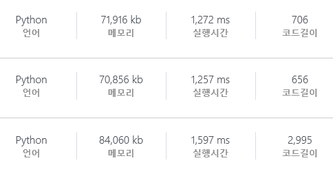
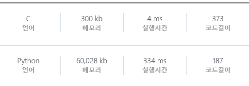
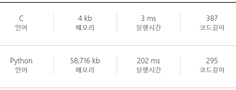
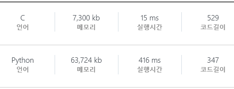

# 210201

## HTML (Hyper Text Markup Language)

웹 페이지를 작성하기 위한 언어.

* HTML의 구조
* = 양 옆으로 띄어쓰기를 하지 않는다.
* mdn 공식 문서 주로 참조할 것.


## CSS (Cascading Style Sheets)

HTML의 스타일, 레이아웃 등을 지정하는 언어.

* 적용 방법 : 인라인, 내부 참조, 외부 참조

  ```css
  선택자 {
  	속성: 값;
  }
  ```


---


# 210202

## CSS Position

문서 상에서 요소를 배치하는 방법.

static (default), relative, absolute, fixed, sticky 등


---


# 210203

## CSS layout

웹 페이지에서의 요소들의 배치.

### float

특정 요소가 텍스트나 인라인 요소에 안에 둘러 쌓여 있듯이 배치될 수 있게 해준다.

### flex 

요소들의 정렬을 쉽게 해주는 개념.


## Bootstrap

오픈 소스 프론트엔드 라이브러리.

디자인을 쉽게 할 수 있도록 해준다.

브라우저 크기에 따라 자동 정렬 가능 (그리드).


---


# 210204

bootstrap의 다양한 components.

button, navbar, card 등.

만들어진 components를 목적에 맞게 가져다 쓰자.


gird의 breakpoint 사용 연습.


font awesome, html에서 쓸 수 있는 다양한 아이콘 가져오기에 유용.


---


# 210205

웹 화면을 꾸미는 것을 도와주는 도구 : animate.css, google font, font awesome 등

웹 접근성에 대한  지침 : NULI


bootstrap 사용 연습.

화면 크기에 따라 화면을 구성하는 components가 변화하는 것을 `d-(breakpoint)` 로 구현하는 연습.


---


# 210208

* 알고리즘이란 무엇인가?

* 시간복잡도.

* 버블 정렬

* 카운팅 정렬

* 완전 검색


SWEA 알고리즘 문제.

### `D3`

* 1206 : View

  https://swexpertacademy.com/main/code/problem/problemDetail.do?contestProbId=AV134DPqAA8CFAYh&categoryId=AV134DPqAA8CFAYh&categoryType=CODE&problemTitle=1206&orderBy=FIRST_REG_DATETIME&selectCodeLang=ALL&select-1=&pageSize=10&pageIndex=1


---


# 210209

SWEA 알고리즘 문제.

### `D3`

* 1208 : Flatten **pass**

  https://swexpertacademy.com/main/code/problem/problemDetail.do?contestProbId=AV139KOaABgCFAYh&categoryId=AV139KOaABgCFAYh&categoryType=CODE&problemTitle=1208&orderBy=FIRST_REG_DATETIME&selectCodeLang=ALL&select-1=&pageSize=10&pageIndex=1

* 5789 : 현주의 상자 바꾸기 **pass**

  https://swexpertacademy.com/main/code/problem/problemDetail.do?contestProbId=AWYygN36Qn8DFAVm&categoryId=AWYygN36Qn8DFAVm&categoryType=CODE&problemTitle=5789&orderBy=FIRST_REG_DATETIME&selectCodeLang=ALL&select-1=&pageSize=10&pageIndex=1


D3은 고민 없이 거의 한 번에 끝내는 거 같다. D4랑 갭이 너무 크다...


### `D4`

* 10966 : 물놀이를 가자 **pass**

  https://swexpertacademy.com/main/code/problem/problemDetail.do?contestProbId=AXWXMZta-PsDFAST&categoryId=AXWXMZta-PsDFAST&categoryType=CODE&problemTitle=10966&orderBy=FIRST_REG_DATETIME&selectCodeLang=ALL&select-1=&pageSize=10&pageIndex=1

  D4 중에서는 쉬운 편이라고 한다. 

  **BFS**를 처음부터 의도한 것은 아니었는데, 생각한대로 짜고 보니 BFS였다. 아마 D4는 이런 식의 자료구조를 활용하는 문제가 주로 있는 듯하다. **`list.count` 사용 여부**와, **`for` 문 하나** 차이로, 6초 시간제한에 걸리던 코드가 실행시간이 **3초 이내**로 줄어들었다.

  index의 합의 차이로 거리를 구하는 풀이를 봤었다. 

  

* 11316 : 주기 찾기 **풀이 중**

  https://swexpertacademy.com/main/code/problem/problemDetail.do?contestProbId=AXaSVuaqPZkDFASQ&categoryId=AXaSVuaqPZkDFASQ&categoryType=CODE&problemTitle=&orderBy=FIRST_REG_DATETIME&selectCodeLang=ALL&select-1=&pageSize=10&pageIndex=1 

  **`index 탐색`을 사용**하면서 제한시간 동안 34문제 풀던 코드를 **76문제 성공으로 개선**시켰다. 개인적으로는 알고리즘 자체에는 문제 없어 보인다. 위의 문제에서처럼 내장함수 사용 등을 좀 더 최적화시키면 될 것 같다.

  그게 아니면 정수론으로 들어가 공식 찾는 수 밖에 없어 보인다... 수학과...

  정적 메모리를 마구마구 쓰자. **공간복잡도 <<<<<<< 시간복잡도!**


### `D6`

* 11389 : 연속하는 수의 곱셈 **풀이 중**

  https://swexpertacademy.com/main/code/problem/problemDetail.do?contestProbId=AXb6NiNKvHsDFARR&categoryId=AXb6NiNKvHsDFARR&categoryType=CODE&problemTitle=11389&orderBy=FIRST_REG_DATETIME&selectCodeLang=ALL&select-1=&pageSize=10&pageIndex=1

  일단 무식한 방법으로 짰다. 답은 나오지만 시간이...


왜 사람들이 코딩테스는 되도록 C++로 준비하라 하는 지 알 것 같다.

웹을 배웠던 1주일을 빼면 파이썬을 배운 지 이제 3주차.

지난 2주 동안은 파이썬을 사용하면서 이제껏 주력 언어였던 C 스타일의 코드가 나와 고민이었다.

하지만 파이썬스럽게 코딩해야지 하던 생각이 오히려 코딩테스트에는 방해인 거 같다.

파이썬스럽게를 생각하며 나도 모르게 내장함수에 의존하게 되어, C를 사용할 때는 고민도 없이 숨 쉬듯 떠올랐을 가벼운 방법들을 떠올리지 못하게 되었다...

2년 넘게 손을 떼고 있었으니 점차 다시 익숙해져야겠지만, C++을 주력으로 쓸 수 있게 연습을 병행해야겠다.

그리고 자꾸 문제 풀다 밥 먹는 거 잊어버리지 말자...


---


# 210210

SWEA 알고리즘 문제.

### `D3`

* 6485 : 삼성시의 버스 노선 **pass**

  https://swexpertacademy.com/main/code/problem/problemDetail.do?contestProbId=AWczm7QaACgDFAWn&categoryId=AWczm7QaACgDFAWn&categoryType=CODE&problemTitle=%EC%82%BC%EC%84%B1%EC%8B%9C&orderBy=FIRST_REG_DATETIME&selectCodeLang=ALL&select-1=&pageSize=10&pageIndex=1

  문제 내는 사람도 결국은 이과생이란 걸 알게 해주는 문제. 문제 내용 설명을 너무 개떡 같이 적어놨다. 문제 자체는 D3 답게 매우 쉬운 편. 


### `D4`

* 11446 : 사탕 가방 **풀이 중**

  https://swexpertacademy.com/main/code/problem/problemDetail.do?contestProbId=AXdHxTNqC2IDFAS5&categoryId=AXdHxTNqC2IDFAS5&categoryType=CODE&problemTitle=&orderBy=FIRST_REG_DATETIME&selectCodeLang=ALL&select-1=&pageSize=10&pageIndex=1

  제한시간 초과가 아니라 오답은 처음 봤다... 것도 애매하게 200개 중에 67개만 맞는데. 제일 골 때리는 상황이다.


---


# 210215

오늘 배운 거.

* 2차원 리스트.
* 델타(delta) 검색.
* 비트 연산자.
  * `1<<n` : 1의 비트를 왼쪽으로 n번 shift. 2의 n승과 같다. n번째 비트만 1인 이진수.
* 순차 검색.


SWEA 알고리즘 문제.

월말평가 때까지 `D3`을 하루 5문제 이상 풀 것.

### `D3`

* 1209 : Sum **pass**

  https://swexpertacademy.com/main/code/problem/problemDetail.do?contestProbId=AV13_BWKACUCFAYh&categoryId=AV13_BWKACUCFAYh&categoryType=CODE&problemTitle=sum&orderBy=FIRST_REG_DATETIME&selectCodeLang=ALL&select-1=&pageSize=10&pageIndex=1

  그냥 2차원 배열 탐색 연습.


* 11387 : 몬스터 사냥 **pass**

  https://swexpertacademy.com/main/code/problem/problemDetail.do?problemLevel=3&contestProbId=AXb6LR76vCcDFARR&categoryId=AXb6LR76vCcDFARR&categoryType=CODE&problemTitle=&orderBy=FIRST_REG_DATETIME&selectCodeLang=ALL&select-1=3&pageSize=10&pageIndex=1

  `0 ~ N-1 까지의 덧셈 공식`을 사용하는 문제. 코드도 간단하고 푸는 법도 쉬웠다.


* 11315 : 오목 판정 **pass**

  https://swexpertacademy.com/main/code/problem/problemDetail.do?problemLevel=3&contestProbId=AXaSUPYqPYMDFASQ&categoryId=AXaSUPYqPYMDFASQ&categoryType=CODE&problemTitle=&orderBy=FIRST_REG_DATETIME&selectCodeLang=ALL&select-1=3&pageSize=10&pageIndex=1

  그냥 2차원 배열 탐색 문제.


* 11285 : 다트 게임 **pass**

  https://swexpertacademy.com/main/code/problem/problemDetail.do?problemLevel=3&contestProbId=AXZuaLsqz9wDFAST&categoryId=AXZuaLsqz9wDFAST&categoryType=CODE&problemTitle=&orderBy=FIRST_REG_DATETIME&selectCodeLang=ALL&select-1=3&pageSize=10&pageIndex=1

  파이썬이 안 된다는 말이 있어서 **C**로 품. 조건문으로 범위 검색하는 것보다 `<math.h>`의 `sqrt` **함수를 쓰는 것이 더 빠르다.** 예외 케이스 잘 생각하자. 올림 함수 `ceil` 사용. 그리고 C언어로 풀 때는 setbuf 지우자...


* 11445 : 무한 사전 **pass**

  https://swexpertacademy.com/main/code/problem/problemDetail.do?contestProbId=AXdHwI1aCy0DFAS5&categoryId=AXdHwI1aCy0DFAS5&categoryType=CODE&problemTitle=&orderBy=FIRST_REG_DATETIME&selectCodeLang=ALL&select-1=&pageSize=10&pageIndex=1

  문제는 잘만 읽으면 매우 쉽고, 입력값의 공백 제거가 관건인 문제.


* 10965 : 제곱수 만들기 **pass**

  https://swexpertacademy.com/main/code/problem/problemDetail.do?problemLevel=3&contestProbId=AXWXH_h695kDFAST&categoryId=AXWXH_h695kDFAST&categoryType=CODE&problemTitle=&orderBy=FIRST_REG_DATETIME&selectCodeLang=ALL&select-1=3&pageSize=10&pageIndex=1

  `test case` 별로 계산하면서 출력하는 것보다, 모든 케이스에 대해 계산 다 해놓고 **출력만 따로 하는 것이 훨씬 빠르다**는 것만 깨달은 문제. 알고리즘 따위 상관 없었다...

  그리고 배열에 필요한 값을 미리 코드에 적어서 할당하는 것보다, 코드 내부에서 **연산을 통해 값을 계산하여 저장하는 것이 훨씬 빠르다.**

  

  맨 밑이 따로 계산한 소수들을 코드 안에 전부 선언한 경우. 


### `D4`

* 11316 : 주기 찾기 **pass**

  https://swexpertacademy.com/main/code/problem/problemDetail.do?contestProbId=AXaSVuaqPZkDFASQ&categoryId=AXaSVuaqPZkDFASQ&categoryType=CODE&problemTitle=&orderBy=FIRST_REG_DATETIME&selectCodeLang=ALL&select-1=&pageSize=10&pageIndex=1 

  **나머지 연산은 연산 시간이 오래 걸린다** 하여, **몫을 구해 빼는 것**으로 시간을 줄였다. 그래도 79개로 시간 초과.

  count 배열의 값으로 index를 주는 것으로 바꾸면서 index 배열의 선언 부분을 실수로 없애지 않고 두었던 게 시간 초과의 원인이었다... 허무하네.


---


# 210216

SWEA 알고리즘 문제.

### `D3`

* 10912 : 외로운 문자 **pass**

  https://swexpertacademy.com/main/code/problem/problemDetail.do?problemLevel=3&contestProbId=AXVJuEvqLAADFASe&categoryId=AXVJuEvqLAADFASe&categoryType=CODE&problemTitle=&orderBy=FIRST_REG_DATETIME&selectCodeLang=ALL&select-1=3&pageSize=10&pageIndex=1

  각 알파벳을 카운트해서 홀수 갯수인 것만 출력. 길이 26의 1차원 배열을 쓰면 편하다.


* 10993 : 군주제와 공화제 **pass**

  https://swexpertacademy.com/main/code/problem/problemDetail.do?problemLevel=3&contestProbId=AXXfloFa29EDFAST&categoryId=AXXfloFa29EDFAST&categoryType=CODE&problemTitle=&orderBy=FIRST_REG_DATETIME&selectCodeLang=ALL&select-1=3&pageSize=10&pageIndex=1

  파이썬이 지정 언어에 없어서 **C**로 품. `break` 하나 생각 없이 잘 못 적어서 고민 많이 했다. 가장 강한 영향력을 행사하는 도시를 구하는 중에, 가장 강하지 않은 두 도시가 값이 같을  경우를 생각 못 함. 1차원 배열로 트리에서 부모 찾아가는 형식의 알고리즘은 예전에 수업 시간에 많이 사용해서 그런 지 금방 떠올랐다.

  2차원 배열을 사용한 코드는 아마 용량 문제로 **런타임 에러**가 발생한 것 같다.


* 10804 : 문자열의 거울상 **pass**

  https://swexpertacademy.com/main/code/problem/problemDetail.do?problemLevel=3&contestProbId=AXTC0x16D8EDFASe&categoryId=AXTC0x16D8EDFASe&categoryType=CODE&problemTitle=&orderBy=FIRST_REG_DATETIME&selectCodeLang=ALL&select-1=3&pageSize=10&pageIndex=1

  1차원 배열 역순 접근.


* 10761 : 신뢰 **pass**

  https://swexpertacademy.com/main/code/problem/problemDetail.do?problemLevel=3&contestProbId=AXSVc1TqEAYDFAQT&categoryId=AXSVc1TqEAYDFAQT&categoryType=CODE&problemTitle=&orderBy=FIRST_REG_DATETIME&selectCodeLang=ALL&select-1=3&pageSize=10&pageIndex=1


* 10726 : 이진수 표현 **pass**

  https://swexpertacademy.com/main/code/problem/problemDetail.do?problemLevel=3&contestProbId=AXRSXf_a9qsDFAXS&categoryId=AXRSXf_a9qsDFAXS&categoryType=CODE&problemTitle=&orderBy=FIRST_REG_DATETIME&selectCodeLang=ALL&select-1=3&pageSize=10&pageIndex=1

  그냥 **C**로 해봤다.


* 10570 : 제곱 팰린드롬 수 **pass**

  https://swexpertacademy.com/main/code/problem/problemDetail.do?problemLevel=3&contestProbId=AXO72aaqPrcDFAXS&categoryId=AXO72aaqPrcDFAXS&categoryType=CODE&problemTitle=&orderBy=FIRST_REG_DATETIME&selectCodeLang=ALL&select-1=3&pageSize=10&pageIndex=1

  문자열 처리는 파이썬이 편하다. 문자열 뒤집기. `string[::-1]`


* 10580 : 전봇대 **pass**

  https://swexpertacademy.com/main/code/problem/problemDetail.do?problemLevel=3&contestProbId=AXO8QBw6Qu4DFAXS&categoryId=AXO8QBw6Qu4DFAXS&categoryType=CODE&problemTitle=&orderBy=FIRST_REG_DATETIME&selectCodeLang=ALL&select-1=3&pageSize=10&pageIndex=2

  교차의 정의를 생각해보자.

  

* 10505 : 소득 불균형 **pass**

  https://swexpertacademy.com/main/code/problem/problemDetail.do?problemLevel=3&contestProbId=AXNP4CvauaMDFAXS&categoryId=AXNP4CvauaMDFAXS&categoryType=CODE&problemTitle=&orderBy=FIRST_REG_DATETIME&selectCodeLang=ALL&select-1=3&pageSize=10&pageIndex=2

  왜 D3인 거지...


* 10200 : 구독자 전쟁 **pass**

  https://swexpertacademy.com/main/code/problem/problemDetail.do?problemLevel=3&contestProbId=AXMCXV_qVgkDFAWv&categoryId=AXMCXV_qVgkDFAWv&categoryType=CODE&problemTitle=&orderBy=FIRST_REG_DATETIME&selectCodeLang=ALL&select-1=3&pageSize=10&pageIndex=2

  왜 D3인 거지2...


* 10059 : 유효기간 **pass**

  https://swexpertacademy.com/main/code/problem/problemDetail.do?problemLevel=3&contestProbId=AXK6YRNaKq0DFAU3&categoryId=AXK6YRNaKq0DFAU3&categoryType=CODE&problemTitle=&orderBy=FIRST_REG_DATETIME&selectCodeLang=ALL&select-1=3&pageSize=10&pageIndex=2

  파이썬이 지정 언어가 아니라 **C**로 풀었다. 딱히 큰 고민은 필요 없다.


* 10032 : 과자 분배 **pass**

  https://swexpertacademy.com/main/code/problem/problemDetail.do?problemLevel=3&contestProbId=AXJZ6_6KCLcDFAU3&categoryId=AXJZ6_6KCLcDFAU3&categoryType=CODE&problemTitle=&orderBy=FIRST_REG_DATETIME&selectCodeLang=ALL&select-1=3&pageSize=10&pageIndex=2

  그냥 나머지 구하면 되는 문제. **C** 사용.


* 9997 : 미니멀리즘 시계 **pass**

  https://swexpertacademy.com/main/code/problem/problemDetail.do?problemLevel=3&contestProbId=AXIvNBzKapEDFAXR&categoryId=AXIvNBzKapEDFAXR&categoryType=CODE&problemTitle=&orderBy=FIRST_REG_DATETIME&selectCodeLang=ALL&select-1=3&pageSize=10&pageIndex=2

  역시 나눗셈 문제. **C** 사용.


* 9940 : 순열1 **pass**

  https://swexpertacademy.com/main/code/problem/problemDetail.do?problemLevel=3&contestProbId=AXHx23oq0REDFAXR&categoryId=AXHx23oq0REDFAXR&categoryType=CODE&problemTitle=&orderBy=FIRST_REG_DATETIME&selectCodeLang=ALL&select-1=3&pageSize=10&pageIndex=2

  **C** 사용.


* 9839 : 최고의 쌍 **pass**

  https://swexpertacademy.com/main/code/problem/problemDetail.do?problemLevel=3&contestProbId=AXGBGehqPAADFAXR&categoryId=AXGBGehqPAADFAXR&categoryType=CODE&problemTitle=&orderBy=FIRST_REG_DATETIME&selectCodeLang=ALL&select-1=3&pageSize=10&pageIndex=2

  조건을 만족하는 숫자쌍이 2개 이상 있을 경우의 조건을 제대로 보지 않았다. **C** 사용.


* 9778 : 카드 게임 **pass**

  https://swexpertacademy.com/main/code/problem/problemDetail.do?problemLevel=3&contestProbId=AXE0YJiK3QcDFAVX&categoryId=AXE0YJiK3QcDFAVX&categoryType=CODE&problemTitle=&orderBy=FIRST_REG_DATETIME&selectCodeLang=ALL&select-1=3&pageSize=10&pageIndex=2

  **C** 사용.


* 9700 : USB 꽂기의 미스터리 **pass**

  https://swexpertacademy.com/main/code/problem/problemDetail.do?problemLevel=3&contestProbId=AXDNEA3aaU0DFAVX&categoryId=AXDNEA3aaU0DFAVX&categoryType=CODE&problemTitle=&orderBy=FIRST_REG_DATETIME&selectCodeLang=ALL&select-1=3&pageSize=10&pageIndex=2

  문제를 이해하는데 시간이 좀 걸렸다. `p`는 처음 USB를 집을 때 올바른 면을 보고 있을 확률, `q`는 올바른 면을 보고 있을 때 꽂힐 확률. 즉, 올바른 면을 보고 있어도 안 들어갈 수도 있다.


### `D4`

* 1210 : Ladder1 **pass**

  https://swexpertacademy.com/main/code/problem/problemDetail.do?contestProbId=AV14ABYKADACFAYh&categoryId=AV14ABYKADACFAYh&categoryType=CODE&problemTitle=1210&orderBy=FIRST_REG_DATETIME&selectCodeLang=ALL&select-1=&pageSize=10&pageIndex=1

  초기 문제는 D4도 쉽구나...

  **출발 지점을 하나하나 검사**하며 2에 도착하는 곳을 찾는 코드와 맨 아래의 **2에서부터 시작하여 거슬러 올라가**는 코드, 2가지. 테스트 케이스가 10가지 뿐이라 그런지 시간 차이는 얼마 안 난다.


상대적으로 같은 난이도 표기에서 옛날에 올라온 문제들이 훨씬 쉬운 것 같다.

C언어도 코드 도중의 변수 선언이 되는구나...

올해 올라온 문제들 제외하면 D3는 거의 고민 없이 풀린다.

가볍게 하루 10문제 정도 씩만 풀자.


---


# 210217

오늘 배운 거.

* 문자열
  * 아스키코드 = 7bit
  * 확장 아스키코드 = 8bit
  * 다국어처리를 위한 표준 = unicode
  * 문자의 표현
    * big-endian, little-endian
    * UTF = unicode trasformation format
      * UTF-8 (web) : 파이썬도 이거 씀
      * UTF-16 (window, java)
      * UTF-32 (unix)
* 패턴 매칭
  * brute force
  * KMP
  * 보이어-무어
* 문자열 암호화
* 문자열 압축


일단 파이썬 가능한 문제부터 풀자.


### `D3`

* 1221 : GNS **pass**

  https://swexpertacademy.com/main/code/problem/problemDetail.do?contestProbId=AV14jJh6ACYCFAYD&categoryId=AV14jJh6ACYCFAYD&categoryType=CODE&problemTitle=GNS&orderBy=FIRST_REG_DATETIME&selectCodeLang=ALL&select-1=&pageSize=10&pageIndex=1

  `dictionary` 를 쓰면 편한 문제.


* 7675 : 통역사 성경이 **pass**

  https://swexpertacademy.com/main/code/problem/problemDetail.do?problemLevel=3&contestProbId=AWqPvqoqSLQDFAT_&categoryId=AWqPvqoqSLQDFAT_&categoryType=CODE&problemTitle=&orderBy=FIRST_REG_DATETIME&selectCodeLang=PYTHON&select-1=3&pageSize=10&pageIndex=2

  문제를 뭐 같이 적어놨네. 앞선 조건(맨 앞 글자가 대문자, 나머지는 소문자) 을 다 만족하되, 문장 끝의 마침표 정도는 포함 되어도 괜찮다는 의미.


* 6692 : 다솔이의 월급 상자 **pass**

  https://swexpertacademy.com/main/code/problem/problemDetail.do?problemLevel=3&contestProbId=AWdXofhKFkADFAWn&categoryId=AWdXofhKFkADFAWn&categoryType=CODE&problemTitle=&orderBy=FIRST_REG_DATETIME&selectCodeLang=PYTHON&select-1=3&pageSize=10&pageIndex=2

  왜 D3인 거지. 이직을 권유한다는 댓글 말고는 볼 게 없는 문제.


* 6190 : 정곤이의 단조 증가하는 수 **pass**

  https://swexpertacademy.com/main/code/problem/problemDetail.do?problemLevel=3&contestProbId=AWcPjEuKAFgDFAU4&categoryId=AWcPjEuKAFgDFAU4&categoryType=CODE&problemTitle=&orderBy=FIRST_REG_DATETIME&selectCodeLang=PYTHON&select-1=3&pageSize=10&pageIndex=2

  비슷한 문제(9839) 를 푼 적이 있어서 무난하게 풀었다.


* 6057 : 그래프의 삼각형 **pass**

  https://swexpertacademy.com/main/code/problem/problemDetail.do?problemLevel=3&contestProbId=AWbHcWd6AFcDFAV0&categoryId=AWbHcWd6AFcDFAV0&categoryType=CODE&problemTitle=&orderBy=FIRST_REG_DATETIME&selectCodeLang=PYTHON&select-1=3&pageSize=10&pageIndex=2

  정점 → 정점 2차원 배열을 sorting 하자.


* 6019 : 기차 사이의 파리 **pass**

  https://swexpertacademy.com/main/code/problem/problemDetail.do?problemLevel=3&contestProbId=AWajaTmaZw4DFAWM&categoryId=AWajaTmaZw4DFAWM&categoryType=CODE&problemTitle=&orderBy=FIRST_REG_DATETIME&selectCodeLang=PYTHON&select-1=3&pageSize=10&pageIndex=2


* 5986 : 새샘이와 세 소수 **pass**

  https://swexpertacademy.com/main/code/problem/problemDetail.do?problemLevel=3&contestProbId=AWaJ3q8qV-4DFAUQ&categoryId=AWaJ3q8qV-4DFAUQ&categoryType=CODE&problemTitle=&orderBy=FIRST_REG_DATETIME&selectCodeLang=PYTHON&select-1=3&pageSize=10&pageIndex=2

  평범환 완전탐색 문제. 배열에 존재하는지 확인할 때, `count()`보다 `in`이 빠르다.


* 5948 : 새샘이의 7-3-5 게임 **pass**

  https://swexpertacademy.com/main/code/problem/problemDetail.do?problemLevel=3&contestProbId=AWZ2IErKCwUDFAUQ&categoryId=AWZ2IErKCwUDFAUQ&categoryType=CODE&problemTitle=&orderBy=FIRST_REG_DATETIME&selectCodeLang=PYTHON&select-1=3&pageSize=10&pageIndex=3

  역시나 평범한 완전탐색 문제. 합으로 가능한 **경우** 중 5번째로 큰 수이니, 서로 다른 조합으로 같은 합이 나오면 1개로 쳐서 5번째 큰 수를 구한다.


* 5688 : 세제곱근을 찾아라 **pass**

  https://swexpertacademy.com/main/code/problem/problemDetail.do?problemLevel=3&contestProbId=AWXVyCaKugQDFAUo&categoryId=AWXVyCaKugQDFAUo&categoryType=CODE&problemTitle=&orderBy=FIRST_REG_DATETIME&selectCodeLang=PYTHON&select-1=3&pageSize=10&pageIndex=3

  세제곱은을 지수로 표기하면 어떻게 될 지 생각해보자.

  10^18의 범위에서는 0.333333334제곱을 하고 소수점을 버리면 세제곱근이 나온다. (세제곱근이 존재하는 경우)


* 5549 : 홀수일까 짝수일까 **pass**

  https://swexpertacademy.com/main/code/problem/problemDetail.do?problemLevel=3&contestProbId=AWWxpEDaAVoDFAW4&categoryId=AWWxpEDaAVoDFAW4&categoryType=CODE&problemTitle=&orderBy=FIRST_REG_DATETIME&selectCodeLang=PYTHON&select-1=3&pageSize=10&pageIndex=3

  입력값의 범위가 너무 클 경우에는 숫자 자료형으로는 처리할 수 없음을 생각하자.

  파이썬과 C, 두 가지로 풀어봤다. 문자열 처리 부분 때문에 역시 코드 길이는 C가 더 길어질 수 밖에 없는 듯하다.

  


* 5515 : 2016년 요일 맞추기 **pass**

  https://swexpertacademy.com/main/code/problem/problemDetail.do?problemLevel=3&contestProbId=AWWOwecaFrIDFAV4&categoryId=AWWOwecaFrIDFAV4&categoryType=CODE&problemTitle=&orderBy=FIRST_REG_DATETIME&selectCodeLang=PYTHON&select-1=3&pageSize=10&pageIndex=3

  공식을 생각해보자.

  


* 5431 : 민석이의 과제 체크하기 **pass**

  https://swexpertacademy.com/main/code/problem/problemDetail.do?problemLevel=3&contestProbId=AWVl3rWKDBYDFAXm&categoryId=AWVl3rWKDBYDFAXm&categoryType=CODE&problemTitle=&orderBy=FIRST_REG_DATETIME&selectCodeLang=PYTHON&select-1=3&pageSize=10&pageIndex=3

  count 배열 사용.

  


* 5356 : 의석이의 세로로 말해요 **pass**

  https://swexpertacademy.com/main/code/problem/problemDetail.do?problemLevel=3&contestProbId=AWVWgkP6sQ0DFAUO&categoryId=AWVWgkP6sQ0DFAUO&categoryType=CODE&problemTitle=&orderBy=FIRST_REG_DATETIME&selectCodeLang=PYTHON&select-1=3&pageSize=10&pageIndex=3


---


# 210218

SWEA 알고리즘 문제.

### `D3`

* 1216 : 회문2 **pass**

  https://swexpertacademy.com/main/code/problem/problemDetail.do?contestProbId=AV14Rq5aABUCFAYi&categoryId=AV14Rq5aABUCFAYi&categoryType=CODE&problemTitle=%ED%9A%8C%EB%AC%B82&orderBy=FIRST_REG_DATETIME&selectCodeLang=ALL&select-1=&pageSize=10&pageIndex=1

  가장 긴 회문의 길이를 구하는 것이라, 길이 별로 검사해야해서 오래 걸리는 편. 그래도 테스트 케이스 10개에 제한시간 30초 이내였고, 하나의 길이에서 회문이 발견 되면 즉시 다음 길이로 넘어가도록 해서 0.5초 이내로 끝났다.

  

* 5215 : 햄버거 다이어트 **pass**

  https://swexpertacademy.com/main/code/problem/problemDetail.do?problemLevel=3&contestProbId=AWT-lPB6dHUDFAVT&categoryId=AWT-lPB6dHUDFAVT&categoryType=CODE&problemTitle=&orderBy=FIRST_REG_DATETIME&selectCodeLang=PYTHON&select-1=3&pageSize=10&pageIndex=3

  부분집합의 합 구하기. 비트 연산자를 이용하여 부분집합 순회하기 사용.


* 5162 : 두가지 빵의 딜레마 **pass**

  https://swexpertacademy.com/main/code/problem/problemDetail.do?problemLevel=3&contestProbId=AWTaTDua3OoDFAVT&categoryId=AWTaTDua3OoDFAVT&categoryType=CODE&problemTitle=&orderBy=FIRST_REG_DATETIME&selectCodeLang=PYTHON&select-1=3&pageSize=10&pageIndex=3

  생각만 잘 하면 단순한 문제. 빵이 두 종류 뿐이므로, 더 싼 빵으로만 구성하면 최대 개수가 된다.


* 4789 : 성공적인 공연 기획 **pass**

  https://swexpertacademy.com/main/code/problem/problemDetail.do?problemLevel=3&contestProbId=AWS2dSgKA8MDFAVT&categoryId=AWS2dSgKA8MDFAVT&categoryType=CODE&problemTitle=&orderBy=FIRST_REG_DATETIME&selectCodeLang=PYTHON&select-1=3&pageSize=10&pageIndex=4

  누적 배열을 만들어, 중간 과정까지 총 일어난 사람 수가 얼마며 그 뒤의 사람이 일어나기 위해 매번 몇 명이 필요한 지 `인덱스 - 누적 수` 로 구한다.


* 4751 : 다솔이의 다이아몬드 장식 **pass**

  https://swexpertacademy.com/main/code/problem/problemDetail.do?problemLevel=3&contestProbId=AWSNw5jKzwMDFAUr&categoryId=AWSNw5jKzwMDFAUr&categoryType=CODE&problemTitle=&orderBy=FIRST_REG_DATETIME&selectCodeLang=PYTHON&select-1=3&pageSize=10&pageIndex=4

  문자들의 반복되는 패턴을 잘 보자.


* 4698 : 테네스의 특별한 소수 **pass**

  https://swexpertacademy.com/main/code/problem/problemDetail.do?problemLevel=3&contestProbId=AWRuoqCKkE0DFAXt&categoryId=AWRuoqCKkE0DFAXt&categoryType=CODE&problemTitle=&orderBy=FIRST_REG_DATETIME&selectCodeLang=PYTHON&select-1=3&pageSize=10&pageIndex=4

  소수 배열을 작성할 때, 나머지 연산이 오래 걸리므로 `배수 여부를 확인하는 True / False 배열`을 만들어 배수일 경우는 건너 뛰는 편이 훨씬 시간이 적게 걸린다. 10^6 범위 기준, 전자는 하염없이 기다려도 안 나오는데, 후자는 1초도 안 걸렸다...


* 4676 : 늘어지는 소리 만들기 **pass**

  https://swexpertacademy.com/main/code/problem/problemDetail.do?problemLevel=3&contestProbId=AWRKWITqfvIDFAV8&categoryId=AWRKWITqfvIDFAV8&categoryType=CODE&problemTitle=&orderBy=FIRST_REG_DATETIME&selectCodeLang=PYTHON&select-1=3&pageSize=10&pageIndex=4

  문자열 처리가 편한 언어면 `insert`와 `index`를 이용해 편하게 풀만한 문제.


* 4615 : 재미있는 오셀로 게임 **pass**

  https://swexpertacademy.com/main/code/problem/problemDetail.do?problemLevel=3&contestProbId=AWQmA4uK8ygDFAXj&categoryId=AWQmA4uK8ygDFAXj&categoryType=CODE&problemTitle=&orderBy=FIRST_REG_DATETIME&selectCodeLang=PYTHON&select-1=3&pageSize=10&pageIndex=4

  데이터가 적어 완전 탐색이 가능한 문제.


* 5293 : 이진 문자열 복원 **풀이 중**

  https://swexpertacademy.com/main/code/problem/problemDetail.do?problemLevel=3&contestProbId=AWUiwoe6o00DFAVT&categoryId=AWUiwoe6o00DFAVT&categoryType=CODE&problemTitle=&orderBy=FIRST_REG_DATETIME&selectCodeLang=PYTHON&select-1=3&pageSize=10&pageIndex=3

  BFS로 모든 경우 값 찾는 중... 겁나 오래 걸려...

  좀 더 고민해볼 필요가 있다.


### `D4`

* 1211 : Ladder2 **pass**

  https://swexpertacademy.com/main/code/problem/problemDetail.do?contestProbId=AV14BgD6AEECFAYh&categoryId=AV14BgD6AEECFAYh&categoryType=CODE&problemTitle=ladder2&orderBy=FIRST_REG_DATETIME&selectCodeLang=ALL&select-1=&pageSize=10&pageIndex=1

  Ladder1에서 모든 출발점을 확인하는 코드를 짜놓아서, 카운트만 하면 되었다.


* 3143 : 가장 빠른 문자열 타이핑 **pass**

  https://swexpertacademy.com/main/code/problem/problemDetail.do?contestProbId=AV_65wkqsb4DFAWS&categoryId=AV_65wkqsb4DFAWS&categoryType=CODE&problemTitle=3143&orderBy=FIRST_REG_DATETIME&selectCodeLang=ALL&select-1=&pageSize=10&pageIndex=1

  bananananana와 nana의 경우를 생각해보자.


* 5432 : 쇠막대기 자르기 **pass**

  https://swexpertacademy.com/main/code/problem/problemDetail.do?contestProbId=AWVl47b6DGMDFAXm&categoryId=AWVl47b6DGMDFAXm&categoryType=CODE&problemTitle=5432&orderBy=FIRST_REG_DATETIME&selectCodeLang=ALL&select-1=&pageSize=10&pageIndex=1

  문자열 `replace` 는 직접 구현하면 너무 느리다. 길이 10000의 입력 기준, 4초가 넘어가던 replace 과정이 내장함수 사용으로 0.2초 정도로 시간 감소.

  `replace` 를 사용하지 않고도 풀 수 있다.


D4도 옛날 문제는 여전히 쉬운 편. 

D3과의 차이는 내가 사용한 방법이 내부적으로 시간이 오래 걸린다 아닌다를 판단하는 것이 필요한 정도.


---


# 210219

### `D3`

* 4522 : 세상의 모든 팰린드롬 **pass**

  https://swexpertacademy.com/main/code/problem/problemDetail.do?problemLevel=3&contestProbId=AWO6Oao6N4QDFAWw&categoryId=AWO6Oao6N4QDFAWw&categoryType=CODE&problemTitle=&orderBy=FIRST_REG_DATETIME&selectCodeLang=PYTHON&select-1=3&pageSize=10&pageIndex=4

  회문 문제. mad?m의 경우를 생각해보자.


* 4579 : 세상의 모든 팰린드롬 2 **pass**

  https://swexpertacademy.com/main/code/problem/problemDetail.do?problemLevel=3&contestProbId=AWQAz7IqAH8DFAWh&categoryId=AWQAz7IqAH8DFAWh&categoryType=CODE&problemTitle=&orderBy=FIRST_REG_DATETIME&selectCodeLang=PYTHON&select-1=3&pageSize=10&pageIndex=4

  mad*m의 경우를 생각해보자. *는 어떤 문자열로도 대체할 수 있으므로, *의 바깥쪽만 회문을 만족하면 된다.


* 4466 : 최대 성적표 만들기 **pass**

  https://swexpertacademy.com/main/code/problem/problemDetail.do?problemLevel=3&contestProbId=AWOUfCJ6qVMDFAWg&categoryId=AWOUfCJ6qVMDFAWg&categoryType=CODE&problemTitle=&orderBy=FIRST_REG_DATETIME&selectCodeLang=PYTHON&select-1=3&pageSize=10&pageIndex=4

  간단한 정렬 문제라 **C**로 풀었다.


* 4406 : 모음이 보이지 않는 사람 **pass**

  https://swexpertacademy.com/main/code/problem/problemDetail.do?problemLevel=3&contestProbId=AWNcD_66pUEDFAV8&categoryId=AWNcD_66pUEDFAV8&categoryType=CODE&problemTitle=&orderBy=FIRST_REG_DATETIME&selectCodeLang=PYTHON&select-1=3&pageSize=10&pageIndex=4

  `for` 문은 `remove`되어 당겨진 인덱스를 무시한다. `list.remove` 는 중복된 요소가 있을 시, 가장 먼저 발견된 하나만 제거.


* 4371 : 항구에 들어오는 배 **pass**

  https://swexpertacademy.com/main/code/problem/problemDetail.do?problemLevel=3&contestProbId=AWMedCxalW8DFAXd&categoryId=AWMedCxalW8DFAXd&categoryType=CODE&problemTitle=&orderBy=FIRST_REG_DATETIME&selectCodeLang=PYTHON&select-1=3&pageSize=10&pageIndex=4

  1 5 9 13 17 20 의 케이스를 생각해보자.


* 4299 : 태혁이의 사랑은 타이밍 **pass**

  https://swexpertacademy.com/main/code/problem/problemDetail.do?problemLevel=3&contestProbId=AWLv6mx6htoDFAVV&categoryId=AWLv6mx6htoDFAVV&categoryType=CODE&problemTitle=&orderBy=FIRST_REG_DATETIME&selectCodeLang=PYTHON&select-1=3&pageSize=10&pageIndex=5
  
  문제랑 댓글 읽다가 웃겨 죽는 줄...


* 4047 : 영준이의 카드 카운팅 **pass**

  https://swexpertacademy.com/main/code/problem/problemDetail.do?problemLevel=3&contestProbId=AWIsY84KEPMDFAWN&categoryId=AWIsY84KEPMDFAWN&categoryType=CODE&problemTitle=&orderBy=FIRST_REG_DATETIME&selectCodeLang=PYTHON&select-1=3&pageSize=10&pageIndex=5

  인덱스 범위에 주의.


* 3975 : 승률 비교하기 **pass**

  https://swexpertacademy.com/main/code/problem/problemDetail.do?problemLevel=3&contestProbId=AWIX_iFqjg4DFAVH&categoryId=AWIX_iFqjg4DFAVH&categoryType=CODE&problemTitle=&orderBy=FIRST_REG_DATETIME&selectCodeLang=PYTHON&select-1=3&pageSize=10&pageIndex=5

  출력은 모아서 한꺼번에 하는 게 훨씬 빠르다. `pop` 사용하는 거보다 인덱스 참조가 훨씬 빠르다.


* 3809 : 화섭이의 정수 나열 **pass**

  https://swexpertacademy.com/main/code/problem/problemDetail.do?problemLevel=3&contestProbId=AWHz7xD6A20DFAVB&categoryId=AWHz7xD6A20DFAVB&categoryType=CODE&problemTitle=&orderBy=FIRST_REG_DATETIME&selectCodeLang=PYTHON&select-1=3&pageSize=10&pageIndex=5

  파이썬은 `in` 함수를 쓰면 편하지만, 다른 건 어떨까.


* 3750 : Digit sum **pass**

  https://swexpertacademy.com/main/code/problem/problemDetail.do?problemLevel=3&contestProbId=AWHPiSYKAD0DFAUn&categoryId=AWHPiSYKAD0DFAUn&categoryType=CODE&problemTitle=&orderBy=FIRST_REG_DATETIME&selectCodeLang=PYTHON&select-1=3&pageSize=10&pageIndex=5

  출력 시간 문제.


* 3499 : 퍼펙트 셔플 **pass**

  https://swexpertacademy.com/main/code/problem/problemDetail.do?problemLevel=3&contestProbId=AWGsRbk6AQIDFAVW&categoryId=AWGsRbk6AQIDFAVW&categoryType=CODE&problemTitle=&orderBy=FIRST_REG_DATETIME&selectCodeLang=PYTHON&select-1=3&pageSize=10&pageIndex=5

  슬라이싱 사용 여부에서는 실행 시간 차이가 거의 나지 않는다.


* 3456 : 직사각형 길이 찾기 **pass**

  https://swexpertacademy.com/main/code/problem/problemDetail.do?problemLevel=3&contestProbId=AWFPmsqqALwDFAV0&categoryId=AWFPmsqqALwDFAV0&categoryType=CODE&problemTitle=&orderBy=FIRST_REG_DATETIME&selectCodeLang=PYTHON&select-1=3&pageSize=10&pageIndex=5

  왜 만들었지..?


* 3431 : 준환이의 운동관리 **pass**

  https://swexpertacademy.com/main/code/problem/problemDetail.do?problemLevel=3&contestProbId=AWE_ZXcqAAMDFAV2&categoryId=AWE_ZXcqAAMDFAV2&categoryType=CODE&problemTitle=&orderBy=FIRST_REG_DATETIME&selectCodeLang=PYTHON&select-1=3&pageSize=10&pageIndex=5

  오래 된 문제일수록 쉬운 건가?


* 3408 : 세가지 합 구하기 **pass**

  https://swexpertacademy.com/main/code/problem/problemDetail.do?problemLevel=3&contestProbId=AWEbPukqySUDFAWs&categoryId=AWEbPukqySUDFAWs&categoryType=CODE&problemTitle=&orderBy=FIRST_REG_DATETIME&selectCodeLang=PYTHON&select-1=3&pageSize=10&pageIndex=5

  합 공식 쓰는 문제. 

  입력의 범위가 10^9이고, 입력의 제곱을 계산해야하므로 (10^18 = (2^10)^6 : 64비트로 양수를 표현하는 자료형을 사용해야함) 파이썬 이외의 언어에서는 이를 고려한 자료형을 써야한다. **C**언어로 **`unsigned long int`**를 사용했고, 이 자료형의 입출력은 **`%lu`** 를 사용한다.


* 3376 : 파도반 수열 **pass**

  https://swexpertacademy.com/main/code/problem/problemDetail.do?problemLevel=3&contestProbId=AWD3Y27q3QIDFAUZ&categoryId=AWD3Y27q3QIDFAUZ&categoryType=CODE&problemTitle=&orderBy=FIRST_REG_DATETIME&selectCodeLang=PYTHON&select-1=3&pageSize=10&pageIndex=5

  마찬가지로 P_100의 값이 888,855,064,897이므로 `unsigned long int` 를 사용. 크기에 영향을 안 받는 파이썬을 통해 미리 값을 알아보는 것도 괜찮은 방법인 거 같다.


---


# 210221

### `D3`

* 3314 : 보충학습과 평균 **pass**

  https://swexpertacademy.com/main/code/problem/problemDetail.do?problemLevel=3&contestProbId=AWBnA2jaxDsDFAWr&categoryId=AWBnA2jaxDsDFAWr&categoryType=CODE&problemTitle=&orderBy=FIRST_REG_DATETIME&selectCodeLang=PYTHON&select-1=3&pageSize=10&pageIndex=6

  