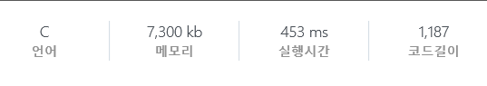

# 210301

### `D5`

* 1242 : 암호코드 스캔 **풀이 중**

  https://swexpertacademy.com/main/code/problem/problemDetail.do?contestProbId=AV15JEKKAM8CFAYD&categoryId=AV15JEKKAM8CFAYD&categoryType=CODE&problemTitle=1%EC%9D%BC%EC%B0%A8&orderBy=FIRST_REG_DATETIME&selectCodeLang=ALL&select-1=&pageSize=10&pageIndex=1

  ***<Try 2>***

  가로 한 줄 씩 검사하면서 이전 줄과 비교해 바뀐 부분이 있는 지를 체크. 이전 줄과 다른 부분의 시작 index와 끝 index만 얻어내므로 그 사이에 이미 얻었던 다른 코드들이 존재할 수 있다.

  ↓

  이전 문자열의 다른 부분을 취함. (`last`)

  ↓

  `last`에 이미 추출된 코드 배열에 존재하는 문자열이 포함되어 있으면 그 부분만 뺀다. (반복)

  ↓

  이미 추출된 코드들이 모두 빠진 `last`가 포함된 문자열이 코드 배열에 존재하는 지 확인. (여려개의 코드가 담긴 문자열이 배열에 존재하는 지 확인.) 

  ↓

  만약 있다면 해당 문자열은 지우고, 해당 문자열에서 `last`를 지운 코드를 다시 저장. 찾았으면 `break`.

  ↓

  위의 작업을 마쳤지만, 남은 문자열에 코드가 2개 이상인 경우는 그 코드들은 시작과 끝이 같지만, 사이에 다른 코드들이 존재하여 구별되는 경우다. 이를 구분하기 위해 `'0000'`이 존재하는 지 검사. (이 부분이 아쉽다.)

  ↓

  현재 줄의 바뀐 부분을 취하여, 양 끝의 `'0'`을 제거. (`current`)

  ↓

  `current` 에 코드 배열에 존재하는 문자열이 포함되어 있으면 그 부분을 지운다. (반복)

  ↓

  양 끝의 `'0'`을 제거하고, 문자열의 길이가 0이 아니면 코드 배열에 포함.

  

  sample input 20개는 다 넘겼다. 근데 제출 시에 `runtime error`가 난다...

  에러가 나는 부분을 찾던가 방법을 바꾸어봐야겠다.

  


---


# 210302

### `D3`

교육과정 문제와 professional을 제외하면 파이썬으로 가능한 문제는 거의 다 풀었기 때문에, 파이썬이 지정 언어가 아닌 문제들로 넘어왔다. 대충 보니 40 문제 조금 안 되는 듯. 파이썬이 지정 언어가 아닌 문제는 기본적을 C로 푼다.


* 9480 : 민정이와 광직이의 알파벳 공부 **pass**

  https://swexpertacademy.com/main/code/problem/problemDetail.do?problemLevel=3&contestProbId=AXAdrmW61ssDFAXq&categoryId=AXAdrmW61ssDFAXq&categoryType=CODE&problemTitle=&orderBy=FIRST_REG_DATETIME&selectCodeLang=CCPP&select-1=3&pageSize=10&pageIndex=3

  부분집합 문제. 테스트 케이스가 적어 완전탐색으로도 시간 내에 풀 수 있다.


* 9317 : 석찬이의 받아쓰기 **pass**

  https://swexpertacademy.com/main/code/problem/problemDetail.do?problemLevel=3&contestProbId=AW-hOY5KeEIDFAVg&categoryId=AW-hOY5KeEIDFAVg&categoryType=CODE&problemTitle=&orderBy=FIRST_REG_DATETIME&selectCodeLang=CCPP&select-1=3&pageSize=10&pageIndex=3


* 9280 : 진용이네 주차타워 **pass**

  https://swexpertacademy.com/main/code/problem/problemDetail.do?problemLevel=3&contestProbId=AW9j74FacD0DFAUY&categoryId=AW9j74FacD0DFAUY&categoryType=CODE&problemTitle=&orderBy=FIRST_REG_DATETIME&selectCodeLang=CCPP&select-1=3&pageSize=10&pageIndex=3

  코드가 더러운데 피곤해서 수정하기 귀찮아...


### `D5`

* 1242 : 암호코드 스캔 **pass**

  https://swexpertacademy.com/main/code/problem/problemDetail.do?contestProbId=AV15JEKKAM8CFAYD&categoryId=AV15JEKKAM8CFAYD&categoryType=CODE&problemTitle=1%EC%9D%BC%EC%B0%A8&orderBy=FIRST_REG_DATETIME&selectCodeLang=ALL&select-1=&pageSize=10&pageIndex=1

  ***<Try 3>***

  이전에는 주어진 입력값에서 `암호 추출 → 2진수로 변환 → 코드에 맞춰 8개의 숫자로 변환 → 유효성 확인` 의 절차로 구현하였다.

  이것을 16진수인 채로 암호를 추출하는 것보다, 통째로 2진수로 바꾼 다음 **1240번** 문제와 같이 뒤에서부터 마지막 1을 찾아 바로 코드 검사를 하는 것이 편할 것이라 생각하였다.

  이 생각을 조금만 더 빨리 했으면 1240번 문제랑 크게 다르지 않을 난이도라 생각한다...

  

  이전 줄과 비교해 변화가 있는 지를 체크.

  ↓

  변화가 있으면 바뀐 줄을 모두 2진수로 바꾼다.

  ↓

  뒤에서부터 탐색하며 암호의 마지막에 오는 `1`을 찾는다.

  ↓

  마지막 1에서부터 7의 배수 길이만큼 잘라 확인한다. (7의 1배수부터 시작하여 유효하지 않으면(10개의 코드 중 일치하는 것이 없으면) 2, 3, 4, 5배수로 점차 늘려가며 검사.)

  ↓

  8개의 숫자를 모두 얻었으면 이 암호가 이전에 추출했던 것인 지 여부를 확인하고, 새로운 암호면 배열에 저장. 

  ↓

  `7의 L배수 * 8`의 길이만큼 앞으로 가서 다시 다음 암호의 마지막 1을 찾는다. (3 ~ 6 반복.)

  

  sample input 20개는 별 문제 없이 통과하였고, 이전 코드처럼 마음에 걸리는 부분도 없었다.

  하지만 제출 시에 마찬가지로 `runtime error`가 발생하여, 제출 화면에서 디버깅을 해보기로 했다.

  그 결과 에러가 발생하는 부분은 여기였다.

  ```python
  # 16진수 → 2진수
  temp = ''
  for c in current:
      temp += X_to_B.get(c)
  ```

  이 부분을 다음과 같이 바꾸었더니 해결되었다.

  ```python
  # 16진수 → 2진수
  temp = ''
  for c in current:
      # 16진수 to 2진수 dictionary에 유효한 키값(0 ~ F)인 지를 확인
      if c in X_to_B.keys():
          temp += X_to_B.get(c)
  ```

  문제에는 입력값은 16진수로만 이루어져있다 해서 신경을 안 썼던 부분이다.

  저렇게 해결되는 걸보니 제출 시 평가하는 test case에 아마 **공백 등의 유효하지 않는 값**이 섞여있는 듯하다.


---


# 210303

### `D3`

* 9229 : 한빈이와 Spot Mart **pass**

  https://swexpertacademy.com/main/code/problem/problemDetail.do?problemLevel=3&contestProbId=AW8Wj7cqbY0DFAXN&categoryId=AW8Wj7cqbY0DFAXN&categoryType=CODE&problemTitle=&orderBy=FIRST_REG_DATETIME&selectCodeLang=CCPP&select-1=3&pageSize=10&pageIndex=3

  완전탐색에서 `M - a[i]` 가 과자의 최소 무게보다 작으면 가지치기 한다.


* 8931 : 제로 **pass**

  https://swexpertacademy.com/main/code/problem/problemDetail.do?problemLevel=3&contestProbId=AW5jBWLq7jwDFATQ&categoryId=AW5jBWLq7jwDFATQ&categoryType=CODE&problemTitle=&orderBy=FIRST_REG_DATETIME&selectCodeLang=CCPP&select-1=3&pageSize=10&pageIndex=3

  stack 사용하는 문제. 0이 나오면 `pop`. 그 외에는 `push`.


* 8888 : 시험 **pass**

  https://swexpertacademy.com/main/code/problem/problemDetail.do?problemLevel=3&contestProbId=AW45RuSae2gDFAQ7&categoryId=AW45RuSae2gDFAQ7&categoryType=CODE&problemTitle=&orderBy=FIRST_REG_DATETIME&selectCodeLang=CCPP&select-1=3&pageSize=10&pageIndex=3

  입력 함수 속도 : `cin < scanf < getchar` 

  ※ 정적 메모리는 `main` 함수 밖에 선언하여야한다. (전역 변수)

  2000 x 2000 배열을 main 함수 안에 선언하여 `runtime error`로 고생했다. 앞으로 C에서 문제 풀 때는 되도록 main 밖에 선언하자.


* 8840 : 아바바바 **pass**

  https://swexpertacademy.com/main/code/problem/problemDetail.do?problemLevel=3&contestProbId=AW4Z8x2KAL8DFAQ7&categoryId=AW4Z8x2KAL8DFAQ7&categoryType=CODE&problemTitle=&orderBy=FIRST_REG_DATETIME&selectCodeLang=CCPP&select-1=3&pageSize=10&pageIndex=3

  L이 주어지면 `1 ~ L-2` 까지 범위의 홀수만 더한 값과 같다. L이 항상 홀수이므로 `(L // 2)^2` 가 된다.

  L의 범위가 `10^9` 까지이므로 결과값은 `10^18 / 4 ~ 2^58` 까지 나온다. `unsigned long int` 사용.


* 8821 : 적고 지우기 **pass**

  https://swexpertacademy.com/main/code/problem/problemDetail.do?problemLevel=3&contestProbId=AW37UDPKCgQDFATy&categoryId=AW37UDPKCgQDFATy&categoryType=CODE&problemTitle=&orderBy=FIRST_REG_DATETIME&selectCodeLang=CCPP&select-1=3&pageSize=10&pageIndex=3

  입력이 길이도 주어지지 않고 공백 없이 들어오기 때문에 `char` 로 받아서 개행 문자 (`\n`) 가 나올 때까지 반복. 길이 10의 배열로 적혀 있는 지 여부를 검사.


* 8741 : 두문자어 **pass**

  https://swexpertacademy.com/main/code/problem/problemDetail.do?problemLevel=3&contestProbId=AW2y6n3qPXQDFATy&categoryId=AW2y6n3qPXQDFATy&categoryType=CODE&problemTitle=&orderBy=FIRST_REG_DATETIME&selectCodeLang=CCPP&select-1=3&pageSize=10&pageIndex=3

  위와 마찬가지로 `char` 로 받아야함. 둘 다 문자열이 까다로운 C를 제외하면 D3일 이유가 없는 거 같은데... 


* 1225 : 암호생성기 **pass**

  https://swexpertacademy.com/main/code/problem/problemDetail.do?problemLevel=3&contestProbId=AV14uWl6AF0CFAYD&categoryId=AV14uWl6AF0CFAYD&categoryType=CODE&problemTitle=&orderBy=FIRST_REG_DATETIME&selectCodeLang=PYTHON&select-1=3&pageSize=10&pageIndex=8

  queue의 FIFO 특성을 사용한 문제. 


---


# 210304

### `D3`

* 8658 : Summation **pass**

  https://swexpertacademy.com/main/code/problem/problemDetail.do?problemLevel=3&contestProbId=AW1lwyh6WPwDFARC&categoryId=AW1lwyh6WPwDFARC&categoryType=CODE&problemTitle=&orderBy=FIRST_REG_DATETIME&selectCodeLang=CCPP&select-1=3&pageSize=10&pageIndex=4

  하나의 test case에 숫자 10개 들어온다는 조건 안 보고, test case 구분하려고 char로 입력 받았다가 왜인지 오류가 나서 unsigned int로 바꿨다.


* 8673 : 코딩 토너먼트1 **pass**

  https://swexpertacademy.com/main/code/problem/problemDetail.do?problemLevel=3&contestProbId=AW2Jldrqlo4DFASu&categoryId=AW2Jldrqlo4DFASu&categoryType=CODE&problemTitle=&orderBy=FIRST_REG_DATETIME&selectCodeLang=CCPP&select-1=3&pageSize=10&pageIndex=4

  어렵지는 않은데 문제에 오타가 좀 있어서 완전 2진 트리 개념이 없으면 읽기가 힘들 거 같다. 

  `2^k` 명의 사람이 토너먼트를 할 경우 : k 라운드까지 존재 (깊이 k인 완전 2진 트리)

  총 경기 수 : `2^k - 1` (깊이 k인 완전 2진 트리의 총 노드 수)

  1라운드 경기 수 : `2^(k - 1)` (깊이 레벨이 k인 노드 수)

  2라운드 경기 수 : `2^(k - 2)`

  ...

  k라운드 경기 수 : `1 = 2^(k - k)` 

  즉, n 라운드의 경기 수 : `2^(k - n)`

  2의 제곱수로 shift 연산을 사용하면 편하다. (`2^n = 1 << n`)


* 8556 : 북북서 **pass**

  https://swexpertacademy.com/main/code/problem/problemDetail.do?problemLevel=3&contestProbId=AW1BsILa2X0DFARC&categoryId=AW1BsILa2X0DFARC&categoryType=CODE&problemTitle=&orderBy=FIRST_REG_DATETIME&selectCodeLang=CCPP&select-1=3&pageSize=10&pageIndex=4

  n을 증가시켜가며 각도를 더하려면 입력을 뒤에서부터 읽어야하므로 stack을 사용하면 편하다.


* 8500 : 극장 좌석 **pass**

  https://swexpertacademy.com/main/code/problem/problemDetail.do?problemLevel=3&contestProbId=AWz5yIfq74QDFARQ&categoryId=AWz5yIfq74QDFARQ&categoryType=CODE&problemTitle=&orderBy=FIRST_REG_DATETIME&selectCodeLang=CCPP&select-1=3&pageSize=10&pageIndex=4

  `Ai` 가 정렬된 순서로 앉으면 그게 최소이다. 따라서, `Ai의 합 + 최대 Ai 값 + 사람 수` 가 답이 된다. 


* 8457 : 알 덴테 스파게티 **pass**

  https://swexpertacademy.com/main/code/problem/problemDetail.do?problemLevel=3&contestProbId=AWzal4EKksEDFAVU&categoryId=AWzal4EKksEDFAVU&categoryType=CODE&problemTitle=&orderBy=FIRST_REG_DATETIME&selectCodeLang=CCPP&select-1=3&pageSize=10&pageIndex=4

  문제를 좀 헷갈리게 적어놨다. `(B-E) ~ (B+E)` 값들 중 하나라도 측정할 수 있으면 카운트한다.


* 8338 : 계산기 **pass**

  https://swexpertacademy.com/main/code/problem/problemDetail.do?problemLevel=3&contestProbId=AWxpQia60FgDFAWL&categoryId=AWxpQia60FgDFAWL&categoryType=CODE&problemTitle=&orderBy=FIRST_REG_DATETIME&selectCodeLang=CCPP&select-1=3&pageSize=10&pageIndex=4

  **그리디** 문제. 매 순간, 직전까지의 결과 값에 새로운 수를 더하는 것과 곱하는 것 중 더 큰 결과가 되도록 하면 된다.


* 8104 : 조 만들기 **pass**

  https://swexpertacademy.com/main/code/problem/problemDetail.do?problemLevel=3&contestProbId=AWwXCn2KQjEDFATu&categoryId=AWwXCn2KQjEDFATu&categoryType=CODE&problemTitle=&orderBy=FIRST_REG_DATETIME&selectCodeLang=CCPP&select-1=3&pageSize=10&pageIndex=4

  하나의 조에 들어가는 등수의 규칙을 찾으면 된다. 

  `1 + 2K + (2K + 1) + 4K + (4K + 1) + 6K + ...` : n개

  N이 짝수이면 모든 조의 실력이 같고, 홀수이면 조 번호가 클수록 1씩 증가한다.

  1조 : `1 + 2K + (2K + 1) + 4K + (4K + 1) + 6K + ...` 

  2조 : `2 + (2K - 1) + (2K + 2) + (4K - 1) + (4K + 2) + (6K - 1) + ...` 

  차이 : `+1 -1 +1 -1 +1 -1 ...`


* 8016 : 홀수 피라미드 **pass**

  https://swexpertacademy.com/main/code/problem/problemDetail.do?problemLevel=3&contestProbId=AWvzGUKKPVwDFASy&categoryId=AWvzGUKKPVwDFASy&categoryType=CODE&problemTitle=&orderBy=FIRST_REG_DATETIME&selectCodeLang=CCPP&select-1=3&pageSize=10&pageIndex=4

  왼쪽 : `2 * (N - 1)^2 + 1`

  오른쪽 : `2 * N^2 - 1`

  N이 10^9까지이므로 결과값은 `2*10^18 ~ 2^61` 까지 나온다. 그러므로 `unsigned long int` 사용.


* 7985 : Rooted Binary Tree 재구성 **pass**

  https://swexpertacademy.com/main/code/problem/problemDetail.do?problemLevel=3&contestProbId=AWu1JmN6Js4DFASy&categoryId=AWu1JmN6Js4DFASy&categoryType=CODE&problemTitle=&orderBy=FIRST_REG_DATETIME&selectCodeLang=CCPP&select-1=3&pageSize=10&pageIndex=4

  재귀. 가운데 수가 부모이며, 그 양 옆의 배열이 자식 트리이다.


* 7964 : 부먹왕국의 차원 관문 **pass**

  https://swexpertacademy.com/main/code/problem/problemDetail.do?problemLevel=3&contestProbId=AWuSgKpqmooDFASy&categoryId=AWuSgKpqmooDFASy&categoryType=CODE&problemTitle=&orderBy=FIRST_REG_DATETIME&selectCodeLang=CCPP&select-1=3&pageSize=10&pageIndex=4

  0이 D개 이상으로 연속 되지 않도록 하면 된다. 연속되는 0의 개수가 D 이상이면 `개수 / D` 한 몫이 그 구간에 들어가야할 관문의 개수이다.


### `D4`

* 1226 : 미로1 **pass**

  https://swexpertacademy.com/main/code/problem/problemDetail.do?problemLevel=4&contestProbId=AV14vXUqAGMCFAYD&categoryId=AV14vXUqAGMCFAYD&categoryType=CODE&problemTitle=&orderBy=FIRST_REG_DATETIME&selectCodeLang=PYTHON&select-1=4&pageSize=10&pageIndex=7

  

* 1227 : 미로2 **pass**

  https://swexpertacademy.com/main/code/problem/problemDetail.do?problemLevel=4&contestProbId=AV14wL9KAGkCFAYD&categoryId=AV14wL9KAGkCFAYD&categoryType=CODE&problemTitle=&orderBy=FIRST_REG_DATETIME&selectCodeLang=PYTHON&select-1=4&pageSize=10&pageIndex=7

  둘 다 탐색 문제. **BFS** 사용.


* 1222 : 계산기1 **pass**

  https://swexpertacademy.com/main/code/problem/problemDetail.do?problemLevel=4&contestProbId=AV14mbSaAEwCFAYD&categoryId=AV14mbSaAEwCFAYD&categoryType=CODE&problemTitle=&orderBy=FIRST_REG_DATETIME&selectCodeLang=PYTHON&select-1=4&pageSize=10&pageIndex=7

  후위 표기법으로 바꿔서 계산하는 문제를 내고 싶었던 모양인데 연산이 더하기 뿐이면 의미가 없지 않나...
  
  


---


# 210305

### `D4`

* 1258 : 행렬찾기 **pass**

  https://swexpertacademy.com/main/code/problem/problemDetail.do?contestProbId=AV18LoAqItcCFAZN&categoryId=AV18LoAqItcCFAZN&categoryType=CODE&problemTitle=1258&orderBy=FIRST_REG_DATETIME&selectCodeLang=ALL&select-1=&pageSize=10&pageIndex=1

  이전에 풀었던 1242번에서 삽질을 워낙 많이 해서 비교적 쉽게 느껴졌다. 행렬에는 0이 안 들어간다는게 편한 점인 듯하다. 

  행별로 검사해서 0이 아닌 한 줄 찾기. (col 수)

  ↓

  해당 인덱스에서 밑으로 내려가며 0이 나올 때까지 찾는다. (row 수)

  ↓

  row, col을 저장하고, 해당 행렬은 전부 0으로 바꾼다. (다음 행렬을 찾기 위함.)


* 4613 : 러시아 국기 같은 깃발 **pass**

  https://swexpertacademy.com/main/code/problem/problemDetail.do?contestProbId=AWQl9TIK8qoDFAXj&categoryId=AWQl9TIK8qoDFAXj&categoryType=CODE&problemTitle=4613&orderBy=FIRST_REG_DATETIME&selectCodeLang=ALL&select-1=&pageSize=10&pageIndex=1

  W, B, R의 가능한 경우의 수를 모두 검사하며 가지치기.


둘 다 D4 치고는 그럭저럭 쉬운 편이었던 것 같다.

이제 알고리즘 집중 기간 끝나서 화력이 떨어질 듯하다...


---


# 210306

### `D3`

* 7853 : 오타 **pass**

  https://swexpertacademy.com/main/code/problem/problemDetail.do?problemLevel=3&contestProbId=AWttUKkq5hQDFASy&categoryId=AWttUKkq5hQDFASy&categoryType=CODE&problemTitle=&orderBy=FIRST_REG_DATETIME&selectCodeLang=CCPP&select-1=3&pageSize=10&pageIndex=5

  경우의 수 문제.

  양 끝의 문자는 바로 옆의 문자와 비교해서 서로 다르면 `x2`.

  안쪽의 문자는 양 옆과 비교해서 3개가 모두 다르면 `x3`, 3개 중 하나만 다르면 `x2`.

  `10^9 + 7 = 1e9 + 7`

  `unsigned long int` 사용. 이제 좀 크다 싶으면 생각하기 귀찮으니 그냥 이거로 쓰게 된다.

  unsigned long int 변수를 사용하지 않고 그냥 1e9 + 7을 하면 `double` 형으로 인식하여 `%` 연산이 안 되니까 변수에 넣어놓고 사용하는게 편하다.


---


# 210307

### `D3`

* 7732 : 시간 개념 **pass**

  https://swexpertacademy.com/main/code/problem/problemDetail.do?problemLevel=3&contestProbId=AWrDLM0aRA8DFARG&categoryId=AWrDLM0aRA8DFARG&categoryType=CODE&problemTitle=&orderBy=FIRST_REG_DATETIME&selectCodeLang=CCPP&select-1=3&pageSize=10&pageIndex=5

  뺄셈만 잘 하면 된다. 출력할 때 숫자가 반드시 두 자리여야하니 여기도 조건문이 필요하다.


* 7728 : 다양성 측정 **pass**

  https://swexpertacademy.com/main/code/problem/problemDetail.do?problemLevel=3&contestProbId=AWq40NEKLyADFARG&categoryId=AWq40NEKLyADFARG&categoryType=CODE&problemTitle=&orderBy=FIRST_REG_DATETIME&selectCodeLang=CCPP&select-1=3&pageSize=10&pageIndex=5

  

---


# 210308

## django

* django 시작하기
* MVC, MTV
* template 상속


## SWEA 알고리즘 문제 풀이

### `D3`

* 7584 : 자가 복제 문자열 **pass**

  https://swexpertacademy.com/main/code/problem/problemDetail.do?problemLevel=3&contestProbId=AWpMsQfaCPMDFAQi&categoryId=AWpMsQfaCPMDFAQi&categoryType=CODE&problemTitle=&orderBy=FIRST_REG_DATETIME&selectCodeLang=CCPP&select-1=3&pageSize=10&pageIndex=5

  `Pi` 의 문자열은 `2^(i-1) -1` 의 길이를 가진다. 규칙에 따라 1번째와 2의 제곱수의 순서는 0임을 알 수 있다.

  K번째가 등장하는 가장 짧은 문자열 `Pi` 의 길이를 찾아 대칭 번호를 찾는 것을 반복.

  ↓

  1을 포함한 2의 제곱수 인덱스를 만나면 break.

  ↓

  대칭을 한 횟수가 홀수이면 1, 짝수이면 0.


---


# 210309

### `D3`

* 7532 : 세영이의 SEM력 연도 **pass**

  https://swexpertacademy.com/main/code/problem/problemDetail.do?problemLevel=3&contestProbId=AWooplJ60l8DFARx&categoryId=AWooplJ60l8DFARx&categoryType=CODE&problemTitle=&orderBy=FIRST_REG_DATETIME&selectCodeLang=CCPP&select-1=3&pageSize=10&pageIndex=5


* 7510 : 상원이의 연속 합 **pass**

  https://swexpertacademy.com/main/code/problem/problemDetail.do?problemLevel=3&contestProbId=AWoEzJFa2A4DFARq&categoryId=AWoEzJFa2A4DFARq&categoryType=CODE&problemTitle=&orderBy=FIRST_REG_DATETIME&selectCodeLang=CCPP&select-1=3&pageSize=10&pageIndex=5


* 7272 : 안경이 없어! **pass**

  https://swexpertacademy.com/main/code/problem/problemDetail.do?problemLevel=3&contestProbId=AWl0ZQ8qn7UDFAXz&categoryId=AWl0ZQ8qn7UDFAXz&categoryType=CODE&problemTitle=&orderBy=FIRST_REG_DATETIME&selectCodeLang=CCPP&select-1=3&pageSize=10&pageIndex=5

  입력되는 두 문자열의 길이가 다를 수 있다.


---


# 210310

## django

월요일부터 오늘까지 배운 것들의 핵심 키워드 정리.

수업 동안 한 메모들은 아무래도 수업 자료와 직결되는 것도 있다보니 따로 정리 없이는 올리면 안 될 거 같다.


* django의 흐름.
* MVC 구조와 MTV 구조. 

* 기본 명령어
  * 프로젝트 생성 : `$ django-admin startproject (프로젝트 명)`
  * 서버 실행 : `$ python manage.py runserver`
  * app 추가 : `$ python manage.py startapp (app 명)`

* Template 상속
* 템플릿에 변수 사용하기
* App 별로 `urls.py` 분리.
* Variable routing : 주소의 일부를 변수에 담아서 사용.
* HTML form tag
* DTL : 장고 템플릿에서 사용하는 내장 시스템 언어.
* URL namespace
* Template namespace
* ORM : Object Relation Mapping
* Model
* Database API
* Admin site
* CRUD : 생성, 조회, 수정, 삭제


## SWEA

### `D3`

* 7227 : 사랑의 카운슬러 **풀이 중**	

  https://swexpertacademy.com/main/code/problem/problemDetail.do?problemLevel=3&contestProbId=AWlQUD2qtysDFAVS&categoryId=AWlQUD2qtysDFAVS&categoryType=CODE&problemTitle=&orderBy=FIRST_REG_DATETIME&selectCodeLang=CCPP&select-1=3&pageSize=10&pageIndex=5

  DFS와 가지치기를 해야할 듯.

  '파이썬 SW문제해결 기본 - Stack2' 에 있는 '배열 최소 합' 과 비슷한 듯하다.


---


# 210311

## SWEA

### `D3`

* 7227 : 사랑의 카운슬러 **풀이 중**	

  https://swexpertacademy.com/main/code/problem/problemDetail.do?problemLevel=3&contestProbId=AWlQUD2qtysDFAVS&categoryId=AWlQUD2qtysDFAVS&categoryType=CODE&problemTitle=&orderBy=FIRST_REG_DATETIME&selectCodeLang=CCPP&select-1=3&pageSize=10&pageIndex=5

  완전 탐색으로는 N = 16부터 시간 초과. 

  완전탐색의 시간복잡도가 `O(n!)`

  가지치기에 대해 좀 생각이 필요하다.


---


# 210312 

## SWEA

### `D3`

* 7227 : 사랑의 카운슬러 **pass**	

  https://swexpertacademy.com/main/code/problem/problemDetail.do?problemLevel=3&contestProbId=AWlQUD2qtysDFAVS&categoryId=AWlQUD2qtysDFAVS&categoryType=CODE&problemTitle=&orderBy=FIRST_REG_DATETIME&selectCodeLang=CCPP&select-1=3&pageSize=10&pageIndex=5

  며칠 고민하다가 겨우 깨달았다. 덕분에 공부는 많이 되었던 것 같다.

  

  입력 좌표의 최대 개수가 20개.

  2마리 씩 짝을 짓는 경우를 완전탐색 하게 되면,

  `20C2 * 18C2 * ... * 2C2`가 되어 `20!/2^10` 가 된다. 여기서 지렁이 쌍의 배치 순서만 다른 경우를 제외하더라도 `20!/(10!*2^10)`로 결국은 `O(n!)`. 또한, 양수들만의 합이 아니므로 가지치기를 할 수도 없다.

  이 문제에서 중요한 것은 모든 지렁이의 이동 거리의 합이 아니라, **'백터 합'**의 **크기**이다.

  지렁이가 4마리인 경우를 예로 들어보면, `1→4 and 2→3`인 경우와 `1→3 and 2→4`인 경우가 둘 다, **(x3 + x4 - x1 - x2, y3 + y4 - y1 - y2)**로 백터합이 같다.

  즉, 이 문제는 움직이는 지렁이와 움직이지 않는 지렁이 2그룹으로 나누어 **어떤 상대랑 매칭이 되는가는 상관 없이 백터합만 구하면 된다.**

  따라서 2그룹으로 나눌 수 있는 경우들만 파악하면 된다. 

  이 때의 경우의 수는 `20C10`으로 `20!/(10!*10!)`이다. 위와 비교해서 `2^10 << 10!`이므로 경우의 수가 훨씬 적다.
  
  `N=20`인 집합에서 **모든 부분 집합을 탐색**하고, `길이가 10인 부분 집합`만 값을 구하는 알고리즘에서 가지치기 없이 완전 탐색으로 구하였다. 따라서 시간복잡도는 `O(2^n)`. 
  
  지수 시간복잡도가 팩토리얼보다는 훨씬 빠름을 체감하였다...
  
  참고로,
  
  `2^20 = 1024^2 = 1,048,576 `이고,
  
  `20C10 = 184,756`이며,
  
  `20!/(10!*2^10) = 654,729,075`이다.
  
  완전 탐색에서는 N=18부터는 5초 안에 답이 나오지 않았고, 
  
  10개를 pick하는 방법이나 중복이 발생하게 잘못 설계했을 때는 N=18에서 2초 정도 걸렸으며,
  
  부분집합 완전탐색으로 원소가 10개인 경우만 값을 계산하는 방법은 100개 test case를 다 합쳐서 1초가 걸리지 않았다.
  
  


---


# 210315

### 모의 SW 역량 테스트

주말동안 많이 풀어보려 했는데.. 실패했다... 게으름...

* 1949 : 등산로 조성 **pass**

  https://swexpertacademy.com/main/code/problem/problemDetail.do?contestProbId=AV5PoOKKAPIDFAUq&categoryId=AV5PoOKKAPIDFAUq&categoryType=CODE&problemTitle=%EB%AA%A8%EC%9D%98&orderBy=FIRST_REG_DATETIME&selectCodeLang=ALL&select-1=&pageSize=10&pageIndex=2

  DFS와 백트래킹으로 최장경로를 찾는 문제. 

  특이한 점은 경로 중, 한 칸에 한하여 K 이내로 숫자를 줄여 지나가도록 할 수 있다는 것.

  생각해야할 점.

  1. 최대 K까지 깎을 수 있으므로 현재 칸 높이 > (인접 칸 - K)이면 지나갈 수 있다. 이 때, 최장 경로를 위해서 인접 칸의 높이는 **현재 칸 높이 - 1**이 되도록만 깎는다. (높을수록 경로가 길어진 가능성이 높아지므로)
  2. 높이를 깎은 칸을 원래대로 되돌리는 시점. 백트래킹이므로 DFS 재귀가 return 되고 나면 방문 표시를 다시 돌려놓는다. 깎은 칸을 원래대로 돌리는 건 이 때 방문 표시를 돌리면서 함께 한다.

  나는 DFS 재귀 함수의 인자로 높이를 깎은 적이 있는 지의 여부를 같이 넘겨주었는데, 2를 생각해보면 전역변수로 그 여부를 확인해도 상관 없을 듯하다. 내가 가장 마지막에 잡아낸 문제가 2번이어서 미처 수정을 못했다.

  

  sample test case 3번의 답.

  깎은 칸의 높이를 원래대로 돌려주는 시점을 경로가 마지막 지점일 때로 설계하였다가, 깎고 난 후의 깊이로 돌아와서 새로 탐색을 하게 되면 경로가 꼬여버렸다. 

  위의 경우에서 (2, 4) → (2, 3) → (2, 2) 가 가능하다 나와버렸다.

  시간 복잡도는 