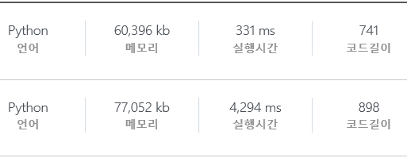
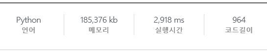
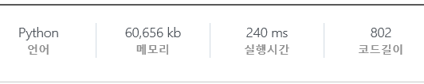

# 210403

## 백준 알고리즘 문제 풀이

* 1697 : 숨바꼭질 **pass**

  https://www.acmicpc.net/problem/1697

  평범하게 BFS로 K를 찾는 문제.

  

* 17103 : 골드바흐 파티션 **pass**

  https://www.acmicpc.net/problem/17103

  N 범위에서 모든 소수들을 찾은 다음, `N-소수`도 소수인 지를 검사. 

  순서만 다른 경우는 같은 것으로 취급하므로, `N/2`까지만 검사하면 됨.


---


# 210405

## 백준 알고리즘 문제 풀이

* 17071 : 숨바꼭질 5 **pass**

  https://www.acmicpc.net/problem/17071

  목적지인 K가 시간이 지남에 따라 움직인다.

  움직일 수 있는 경로가 x+1, x-1, 2x 이므로, +1과 -1에 의해 일정 장소에 한 번 도달하면 2초마다 그 장소에 돌아오게 된다.

  여기서 많이 헤맸던 부분은 어느 지점에 최초로 도착하는 지점을 짝수 시간과 홀수 시간으로 구분하지 않은 점이다.

  만약 특정 지점에 짝수 시간에 도착했다고 한다면, 그 뒤로 매 짝수 시간마다 해당 지점을 방문할 수 있지만 홀수 시간에 동생이 온다면 이 경로로는 동생을 잡을 수 없다. 하지만 다른 경로를 통해 홀수 시간에도 해당 지점에 방문할 수 있을 수 있으므로, 홀수 시간과 짝수 시간을 따로 저장해줄 필요가 있다.


* 11025 : 요세푸스 문제 3 **pass**

  https://www.acmicpc.net/problem/11025

  검색을 해보니 꽤나 알려진 문제인 듯하다.

  Reference : https://ko.wikipedia.org/wiki/%EC%9A%94%EC%84%B8%ED%91%B8%EC%8A%A4_%EB%AC%B8%EC%A0%9C

  여기서의 인덱스는 0부터 시작한다 사람이 i명이고 k번째마다 퇴장할 때, 마지막 사람의 인덱스를 (i, k)라고 하면,

  `(1, k) = 0` : 사람이 한 명 뿐이므로 첫번째(0) 사람이 마지막 사람이 된다.

  ***<귀납법으로 증명>***

  i = n일 때의 마지막 인덱스를 `(n, k) = x`라고 하면, 

  i = n + 1인 경우는

  `0 1 2 3 ... K-1 K K+1 ... N-1 N` 에서 첫번째 K번째 사람을 빼면,

  `K K+1 K+2 ... N-1 N 0 1 2 ... K-2` 순서의 (n, k)와 동일하게 된다.

  이 때, 기존의 0부터 시작하는 인덱스에서 K를 더한 것과 같으므로 `(x + K) % N` 가 된다. 

  

---


# 210406

## SWEA 알고리즘 문제 풀이

### `D3`

* 5293 : 이진 문자열 복원 **pass**

  https://swexpertacademy.com/main/code/problem/problemDetail.do?problemLevel=3&contestProbId=AWUiwoe6o00DFAVT&categoryId=AWUiwoe6o00DFAVT&categoryType=CODE&problemTitle=&orderBy=FIRST_REG_DATETIME&selectCodeLang=ALL&select-1=3&pageSize=10&pageIndex=8

  처음엔 DFS나 BFS를 시도했었다. 하지만 같은 경우라도 어떤 경로로 왔느냐에 따라 가능/불가능이 갈리기 때문에 시간이 너무 오래 걸려 실패. (N = 10 일 때도 몇 시간이 걸려도 안 나왔다...)

  불가능한 경우를 먼저 찾아보면, 

  1. A와 D가 모두 1 이상이지만, B와 C가 모두 0일 때.
  2. B와 C의 차이가 2 이상일 때.

  **1 :** A와 D가 모두 존재해야하므로 `0`과 `1`의 전환점이 필요하지만, B와 C가 모두 0이라 `0`과 `1`이 스위칭 될 수 없다.

  **2 :** 예를 들어, B=2, C=0의 경우를 생각하면,

  ​	`...000111(...)000111...` 형태의 문자열이 될 것이다. C가 존재하면 안 되므로, `(...)` 부분에는 `0` 혹은 `1`만 존재해야한다. 하지만 이 구간은 `1`로 시작해서 `0`으로 끝나야하므로 모순. 따라서, B와 C의 차이가 2보다 큰 경우는 존재할 수 없다.

  이 나머지 경우는 각자 순서에 맞게 이어 붙이면 된다. 

  B와 C의 차이가 1 이하이므로, 둘 중 더 많은 쪽의 갯수만큼 붙이면 나머지 한 쪽은 자동으로 따라온다.

  ex)  B=3, C=2 : `101010`

  이러고 양 옆에 A와 D만큼 `0`과 `1`을 붙이면 된다.

  B = C의 경우는 A가 더 많은 지, D가 더 많은 지에 따라 어느 쪽을 먼저 둘 것인 지를 결정하면 된다. 


* 11688 : Calkin-Wilf tree 1 **pass**

  https://swexpertacademy.com/main/code/problem/problemDetail.do?contestProbId=AXgZSOn6ApIDFASW&categoryId=AXgZSOn6ApIDFASW&categoryType=CODE&problemTitle=&orderBy=FIRST_REG_DATETIME&selectCodeLang=ALL&select-1=&pageSize=10&pageIndex=1

  분수를 분모와 분자 따로 출력하라 했으므로, 처음부터 그냥 정수로 따로 계산하면 된다.

  

이걸로 교육과정 문제들과 professional을 제외하면 D3는 다 풀었다.


### `D4`

* 1231 : 중위순회 **pass**

  https://swexpertacademy.com/main/code/problem/problemDetail.do?problemLevel=4&contestProbId=AV140YnqAIECFAYD&categoryId=AV140YnqAIECFAYD&categoryType=CODE&problemTitle=&orderBy=FIRST_REG_DATETIME&selectCodeLang=ALL&select-1=4&pageSize=10&pageIndex=11
  
  중위순회로 문자 출력.
  
  왼쪽 자식 재귀 - 출력 - 오른쪽 자식 재귀.


* 1232 : 사칙연산 **pass**

  https://swexpertacademy.com/main/code/problem/problemDetail.do?problemLevel=4&contestProbId=AV141J8KAIcCFAYD&categoryId=AV141J8KAIcCFAYD&categoryType=CODE&problemTitle=&orderBy=FIRST_REG_DATETIME&selectCodeLang=ALL&select-1=4&pageSize=10&pageIndex=11

  후위순회로 연산.

  현재 노드가 숫자면 본인을 반환.

  현재 노드가 연산자이면 왼쪽 재귀의 반환값과 오른쪽 재귀의 반환값을 연산하여 반환.


### `D5`

* 11689 : Calkin-Wilf tree 2 **pass**

  https://swexpertacademy.com/main/code/problem/problemDetail.do?contestProbId=AXgZVRZKAtIDFASW&categoryId=AXgZVRZKAtIDFASW&categoryType=CODE&problemTitle=&orderBy=FIRST_REG_DATETIME&selectCodeLang=ALL&select-1=&pageSize=10&pageIndex=1

  D5치고는 쉽게 푼 거 같다.

  정직하게 기존 규칙대로 큰 쪽에 작은 쪽을 빼면서 구하면, `1 10^18` 의 경우는 연산을 `10^18 - 1`번 하므로 시간초과가 된다.

  트리에서 같은 방향의 가지를 계속 선택한 경우에는 큰 수가 작은 수의 배수만큼 늘어난다.

  매번 `큰 수 / 작은 수 `를 하여 그 몫만큼을 카운트 해주고, `큰 수 - (작은 수 * 몫)`을 반복.

  단, 나누어 떨어지는 경우는 몫에서 1을 뺀 값으로 계산한다.

  이렇게 하면 최악의 경우는, 트리를 좌우 번갈아가면서 내려오는 경우이다.

  11688번의 코드를 사용해 테스트 한 결과, 86번 정도에서 10^18 값이 나오기 시작했으므로 최악의 경우의 연산도 86번을 넘지 않는다.

  시간 복잡도는 대략 `O(logn)`.

  파이썬 기준으로 테스트 케이스가 100000개나 되어서 그런 지, 출력을 한꺼번에 하지 않으면 시간초과가 된다. (아무 연산도 하지 않고 입출력만 반복해도 시간초과가 뜬다.)

  

---


# 210407

## SWEA 알고리즘 문제 풀이

### `D3`

* 5601 : 쥬스 나누기 **pass**

  https://swexpertacademy.com/main/code/problem/problemDetail.do?problemLevel=3&contestProbId=AWXGAylqcdYDFAUo&categoryId=AWXGAylqcdYDFAUo&categoryType=CODE&problemTitle=&orderBy=FIRST_REG_DATETIME&selectCodeLang=ALL&select-1=3&pageSize=10&pageIndex=14

  그냥 1/N.


* 5603 : 건초더미 **pass**

  https://swexpertacademy.com/main/code/problem/problemDetail.do?problemLevel=3&contestProbId=AWXGEbd6cjMDFAUo&categoryId=AWXGEbd6cjMDFAUo&categoryType=CODE&problemTitle=&orderBy=FIRST_REG_DATETIME&selectCodeLang=ALL&select-1=3&pageSize=10&pageIndex=14

  평균(= 원래의 건초더미 크기)을 구한 다음, 각 건초더미들과 평균과의 차를 구한다.

  구하려는 값이 옮기는 횟수이므로 나누기 2를 해준다.


* 5607 : 조합 **pass ※중요**

  https://swexpertacademy.com/main/code/problem/problemDetail.do?problemLevel=3&contestProbId=AWXGKdbqczEDFAUo&categoryId=AWXGKdbqczEDFAUo&categoryType=CODE&problemTitle=&orderBy=FIRST_REG_DATETIME&selectCodeLang=ALL&select-1=3&pageSize=10&pageIndex=14

  References : 
  
  https://5stralia.tistory.com/4
  
  https://sangwoo0727.github.io/algorithm/Algorithm-BOJ11401/
  
  페르마 소정리와 나머지 연산의 특징을 이용하여 변형된 조합 공식을 사용한 문제.
  
  위 링크들에 잘 정리되어있다.
  
  
  
  (123456791 - 2) 제곱을 구하는 과정에서 `O(n)`이 아닌 `O(logn)`의 방법을 사용하였다.
  
  10진수를  2진수로 변형하는 알고리즘과 매우 유사. 모든 10진수는 2의 제곱수들의 합으로 나타낼 수 있다.
  
  ```python
  t = fac[R] * fac[N - R]
  temp = 1				# 제곱한 결과를 저장
  l = M - 2				# t의 l제곱
  while l > 0:
      if (l % 2) == 1:
          temp *= t		# 2진수에서 1로 표현되는 =l을 2의 제곱수의 합으로 표현했을 때 나타나는 수
          l -= 1
          temp %= M
      t *= t				# 제곱수를 2배로 증가
      t %= M
      l /= 2
  ```
  
  
  
  2진수에서 1로 표현되는 자리수마다 곱해주면 된다. 자리수가 올라갈 때마다 곱하는 수를 제곱하여 증가시켜준다.


## 백준 알고리즘 문제 풀이

* 16922 : 로마 숫자 만들기 **pass**

  https://www.acmicpc.net/problem/16922

  중복 조합 문제. `4Hn`

  대신, 만들 수 있는 숫자들을 구하는 것이므로, 다른 조합 같은 숫자가 있을 수 있다.

  예를 들어 N=10일 때, `LIIIIIIIII` 와 `XXXXXVIIII` 는 둘 다 59로 같은 수를 나타낸다.

  중복을 알아낼 공식 같은게 있을까 고민하다가 일단 20까지의 중복 조합들을 계산해보니, `4H20 = 1,771`로 별로 크지 않은 수였다. 

  즉, 가능한 조합들을 완전 탐색하여 중복을 제거 가능한 문제.

  만들 수 있는 가장 큰 수가 `50*20 = 1000`이므로 1001 길이의 boolean 배열로 중복 여부를 검사했다.


---


# 210410

## SWEA 알고리즘 문제 풀이

### `D3`

* 5642 : 합 **pass**

  https://swexpertacademy.com/main/code/problem/problemDetail.do?problemLevel=3&contestProbId=AWXQm2SqdxkDFAUo&categoryId=AWXQm2SqdxkDFAUo&categoryType=CODE&problemTitle=&orderBy=FIRST_REG_DATETIME&selectCodeLang=ALL&select-1=3&pageSize=10&pageIndex=14


## 백준 알고리즘 문제 풀이

* 1912 : 연속합 **pass**

  https://www.acmicpc.net/problem/1912

  

  Reference : https://mygumi.tistory.com/97

  위 둘은 거의 같은 문제다.
  
  앞에서부터 하나씩 더하면서 합의 최대값을 찾는다.
  
  단, 합이 음수가 될 경우, 그 다음 숫자는 혼자 있을 때가 더 커지므로 더하지 않고 새로 시작한다.


---


# 210411

## 백준 알고리즘 문제 풀이

* 12026 : BOJ 거리 **pass**

  https://www.acmicpc.net/problem/12026

  처음엔 DFS 풀었다가 시간 초과.

  알고리즘 분류를 보니 DP라고 되어있었다.

  배열 dp와 before를 만들고, dp에는 시작점에서부터의 최소 에너지를, before에는 최소에너지일 때 바로 직전에 있었던 곳의 인덱스를 저장한다.

  이 때, 시작점에서 갈 수 없는 지점 (시작점이 아닌데 before가 없는 지점)은 dp를 계산할 때 제외시킨다.


---


# 210412

링크로 접근은 안 되는 듯해서 생략.

## Programming Professional 1일차 - Ad Hoc Algorithms

> 특별한 이론보다는 아이디어에 의존한다.


### Parametric Search

Reference : https://www.crocus.co.kr/1000


* 11차시 - 3813 : 그래도 수명이 절반이 되어서는... **pass**

  Parametric search와 Binary search 사용.

  **Parametric search**

  어떤 x에 대해, 답이 x라고 가정했을 경우 참인지 거짓인지를 판별.

  W에서 x이하인 값이 연속으로 나오면 카운팅 하여, Si를 차례로 넣을 수 있는 지를 확인한다. = `O(n)`

  **Binary search**

  어떤 x에 대해 parametric search 결과가 참이면, x 이상의 값에서는 모두 참이된다.

  반대로 거짓이면, x이하의 값에서는 모두 거짓이 된다.

  이를 이용해 참과 거짓의 경계가 되는 값을 찾아, 문제에서 요구하는 최소값을 찾을 수 있다. = `O(logn)`

  binary search을 하며 parametric search를 반복하므로, = `O(nlogn)`


* 13차시 - 3816 : 아나그램 **pass**

  아나그램은 같은 알파벳으로 순서만 바꾼 단어를 뜻하므로, 들어가있는 알파벳의 수만 일치하면 된다.

  S1의 counting을 구한 다음,

  S2을 처음부터 이동하면서 S1의 길이만큼 잘라 counting. 아나그램이 맞으면 개수 + 1.

  하지만 매번 부분 문자열을 새로 카운팅하면, `(|S2| - |S1| + 1) * |S1| * 26(비교연산)` 만큼의 연산이 필요함.  = `O(n^2)`

  이 때, S2의 부분 문자열을 카운팅할 때, 다음으로 넘어가면서 첫 문자를 - 1, 다음 문자열에서 마지막 문자만 + 1을 해주는 방법을 사용하면 `(|S2| - |S1| + 1) * 2 * 26`만큼만 연산하면 된다.  = `O(n)`


---


# 210413

## Programming Professional 1일차 - Ad Hoc Algorithms

* 12차시 - 3814 : 평등주의 **pass**

  역시 parametric search를 사용하는 문제.

  어떤 x에 대해, 인접한 차이가 x 이하가 되도록 만들 수 있는가를 판별. 이것을 판별하는 방법에 의해 시간복잡도가 결정된다.
  
  **<판별 방법 1>**
  
  1. 수열의 어느 한 요소를 기준으로 하면, 양 옆으로 한 칸 갈 때마다 +x 만큼의 상한값을 결정할 수 있다. 이 상한값을 모든 요소에 대해 구한다.
  2. 각 칸의 상한값들 중 최소값을 취한다. 
  3. 입력 배열과 비교하여 얼마만큼 감소시켜야하는 지 계산.
  4. K와 비교해서 참 거짓 판별.
  
  
  
  이 방법은 1번에 의해 `O(n^2)`이 된다.
  
  **<판별 방법 2>**
  
  시간복잡도를 `O(n)`인 점화식으로 만들기 위해, 위의 2차원 배열을 두 구간으로 나누어 계산한다.
  
  
  
  다음을 구해서 `min(A[i], B[i])`를 취하면, 방법 1과 같은 결과가 나온다.


* 14차시 - 3819 : 최대 부분 배열 **pass**

  SWEA 5642, 백준 1912 와 같은 문제.

  이 문제에서는 자바와 파이썬은 입력에서 런타임에러가 발생하는 듯하다.

  자바는 Scanner를 사용하면 된다고 하던데, 파이썬은 

  ```python
  T = int(input())
  for test_case in range(1, T + 1):
      N = input()
      A = [input() for _ in range(N)]
  ```

  이거만 제출해도 런타임 에러 발생한다...

  방법이 없어 보여 C로 풀이.

   

---


# 210414

## SWEA 알고리즘 문제 풀이

### `D3`

* 11736 : 평범한 숫자 **pass**

  https://swexpertacademy.com/main/code/problem/problemDetail.do?contestProbId=AXhh-H-KwUcDFARQ&categoryId=AXhh-H-KwUcDFARQ&categoryType=CODE&problemTitle=&orderBy=FIRST_REG_DATETIME&selectCodeLang=ALL&select-1=&pageSize=10&pageIndex=1

  그냥 대소 비교하는 문제...

  

* 1244 : 최대 상금 **pass**

  https://swexpertacademy.com/main/code/problem/problemDetail.do?problemLevel=3&contestProbId=AV15Khn6AN0CFAYD&categoryId=AV15Khn6AN0CFAYD&categoryType=CODE&problemTitle=&orderBy=FIRST_REG_DATETIME&selectCodeLang=ALL&select-1=3&pageSize=10&pageIndex=12

  이전에 한 번 풀었던 문제지만 과제로 나온 김이 한 번 더 풀어봤다.

  백준의 17071번 문제의 아이디어로 접근하여 가지치기를 하면 훨씬 빨라진다.

  원소 중 2개를 골라 교환. 다만, 같은 두 원소를 반복해서 교환하는 것도 가능하므로 최대 시간은

  `(6C2)^10 = 15^10 = 576,650,390,625`

  테스트 케이스 10번이 이에 해당한다. (최대 6자리, 최대 교환 횟수 10번)

  여기서 백준 17071번의 아이디어를 들고 오면, 한 번 특정한 숫자가 교환으로 인해 등장하게되면, **2 깊이마다 반복해서 나타날 수 있다.**

  즉, 처음 등장 했을 때 저장을 해두고 (**memorization**), 반복 등장했을 경우는 가지치기를 하면 된다. 

  이 때, 홀수 깊이에서 등장했을 경우와 짝수 깊이에서 등장했을 경우에 따라 K에서 등장할 수 있는 지 여부가 결정되기 때문에 **K의 홀짝 여부**에 따라 저장해주는 경우를 나눈다. (K가 홀수면 홀수 깊이에서만 저장)

  저장된 값들 중 가장 큰 값을 취하면 된다.


## Programming Professional 2일차 - 증명의 중요성

* 10차시 - 3820 : 롤러코스터

  정답인 순서를 가정하고 1~n까지 번호를 붙이고, av + b 연산을 (a, b)로 표기하도록 하자.

  임의의 i를 취했을 때, i-1번째까지의 결과 값 x로 (ai, bi) → (ai+1, bi+1)를 한 것이 (ai+1, bi+1) → (ai, bi)를 한 것보다 작아야한다. (그래야 최소값이 나오기 때문)

  대소 관계는 x값에 상관 없이 일정하므로 1로 두면,

  `ai+1*(ai + bi) + bi+1 <= ai*(ai+1 + bi+1) + bi`

  → `bi*(ai+1 - 1) <= bi+1*(ai - 1)`

  위의 대소관계를 가지고 정렬하면 된다.

  파이썬에서는 이렇게 정렬이 가능하다.

  ```python
  # ab : (a, b)를 원소로 하는 리스트
  # (a - 1)/b 의 내림차순 정렬
  ab.sort(key=lambda x : (-(x[0] - 1) / x[1]))
  ```

  직접 정렬을 구현할 때에는 b는 10^9이고 a는 1자리수의 차이면, 일반적인 float의 유효자리 범위를 넘기 때문에 제대로 정렬이 안 될 수 도 있다. 그러니 위의 곱셈 형태를 사용하자.

  또한, 정렬 알고리즘을 `O(n^2)` 인 것을 사용하면 시간초과가 된다. (n = 2 * 10^5) `O(nlogn)` 인 정렬 알고리즘을 사용하자.

  정렬 후에는 계산만 하면 되므로, 전체 시간복잡도는 사용하는 정렬 알고리즘과 같다.


* 12차시 - 3950 : 괄호

  주어진 문자열 내에서 **올바른 부분 문자열** 을 모두 제거하면, 반드시 `))...))((...((` 형태가 된다. (다른 것을 끼워넣으면 올바른 부분 문자열이 생기게 되므로 모두 제거한다는 가정에 어긋난다.)

  각각을 A파트, B파트라고 하면, 둘 중 하나를 모두 뒤집은 다음에 끝부분의 반틈을 뒤집으면 된다. (즉, A파트와 B파트 개수의 합이 **홀수이면** 올바르게 만들 수 없다.)

  뒤집는다 = reverse = 123 → 321 임을 주의하자.

  **stack** 을 사용하여 올바른 부분 문자열을 제거할 수 있다. 올바르지 않은 부분들의 인덱스를 저장한다.

  1. `(` 이 없는데 `)`가 나옴. → A파트에 저장.
  2. 입력 문자열 탐색이 끝난 뒤에 stack에 남아있는 것. → B파트.

  뒤집을 때 **인덱스가 바뀜**에 주의하자.

  ```python
  start = A[0]
  end = A[-1]
  temp = []
  for i in range(len(A) - 1, -1, -1):
      temp.append((start + end) - A[i])
  A = temp
  ```

  

  Reference : https://zoosso.tistory.com/610

  이런 풀이방법도 있다.


---


# 210415

## SWEA 알고리즘 문제 풀이

### 모의 SW 역량테스트

* 4012 : 요리사 **pass**

  https://swexpertacademy.com/main/code/problem/problemDetail.do?contestProbId=AWIeUtVakTMDFAVH&categoryId=AWIeUtVakTMDFAVH&categoryType=CODE&problemTitle=%EB%AA%A8%EC%9D%98&orderBy=FIRST_REG_DATETIME&selectCodeLang=ALL&select-1=&pageSize=10&pageIndex=1

  하나의 요리에 식재료를 반드시 N/2개를 사용해야하므로, 최대 경우의 수는 `16C8 = 12,870`.

  즉, 완전탐색 가능한 문제다.

  0 ~ n-1를 차례로 A에 넣었을 경우와 B에 넣었을 경우를 각각 재귀. 둘 중 하나의 길이가 n/2를 넘어가면 멈추고, 둘 다 길이가 n/2가 되었을 경우에는 맛 차이를 계산.

  이 때, 맛 차이의 절대값을 구하는 것이므로, A와 B가 대칭일 경우는 값이 같다.

  여기에 대한 첫번째 방법으로, 지금까지 나온 A와 B를 따로 저장하여, 차이값을 계산하기 전 출현 여부를 검사하였다. 이 경우, 대칭된 케이스도 재귀는 최대깊이까지 내려가므로 실행시간이 오래 걸린다.

  

  위의 재귀 트리를 보면, 루트를 기준으로 대칭이 형성된다. 따라서, 왼쪽 서브트리만 재귀 탐색을 하게 되면 시간이 훨씬 적게 걸린다.

  

  이론적으로는 절반의 시간이지만(`16C8 / 2 = 15C7`), 대칭 검사를 하는 시간과 메모리가 영향을 미친 듯하다. (해당 부분의 코드만 삭제하여 제출하였다.)

  


## Programming Professional 2일차 - 증명의 중요성

* 11차시 - 3947 : 가장 짧은 길 전부 청소하기 **풀이 중**

  Dijkstra + min heap

  Shortest path DAG

  썩 금방 와닿는 내용은 아니었다. 일단 다익스트라 구현부터 천천히 해보자...


---


# 210416

## SWEA 알고리즘 문제 풀이

### `D4`

* 4366 : 정식이의 은행업무 **pass**

  https://swexpertacademy.com/main/code/problem/problemDetail.do?contestProbId=AWMeRLz6kC0DFAXd&categoryId=AWMeRLz6kC0DFAXd&categoryType=CODE&problemTitle=4366&orderBy=FIRST_REG_DATETIME&selectCodeLang=ALL&select-1=&pageSize=10&pageIndex=1

  2진수, 3진수의 각 자리가 잘못됐을 경우의 모든 경우를 계산. 같은 것을 찾는다.

  각 수를 10진수로 바꾸는데 `O(n)`.

  몇 번째 자리가 잘못됐는지 전부 탐색해야하므로 숫자 바꾸기를 n번 반복.

  따라서 시간복잡도는 `O(n^2)`


* 2819 : 격자판의 숫자 이어 붙이기 **pass**

  https://swexpertacademy.com/main/code/problem/problemDetail.do?contestProbId=AV7I5fgqEogDFAXB&categoryId=AV7I5fgqEogDFAXB&categoryType=CODE&problemTitle=2819&orderBy=FIRST_REG_DATETIME&selectCodeLang=ALL&select-1=&pageSize=10&pageIndex=1

  DFS로 깊이 7만큼 탐색한 다음에 중복되는 수가 아닐 경우 배열에 넣는다. 앞자리 0도 유효하므로 문자열을 사용하는 편이 낫다고 생각했다.

  이동은 네 방향으로 가능하며, 모든 칸에서 시작할 경우를 완전탐색. = `16 * 4^6 = 2^16 = 65,536`


* 1861 : 정사각형 방 **pass**

  https://swexpertacademy.com/main/code/problem/problemDetail.do?contestProbId=AV5LtJYKDzsDFAXc&categoryId=AV5LtJYKDzsDFAXc&categoryType=CODE&problemTitle=1861&orderBy=FIRST_REG_DATETIME&selectCodeLang=ALL&select-1=&pageSize=10&pageIndex=1

  모든 칸에서 시작하여, 이동 가능한 방 수를 완전 탐색. = `O(n^3)` 

  

  하지만 이 문제의 경우, 이동할 수 있는 방이 자신보다 번호가 1 큰 방으로 정해져있다. 즉, 각 방마다 이동 가능한 지 여부가 T/F로 결정된다.

  boolean 배열을 N*N만큼 만들어, 해당 번호의 방이 이동이 가능한 지를 저장. T가 가장 길게 이어지는 곳의 시작 번호를 찾으면 된다. 

  같은 길이일 경우, 방 번호가 더 작은 쪽을 출력해야하므로 boolean 배열을 거꾸로 탐색하면 편하다.

  ```python
  # boolean 배열 path
  count = 0
  res = 0
  room = 0
  for i in range(len(path) - 1, -1, -1):
      if path[i]:
          count += 1
      else:
          if res <= count + 1:
              res = count + 1
              room = i + 1
          count = 0
  ```

  출력해야하는 것이 이동 횟수가 아니라 방의 수이므로 + 1을 해줘야한다.

  시간복잡도 = `O(n^2)`

  


* 1486 : 장훈이의 높은 선반 **pass**

  https://swexpertacademy.com/main/code/problem/problemDetail.do?contestProbId=AV2b7Yf6ABcBBASw&categoryId=AV2b7Yf6ABcBBASw&categoryType=CODE&problemTitle=1486&orderBy=FIRST_REG_DATETIME&selectCodeLang=ALL&select-1=&pageSize=10&pageIndex=1

  부분집합 + 가지치기

  부분집합의 완전탐색을 하면서, B과 가장 작은 차이가 나는 경우를 찾는다.

  이 때, 키의 합이 `B + 현재의 가장 작은 차이`보다 커지면 가지치기를 한다.


### `D5`

* 1247 : 최적 경로 **pass**

  https://swexpertacademy.com/main/code/problem/problemDetail.do?contestProbId=AV15OZ4qAPICFAYD&categoryId=AV15OZ4qAPICFAYD&categoryType=CODE&problemTitle=1247&orderBy=FIRST_REG_DATETIME&selectCodeLang=ALL&select-1=&pageSize=10&pageIndex=1

  전형적인 TSP. 시간 제한이 순열 완전탐색이 가능한 정도이다.

  바보 같이 회사, 집, 손님들의 좌표 순서를 잘못 봐서 한참 헤맸다... 문제를 잘 읽자.

  이걸 보면 D5도 만만찮게 난이도 편차가 심한 듯하다.


## Programming Professional 5일차 - 그래프

* 12차시 - 4006 : 고속도로 건설 2 **풀이 중**

  min heap을 사용한 Prim MST.

  특정 노드에 연결된 edge를 한 번에 불러올 수 있도록 리스트 or 딕셔너리 사용. (ex. edges[i]는 i에 연결된 모든 간선)

  visit 표시는 boolean으로.

  간선 저장 시에 edges[i]에는 (i, x) 순서로 저장하여, 연결된 반대편이 이미 방문한 곳이면 heap에 넣지 않았다.

  이렇게 해서 8개 중 7개 맞고 시간초과...

  시간을 줄일 방법을 더 고민해봐야겠다.


* 13차시 - 4007 : 간담회 참석 **풀이 중**

  역방향 그래프를 따로 생성하여 Dijkstra 2번 돌리기.


pro는 시간 초과 고려를 많이 해야하는 것 같다.

파이썬이라 그런 걸까.

여유가 되면 다른 언어로도 풀어봐야겠다.


---


# 210418

## Programming Professional 5일차 - 그래프

* 12차시 - 4006 : 고속도로 건설 2 **풀이 중**

  입력을 한꺼번에 받으면 개선될까 생각했는데 아니네...

  뭐가 문제일까...


---

# 210419

## SWEA 알고리즘 문제 풀이 

### 모의 SW 역량테스트

요즘은 시뮬레이션 위주로 출제된다 하실래 시뮬레이션의 대표 문제를 풀어보았다.


* 2382 : 미생물 격리 **pass**

  https://swexpertacademy.com/main/code/problem/problemDetail.do?contestProbId=AV597vbqAH0DFAVl&categoryId=AV597vbqAH0DFAVl&categoryType=CODE&problemTitle=%EB%AA%A8%EC%9D%98&orderBy=FIRST_REG_DATETIME&selectCodeLang=ALL&select-1=&pageSize=10&pageIndex=2

  좌표 리스트를 만들고, M시간만큼 반복문을 돌리며 군집끼리 만나거나 약품을 만나는 경우를 고려한다.

  좌표 리스트를 sorting을 시키면 같은 좌표에 있는 경우를 쉽게 찾을 수 있다.

  SW 역량테스트는 라이브러리 사용이 가능하니 마음껏 이용하자.

  ```python
  samples.sort(key=lambda x: (x[0], x[1], -x[2]))
  ```

  파이썬은 이렇게 하면, 같은 좌표 있는 가장 큰 군집을 쉽게 고려할 수 있다. 


* 5648 : 원자 소멸 시뮬레이션 **pass**

  https://swexpertacademy.com/main/code/problem/problemDetail.do?contestProbId=AWXRFInKex8DFAUo&categoryId=AWXRFInKex8DFAUo&categoryType=CODE&problemTitle=%EB%AA%A8%EC%9D%98&orderBy=FIRST_REG_DATETIME&selectCodeLang=ALL&select-1=&pageSize=10&pageIndex=1

  위의 문제와 거의 동일.

  제출하고 한참 돌길래 시간 초과 날 줄 알았다. 전체 실행시간은 11초 정도. 찜찜하긴 한데... 풀었으면 됐나... 일단 지금 목적은 삼성 코테 통과니까.

  0.5초 단위를 표현하기 위해 전체 좌표를 x2를 하여 사용하였다.

  1. 원소가 1개 남을 때까지 반복.
  2. 입력 좌표의 범위가 -1000 ~ 1000이므로 이동 후의 좌표가 이를 넘어가면, 경로에서 다른 원자를 만날 리가 없으므로 더이상 고려하지 않는다.


## Programming Professional 8일차 - DP

* 14차시 - 4052 : 프리랜서 **pass**

  1~i번째까지의 일을 하였을 때, 가장 큰 소득.

  `before[i]` : i번째 일이 시작하기 바로 전에 끝나는 일의 index.

  DP의 특성상, **before[i]는 i보다 작은 인덱스**여야하지만, 이 문제의 테스트 케이스들은 이걸 고려하지 않아도 pass가 가능한 것 같다.

  DP의 점화식은 두 갈래로 나뉜다.

  1. i번째 일을 하지 않는 경우.
  2. 직전의 일 (before[i]) 까지의 최대 소득에서 i번째 일을 하는 경우.

  `dp[i] = max(dp[i - 1], dp[before[i]] + C[i])`

  

* 15차시 - 4062 : Largest Empty Square **pass**

  `dp[i][j]` : 오른쪽 아래가 (i, j)인, 가장 큰 비어있는 정사각형.

  재귀식 : `dp[i][j] = min(dp[i-1][j-1], dp[i-1][j], dp[i][j-1]) + 1`

  

  min이 결정된 시점에서, (i, j)를 기준으로 min + 1만큼은 검은 점이 없다는 것이 보장된다.


* 18차시 - 4070 : 타일링 **pass**

  `dp[i] = dp[i - 1] + 2 * dp[i - 2]`

  전에 어디선가 봤던 문제라 금방 풀었다.

  


---


# 210420

## SWEA 알고리즘 문제 풀이 

### 모의 SW 역량테스트

* 5656 : 벽돌 깨기 **pass**

  https://swexpertacademy.com/main/code/problem/problemDetail.do?contestProbId=AWXRQm6qfL0DFAUo&categoryId=AWXRQm6qfL0DFAUo&categoryType=CODE&problemTitle=%EB%AA%A8%EC%9D%98&orderBy=FIRST_REG_DATETIME&selectCodeLang=ALL&select-1=&pageSize=10&pageIndex=1

  DFS와 BFS를 적절히 섞었다고 해야하나.

  기본적으로는 매번 구슬을 쏠 때마다, 가장 위에 있는 벽돌들을 찾아 각 벽돌을 쏠 경우에 대해 DFS로 완전탐색.

  구슬로 특정 벽돌을 쏜 후, 벽돌의 숫자에 따라 연쇄적으로 벽돌이 깨지는 경우가 있다. 

  해당 벽돌의 폭파 범위 안에 있는 모든 벽돌들은 queue에 넣은 다음, 더이상 queue에 남은 벽돌이 없을 때까지 벽돌을 없애도록 한다. 여기서는 BFS와 유사하다.

  매번 벽돌 상태를 복원시키기가 힘드므로, 구슬을 쏠 때마다 직전 상태의 벽돌 정보를 복사하여 사용한다. 재귀를 할 때, 직전의 벽돌 정보도 함께 넘겨주도록 했다.

  벽돌을 폭파시킨 다음에는 중간에 빈 공간이 생긴 경우 벽돌이 떨어지는 것도 잊지 말고 구현하자.

  ```python
  # 아래에 빈 공간이 있는 벽돌 떨어뜨리기
  # temp : 폭파 뒤의 벽돌 정보
  for j in range(W):
      for i in range(H - 1, -1, -1):
          if temp[i][j]:
              y = i + 1
              while True:
                  if y >= H or temp[y][j]:
                      break
                  temp[y][j], temp[y - 1][j] = temp[y - 1][j], temp[y][j]
                  y += 1
  ```

  시간복잡도는, 매번 구슬을 쏠 때마다 가장 위에 있는 벽돌을 모두 재귀로 탐색하므로, `O(W^N)`.

  N <= 4, W <= 12 이므로, `12^4 = 20,736`. 완전탐색이 가능하다. 


* 2117 : 홈 방범 서비스 **pass**

  https://swexpertacademy.com/main/code/problem/problemDetail.do?contestProbId=AV5V61LqAf8DFAWu&categoryId=AV5V61LqAf8DFAWu&categoryType=CODE&problemTitle=%EB%AA%A8%EC%9D%98&orderBy=FIRST_REG_DATETIME&selectCodeLang=ALL&select-1=&pageSize=10&pageIndex=2

  문제 내용 자체는 어렵지 않다. 다만 마름모를 탐색하는 것이 까다로웠다.

  ```python
  # 마름모 탐색
  for k in range(1, N + 1 + is_even):
      for i in range(k):
          for d in delta:
              nr = r + d[0] * i
              nc = c + d[1] * (k - 1 - i)
              if is_in(nr, nc) and not visit[nr][nc]:
                  visit[nr][nc] = 1
                  if info[nr][nc]:
                      count += 1
  ```

  어느 특정한 점을 가운데로 하여 탐색할 때, 한 번에 최대 크기까지의 마름모를 탐색하면 탐색 시간을 줄일 수 있다.

  k = 1 마름모 탐색 → 손익 계산 → k = 2 마름모의 가장자리 부분 탐색 → 반복.

  마름모가 커질 수록 해당되는 집의 수는 같거나 늘어날 것이다. 마름모 크기가 k일 때, 손해를 보지 않는 경우만 값을 갱신한다. 

  최대 크기까지 모두 탐색한 후에 마지막으로 갱신 된 값을 리턴하면, 해당 점을 가운데로 했을 경우의, 손해를 보지 않고 공급할 수 있는 최대 집이 수가 된다. 

  ```python
  if costs[k] <= count * M:
      ret = count
  ```

  cost[k]는 테스트 케이스 시작 전에 미리 만들어두면 중복하여 계산되는 걸 피할 수 있다.

  

  홈페이지에서 주어지는 10번 째 테스트 케이스. 즉, N*N이 모두 마름모 안에 들어갈 경우를 생각하면 탐색해야하는 최대 마름모 크기를 고려할 수 있다. 마름모 안에 있는 최대 정사각형의 한 변의 길이가 얼마인 지를 자세히 보면,

  **N이 홀수일 때, K = 1 ~ N**

  **N이 짝수일 때, K = 1 ~ (N + 1)**

  가 됨을 알 수 있다. 

  

* 2115 : 벌꿀채취 **pass**

  https://swexpertacademy.com/main/code/problem/problemDetail.do?contestProbId=AV5V4A46AdIDFAWu&categoryId=AV5V4A46AdIDFAWu&categoryType=CODE&problemTitle=%EB%AA%A8%EC%9D%98&orderBy=FIRST_REG_DATETIME&selectCodeLang=ALL&select-1=&pageSize=10&pageIndex=2

  가로로 길이 M인 부분 배열 2개 조합 찾기. X 부분 배열의 부분 집합들 중 최대 수익을 얻는 조합 찾기.

  전자가 `O(n^4)`, 후자가 `O(2^M)`이다. 여기서 n은 벌통의 한 변 길이. 벌통의 2차원 배열 전체를 n으로 본다면 `O(n^2)`으로 볼 수도 있을 것이다.

  N <= 10, M <= 5이므로, `N^4 * 2^5 = 320,000`. 역시 완전탐색 가능한 문제다.


### `D4`

* 1865 : 동철이의 일 분배 **pass**

  https://swexpertacademy.com/main/code/problem/problemDetail.do?contestProbId=AV5LuHfqDz8DFAXc&categoryId=AV5LuHfqDz8DFAXc&categoryType=CODE&problemTitle=1865&orderBy=FIRST_REG_DATETIME&selectCodeLang=ALL&select-1=&pageSize=10&pageIndex=1

  문제 자체는 특이한 게 없는 백트래킹 문제이다.

  다만, 확률을 계산해야하는데 입력이 퍼센트 (%)로 들어와서 이를 실수 형태 (0 ~ 1)로 편하게 변환하려고 map()을 적용할 방법이 없을까 고민하다가, **`map()`에서도 `lambda`를 사용할 수 있다**는 것을 알았다.

  ```python
  map(lambda x: x / 100, map(float, input().split()))
  ```

  이렇게 표현이 가능하다.


## Programming Professional 8일차 - DP

* 16차시 - 4065 : LCS **pass**

  **Longest Common Subsequence** 알고리즘. 유명한 DP 알고리즘이라 한다.

  Reference : https://twinw.tistory.com/126

  먼저, subsequence이기 때문에 substring과는 달리, 등장 **순서**만 맞으면 원래의 문자열에서 **연속적으로 등장할 필요는 없다.**

  예시 테스트 케이스의 경우를 생각해보면, 

  ACGT와 AGCT의 LCS는 **ACT**와 **AGT**로 두 가지가 있으므로, LCS의 길이는 **3**이다.

  <점화식>

  **if String1[i] == String2[j] :**  `dp[i][j] = dp[i - 1][j - 1] + 1`

  **else :** `dp[i][j] = max(dp[i - 1][j], dp[i][j - 1])`


* 17차시 - 4066 : All Pair Shortest Path **풀이 중**

  Reference : https://hsp1116.tistory.com/45

  왜.. 오답이 나오니... 예시는 다 맞는데 ㅠㅠ


---


# 210421

## SWEA 알고리즘 문제 풀이 

### 모의 SW 역량테스트

* 5644 : 무선 충전 **pass**

  https://swexpertacademy.com/main/code/problem/problemDetail.do?contestProbId=AWXRDL1aeugDFAUo&categoryId=AWXRDL1aeugDFAUo&categoryType=CODE&problemTitle=%EB%AA%A8%EC%9D%98&orderBy=FIRST_REG_DATETIME&selectCodeLang=ALL&select-1=&pageSize=10&pageIndex=1

  어제 2115번에서도 느꼈지만, ~한 최대값, 최소값을 구할 때는 그냥 DFS로 완전탐색을 때려버리자. 삼성 코테는 실행시간 조건이 그래도 충분하다.

  전체를 DFS 돌리는 문제보다는 부분적으로 완전탐색이 필요한 문제가 많은 듯하다. 물론 완탐이 아니어도 조건을 잘 만들면 가능하지만, 완탐이 구현하기도 쉽고 시간도 충분한 선에서 입력 크기가 주어진다. 

  이번 코테는 시험장에서 괜히 어설프게 조건문 쓰지 말고 최대값, 최소값 구할 때는 그냥 완탐으로 가자.

  매 시간마다 충전기의 visit배열을 만들고, 거리를 계산하여 **A와 인접하면 +1, B와 인접하면 +2**로 표시. 이렇게 하면 A와 B 모두와 인접하면 값이 3이 되므로 A, B, A와 B를 구분이 가능하다.

  이렇게 만든 visit 배열을 통해, 완탐을 하여, 해당 시간에서의 A와 B의 최대 충전값을 구한다.

  ```python
  # 완전탐색 재귀 함수
  # BCs는 충전기 정보
  def max_power(k, SA, SB):
      global tempA
      global tempB
      if k == A:
          if SA + SB > tempA + tempB:
              tempA = SA
              tempB = SB
          return
  
      if visit[k] == 1:
          max_power(k + 1, BCs[k][3], SB)
      elif visit[k] == 2:
          max_power(k + 1, SA, BCs[k][3])
      elif visit[k] == 3:
          max_power(k + 1, BCs[k][3], SB)
          max_power(k + 1, SA, BCs[k][3])
          max_power(k + 1, BCs[k][3] //2, BCs[k][3] //2)
      max_power(k + 1, SA, SB)
      return
  ```

  

* 4008 : 숫자 만들기 **pass**

  https://swexpertacademy.com/main/code/problem/problemDetail.do?contestProbId=AWIeRZV6kBUDFAVH&categoryId=AWIeRZV6kBUDFAVH&categoryType=CODE&problemTitle=%EB%AA%A8%EC%9D%98&orderBy=FIRST_REG_DATETIME&selectCodeLang=ALL&select-1=&pageSize=10&pageIndex=1

  단순히 생각하면 순열 문제처럼 보여서 `12! = 479,001,600`이 되어 완탐을 못 할 거라 생각할 수 있다. 

  하지만 연산자의 배치 순서를 결정하는 문제이긴 하나, 종류는 4개 뿐이므로 순열이 아니라 **중복순열** 문제이다.

  N <= 12이므로 배치하는 연산자의 최대 개수는 11 (= N - 1). 즉, `4Π11 = 4^11 = 4,194,304` 로 완전탐색 가능하다.

  단순 DFS라 금방 풀었다.


* 2105 : 디저트 카페 **pass**

  https://swexpertacademy.com/main/code/problem/problemDetail.do?contestProbId=AV5VwAr6APYDFAWu&categoryId=AV5VwAr6APYDFAWu&categoryType=CODE&problemTitle=%EB%AA%A8%EC%9D%98&orderBy=FIRST_REG_DATETIME&selectCodeLang=ALL&select-1=&pageSize=10&pageIndex=2

  순회 방향을 **한 방향으로 정하여** 탐색. 여러 방향을 다 고려하면, 시작점을 바꾸어 탐색할 때 중복이 발생한다.

  

  같은 곳을 2번 방문하는 것도, 같은 디저트를 파는 다른 곳을 방문하는 것도 불가능하므로, 방문 표시를 **디저트 번호**를 이용하여 한다.

  재귀마다 **방향 정보**를 넘겨준다. 방향 정보는 delta의 인덱스가 된다. 

  `delta = [(1, 1), (1, -1), (-1, -1), (-1, 1)]` (시계 방향)

  방향 번호가 마지막 번호이며, 시작점과 같은 곳으로 돌아오면 카페 수를 갱신하고 재귀를 멈춘다.

  각 경우마다 재귀는 2번씩 호출된다. (방향을 그대로, 혹은 다음 방향으로 바꾸는 경우)

  어느 한 곳을 시작점으로 두었을 때, 최악의 경우에 N * N개의 카페를 모두 탐색하게 된다. 시작점으로 가능한 경우도 N * N개가 있으므로, 시간복잡도는 `O(n^4)`.

  N <= 20이므로, `20^4 = 160,000`. 역시 완전탐색 가능하다.


## Programming Professional 6일차 - 문자열 알고리즘

* 15차시 - 4038 : 단어가 등장하는 횟수 **pass**

  **<Rabin-Karp 알고리즘>**

  `f(T[i ~ i+m-1]) = T[i+m-1] + T[i+m-2]*x + ... + T[i]*x^(m-1) (mod P)`

  문자열을 x진법으로 표현한 것으로 계산하여 해쉬 키를 구한다. 이 문제는 입력이 영어 대소문자, 숫자를 모두 포함하고 있으므로, x는 아스키 코드 최대값보다 큰 소수를 사용하는 것이 좋다.

  또한, 여기서 P는 해쉬 키 값이 너무 커지는 것을 막기 위해 나머지 연산을 취한 것이다.

  **P와 x는 모두 소수인 편이 키 값의 충돌 확률을 훨씬 낮출 수 있다.**

  C/C++의 경우, `unsigned long long` 를 사용하여 **오버플로우를 이용**하면, `2^64`를 P로 둔 효과를 낼 수 있다. 이 때는 나머지 연산을 사용하지 않으므로 실행 속도도 좀 더 **빨라진다.**

  나머지 연산을 사용하여 구현한 파이썬 코드는 시간초과고, 사용하지 않은 C 코드는 통과되었다.


* 16차시 - 4039 : 두 번 이상 등장하는 문자열 **pass**

  **Parametric search + Rabin-Karp 알고리즘**

  특정 n이 주어졌을 때, n 길이의 부분 문자열이 두 번 이상 나타나는지 여부를 확인.

  1. Rabin-Karp를 사용하여 문자열 B에서 만들 수 있는 길이 n (n <= len(B))의 모든 부분 문자열의 해쉬 키 값을 구한다. = `O(n)`
  2. 키 값들을 **정렬** (merge sort 사용). = `O(nlogn)`
  3. 키 값들 중, **중복**으로 나타나는 키가 있으면 참, 없으면 거짓. = `O(n)`

  위의 과정을 반복. Parametric search = `O(logn)`

  전체 시간복잡도 = `O(logn) * (O(n) + O(nlogn) + O(n)) = O(nlog^2n)`

  위의 문제와 마찬가지로 라빈-카프를 사용해야하므로, 오버플로우를 이용하기 위해 C언어로 풀이.


---


# 210422

## SWEA 알고리즘 문제 풀이 

### 모의 SW 역량테스트

* 2112 : 보호 필름 **pass**

  https://swexpertacademy.com/main/code/problem/problemDetail.do?contestProbId=AV5V1SYKAaUDFAWu&categoryId=AV5V1SYKAaUDFAWu&categoryType=CODE&problemTitle=%EB%AA%A8%EC%9D%98&orderBy=FIRST_REG_DATETIME&selectCodeLang=ALL&select-1=&pageSize=10&pageIndex=2

  부분집합과 유사한 DFS 사용.

  각 층에서 3가지 재귀가 생긴다. 

  1. 해당 층에 A 약품을 사용하는 경우
  2. 해당 층에 B 약품을 사용하는 경우
  3. 해당 층에 약품을 사용하지 않는 경우

  따라서, 시간 복잡도는 `O(3^D)`.

  D <= 13이므로, `3^13 = 1,594,323`.

  필름의 합격 기준 검사까지 고려하면, `W * D * 3^D = 20 * 13 * 3^13  = 414,523,980`.

  합격 기준 검사나 DFS에서 가지치기를 하면 시간 안에 풀 수 있다.


### `D4`

* 1251 : 하나로 **pass**

  https://swexpertacademy.com/main/code/problem/problemDetail.do?contestProbId=AV15StKqAQkCFAYD&categoryId=AV15StKqAQkCFAYD&categoryType=CODE&problemTitle=1251&orderBy=FIRST_REG_DATETIME&selectCodeLang=ALL&select-1=&pageSize=10&pageIndex=1

  가중치가 (E * L^2)인 MST 문제.

  문제에서 확실히 명시를 안 해주었는데, L은 그냥 일반적은 좌표상의 거리다.

  `W[i][j] = E * L^2 = E*((x[i] - x[j])^2 + (y[i] - y[j])^2)`

  Prim 알고리즘 사용.


## Programming Professional 4일차 - Counting & Probability

* 21차시 - 3993 : Pole **pass**

  DP 사용.

  `dp[n][l][r] = dp[n - 1][l - 1][r] + dp[n - 1][l][r - 1] + (n - 2) * dp[n - 1][l][r]`


* 23차시 - 3998 : Inversion Counting **풀이 중**

  코테 끝나고 여유 생기면 indexed tree에 대해서 정리해보자.

