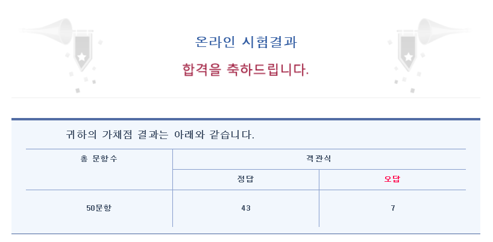

# 210503

## 2020 카카오 인턴십 기출 문제

* 경주로 건설

  BFS 사용.

  queue에 정보를 저장할 때, 비용도 함께 저장해야 잘못 계산되는 것을 피할 수 있다.


---


# 210504~05

* 리눅스 기본 명령어 정리

* 리눅스 마스터 2급 1차 시험

  

족보 사이트 : https://q.fran.kr/%EB%AC%B8%EC%A0%9C/3409


---


# 210507~08

## 2019 카카오 개발자 겨울 인턴십 기출 문제

* 크레인 인형뽑기 게임

  현재 뽑은 인형이 stack의 가장 위에 있는 인형과 같은 종류면 pop, 다른 종류면 stack에 push.


* 불량 사용자

  각 불량 사용자 케이스마다 어떤 아이디가 들어갈 수 있는 지를 모두 검사.

  가능한 조합을 DFS를 통해 완전 탐색.


* 튜플

  새삼 파이썬의 편리함을 느꼈다.

  문자열을 분석해 각각의 리스트로 나눈 다음 (2차원 리스트), 리스트의 길이 순으로 정렬.

  1개짜리 리스트부터 보면서 원소의 순서대로 정답 리스트에 append.


* 징검다리 건너기

  레벨 3인데 parametric search가 나와서 놀랐다...

  특정 x에 대해, x명이 다리를 건널 수 있는 지 여부를 검사하여, 최대 몇 명이 건널 수 있는 지를 찾아낸다.


---


# 210511~13

SQLD 준비 중.

프로그래머스에 있는 SQL문 문제를 풀어보았다.

### Level 2

* 루시와 엘라 찾기

  ```sql
  SELECT ANIMAL_ID, NAME, SEX_UPON_INTAKE FROM ANIMAL_INS
  WHERE NAME IN ('Lucy', 'Ella', 'Pickle', 'Rogan', 'Sabrina', 'Mitty')
  ORDER BY ANIMAL_ID
  ```

  * `IN (...)`: 여러 조건을 검색할 때.

* 이름에 el이 들어가는 동물 찾기

  ```sql
  SELECT ANIMAL_ID, NAME FROM ANIMAL_INS
  WHERE NAME LIKE '%EL%' AND ANIMAL_TYPE = 'Dog'
  ORDER BY NAME
  ```

  * `LIKE`: 특정 구문을 포함하는 문자열 검색.

* 중성화 여부 파악하기

  ```sql
  SELECT ANIMAL_ID, NAME,
  CASE WHEN (SEX_UPON_INTAKE LIKE '%Neutered%') THEN 'O'
  WHEN (SEX_UPON_INTAKE LIKE '%Spayed%') THEN 'O'
  ELSE 'X'
  END AS '중성화'
  FROM ANIMAL_INS
  ORDER BY ANIMAL_ID
  ```

  * `CASE WHEN ... THEN ... ELSE ... ENS AS 'column명'`: 조건문
  * `SELECT ...  FROM` 사이에 사용.

* 동명 동물 수 찾기

  ```sql
  SELECT NAME, COUNT(NAME) AS 'COUNT' FROM ANIMAL_INS 
  GROUP BY NAME
  HAVING COUNT(NAME) >= 2
  ORDER BY NAME
  ```

  * 집계함수 (`COUNT`, `MAX` 등)는 `SELECT`와 `HAVING` 절에서만 사용 가능.

* 고양이와 개는 몇 마리 있을까

  ```sql
  SELECT ANIMAL_TYPE, COUNT(ANIMAL_TYPE) AS 'count' FROM ANIMAL_INS
  GROUP BY ANIMAL_TYPE
  ORDER BY ANIMAL_TYPE
  ```

  * 같은 데이터의 수 : `COUNT(column) ... GROUP BY column `

* 최솟값 구하기

  ```sql
  SELECT MIN(DATETIME) AS '시간' FROM ANIMAL_INS
  ```

  * 시간은 빠를수록 작은 값으로 취급.

* 동물 수 구하기

  ```sql
  SELECT COUNT(*) AS 'count' FROM ANIMAL_INS
  ```

* NULL 처리하기

  ```sql
  SELECT ANIMAL_TYPE, 
  CASE WHEN NAME IS NULL THEN 'No name'
  ELSE NAME
  END AS 'NAME',
  SEX_UPON_INTAKE FROM ANIMAL_INS
  ORDER BY ANIMAL_ID
  ```

  * `CASE` 구문은 전체를 column 하나로 취급.

* 입양 시각 구하기(1)

  ```sql
  SELECT HOUR(DATETIME), COUNT(*) FROM ANIMAL_OUTS
  WHERE HOUR(DATETIME) >= 9 AND HOUR(DATETIME) <= 19
  GROUP BY HOUR(DATETIME)
  ORDER BY HOUR(DATETIME)
  ```

  * datetime의 일부를 검색하는 법.
  * Reference : https://extbrain.tistory.com/60

* 중복 제거하기

  ```sql
  SELECT COUNT(DISTINCT NAME) AS 'count' FROM ANIMAL_INS
  WHERE NAME IS NOT NULL
  ```

  * 중복을 제거한 이름의 수 : `COUNT` 안에 `DISTINCT` 사용.

* DATETIME에서 DATE로 형 변환

  ```sql
  SELECT ANIMAL_ID, NAME, 
  DATE_FORMAT(DATETIME, '%Y-%m-%d') AS '날짜' 
  FROM ANIMAL_INS
  ```

  * datetime의 포맷 설정. 
  * `DATE_FORMAT(data, format)`
  * Reference : https://chobokkiri.tistory.com/49


---


# 210514

처음으로 분업을 하여 gitlab에서 합쳐보았다.

잊어버리기 전에 합치는 법 정리.


* 작업은 항상 따로 branch를 만들고 거기서 작업함. master에서 작업하지 않기.
* master는 항상 최신 버전으로. 

```bash
$ git pull origin master
```

* branch 생성

```bash
$ git branch (branch명)
```

* branch 변경

```bash
$ git switch (branch명)
```

* branch 삭제

```bash
$ git branch -D (branch명)
```

* 임시 공간에 저장. branch가 꼬였을 때 이용하자.

```bash
$ git stash
```

* 임시 공간에 저장한 거 해당 branch에 적용.

```bash
$ git stash apply
```


### 흐름

* master는 항상 최신 버전으로 유지 (pull)

* 새로 branch를 생성하여 작업.
* 작업한 branch에서 add, commit, push
* gitlab에서 merge request를 동업자한테 보냄.
* 상대방이 merge를 해주면 master에 merge 완료.


---


# 210516~17

프로그래머스 SQL문 연습.

* 모든 레코드 조회하기

  ```sql
  SELECT * FROM ANIMAL_INS
  ORDER BY ANIMAL_ID
  ```


* 이름이 없는 동물의 아이디

  ```sql
  SELECT ANIMAL_ID FROM ANIMAL_INS
  WHERE NAME IS NULL
  ```

* 최댓값 구하기

  ```sql
  SELECT MAX(DATETIME) FROM ANIMAL_INS
  ```

* 이름이 있는 동물의 아이디

  ```sql
  SELECT ANIMAL_ID FROM ANIMAL_INS
  WHERE NAME IS NOT NULL
  ORDER BY ANIMAL_ID
  ```

* 역순 정렬하기

  ```sql
  SELECT NAME, DATETIME FROM ANIMAL_INS
  ORDER BY ANIMAL_ID DESC
  ```

* 아픈 동물 찾기

  ```sql
  SELECT ANIMAL_ID, NAME FROM ANIMAL_INS
  WHERE INTAKE_CONDITION = 'Sick'
  ```

* 어린 동물 찾기

  ```sql
  SELECT ANIMAL_ID, NAME FROM ANIMAL_INS
  WHERE NOT INTAKE_CONDITION = 'Aged'
  ```

* 동물의 아이디와 이름

  ```sql
  SELECT ANIMAL_ID, NAME FROM ANIMAL_INS
  ORDER BY ANIMAL_ID
  ```

* 여러 기준으로 정렬하기

  ```sql
  SELECT ANIMAL_ID, NAME, DATETIME FROM ANIMAL_INS
  ORDER BY NAME, DATETIME DESC
  ```

* 상위 n개 레코드

  ```sql
  SELECT NAME FROM ANIMAL_INS
  ORDER BY DATETIME
  LIMIT 1
  ```

  

---


