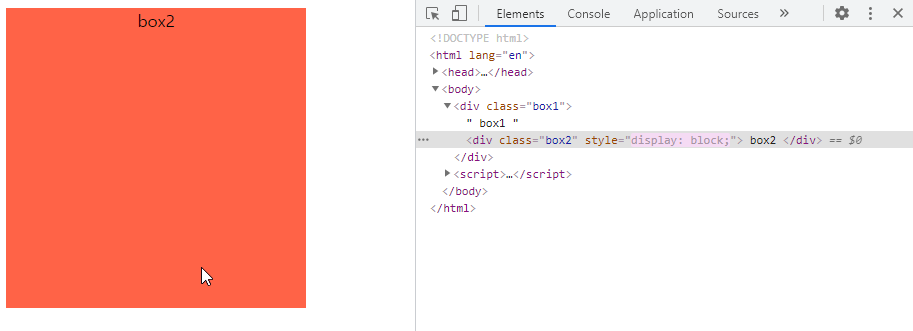
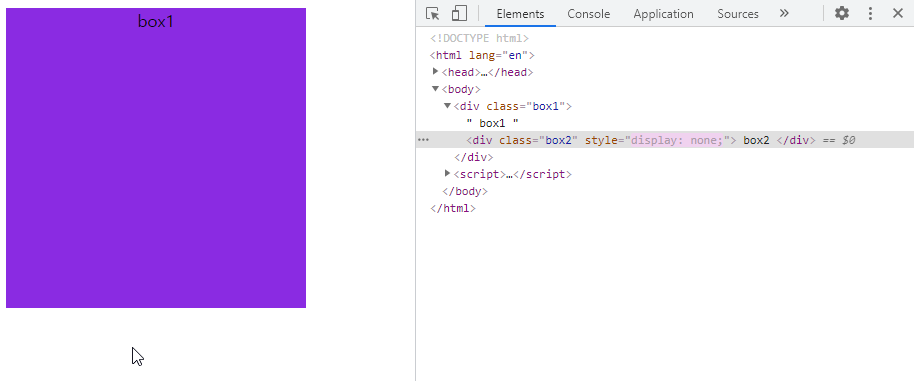

# 210607

면접 일정이 대충 끝났으니, 관통 프로젝트 하면서 알게 된 것 몇 가지를 정리하려 한다.

### 메가박스 메인 

> 메가박스 홈페이지의 영화 포스터에 마우스를 올리면 영화의 대략적인 정보가 표시되도록 하는 것을 비슷하게 구현.

* 부모 요소의 position을 relative, 자식 요소를 absolute. 

* 자식 요소의 좌표를 (0, 0)으로 설정하면 두 요소가 겹치게 된다.

* 자식 요소의 display를 마우스의 호버링 여부에 따라 none과 block을 전환.


* 프로젝트에서는 vuejs를 사용.

* 복습하며 CSS만으로 구현하려다 실패.

```css
.box1 {
    position: relative;

    width: 300px;
    height: 300px;

    background-color: blueviolet;
    text-align: center;
    padding: auto auto;
}

.box2 {
    position: absolute;
    display: none;

    top: 0;
    bottom: 0;
    left: 0;
    right: 0;

    width: 100%;
    height: 100%;

    background-color: tomato;
}

.box2 :hover {
    display: block;
}
```

```html
<div class="box1">
    box1
    <div class="box2">
        box2
    </div>
</div>
```


---


# 210608

* javascript를 함께 사용하여 구현.
* 마우스 이벤트 `mouseover`, `mouseout` 사용.

```javascript
const box1 = document.querySelector('.box1')
const box2 = document.querySelector('.box2')

box1.addEventListener('mouseover', function(event) {
    box2.setAttribute('style', 'display: block;')
})
box1.addEventListener('mouseout', function(event) {
    box2.setAttribute('style', 'display: none;')
})
```

* 이벤트 리스너는 부모 요소에 add.
* 이벤트가 발생하면 자식 요소의 display를 변경.

* `mouseover`

  

* `mouseout`

  


source code : https://github.com/YJ0522771/TIL/blob/master/Study%20Note/Web/210607_Mouse_Hovering_Event.html


---


# 210609

## SWEA 알고리즘 문제 풀이

* 4335 : 무인도 탈출 **풀이 중**

  https://swexpertacademy.com/main/code/problem/problemDetail.do?contestProbId=AWL6HGz6Ai4DFAUY&categoryId=AWL6HGz6Ai4DFAUY&categoryType=CODE&problemTitle=4335&orderBy=FIRST_REG_DATETIME&selectCodeLang=ALL&select-1=&pageSize=10&pageIndex=1

  backtracking 문제라고 생각하여 구현하였더니, 시간 초과.

  N=20이고, 각 박스의 가능한 상태는 회전하는 경우 3가지와 포함하지 않는 경우, 모두 4가지.

  단순히 계산하면 4^20가지의 완전 탐색에서 최대값을 찾는 문제가 되지만, 아래 면을 넘어가도록 박스를 쌓을 수 없다는 제약이 있으므로 탐색하는 경우의 수가 상당히 줄어든다.

  가지치기를 제외하고, SWEA의 서버 기준으로 N=20짜리 한 문제를 푸는데에 아슬아슬하게 제한시간인 8초가 되지 않는다. 즉, 실행 시간을 길어도 지금의 절반 정도로 줄일 필요가 있다...

  가능한 가지치기를 생각해보자.

  혹은 다른 접근방법이 있으려나?


---


# 210610

## 백준 알고리즘 문제 풀이

백준의 단계별 문제들을 조금씩 차근차근 풀어볼까 한다.

카카오 인턴 코테 이후로 자격증 + 면접 + 프로젝트로 알고리즘은 손을 놓고 있었는데, 슬슬 다시 감을 찾아야겠다.

한동안은 가볍게 몸풀기 위주로.


> DP.

* 1149 : RGB거리 **pass**

  https://www.acmicpc.net/problem/1149

  DP 문제.

  dp[i] [R] = i 번째 집을 빨강으로 칠했을 때의 최소 비용.

  = min(dp[i - 1] [G], dp[i - 1] [B]) + cost[i] [R]

  마찬가지로,

  dp[i] [G] = i 번째 집을 초록으로 칠했을 때의 최소 비용.
  
  dp[i] [B] = i 번째 집을 파랑으로 칠했을 때의 최소 비용. 
  
  최종 답은 dp[N] 배열의 최소값이다.


---


# 210611

## 백준 알고리즘 문제 풀이

> DP.

* 1932 : 정수 삼각형 **pass**

  https://www.acmicpc.net/problem/1932

  dp[i] [j] = i 번째 줄에서 j 번째 숫자를 선택했을 때, 경로의 최대 합.

  = max(dp[i - 1] [j - 1], dp[i - 1] [j]) + nums[i] [j]

  답 = max(dp[N])


---


# 210614

## 백준 알고리즘 문제 풀이

> 브루트포스.

* 2798 : 블랙잭 **pass**

  https://www.acmicpc.net/problem/2798

  모든 경우를 다 검사해보면 된다.

  카드의 수의 최대가 100개이므로, 최대 검사 수는 300을 넘지 않는다.


* 2231 : 분해합 **pass**

  https://www.acmicpc.net/problem/2231

  1부터 N - 1까지 차례로 분해합을 구해보면서, 분해합이 N이 나오면 탐색을 멈추고 바로 출력. (가장 작은 생성자)


---


# 210615

## 백준 알고리즘 문제 풀이

> 브루트포스.

* 7568 : 덩치 **pass**

  https://www.acmicpc.net/problem/7568 

  최대 N이 50이므로 완전 탐색 시, 검사 수는 `50 * 49 = 2450`.


* 1018 : 체스판 다시 칠하기 **pass**

  https://www.acmicpc.net/problem/1018

  입력이 최대인 경우도 검사 수는 `64 * 2 * (50 - 7) * (50 - 7) = 236,672`.

  체스판이 W로 시작하는 경우와 B로 시작하는 경우에 새로 칠해야하는 칸의 수를 모두 검사하여, 적은 쪽을 고름.

  검사하는 영역의 첫 칸에 따라 검사 패턴을 달리 하였더니, 

  ```
  8 8
  BBWBWBWB
  BWBWBWBW
  WBWBWBWB
  BWBWBWBW
  WBWBWBWB
  BWBWBWBW
  WBWBWBWB
  BWBWBWBW
  ```

  이 경우에 제대로 값이 나오지 않는다.

  

---


# 210616

## 백준 알고리즘 문제 풀이

> 브루트포스.

* 1436 : 영화감독 숌 **pass**

  https://www.acmicpc.net/problem/1436

  연속으로 6이 세 번 나오는 숫자를 모두 탐색.

  10,000번째 수까지 구해야하기 때문에, 하드 코딩은 무리..

  3,000,000까지 검사하면 총 11,100개가 나온다.


---


# 210617

## 백준 알고리즘 문제 풀이

> 재귀.

* 10872 : 팩토리얼 **pass**

  https://www.acmicpc.net/problem/10872

  이름 그대로 어려운 것 없는, 재귀로 팩토리얼 구현하는 문제.

  너무 쉽게 생각했다가 N이 0부터 시작하는 것을 고려하지 않았다..


* 10870 : 피보나치 수 5 **pass**

  https://www.acmicpc.net/problem/10870

  마찬가지로 n = 0일 때, 0

  n = 1일 떄, 1임을 유의.
