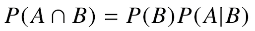

# 01/20

### 할 일

* Python Basics 4-2, 5-1~2강
* AI Math 6~8강
* 심화 과제 1
* AI Math 7강 퀴즈
* AI Math 8강 퀴즈


### 피어세션

* 확률론

  * robust하다의 의미

    https://m.blog.naver.com/qbxlvnf11/221493039097

  * skewness의 의미

  * 인과성과 상관성의 의미

* 통계론

  * 불편 추정량이란?

    https://hsm-edu.tistory.com/13?category=741767

  * 왜 표본분포는 n-1을 나누는가?

    https://hsm-edu.tistory.com/15?category=741767


### 공부한 내용

#### Module and Project

##### 모듈과 패키지

* 모듈 

  * 작은 프로그램 조각들 - 모이면 하나의 큰 프로그램.
  * import 문으로 호출 → 모든 코드가 메모리에 로딩 됨.
  * `__pycache__` : 쉽게 호출하기 위해 컴파일한 내용이 담긴 폴더.

* namespace

  * 모듈 내부의 일부 함수 혹은 클래스만 호출.
  * `from ... import ~`
  * `*` : 모든 함수 혹은 클래스. ex) `from module import *`
  * alias : 모듈 명의 별칭. `as`를 사용. ex) `from module as mod`

* 패키지

  * 코드의 묶음. 다양한 모듈들의 합. 폴더로 관리.

  * 패키지로 인식되기 위해서는 폴더 내에 `__init__.py` 파일이 필요. (3.3 이후로는 없어도 됨.)

    ```python
    # __init__.py 내부
    
    __all__ = ['mod1', 'mod2', 'pack1']	# 사용할 모듈이나 패키지명 선언
    
    from . import mod1
    from . import mod2
    from . improt pack1
    ```

  * `from (패키지 경로) import 모듈`

    * 상대경로

  * `__main__.py`

    * `python (폴더명)`을 하면 실행되는 파일.
    * `if __name__ == '__main__':`

##### 가상환경

* 프로젝트 시, 패키지 버전 충돌을 방지하기 위해 가상환경 설정.

* 대표 도구

  * virtualenv + pip
  * conda

* conda 명령어

  * 프로젝트 생성

    ````bash
    $ conda create -n (프로젝트 이름) python=(파이썬 버전)
    ````

  * 가상환경 실행

    ```bash
    $ conda activate (프로젝트 이름)
    ```

  * 패키지 설치

    ```bash
    $ conda install (패키지 이름)
    ```


---


#### Exception / File / Log Handling

##### Exception

* 예상 가능한 예외
  * 사전에 인지 가능.
  * 개발자가 명시적으로 정의.
* 예상 불가능한 예외
  * 인터프리터 과정에서 발생하는 예외, 개발자 실수 등.
  * 수행 불가 시 인터프리터가 에러를 자동 호출.
* 예외가 발생할 경우 대처 필요.


##### Exception Handling

* try ... except (... else) (... finally)

  ```python
  try:
      # 예외 발생 가능 코드
  except <Exception type>:
      # 예외 발생 시 대응하는 코드
  else:
      # 예외가 발생하지 않았을 때 실행할 코드
  finally:
      # 예외 여부와 상관 없이 실행할 코드
  ```

* bulit-in exception

  * IndexError : index 범위를 초과
  * NameError : 존재하지 않는 변수
  * ZeroDivisionError : 0으로 나누는 경우
  * ValueError : 
  * FileNotFoundError
  * 등등

* `Exception` : 모든 예외를 포함.

* raise : 강제로 exception 발생

  ```python
  if (예외 발생 조건):
      raise <Exception type>(예외 정보)
  ```

* assert : 특정 조건을 만족하지 않을 경우 예외 발생

  ```python
  assert (예외 조건)
  # 조건이 false이면 AssertionError 발생
  ```


##### File Handling

* 파일 시스템 : OS에서 파일을 저장하는 트리구조 저장 체계
* 기본적인 파일 종류
  * text 파일 : 문자열로 저장. 메모장으로 열면 내용 확인 가능.
  * binary 파일 : 이진 형식으로 저장. 메모장으로 열면 내용이 깨짐.

* Python File I/O

  * 파일 열기 `f = open("파일 경로", "접근 모드")`

    * r : 읽기모드
    * w : 쓰기모드
    * a : 추가모드
    * 바이너리 파일은 모드 뒤에 b를 붙임.

  * 파일 닫기 : `f.close()`

  * with 구문과 함께 : `with open("파일 경로", "접근 모드") as f`

    

  * 파일 읽기

    * `f.read()` : 파일 전체를 문자열로 읽어옴.
    * `f.readline()` : 한 줄만 읽어옴.
    * `f.readlines()` : 한 줄 씩, list로 저장.

  * 파일 쓰기

    * 파일 열 때, encoding 지정. ex) 리눅스-utf8, 윈도우-cp949
    * `f.write(데이터)`


* OS 모듈
  * `os.mkdir(디렉터리 명)` : 디렉터리 생성
  * `os.path.exists(디렉터리 명)` : 디렉터리 존재 여부 확인
  * `os.apth.join(디렉터리 경로, 파일명)` : 경로 생성 (문자열)
* shutil 모듈
  * `shutil.copy(파일명, 경로)` : 지정 경로에 파일 복사.
* pathlib 모듈
  * path를 객체로 다룸.
  * `pathlib.Path.cwd()` : 현재 경로.
  * `.parent` : 부모 경로.
* pickle 모듈
  * `pickle.dump(데이터, 파일)` : 데이터를 파일에 쓰기.
  * `pickle.load(파일)` : 파일에서 데이터 읽기.
  * .pickle 파일 : binary 파일이므로, 모드에 b를 붙여 열어줘야한다.
  * 객체도 저장 가능.
* 영속화 : 객체를 파일에 저장하여 불러옴.


##### Log Handling

* Logging

  * 프로그램이 실행되는 동안 일어나는 정보를 남김.
  * 콘솔 출력, 파일, DB 등.
  * 실행시점에 남겨야하는 기록, 개발 시 남겨야하는 기록.
  * 기록을 분석하여 의미있는 결과 도출.

* logging 모듈

  * logging level 

    * 프로그램 진행 상황에 따라 다른 level의 로그.
    * debug > info > warning > **error > critical**
      * debug : 개발 시 처리 기록.
      * info : 처리 진행 정보.
      * warning : 사용자가 잘못 입력, 처리는 가능하나 개발 시 의도치 않은 부분.
      * error : 잘못된 처리로 에러. 프로그램은 동작 가능. 보통 여기서부터 사용자에게 알림.
      * critical : 잘못된 처리로 데이터 손실 혹은 프로그램이 더이상 동작할 수 없음.

    ```python
    logger = logging.getLogger('main')	# logger 객체를 불러옴.
    logging.basicConfig(level=logging.DEBUG)	# logging level 변경
    # logger.setLevel(logging.DEBUG)도 사용 가능.
    
    logger.debug(message)	# 로그 출력
    ...
    ```


* configparser
  * 프로그램 실행 설정을 파일로 저장.
  * dict type으로 관리.

  

* argparser

  * 콘솔 창에서 프로그램 실행 시 setting 정보를 입력 받음.
  * 거의 모든 콘솔 기반 파이썬에서 제공.
  * command-line option이라고 부름.

  


* logging formatter

  * 로그의 포맷 지정.
  * ex

  ```python
  formatter = logging.Formatter('%(asctime)s %(levelname)s %(process)d %(message)s')
  ```

* log config file

  * `logging.config.fileConfig('logging.conf')`

  * config 예시

    


---


#### Python Data Handling

* CSV, html, XML, JSON

##### CSV (comma seperate value)

* 콤마로 데이터를 구분한 텍스트 파일
* 엑셀 양식의 데이터를 손쉽게 공유하기 위해 사용.
* 탭(TSV), 빈 칸(SSV) 등으로 구분하기도 함.

* csv 모듈

  * 데이터 내에 ,가 들어가 있을 경우 전처리가 필요. → 파이썬에서는 CSV 객체를 지원함.

  * 


---


#### 통계학

* 통계적 모델링 - 적절한 가정 위에 확률분포를 추정

  * 유한한 데이터만 관찰해서 모집단의 분포를 정확히 알아내는 것은 불가능.
  * 근사적으로 확률분포 추정.
  * 데이터와 추정 방법의 불확실성을 고려, 위험을 최소화.

* **모수적(parametic) 방법론** : 특정 분포를 따른다고 가정한 후, 모수(parameter)를 추정.

* **비모수적(nonparametic) 방법론** : 데이터에 따라 모델의 구조와 모수의 개수가 유연하게 바뀜.

* 확률 분포 가정 - 히스토그램 등을 통해 모양을 관찰

  * 2개의 값 : 베르누이 분포
  * n개의 이산적인 값 : 카테고리 분포
  * 0~1 사이 값 : 베타 분포
  * 0 이상의 값 : 감마 분포, 로그 정규 분포 등
  * 실수 전체 값 : 정규 분포, 라플라스 분포 등
  * 데이터 생성 원리를 고려.

* 정규분포 모수

  

  * 표본평균 : 주어진 데이터의 산술평균
  * 표본분산 : 불편 (unbiased) 추정량을 구하기 위해 (N - 1)을 나눔. 기대치를 사용했을 때, 모집단의 통계치와 일치하도록 유도하기 위함.

* 표집분포(sampling distribution) : **통계량**의 확률분포.

  * sample distribution : 표본들의 분포.

* 중심 극한 정리(central limit theorem) : 표본평균의 표집분포는 N이 커질수록 정규분포를 따른다. (모집단의 분포는 상관 없음.)

##### 최대 가능도 추정법 (maximum  likelihood estimation, MLE) 

> references : https://datascienceschool.net/02%20mathematics/09.02%20%EC%B5%9C%EB%8C%80%EA%B0%80%EB%8A%A5%EB%8F%84%20%EC%B6%94%EC%A0%95%EB%B2%95.html
>
> 

* 이론적으로 가장 가능성이 높은 모수를 추정하는 방법 중 하나.

  

* 모수 θ를 따르는 분포가 x를 관찰할 가능성.

* 확률로 해석하면 안 됨.

* 데이터 집합이 독립적으로 추출되었을 경우, 로그 가능도를 최적화.

  

  * 데이터의 숫자가 크거나, 많아지면 곱셈을 컴퓨터로 연산하기 힘들다.
  * 경사 하강법에서 미분 연산을 할 떄, 로그 가능도를 사용하면 O(n^2) → O(n)이 됨.
  * 음의 경사하강도 사용. (최소값을 찾기 위해)

* 정규분포 예제

  

  

  * MLE는 불편추정량을 보장하진 않는다.

* 카테고리 분포 예제 

  

  

  * nk : k 카테고리의 데이터 개수.

    

    

    

  * 카테고리 분포의 MLE는 경우의 수를 세어 비율을 구함.

* 딥러닝에서의 최대가능도 추정법.

  * 분류문제에서 소프트맥스 벡터는 카테고리분포의 모수를 모델링.

  * one-hot 벡터로 표현한 정답 레이블 y를 관찰데이터로 이용하여 로그가능도 최적화.

    

* 모델이 학습하는 확률분포와 데이터에서 관찰되는 확률분포의 거리를 통해 손실함수 유도.

* 두 확률분포사이의 거리

  * 쿨백-라이블러 발산

    

    

    * 분류문제에서 정답 레이블을 P, 모델 예측을 Q라 두면 MLE는 쿨백-라이블러 발산을 최소화하는 것과 같다.

    

---


#### 베이즈 통계학

* 조건부확률

  

  * 사건 B가 일어난 상황에서 A가 발생할 확률.

  


* likelihood : 주어진 모수(θ)에서 해당 데이터가 관찰될 확률
* evidence : 해당 데이터 자체의 분포

|      | θ                  | ~θ                              |
| ---- | ------------------ | ------------------------------- |
| D    | TP, 민감도(recall) | FP (1종오류), 오탐(false alarm) |
| ~D   | FN (2종 오류)      | TN, 특이도(specificity)         |


* 정보의 갱신 
  * 새로운 데이터가 들어왔을 때, 갱신된 사후확률을 계산할 수 있다.
  * 이전의 사후확률을 사전확률로 사용하여 계산.
* 조건부 확률만으로 **인과관계를 추론하는 것은 불가능**하다.
* 인과관계를 알아내기 위해서는 중첩요인(confounding factor)의 효과를 제거해야한다.
  * 가짜연관성 (spurious correlation)
