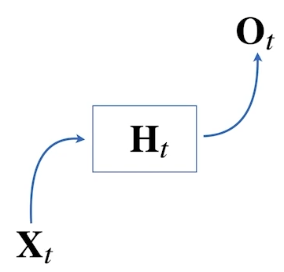

# 01/21

### 할 일

* Python Basics 6, 7-1~2강
  * numpy
  * pandas

* AI Math 9~10강
  * CNN 첫걸음
  * RNN 첫걸음


### 피어세션

* 베이즈 통계학

  * simpson's paradox

    https://ko.wikipedia.org/wiki/%EC%8B%AC%EC%8A%A8%EC%9D%98_%EC%97%AD%EC%84%A4

    https://en.wikipedia.org/wiki/Simpson%27s_paradox

* CNN

  * 다층 신경망 용어

    https://supermemi.tistory.com/4

  * cross-correlation

    https://m.blog.naver.com/PostView.naver?isHttpsRedirect=true&blogId=jinohpark79&logNo=110189322799

  * convolution 역전파 적용

    https://www.philgineer.com/2021/02/cnn-5.html


### 공부한 내용

#### numpy

* 일반적인 list로 matrix 표현
  * 다양한 matrix 계산이나 큰 matrix에 대한 표현이 어려움.
  * 메모리를 많이 차지함.

* numpy

  * numerical python
  * 파이썬의 고성능 과학 계산용 패키지
  * array 연산의 사실상 표준
  * 일반 list에 비해 빠르고, 메모리 효율적
  * 반복문 없이 데이터 배열에 대한 처리 지원
  * 선형대수에 관한 다양한 기능 제공
  * C, C++, 포트란 등과 통합 가능
  * 주로 np라는 alias로 호출 `import numpy as np`

  

##### ndarray

* array 생성

  ```python
  test_arr = np.array((데이터), (데이터 타입))
  ```

* 하나의 array에 **하나의 데이터 타입만**. dynamic typing을 지원하지 않음.
* array의 데이터가 메모리에 차례로 저장.
  * list
    * 메모리의 어딘가에 값이 있고, 해당 값의 주소를 list에 저장.
    * 서로 다른 list에 같은 값이 있으면, 해당 메모리 주소는 같다.
  * ndarray
    * 각 array의 데이터가 차례로 저장되기 때문에 같은 값이라도 다른 array에 있으면 주소가 다름.
* `arr.dtype` : 데이터 타입
* `arr.shape` : array의 형태

* array의 rank
  * 0-rank = scalar
  * 1-rank = vector
  * 2-rank = matrix
  * 3~-rank = n-order tensor
* array dtype : C의 데이터 타입과 compatible.


##### handling shape

* `arr.reshape((reshape할 값))` : array의 shap 변경.
  * -1 : 기존 matrix의 전체 size를 기반으로 개수 선정.
    * ex) (2, 4) → (-1, 2)를 하면 row의 수가 4가 된다.

* `arr.flatten()` : 2-rank 이상의 array를 1-rank로 만들어 줌.


##### indexing and slicing

* array의 indexing : `[0][0]` = `[0, 0]` 모두 사용 가능.
* array의 slicing
  * list와 달리, 행과 열을 각각 slicing 가능.
    * ex) `arr[:, 2:]`
  * 부분 matrix 추출 가능.
  * `(시작):(끝):(step)`


##### creation function

* `np.arange(시작, 끝, step)`
  * 시작 기본값 : 0
  * step 기본값 : 1
  * 끝값은 포함되지 않음.
* `np.zeros(shape, dtype)` : 0으로만 채워진 array 생성.
* `np.ones(shape, dtype)` : 1로만 채워진 array 생성.
* `np.empty(shape, dtype)` : 비어있는 array 생성. 메모리 초기화를 하지 않아 잉여값이 들어있을 수 있음.
* `np.ones_like(arr)` : 해당 array와 **같은 모양**의, 1로 채워진 array 생성.
* `np.zeros_like(arr)`
* `np.identity(n, dtype)` : n-rank인 **단위행렬** 생성.
* `np.eye(n, m, k, dtype)` : 대각선으로 1인 array 생성.
  * n, m : shape 지정. n만 입력하면 (n, n)인 array 생성.
  * k : 1이 시작하는 index.
* `np.diag(arr, k)` :  대각 행렬 값을 추출.
  * k : 대각 행렬 시작 index.


##### random sampling

* `np.random.분포()`
  * 해당 분포에서 random으로 sampling
  * 각 분포마다 필요한 parameter가 다르다.


##### operation functions

* axis

  * 연산의 기준이 되는 축.
  * shape에서 가장 먼저 오는 축이 axis-0.

  

* 연산 : `np.sum`, `mean`, `std`, `var`, `sqrt` 등

* `np.something` : 다양한 수학 연산자 제공.

* `np.vstack`, `np.hstack`, `np.concatenate`

  

  


##### array operation

* element-wise operation
  * 같은 위치의 원소끼리 연산.
  * `+`, `-`, `*`
* `arr1.dot(arr2)` : dot product, 일반적인 행렬 곱셈.
* tanspose : 전치행렬
  * `arr.T`
  * `arr.transpose()`
* broadcasting 
  * matrix - scalar 연산 : scalar 값을 matrix의 모든 원소에 연산.
    * ex) [1, 2, 3] + 3 = [4, 5, 6]
  * matrix - vector 연산 : matrix의 크기만큼 vector의 크기를 늘려서 연산.
    * ex) [[1, 2], [3, 4]] + [1, 2] = [[2, 4], [4, 6]]


##### numpy performance

* for loop < list comprehension < numpy


##### comparisons

* 비교연산 
  * array - scalar 비교연산 : 모든 원소에 대해 적용한, boolean array가 결과로 나옴.
  * array 끼리 비교연산 : 크기가 같을 때만 가능.
* `np.all(arr 조건)` : 모든 원소에 대해 만족하면 true.
* `np.any(arr 조건)` : 하나의 원소라도 만족하면 true.
* logical
  * `np.logical_and()` : 조건을 모두 만족해야 true.
  * `np.logical_not()`
  * `np.logical_or()`
  * boolean array나 boolean array가 결과로 나오는 조건식을 입력.
* `np.where()` : true인 index를 반환.
  * `np.where(조건, 참인 경우, 거짓인 경우)` : index 대신 각 해당 값을 넣은 array.
* `np.isnan(arr)` : NaN 여부 확인.
* `np.isfinite(arr)` : 유한한 값인 지 여부 확인.
* `np.argmax(arr)` : 가장 큰 값의 index.
* `np.artmin(arr)` : 가장 작은 값의 index.

* boolean index : `arr[조건]` true가 되는 값만 추출.
* fancy index : 다른 array를 index로 사용. 해당 값으로 이루어진 array 추출.


##### data i/o

* `np.savetxt(파일, 데이터, 포맷, 구분자)`
* `np.loadtxt(파일)`
* `np.save(file=npy 파일, arr=데이터)`
  * pickle로 저장됨.
* `np.load(file=npy 파일)`


---


#### pandas

* 구조화된 데이터 처리를 지원하는 파이썬 라이브러리.
* 인덱싱, 연산용 함수, 전처리 함수 등을 제공함.
* 데이터 처리 및 통계 분석을 위해 사용.
* 테이블 형태 데이터를 다루는데 최적화.


* **Series** : 하나의 column에 해당하는 데이터의 모음 (객체). series의 모음이 데이터 프레임.
  * index, data, data type으로 이루어짐.
  * index를 숫자가 아닌 데이터로도 지정 가능.
  * []로 indexing.
  * `pd.Series(data, index, dtype, name)` : series 생성.
  * `obj.index` : 인덱스 값.
  * `obj.values` : 데이터 값.
  * `obj.astype(데이터 타입)` : 데이터 타입 변경.
  * `obj.name` : series (column)의 이름.
  * 생성 시, index가 기준. 
    * 입력 data가 dict이고, 대응되는 index에 대한 값이 없을 경우 NaN으로 채움.
    * data와 index 모두 list이고, 그 수가 다르면 value error.


* **Data Frame** : 데이터 테이블 전체를 포함하는 객체.
  * 하나의 값을 접근하기 위해서는 index와 col을 모두 알아야 함.
  * `pd.DataFrame(data, columns)`
  * `df.columns` : column 이름들 출력.
  * `df.values` : data 값들 출력.
  * column 선택
    * `df.col`
    * `df['col']` : dict 타입처럼 사용.
  * indexing
    * `df.loc[index의 이름 (실제 index 값)]`
    * `df.iloc[index의 순서 (몇 번째 index)]`
    * slicing도 가능.
  * 새로운 columns 생성 : `df[새로운 col 이름] = data`
  * `df.T` : transpose
  * `df.to_csv()` : 파일로도 출력 가능.
  * column 삭제
    * `del df[col 이름]` : 원본 df에서 해당 col이 삭제.
    * `df.drop(col 이름, axis=1)` : 원본 df는 변화가 없고, 해당 col이 삭제된 df를 반환.
      * axis=0 : row 삭제.
      * axis=1 : col 삭제
  * json 데이터 입력
    * `{'col1': {index1: data1, index2: data2}, 'col2': {index2: data3, index3: data4}}`


---


#### CNN 첫걸음

* 지금까지 배운 MLP는 각 뉴런들이 선형모델과 활성함수로 모두 연결된 구조. (fully connected)

  * 가중치 행렬과 parameter 수가 매우 커질 수 있다.

  

##### convolution 연산

* convolution 연산 - kernel 사용.

  

  

* signal을 국소적으로 증폭 혹은 감소시켜 정보를 추출, 필터링.

* cross-correlation (?)

  >  references : https://m.blog.naver.com/PostView.naver?isHttpsRedirect=true&blogId=jinohpark79&logNo=110189322799

* tanslation invariant (?)

* 영상처리에서의 convolution : 다양한 image 효과를 얻을 수 있음.

* 다양한 차원의 convolution

  

  * 데이터의 성격에 따라 사용하는 커널이 달라짐.

* 2차원 convolution 연산

  

  * 출력 크기

    

    * O : 출력 크기
    * K : 커널 크기
    * H, W : 원본 크기

* 채널이 C개인 입력에 채널이 C개인 커널을 적용하면, 출력의 채널은 1개이다.

* Oc개만큼의 채널을 가진 출력을 얻고 싶으면, 입력과 같은 수의 채널을 가진 커널을 Oc개 적용하면 된다.


##### convolution 연산의 역전파


* 역전파 적용 (?)

  > references : https://www.philgineer.com/2021/02/cnn-5.html


---


#### RNN 첫걸음

* sequence 데이터에 적용.
* 데이터가 독립적으로 들어오지 않는 경우가 많다.
* 데이터의 순서가 중요. 맥락. 
* 데이터의 순서를 바꾸면 안 됨.


* 이전 정보들을 가지고 앞으로 발생할 데이터의 확률분포를 다룸 → **조건부 확률** 사용

  

  * 꼭 모든 과거의 정보가 필요한 것은 아니다.
  * **길이가 가변적인 데이터**를 다룰 수 있는 모델이 필요. → 조건부에 들어가는 데이터의 길이가 가변적.

* **자기회귀모델 (Autoregressive Model, AR model)**

  * 모든 과거의 정보를 사용하지 않고, 고정된 τ만큼의 길이만 사용. = AR(τ)
  * τ를 정함에 있어 사전지식이 필요할 때도 있다.

* **잠재 AR 모델**

  * 바로 직전 정보를 제외한 나머지 정보들을 Ht라는 잠재변수로 인코딩하여 사용.
  * 고정된 길이의 문제로 바꿀 수 있음.


##### RNN (Recurrent Neural Network)

* 잠재변수 Ht를 신경망을 통해 반복해서 사용.

  

  

* 가장 기본적인 RNN 모형은 MLP와 유사한 모양이다.

     

  * W(1), W(2)는 불변.
  * 이 모형은 과거의 정보를 잠재변수에 담을 수 없다.

  

* 이전 순서의 잠재변수와 현재의 입력을 활용하여 새 잠재변수를 계산.

  

  * 이전 잠재변수를 다음 잠재변수의 인코딩에 사용.

* 

* RNN의 역전파는 잠재변수의 연결 그래프에 따라 순차적으로 계산.

  * Backpropagation Through Time (BPTT)
  * 다음 시점의 잠재변수의 gradient와 출력에서의 gradient.

  

* 모든 시점에서 대해서 BPTT를 적용하면 gradient의 계산이 불안정해진다.

  * ex) gradient가 0이 나오면 정보 유실의 우려가 있다.

* 잠재정보에 대한 gradient를 어느 시점에서 끊는다. (truncated BPTT)

* Vanilla RNN은 길이가 긴 시퀀스를 처리하는데 문제가 있음. → GRU, LSTM 사용.

