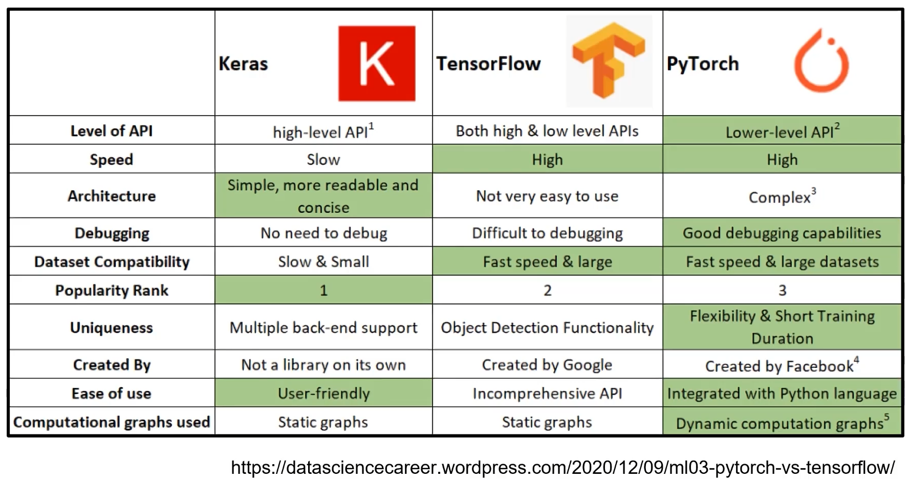
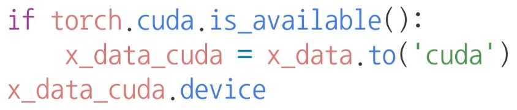
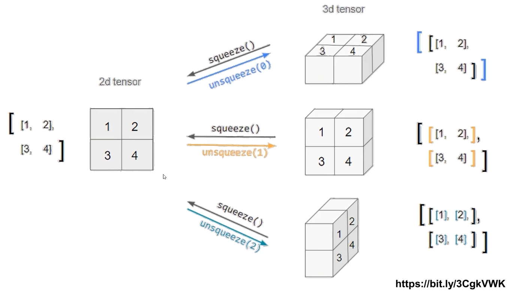
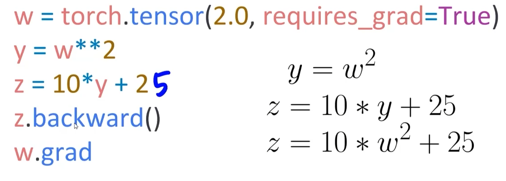

# 01/24

### 할 일

* pytorch 기본 1~3강
  * Introduction to PyTorch
  * PyTorch Basics
  * PyTorch 프로젝트 구조 이해하기
* 퀴즈
* 기본 과제


### 피어세션


### 공부한 내용

> PyTorch 공식 문서 : https://pytorch.org/docs/stable/index.html

#### Introduction to PyTorch

* 대표적인 딥러닝 프레임워크 : TensorFlow, PyTorch, Keras 등

  > DL 프레임워크 비교
  >
  > https://en.wikipedia.org/wiki/Comparison_of_deep-learning_software

  

  * 가장 큰 차이점 : computational graphs used (?)

    * PyTorch : Dynamic Computation Graph

    * TensorFlow : Define and run
    * 실행 속도에는 큰 차이가 없다.

  * computational graph : 연산 과정을 그래프로 표현

    * Define and run
      * 그래프를 정의하는 코드가 먼저 존재.
      * 실행 시점에 feed. (데이터를 해당 그래프의 코드에 넣어줌.)
      * 데이터를 넣기 전까지는 그래프가 제대로 정의되었는지 디버깅이 힘들었음.
    * Define by run (Dynamic Computation Graph, DCG)
      * 실행하면서 그래프를 생성. (??)
      * 상대적으로 디버깅이 쉬워짐.

* TensorFlow vs PyTorch

  * TensorFlow
    * production
    * scalability (?)
    * 구글에서 지원하므로, 제품 호환 등이 쉽다.
  * PyTorch
    * 디버깅이 편리하므로, 논문 등에서 쓰이기 쉽다.

* PyTorch 특징

  * Define by run : 디버깅이 쉽고, 즉시 확인 가능. → pythonic  code
  * Numpy + AutoGrad (자동 미분) + Function : 다양한 DL 연산, 함수를 지원.


---


#### PyTorch Basics

##### PyTorch operations

* numpu + AutoGrad

* **Tensor**

  * 다차원 array를 표현하는 파이토치 클래스
  * numpy의 ndarray, 텐서플로우의 Tensor와 동일
  * 데이터 타입은 numpy와 거의 동일.

* 텐서 생성

  * `torch.FloatTensor(list or ndarray)` 
  * `torch.tensor(list or ndarray)`
  * `torch.from_numpy(ndarray)`

* `tensor.ndim` : 텐서의 dimension.

* `tensor.shape` : 텐서의 형태.

* numpy의 operation이 **대부분 그대로 적용됨**.

* `tensor.device`  : tensor가 올라가 있는 곳.

* tensor를 GPU에 올려서 사용 가능.

  

* Tensor handling

  * `view` : tensor의 shape 변환. (reshape보다 사용 권장.)

    * 기존 텐서의 메모리를 그대로 사용. → 기존 텐서를 변경하면 형태가 다른 텐서도 함께 변경됨.
    * reshape은 copy를 하므로, 기존 텐서와 변경된 텐서가 서로 영향을 받지 않음. (pytorch 1.10.1에서 적용이 안 됨???)

  * `squeeze` : 차원의 개수가 1인 차원 삭제 (압축).

  * `unsqueeze` : 차원의 개수가 1인 차원 추가.

    

    * ex
      * (2, 2) unsqueeze(0) → (1, 2, 2)
      * (2, 2) unsqueeze(1) → (2, 1, 2)
      * (2, 2) unsqueeze(2) → (2, 2, 1)

* Tensor operation

  * numpy에서 사용되는 연산이 거의 그대로 적용됨.
  * 행렬 곱셈은 `dot`이 아닌 `mm` 사용. 
  * `dot` 백터 간의 내적만.
  * `mm`은 백터 연산을 지원하지 않음.
  * `mm`은 **broadcasting**을 지원하지 않으나, `matmul`은 지원함.


##### ML/DL formula

* `import torch.nn.functional as F`
* 다양한 수식 변환 지원.
* argmax, one_hot, cartesian_prod 등.


##### AutoGrad

* PyTorch의 핵심은 자동 미분 지원. = `backward()`

  

* 미분의 대상은 `requires_grad=True`를 해줌.

  * 주로 제공되는 함수 사용.

* `.grad`로 결과값을 얻음.

* `.backward()`의 `gradient` 속성.

  > references : https://tutorials.pytorch.kr/beginner/blitz/autograd_tutorial.html


---


#### PyTorch 프로젝트 구조 이해하기

* 다양한 프로젝트 템플릿이 존재.
* 필요에 따라 수정하여 사용.
* 추천 템플릿 repo
  * https://github.com/FrancescoSaverioZuppichini/PyTorch-Deep-Learning-Template
  * https://github.com/PyTorchLightning/deep-learning-project-template
  * https://github.com/victoresque/pytorch-template   *이걸 사용해서 실습 (git clone)


* 프로젝트 생성 > 새 프로젝트 이름으로 폴더가 생성된다.

  ```bash
  $ python new_project.py (프로젝트 이름)
  ```

* 프로젝트 실행

  ```bash
  $ python train.py -c config.json
  ```

* VS code에서 SSH 연결 (colab 환경과 연결)

  * VS code에 Remote - SSH 설치
  * add new ssh host
  * `ssh root@주소 -p 포트번호`
  * platform을 리눅스로 하였을 때 에러가 발생하지 않았다.


#### 기본 과제

* `torch.gather`

  > refer : https://data-newbie.tistory.com/709

  * dim으로 정한 차원을 제외하고, index와 input의 형태는 같음.
  * output의 형태는 index와 같다.

* 