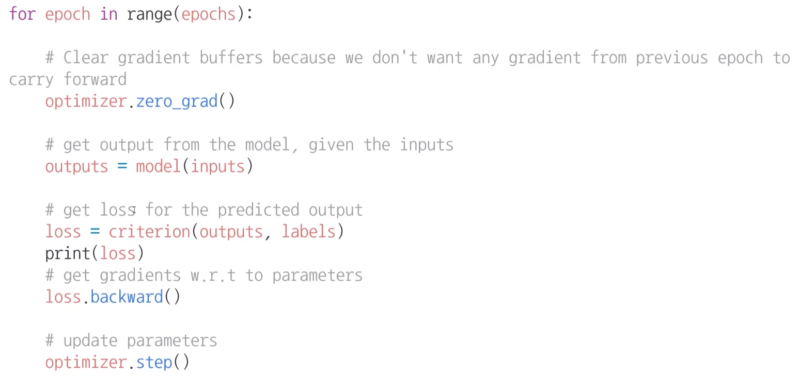
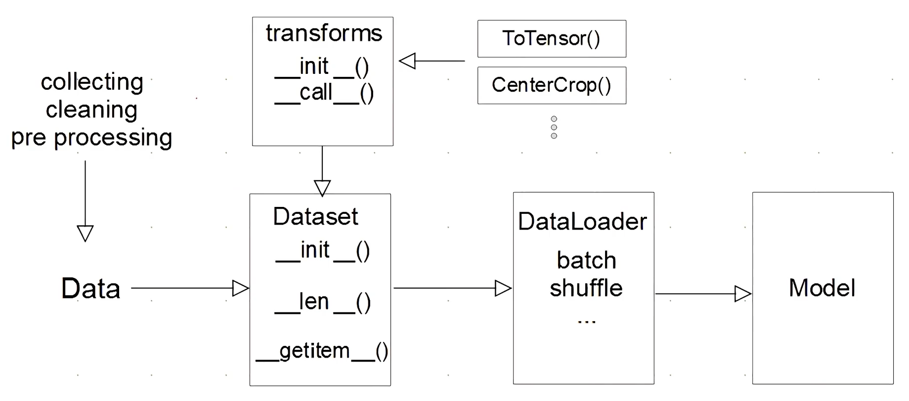
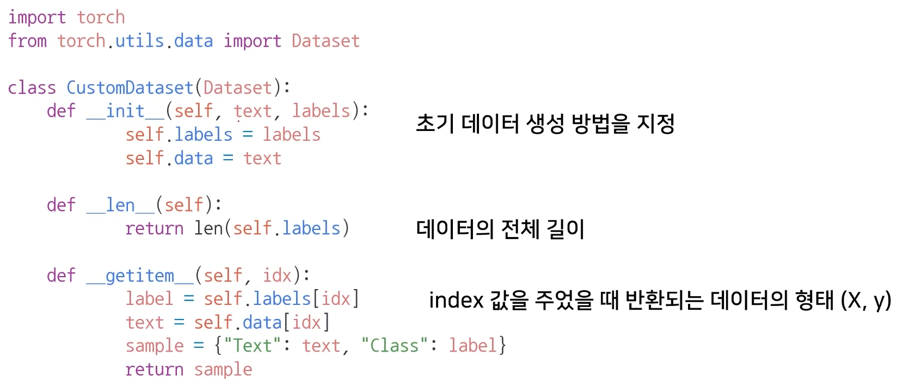
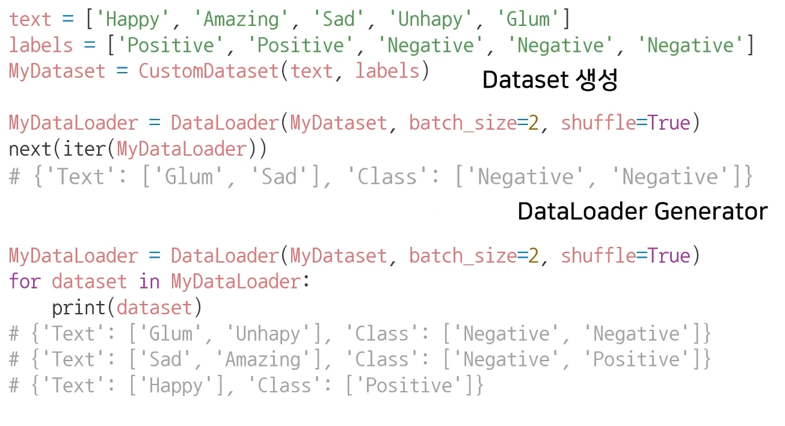
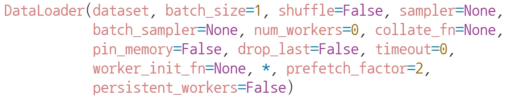

# 01/25

### 할 일

* PyTorch 구조 4~5강
  * AutoGrad & Optimizer
  * Dataset & Dataloader
  * 퀴즈
  * 기본 과제

### 피어세션

* 병렬적인 데이터 전처리는 무엇인가?

### 공부한 내용

#### AutoGrad & Optimizer

* layer = block : 딥러닝 모델은 여러 layer를 쌓아 만들어짐.

##### `torch.nn.Module`

* Layer의 basd class.
* 정의해야할 것
  * input, output, forward, backward
  * 학습 대상이 되는 parameter (tensor)
* `nn.Parameter`
  * Tensor의 상속 객체
  * `required_grad` : nn.Module 내에서 attribute가 될 때, 학습 대상이 되는 tensor
  * 대부분의 layer에는 w값이 지정되어 있음. (직접 지정할 일은 거의 없다.)
  * `.parameters()` 로 파라미터로 지정된 값들을 불러올 수 있다.

* forward

  * 예측값을 구함.

* backward

  * 파라미터들의 미분 수행.

  * forward의 결과값과 실제값의 차이 (loss)에 대해 미분 수행.

  * 파라미터 업데이트.

    

  * 실행 순서

    * `optimizer.zero_grad()` : 이전의 gradient 값이 현재의 계산에 영향을 주지 않도록 초기화.
    * 예측값 계산.
    * loss 계산.
    * gradient 계산.
    * 파라미터 업데이터.

  * Module 단계에서 직접 지정 가능. backward와 optimizer 오버라이딩.

---

#### Dataset & Dataloader

* transforms : 데이터 전처리
  * ex) 입력 데이터를 텐서로 변환.
* DataLoader : 주어진 DataSet을 어떻게 처리해야할 지
* transforms, DataSet, DataLoader는 필요에 따라 만들 필요가 있다.

##### `DataSet`

* 데이터 입력 형태를 정의하는 클래스.
* 데이터 입력 방식의 표준화.
* 종류 (이미지, 텍스트, 오디오 등)에 따라 다른 입력 정의.

* 데이터 형태에 따라 각 함수를 다르게 정의해야함.
* 모든 것을 데이터 생성 시점에 처리할 필요는 없음.
* data set에 대한 표준화 된 처리방법을 제공할 필요. (후속 연구자나 동료를 위해)
* HuggingFace등의 표준화 된 라이브러리.

##### `DataLoader`

* data의 batch를 생성해주는 클래스.

* 학습 직전 (GPU feed 전) 데이터 변환.

* 주요 업무 : tensor로 변환, batch 처리.

* 병렬적 데이터 전처리 코드 고민 필요.

  > 병렬처리 reference : https://yganalyst.github.io/data_handling/memo_17_parallel/

* `sampler` : shuffle을 할 때 index를 뽑는 기법.
* `collate_fn` : 가변 길이 데이터에 대해 패딩을 해주는 방법 정의.