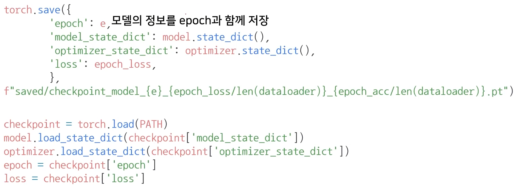
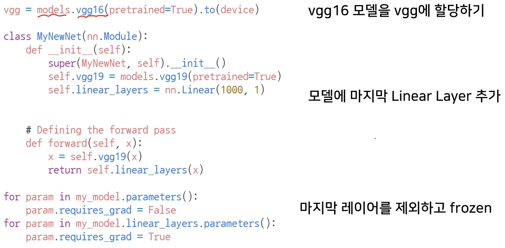
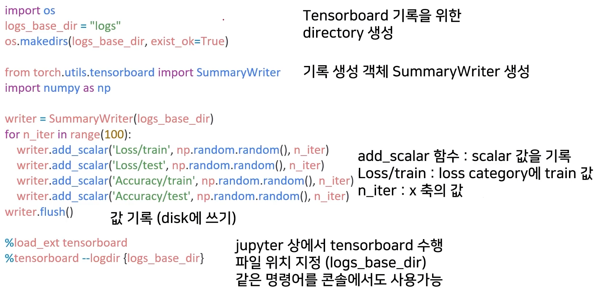
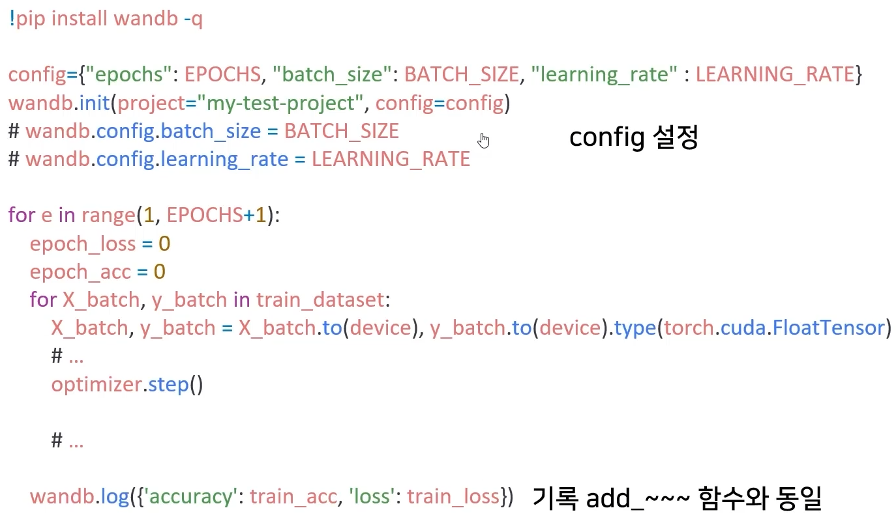

# 01/26

### 할 일

* PyTorch 구조 6~7강
  * 모델 불러오기
  * Monitoring tools for PyTorch
* 퀴즈

### 피어세션

* gather의 dimension 기준.
* 

### 공부한 내용

#### 모델 불러오기

> references
>
> CV 모델 repo : https://github.com/rwightman/pytorch-image-models
>
> Segmentation 모델 repo : https://github.com/qubvel/segmentation_models.pytorch

* 파인 튜닝 : 기존에 학습된 모델을 가져와, 나의 데이터셋에 맞춰 다시 한 번 학습하는 알고리즘.

##### `model.save()`

* 학습 결과의 관리, 저장 필요성.
* 모델 형태 (architecture) 와 파라미터 저장.
* 학습 중간 과정을 저장해줌. 최선의 결과 모델 선택.
* 모델을 외부 인원과 공유.

* `model.state_dict()` : 모델의 파라미터. OrderedDict 타입.
* `torch.save(data, path)` : 모델이나 파라미터 저장.
  * .pt : 파이토치에서 모델을 저장하는 확장자명.
* `model.load_state_dict(torch.load(path))` : 저장한 파라미터 불러옴. 동일한 모델이어야함.

* Kaggle Cats and Dogs Dataset : https://www.microsoft.com/en-us/download/details.aspx?id=54765

* `from torchsummary import summary` : 모델에 대한 정보를 편하게 볼 수 있음.

##### checkpoints

* 학습의 중간 결과 저장.
* earlystopping 기법 사용 시, 이전 학습의 결과가 필요.
* 일반적으로 epoch, loss, metric의 값을 함께 저장하여 확인.

##### pretrained model transfer learning

* **transfer learning**
  * 다른 데이터셋으로 만든 모델을 현재 데이터에 적용.
  * 일반적으로 대용량 데이터셋으로 만든 모델이 성능이 좋다.
  * 현재 DL에서 가장 일반적인 학습 기법.
  * backbone architecture가 잘 학습된 모델에서 일부분만 변경하여 학습.
* TorchVision에서 다양한 모델 지원
* freezing : ptretrained model에서 일부분을 frozen.

* 마지막 레이어만 gradient 계산.

---

#### Monitoring tools for PyTorch

* 학습 시간이  매우 길다 - 기록이 필요.
* 대표적 도구 : Tensorboard, weight & biases

##### Tensorboard

* 텐서플로우로 만들어진 시각화 도구.
* 학습 그래프, metric, 학습 결과의 시각화 지원.
* PyTorch도 연결 가능.

* scalar : metric 등 상수 값의 연속을 표시.
* graph : 모델의 computational graph.
* histogram : W 등 값의 분포.
* image, text : 예측 값과 실제 값을 비교.
* mesh : 3d 형태의 데이터 표현.
* hyperparameter : 파라미터 값 확인.

* 텐서 보드 다운로드 - 6006 포트.
* `%load_ext tensorboard` : jupyter나 colab에서 바로 사용 가능.

##### weight & biases

> https://wandb.ai/site

* ML 실험을 원활히 지원하기 위한 상용도구..
* 협업, code versioning, 실험 결과 기록 등을 제공.
  * code, model, data를 나눠서 버전 관리 가능.
  * 공유가 편함.
* MLOps의 대표적인 툴.

