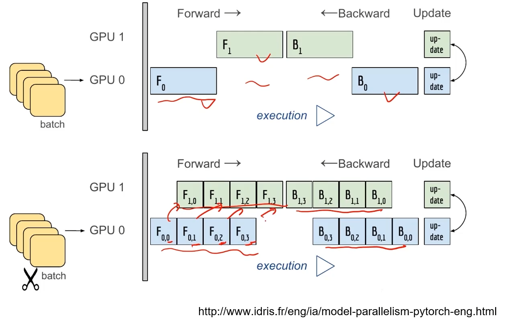
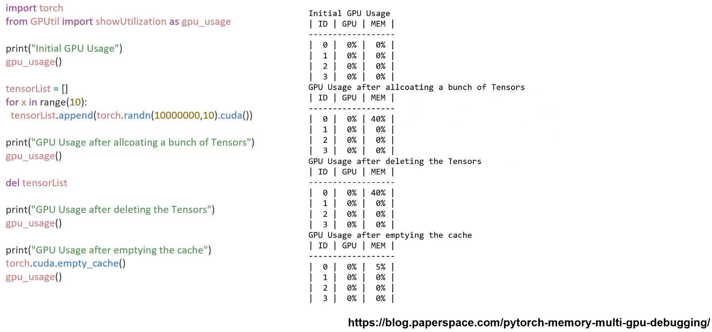

# 01/27

### 할 일

* PyTorch 구조 8~10강
  * Multi-GPU
  * Hyperparameter Tuning
  * PyTorch Troubleshooting
* 퀴즈


### 피어세션

* 


### 공부한 내용

#### Multi-GPU

* 많은 데이터로 성능이 좋은 모델을 만드는 것에 초점이 맞춰지고 있음.
* colab은 multi-GPU 지원 안 함.
* GCP (google cloud platform), AWS (amazon web service)
* 딥러닝 - 많은 데이터와의 싸움 - GPU 확보가 중요시 됨.


* node : system, 한 대의 컴퓨터.
  * ex) single node multi GPU : 한 대의 컴퓨터에 여러 개의 GPU.

* TensorRT : NVIDIA에서 개발한 GPU 사용을 도와주는 도구.


##### Model parallel

* 다중 GPU에 학습을 분산.
  * 모델 나누기 : 모델을 나누어서 다른 GPU에서 학습.
    * ex) alexnet
    * 파이프라인이 원활하지 않을 때는 모델의 병목화가 생기기도 함.
    * 매우 어려움.
  * 데이터 나누기 : 데이터를 나누어 각각 학습한 다음, 값의 평균을 구함.




##### Data parellel

* 데이터를 나눠 GPU에 할당 후, 결과의 평균을 취함.
* 여러 batch를 동시에 돌린다고 생각.


* `DataParellel` 

  * 데이터를 분배한 후, 결과를 한 GPU에 모아서 평균을 취함.
  * GPU 사용 불균형 문제.
  * 하나의 GPU에 맞춰서 batch size를 줄임.
  * global interpreter lock (?)

  

* `DistributedDataParellel` (?)

  * 각 CPU마다 process를 생성하여 GPU에 할당.
  * 최종 gradient의 평균.

  

  

  

  > CPU와 GPU : https://sdc-james.gitbook.io/onebook/2.-1/1./1.1.1.-cpu-gpu

  ---


#### Hyperparameter Tuning

* 성능 높이는 방법

  * 모델 바꾸기.
  * 데이터 추가 혹은 변경. (가장 중요)
  * hyperparameter tuning.

  

* **hyperparameter**

  * 모델 스스로 학습하지 않는 값.
  * 직접 지정해주어야하는 파라미터. 
  * learning rate, 모델 크기, optimizer 등


##### hyperparameter tuning

* 가장 기본적인 방법
  * grid : 값들을 일정한 범위를 정해서 자름.
  * random
  * random하게 값을 정해 결과를 본 다음, 학습이 잘 되는 구간에서 grid로 정확한 값을 찾는다.
* 베이지안 기반 기법들 (ex) BOHB) (?)


##### Ray

* multi-node multi-processing 지원 모듈.
* 병렬 처리를 위해 개발된 모듈.
* 현재 분산 병렬 ML/DL 모듈의 표준.


> PyTorch와 Ray 같이 사용하기 : https://pytorch.org/tutorials/beginner/hyperparameter_tuning_tutorial.html


---


#### PyTorch Troubleshooting

##### OOM (out of memory)

* 왜, 어디서 발생했는지 알기 어려움.
* error backtracking이 이상한 곳으로 감.
* 메모리의 이전 상황을 파악하기 어려움.


* 가장 단순한 해결책 : batch size를 줄인다. → GPU clean.


* `GPUUtil`

  * 현재 GPU 상태를 파악할 수 있도록 해주는 모듈.
  * colab은 GPU 상태를 보기 편하다.

  ```python
  import GPUUtil
  GPUUtil.showUtilization()
  ```

* `torch.cuda.empty_cache()`

  * 사용되지 않는 GPU cache를 정리.
  * 가용 메모리 확보.
  * `del`과 구분 : del은 한 메모리는 garbage collector 작동 이후에 사용 가능.
  * 학습 시작 전, 이전 학습의 영향을 받지 않기 위해 `empty_cache`를 하는 것을 권장.

  

* training loop에서 tensor로 축적되는 변수
  * tensor로 처리된 변수는 GPU 상의 메모리를 사용하며 계속 메모리에 축적됨.
  * 더이상 사용하지 않는 변수들을 찾을 필요가 있다.
  * 1-d tensor의 경우 **python 기본 객체**로 변환.
    * `변수.item`
    * `datatype()`
  * del 명령어 적절히 사용.
    * 필요 없어진 변수는 적절히 삭제.
    * python은 loop 내에서만 사용되는 변수도 loop 이후에 메모리를 차지함. → loop 마지막에 del 사용.

* 가능한 batch size 실험해보기

  

* `torch.no_grad()`

  * backward pass에서 메모리가 쌓이는 현상이 없어짐.

  


* 예상치 못한 에러 메세지
  * OOM 말고도 유사한 에러들이 발생.
  * CUDNN_STATUS_NOT_INIT, device-side-assert 등


* 그 외
  * colab에서 너무 큰 사이즈는 실행하지 말 것.
  * CNN의 대부분의 에러는 크기가 안 맞아서 생기는 경우. (torchsummary 등으로 사이즈를 맞출 것)
  * tensor의 float precision을 16 bit로 줄일 수도 있음.


> 에러 정리 : https://brstar96.github.io/shoveling/device_error_summary/
>
> PyTorch에서 자주 발생하는 에러 질문들 : https://pytorch.org/docs/stable/notes/faq.html