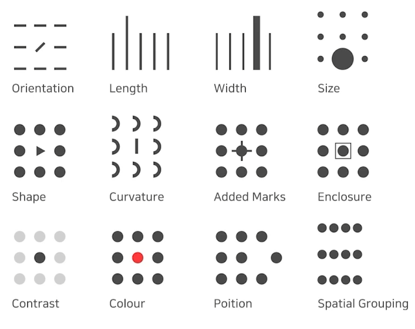
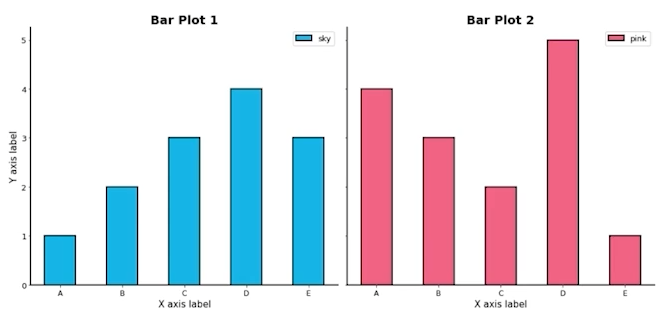
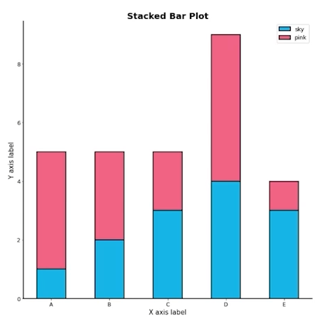
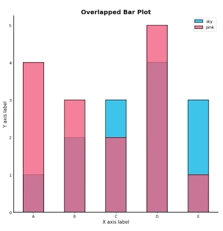
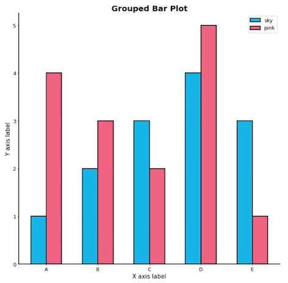
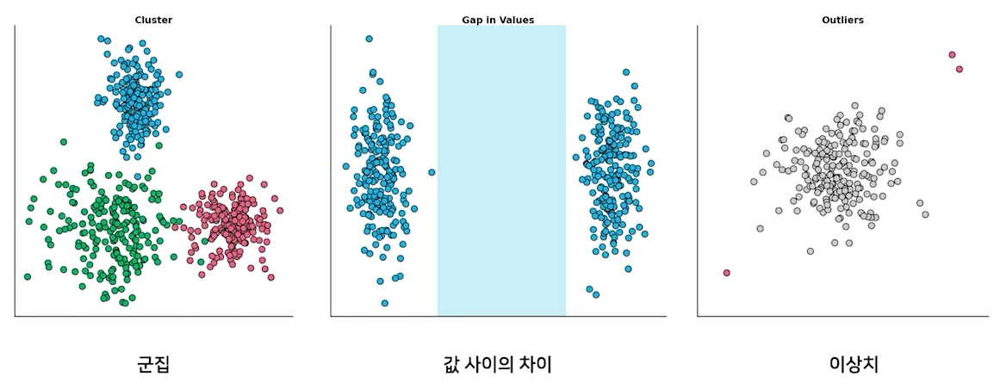
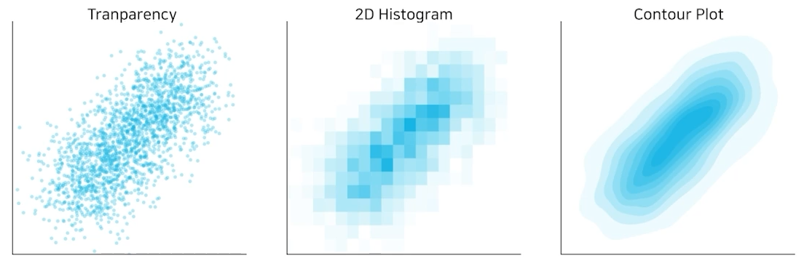
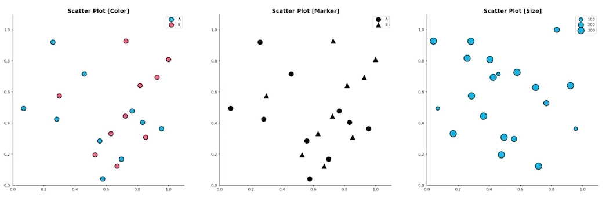

# 02/03

### 할 일

* Introduction to Visualization
  * 1-1강 Welcome to Visulization
  * 1-2강 시각화의 요소
  * 1-3강 Python과 Matplotlib

* 기본적인 차트의 사용
  * 2-1강 Bar Plot 사용하기
  * 2-2강 Line Plot 사용하기
  * 2-3강 Scatter Plot 사용하기

### 피어세션

### 공부한 내용

#### Welcome to Visulization

* 데이터 시각화 : 데이터를 그래픽 요소로 매핑하여 시각적으로 표현하는 것.
* 시각화 요소 : 목적, 독자, 데이터, 스토리, 방법, 디자인
* 목적에 따라 원하는 시각화가 다르다. = 좋은 시각화를 표현할 절대적인 수치가 없다.
* 목적에 따라 시각화를 선택하고 사용

---

#### 시각화의 요소

##### 데이터 이해하기

* 시각화를 진행할 데이터

  * 데이터셋 관점 (global)
  * 개별 데이터 관점 (local)

  

* 데이터셋 종류

  * 정형 데이터
    * 테이블 형태로 제공됨. (ex) csv)
    * row = item, col = attribute (feature)
    * 가장 쉽게 시각화 가능.
    * 통계적 특성, 데이터 간 비교, 관계 등
  * 시계열 데이터 (time-series)
    * 시간 흐름에 따른 데이터.
    * 기온, 주가 (정형), 음성, 비디오 (비정형) 등.
    * 추세 (trend), 계절성 (seasonality), 주기성 (cycle) 등.
  * 지리 데이터
    * 지도 정보와 보고자 하는 정보 간의 조화.
    * 거리, 경로, 분포 등
  * 관계형 (네트워크) 데이터
    * 객체와 객체 간의 관계 (graph, network)
    * node와 link.
    * 크기, 색, 수 등으로 객체와 관계의 가중치 표현.
    * 휴리스틱하게 노드 배치 구성.
  * 계층적 데이터
    * 포함 관계가 분명한 데이터.
    * tree, treemap, sunburst 등.
  * 다양한 비정형 데이터

  

* 데이터의 종류

  * 수치형 (numerical)
    * 연속형 (continuous)
    * 이산형 (discrete)
  * 범주형 (categorical)
    * 명목형 (nominal)
    * 순서형 (ordinal)

##### 시각화 이해하기

* **mark** : 점, 선, 면. 기본적인 그래픽 요소.

* **channel** : 길이, 면적, 부피 등. mark를 제어하는 요소. 차원에 독립.

* 전주의적 속성

  * 주의를 주지 않아도 인지하게 되는 요소.

  * 동시에 사용하면 인지하기 어려움.

  * 적절하게 사용 필요. **시각적 분리 (visual pop-out)**

  * ex)

    

---

#### Python과 Matplotlib

* matplotlib : matlab에서 지원하는 시각화를 사용할 수 있는 모듈.

##### Figure와 Axes

* `fig.add_subplot()` : figure라는 큰 틀에 ax라는 서브 플롯 추가.
* `plt.figure(figsize=(크기))` : figure 크기 조정.
* `fig.set_facecolor()` : figure의 색 조정.
* `fig.add_subplot(row, col, num)` : plot 여러 개 그리기.
  * row x col로 figure를 쪼갰을 때 num번째 subplot 반환.
* `plt.plot(데이터)` : plot에 데이터 추가.
  * 절차지향적 : 바로 직전에 추가된 subplot에만 데이터를 넣는다.
  * pythonic하지 못하다.
  * **subplot 객체 ax에 직접 그리기**
* `ax.plot(데이터)`

##### Plot의 요소

* 하나의 subplot에 여러 데이터 그리기
  * 같은 subplot에 계속 데이터를 추가하면, 여러 데이터를 그릴 수 있다.
  * 같은 그래프의 경우 정해진 색이 순차적으로 적용됨.
  * 다른 그래프일 경우 색 구분이 되지 않음.
* 색 지정하기
  * `ax.plot(데이터, color=색)`
* 텍스트 사용하기
  * plot에 정보 기입.
  * `ax.plot`에 `label` 추가.
  * `label`만 추가해서는 보여지지 않음.
  * `ax.legend()` : 범례 추가 - plot에 지정한 텍스트를 보여주기 위해 선언 필요.
  * `ax.set_title(텍스트)` : subplot에 제목 지정.
  * `fig.suptitle(텍스트)` : figure 전체의 제목 지정.
  * `ticks` : 축에 적히는 수 지정.
    * ex) `ax.set_xticks()` : x축에 적히는 수 지정.
  * `ticklabels` : 축에 적히는 텍스트 지정.
    * ex) `ax.set_xticklabels()` : x축에 적히는 텍스트 지정.
  * `ax.test(x, y, s=텍스트)` : x, y에 들어갈 텍스트.
  * `ax.annotate(text, xy)` : 지정 위치에 주석 추가.
    * 화살표(`arrowprops`) 등을 추가할 수 있다. 확장된 기능.

---

#### Bar Plot 사용하기

##### Bar Plot의 목적과 요소

* 직사각형 막대를 사용하여 데이터 값 표현.
* 범주에 따른 수치 값을 비교하기에 적합.
* 막대 그래프, bar chart, bar graph.

* 막대 방향에 따른 분류.
  * `.bar()` : vertical, 기본.
  * `.barh()` : horizontal, 범주가 많을 때 적합.

##### 다양한 Bar Plot

* 여러 데이터 그룹에 대한 bar plot 그리기

  * 플롯을 여러 개 그리기.

    

  * 한 개의 플롯에 동시에 그리기.

    * 쌓기
    * 겹치기
    * 이웃하여 배치

* **Stacked Bar Plot**

  

  * 2개 이상 그룹을 쌓아서 표현.
  * 맨 밑의 그룹 외에는 분포를 파악하기 어려움.
  * `.bar()` - `bottom`, `barh()` - `left`
  * Percentage Stacked Bar Plot : 전체에서의 비율로 표현.

* **Overlapped Bar Plot**

  

  * 2개의 그룹만 비교할 경우, 겹쳐서 표현.
  * 같은 축을 사용하니 비교가 쉬움.
  * 투명도 조정. - `alpha`
  * 3개 이상 그룹은 Area plot이 더 효과적.

* **Grouped Bar Plot**

  

  * 그룹별 범주에 따른 bar를 이웃되도록 배치.
  * 분포 파악도 쉽고, 두 그룹의 비교도 쉽다.
  * matplotlib에서 구현이 비교적 어렵다.
  * 마찬가지로 그룹이 너무 많으면 효과적이지 못하다. 

##### 정확한 Bar Plot (지켜야할 것)

* Principle of Proportion Ink : 실제 값과 그에 표현되는 그래픽의 잉크 양은 비례해야한다.

* 값의 차이의 정도를 잘 인지하기 위해서 축의 값은 0에서 시작.

* 데이터 정렬

  * 정확한 전달을 위해 정렬 필수.
  * pandas에서는 `sort_values()`, `sort_index()`를 사용.
  * 종류에 따라 정렬
    * 시계열 - 시간순
    * 수치형 - 크기순
    * 순서형 - 범주 순서대로
    * 명목형 - 범주 값에 따라 정렬
  * 여러 기준으로 정렬하여 패턴을 발견.
  * 대시보드에서 interactive를 제공하는 것이 유용.

* 적절한 공간 활용

  * 여백과 공간 조정. - 가독성 상승.
  * `.set_xlim()`, `.set_ylime()`
  * `.spines[spine].set_visible()`
  * `width`
  * `.legend()`
  * `.margins()`

* 필요 없는 복잡함 지양

  * 되도록 3D plot은 지양.
  * 무엇을 보고 싶은가를 생각.
  * 필요한 정보는 최소한으로.
  * `.grid()`
  * `.set_ticklabels()`
  * `.text()`, `.annotate()`

* 오차막대 (`errorbar`)

* 히스토그램 (`.hist()`) : bar 사이 간격이 0. 연속된 느낌.

* 텍스트 정보

  * 제목 : `.set_title()`
  * 라벨 : `.set_xlabel()`, `.set_ylabel()`

  

---

#### Line Plot 사용하기

##### Line Plot의 목적과 요소

* 연속적으로 변화하는 값을 순서대로 점으로 나타내고 이은 선.
* 시간, 순서에 대한 변화. 추세. - 시계열 분석
* 꺾은선 그래프, 선 그래프, line chart, line graph.
* `.plot()`

* 5개 이하 선을 사용하는 것을 추천.

* 구별 요소.

  * 색 (`color`)
  * 마커 (`marker`, `markersize`) : https://matplotlib.org/stable/api/markers_api.html
  * 선 종류 (`linestyle`, `linewidth`) : `solid`, `dashed`, `dashdot`, `dotted`, `None` 등

  

* 전처리

  * 노이즈로 인한 패턴, 추세 파악.
  * smoothing

##### 정확한 Line Plot (지켜야할 것)

* 추세에 집중.

  * 트렌드에 민감. 추세가 중요. - 축을 반드시 0에 둘 필요는 없다.
  * 디테일 정보는 없는 편이 보기 좋다.
  * 범위 조정. `.set_ylim()`

* 간격

  * 변화량을 기울기 정보로 느낌. - x축 간격이 중요하다.
  * 실제 데이터가 규칙적 간격이 아니라면, 관측 값을 점(marker)으로 표시.

* 보간

  * 점과 점 사이에 데이터가 없기에 이를 잇는 방법.
  * 에러나 노이즈가 포함되어 있는 경우.
    * Moving Arange : pandas의 `rolling(window).mean()`
    * Smooth Curve with Scipy
      * `scipy.interploate.make_interp_spline()`
      * `scipy.interpolate.interp1d()`
      * `scipy.ndimage.gaussian_filter1d()`
  * 일반적인 분석에는 지양할 것. - 작은 차이가 중요할 수도 있는 분석에서는 지양.
  * 보기에는 좋음. - presentation 등에 적합.
  * 없는 데이터를 있다고 생각하게 할 수 있음.
  * 작은 차이를 없앨 수 있음.

  > https://www.delftstack.com/howto/matplotlib/matplotlib-plot-smooth-curve/

* 이중 축 사용

  * 같은 시간 축에 대해 서로 다른 종류의 데이터를 표현. `.twinx()`

  * 한 데이터에 대해 다른 단위. `.secondary_xaxis()`, `.secondary_yaxis()`

    > https://matplotlib.org/stable/gallery/subplots_axes_and_figures/secondary_axis.html

  * 되도록 지양. 그래프를 2개 사용하는 것이 가독성이 높음.

* 라인 끝 단에 레이블 추가. - 가독성이 높아짐.

* min, max 정보.

* uncertainty 표현. 그래프 선보다 연한 색. (신뢰구간, 분산 등)

---

#### Scatter Plot 사용하기

##### 기본 Scatter Plot

* 점을 사용하여 두 feature 간의 관계를 알기 위해 사용.
* 산점도
* `.scatter()`

* 3가지 요소 : line plot과 파라미터 동일.

  * 색 (`color`)
  * 모양 (`marker`)
  * 크기 (`size`)
  * 데이터 차원 확장 가능.

* **상관관계** 확인.

* **군집, 값 차이, 이상치** 확인.

  

##### 정확한 Scatter Plot

* 점이 많아질수록 분포 파악이 힘들다.

  * 투명도 조정
  * jittering : 점위 위치 변경.
  * 2차원 히스토그램 : 히트맵
  * Contour plot : 등고선. 좁을수록 데이터가 조밀.

  

* 점의 요소와 인지

  * 색 : 연속 데이터는 gradient, 이산 데이터는 개별 색상.
  * 마커 : 마커 별로 크기가 다름. 구별이 힘듬.
  * 크기 
    * bubble chart라고 부름.
    * 구별은 쉽지만 크기 비교가 어려움.
    * 각 점들의 비율에 초점을 둔다면 좋은 표현.

  

* 인과관계 (causal relation)와 상관관계 (correlation)는 다르다.

  * 인과관계는 항상 사전 정보와 함께 가정으로 제시.

* 추세선

  * scatter의 패턴을 유추.
  * 2개 이상 사용하면 가독성이 떨어짐.
  * 전체적인 분포를 살필 때만 사용.

* grid 지양.

* 범주형에 대해서는 heatmap 또는 bubble chart.