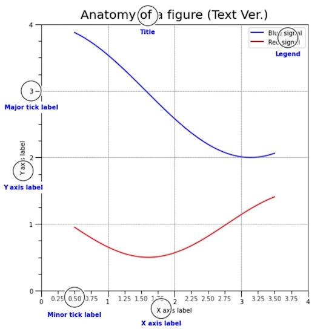
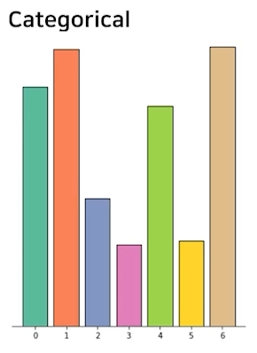
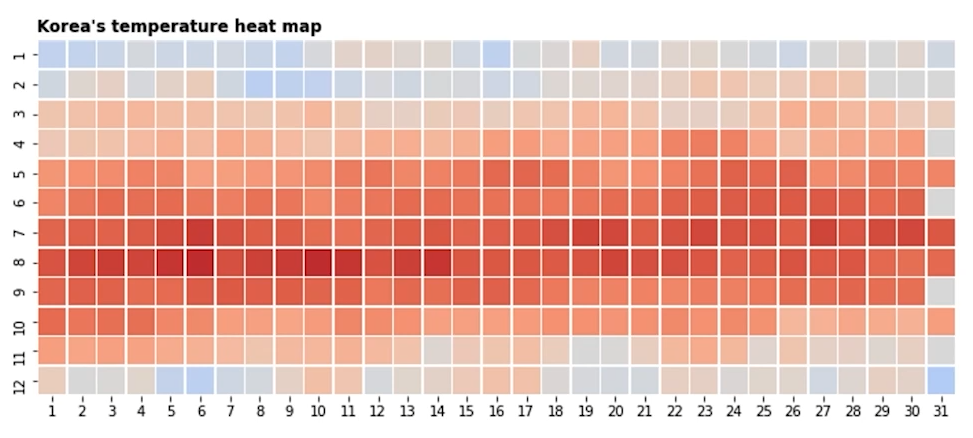
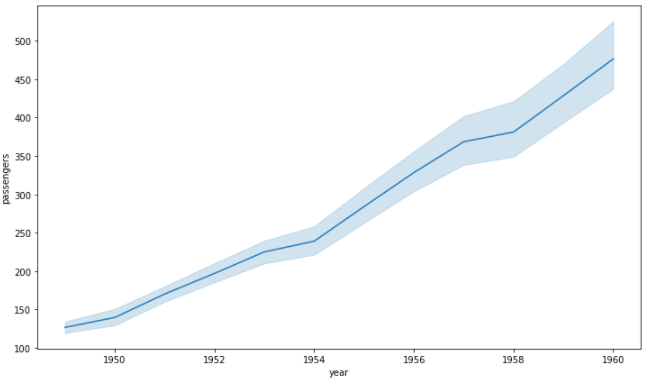

# 02/04

### 할 일

* 차트의 요소
  * 3-1강 Text 사용하기
  * 3-2강 Color 사용하기
  * 3-3강 Facet 사용하기
  * 3-4강 More Tips
* 통계와 차트
  * 4-1강 Seaborn 소개
  * 4-2강 Seaborn 기초
  * 4-3강 Seaborn 심화


### 피어세션


### 공부한 내용

#### Text 사용하기

* 정보 전달.
* 과하게 사용하면 이해에 방해가 된다.


##### 종류

* **title** : 제목, 주제.

  * `fig.suptitle('title')`

  * `ax.set_title('title')`

* **label** : 축 정보.

  * `ax.set_label('label')` : 축 이름 필요.

* **tick label** : 축의 눈금에 스케일 정보 추가.

* **legend** : 범례, 2개 이상의 그래프가 그려져있을 경우 보조 정보.

  * `ax.plot(label='legend')`

  * `ax.legend()`

    > bbox_to_anchor : https://stackoverflow.com/questions/39803385/what-does-a-4-element-tuple-argument-for-bbox-to-anchor-mean-in-matplotlib/39806180#39806180

* **annotation** : 그 외 정보.




##### Properties

* Components

  > 글씨체에 따른 가독성
  >
  > https://material.io/design/typography/understanding-typography.html#type-classification

  

* Details

  * `color`
  * `linespacing`
  * `backgroundcolor`
  * `alpha`
  * `zorder` : 겹침 순서.
  * `visible`

* Alignment

  * `ha` : horizontal alignment, `left`, `right`, `center`
  * `va` : vertical alignment, `top`, `bottom`, `center`
  * `rotation` : `horizontal`, `vertical`, 각도.
  * `multialignment`

* `bbox`

  * `boxstyle `

    

  * `facecolor`, `alpha` 등

  * dict로 입력. 

​	

---


#### Color 사용하기

* 위치와 색은 가장 효과적인 채널 구분.
* 가장 중요한 것은 인사이트 전달. - 전하고자 하는 것들 모두 전달했는가, 오해는 없는가.
* 색이 가지는 의미.
  * 온도 : 저온 - 파랑, 고온 - 빨강.
  * 브랜드.
  * 이미 사용되는 색에는 이유가 있다. - 기존 사례를 참고.


##### Color Palette의 종류

* **범주형 (categorical)**

  * 독립된 색상.
  * 최대 10개까지. 그 외는 기타로 묶을 것.
  * 색의 차이로 구분.
  * 채도, 명도의 개별적 조정 지양.

  

* **연속형 (sequential)**

  * 연속적인 색상 사용.

  * 어두운 배경에는 밝은 색, 밝은 배경에는 어두운 색이 큰 값을 표현.

  * 단일 색조.

  * 균일한 색상 변화가 중요.

  * ex) 

    

* **발산형 (diverge)**

  * 연속형과 유사하지만 중앙을 기준으로 발산.

  * 양 끝에 상반된 색 사용.

  * 중앙 색은 양쪽 끝 색에 편향되지 않아야 함.

  * ex)

    

##### 색 사용 tips

* 색상 대비로 강조
  * 명도 대비 : 밝은 색과 어두운 색 배치.
  * 색상 대비 : 가까운 색이 차이가 더 크게 보임. (ex) 파랑-보라, 빨강-보라 등)
  * 채도 대비 : 채도 차이가 더 크게 보임.
  * 보색 대비 : 정반대 색상. 더 선명해 보임.
* 색각 이상 : 색맹, 색약.


> matplotlib의 color API : https://matplotlib.org/stable/api/colors_api.html


* 색상 표현 : RGB, HSL
* HSL : 색조 (Hue),  채도 (Saturate), 광도 (Lightness)

> Top R Color Palettes : https://www.datanovia.com/en/blog/top-r-color-palettes-to-know-for-great-data-visualization/
>
> Adobe Color : https://color.adobe.com/ko/create/color-wheel


* 팔레트 가져오기

  ```python
  from matplotlib.colors import ListedColormap
  
  c = plt.cm.get_cmap(팔레트 이름).colors # RGB 값 가져오기, list
  ax.scatter(cmap=ListedColormap(c))
  ```

* `fig.colorbar()` : 각 서브플롯에 colorbar 추가.

* offset : 최대 최소를 설정하여 상대적인 위치 값을 구함.

  ```python
  from matplotlib.colors import TwoSlopeNorm
  
  offset = TwoSlopeNorm(vmin=최소값, vcenter=중간값, vmax=최대값)
  offset(데이터)
  ```

  

---


#### Facet 사용하기

* Facet은 분할을 의미.

* 화면 상에 View를 분할, 추가.

  * 다른 인코딩을 통해 다른 인사이트.
  * 같은 방법으로 여러 feature.
  * 큰 틀에서 볼 수 없는 부분 집합.

* Subplot

  * `plt.subplot()`
  * `plt.figure() + fig.add_subplot()`
  * `plt.subplots()`

* Grid Spec

  * `fig.add_gridspec(크기)`

    * 원하는 크기의 그리드를 만들어 반환.

      ```python
      gs = fig.add_gridspec(3, 3)
      ax = fig.add_subplot(gs[원하는만큼 2차원 slicing]) 
      ```

  * `plt.subplot2grid(grid 크기, 시작점, colspan=칸 수)`

* 내부에 그리기 

  * `fig.add_axes([x, y, dx, dy])`
    * 원하는 임의의 위치에 그리기.
    * 겹치게 그리기도 가능.

  * `ax.inset_axes([x, y, dx, dy])`

    * plot 내부에 plot을 하나 더 만듬. 
    * 차원 축소 등에 사용.

  * `make_axes_locatable(ax)`

    * plot 외부에 plot을 하나 더 배치.

    * color bar 등에 사용.

      ```python
      divider = make_axes_locatable(ax)
      cax = divider.append_axes(위치 (right, left 등), size, pad) # 이걸 해줘야 보임.
      ```

      


* `fig.set_facecolor()` : figure의 배경색 지정.
* `plt.figure()`
  * `dpi` : 해상도 지정. 기본값 100.
  * `figsize` : figure의 크기 지정.
* `fig.add_subplot()`
  * `sharex=(다른 subplot)`, `sharey=` : 지정한 subplot과 축을 공유.
  * `aspect` : 세로 / 가로 길이 비율 지정. plot의 크기. 1대1 = 1.
* `fig.subplots()`
  * `sharex=(bool)`, `sharey=` : 모든 subplot이 축을 공유.
  * `squeeze=False` : 1차원의 ax 배열에서도 2차원 이상의 ax 배열처럼 인덱싱이 가능하도록 해줌.
* `axes.flatten()` : 2차원 이상의 ax 배열을 1차원처럼 인덱싱할 수 있도록 해줌.


---


#### More Tips

##### Grid

* 기본 grid : `ax.grid()`

  * `which` : `major`, `minor`, `both`. grid를 그릴 곳 선택
  * `zorder`
  * `axis` : 축 선택. `x`, `y`, `both`
  * `linestyle`, `linewidth` 등

* x + y = c

  ```python
  # 원하는 간격
  x_start = np.linspace(0, 2.2, 12, endpoint=True) # 처음, 끝, 점 수
  # 하나씩 그려줌
  for xs in x_start:
      ax.plot([xs, 0], [0, xs], linestyle='--', color='gray', alpha=0.5, linewidth=1)
  ```

* y = xc

  ```python
  # 0~90까지 각도 간격
  radian = np.linspace(0, np.pi/2, 11, endpoint=True) # 0~90도까지
  
  for rad in radian:
      ax.plot([0,2], [0, 2*np.tan(rad)], linestyle='--', color='gray', alpha=0.5, linewidth=1)
  ```

* 동심원

  ```python
  # 반지름 간격
  rs = np.linspace(0.1, 0.8, 8, endpoint=True)
  
  for r in rs:
      xx = r*np.cos(np.linspace(0, 2*np.pi, 100)) # 0~360도까지
      yy = r*np.sin(np.linspace(0, 2*np.pi, 100))
      # (x[2], y[2])가 원의 중심
      ax.plot(xx+x[2], yy+y[2], linestyle='--', color='gray', alpha=0.5, linewidth=1)
  ```


##### Line & Span

* Line
  * `ax.axvline(좌표)`, `ax.axhline(좌표)` : 원하는 위치에 각 축과 평행하는 선을 그림.
    * `min`, `max` : 특정 범위에만 선 그리기 가능.
* Span
  * `ax.axvspan(좌표, 두께)`, `ax.axhspan(좌표, 두께)` : 축과 평행한 면 그리기.
    * `min`, `max` 
    * `alpha`


##### Spines

* `ax.spines`
  * `set_visible` 
  * `set_linewidth`
  * `set_position`
    * `center`
    * `('axes', 옮기는 정도)` : 축을 기준으로. 비율.
    * `('data', 옮기는 정도)` : 실제 좌표값 기준.


##### settings

> https://matplotlib.org/stable/tutorials/introductory/customizing.html

* 기본으로 지정된 파라미터 변경 가능.

* mpl.rc

  ```python
  # 둘 다 같은 기능.
  plt.rcParams['lines.linewidth'] = 2
  plt.rcParams['lines.linestyle'] = ':'
  
  plt.rc('lines', linewidth=2, linestyle=':')
  ```

  * `plt.rcParams.update(plt.rcParamsDefault)` : 원래 값으로 되돌리기.

* theme

  * 사용 가능한 테마 목록 : `mpl.style.available`

  * 테마 사용 : `mpl.style.use(테마 이름)`

  * 일부만 테마 적용 - with 구문 사용.

    ```python
    with plt.style.context(테마 이름):
        plt.plot()
    plt.show()
    ```


---


#### Seaborn 소개

* matplotlib 기반 통계 라이브러리 시각화 라이브러리.
* matplotlib으로 커스텀 가능.
* 쉬운 문법과 깔끔한 디자인.
* 목적과 방법에 따라 API를 분류하여 제공.
  * categorical
  * distribution
  * relational
  * regression
  * multiples
  * theme


---


#### Seaborn 기초

* `sns.countplot`
  * 범주에 대해 데이터 수를 세어 막대 그래프를 그려줌.
  * `x`, `y` : 해당 축에 들어갈 범주 데이터.
  * `data` : 범주에 따라 카운트 할 데이터.
  * `order` : 그리는 순서.
  * `hue` : 세부 그룹을 나누어서 그림. 나누는 기준 column 지정. 자동으로 범례 추가.
  * `hue_order` : 세부 그룹의 순서.
  * `ax` : 그래프를 넣을 subplot 지정.


##### Categorical API

* box plot

  > https://towardsdatascience.com/understanding-boxplots-5e2df7bcbd51

  

  * `sns.boxplot()`
    * `x`, `y` 
    * `data` 
    * `order` 
    * `hue`
    * `width`, `linewidth`, `fliersize`

* violin plot

  * 연속적인 표현으로 없는 값이 있는 것처럼 보임.
  * `sns.violinplot`
    * `bw` : 분포를 표현하는 간격. 작은 값일수록 세밀하게 표현.
    * `cut` : 끝부분을 자르는 정도. 0이면 딱 범위에 맞게 자름.
    * `inner` : 내부 표현. `box`, `quartile`, `point`, `stick`,  `None`
    * `scale` 
      * `area` : 전체 면적이 같도록.
      * `count` : 데이터 수에 맞추어 크기가 다름. 많은 쪽이 더 뚱뚱함.
      * `width` : 전체 너비를 같도록.

* boxen plot : box plot과 violin plot을 동시에 그린 모양.

* swarm plot : 분포에 대해 점을 찍어 표현. violin plot과 비슷한 모양.

* strip plot : 분포를 막대 상의 점의 밀도로 표현.


##### Distribution

* univariate distribution
  * 단일 변수.
  * `histplot` : 히스토그램
    * `binwidth` : 막대 간격 조정.
    * `bins` : 막대 개수 조정.
    * `element` : 막대 표현 지정.
      * `bars` : 기본 막대.
      * `step` : 계단 형식. 막대가 경계 없이 합쳐진 모양.
      * `poly` : 다각형 형태.
    * `hue` 
    * `multiple` : multiple bar chart 종류 지정.
      * `fill`
      * `layer`
      * `dodge`
      * `stack`
  * `kdeplot` : kernel density estimate
    * `fill` : 그래프 내부를 채움. 밀도함수이므로, 채워주는 편이 의도 전달이 잘 된다.
    * `bw_method` : 얼마나 세밀하게 표현할 지 지정.
    * `hue`
    * `multiple`
      * `fill`
      * `layer`
      * `stack`
    * `cumulative=bool` : 누적 분포 여부.
  * `ecdfplot` : 누적 밀도 함수
    * `hue`
    * `stat` : 값의 종류
      * `count` : 데이터 수
      * `proportion` : 비율
    * `complementary=bool`
      * `True` : 1부터 시작
      * `False` : 0부터 시작
  * `rugplot` : 선을 사용한 밀도 함수.
* bivariate distribution
  * 2개 이상의 변수.
  * `histplot`
    * `x`, `y` : 각 축에 데이터 지정.
    * `bins=(x, y)` : 각 축의 구간 수 지정.
    * `cbar=bool` : color bar 표시 여부.
  * `kdeplot`
    * `x`, `y`
    * `fill`
    * `bw_method`


##### Relation & Regression

* `scatterplot`

  * `x`, `y`
  * `data`
  * `hue`
  * `markers`, `style`, `size` 등

* `lineplot`

  * `hue`

  * `markers=bool` : 마커 표시 여부.

  * `dashes=bool` : 점선 (-.-) 여부.

  * 자동으로 평균과 오차범위를 계산해서 표시해줌.

    

* `regplot`

  * 회귀선을 추가한 scatter plot.
  * `x_estimator` : 회귀선에 사용할 값.
  * `x_bins`
  * `order` : 회귀선 차수 지정.
  * `logx=bool` : 회귀선의 로그함수 여부.


##### Matrix Plots

* `heatmap(df.corr(), ax)`
  * `vmin`, `vmax` : 상관계수는 -1 ~ 1이므로 범위를 지정해주면 좋다.
  * `center` : 0을 기준으로 하겠다는 의미로, 0으로 지정해주면 좋다.
  * `cmap`
  * `annot=bool` : 각 칸에 값을 넣어줌. annotation
  * `fmt` : annotation 포맷 지정.
  * `linewidth`
  * `square=bool` : 정사각형 여부.
  * `cbar=bool`
  * `mask` : 입력된 df.corr()과 같은 크기의 bool 행렬. True인 칸만 보여줌.


##### Further reading

> seaborn API 문서 : https://seaborn.pydata.org/api.html


---


#### Seaborn 심화

