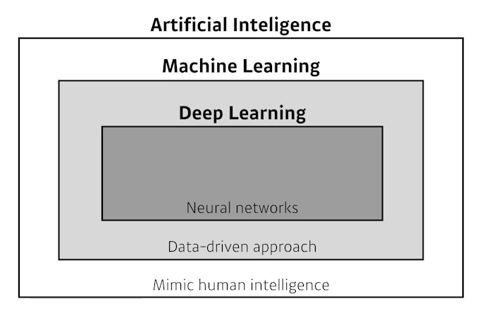
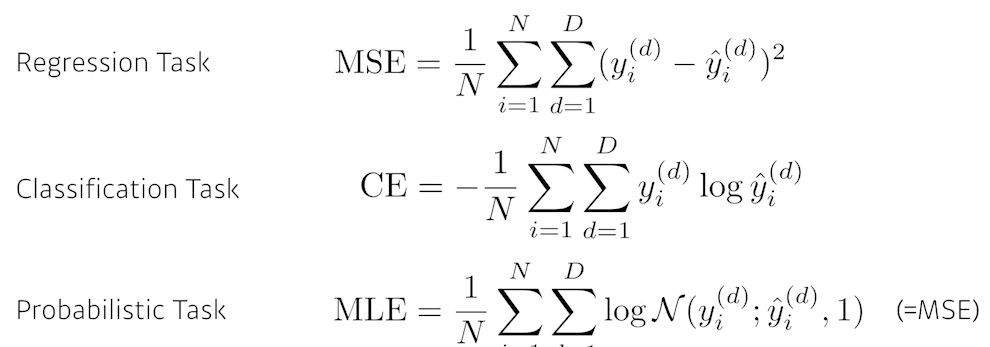
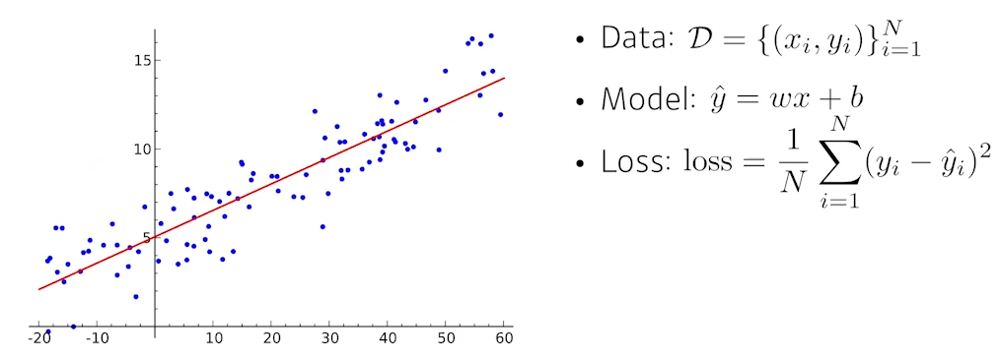
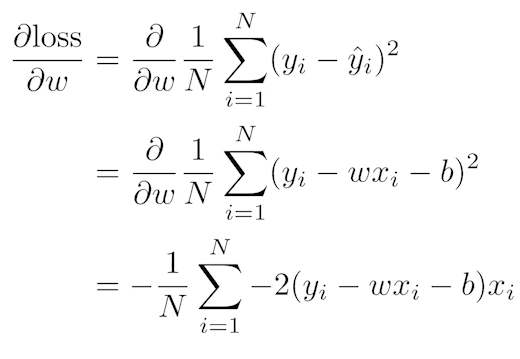
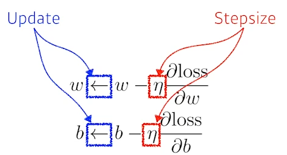
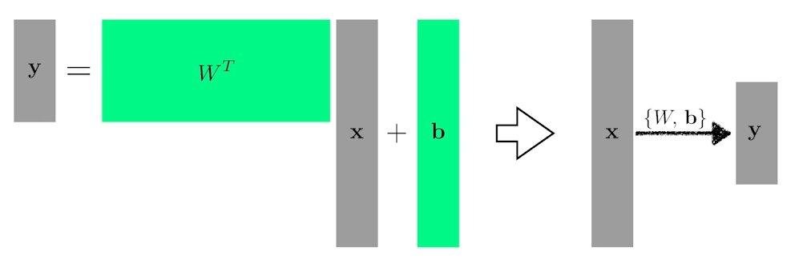
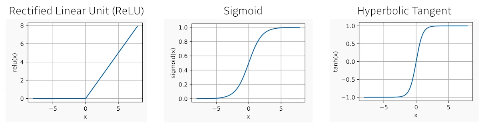
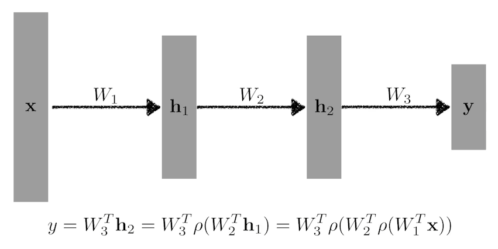
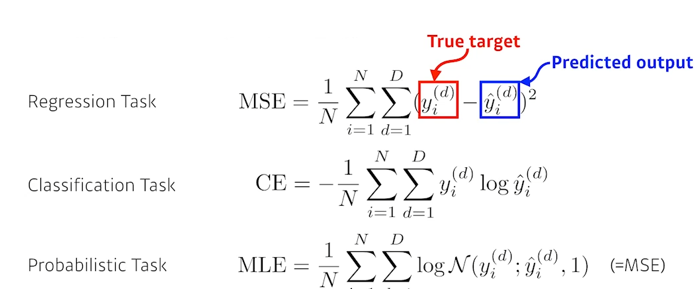

# 02/07

### 할 일

* Data Viz - 다양한 시각화 방법론
  * 5-1강 Polar Coordinate
  * 5-2강 Pie Charts
  * 5-3강 다양한 시각화 라이브러리
* DL Basic - 딥러닝 기본
  * 1강 딥러닝 기본 용어 설명
  * 2강 뉴럴 네트워크 - MLP 
  * 2강 실습 MLP 구현


### 피어세션


### 공부한 내용

#### Polar Coordinate

##### Polar Plot

* 극 좌표계 : 거리와 각을 사용하여 plot.
* 회전, 주기성 표현에 적합.
* scatter, line, bar 모두 사용 가능.
* 직교 좌표계로 변환 가능.
  * x = r cosθ
  * y = r sinθ


###### 실습

* 직교 좌표계가 아니므로, subplot 생성 시 좌표계를 선언해주어야 함.
  * `projection = 'polar'` 혹은 `polar=Ture` 
* `ax.set_rmax()` : 반지름 조정.
* `ax.set_rmin()` : 중심의 기준값 변경.
*  `ax.set_rticks()` : 눈금 조정.
* `ax.set_rlabel_position(각도)` : 눈금 표시 각도 지정.
* 부채꼴 모양의 plot - 각도 설정
  * `ax.set_thetamin()`
  * `ax.set_thetamax()`


* `ax.scatter(theta, r)`
* `ax.bar(theta, r)`
  * 막대 간의 차이를 상대적으로 파악하기 어렵다.
  * 사용 시 주의.
* `ax.plot(theta, r)`
* `ax.fill(theta, r)`


##### Radar Plot

* 별 모양으로 생겨 Star Plot으로 불리기도 함.

* 중심점을 기준으로 N개 변수값을 표현할 수 있음.

* 데이터의 Quality를 표현하기 좋음.

* 여러 데이터를 개별적으로 비교할 때 유용.

* 주의점

  * 각 feature가 독립적이며 척도가 같아야 함.

  * 순서형 변수와 수치형 변수가 함께 있다면 고려 필요.

  * 면적은 feature의 순서에 따라 달라짐. - 면적에 너무 의미를 두지 않음.

  * feature가 많으면 가독성이 떨어짐.


###### 실습

* `ax.plot`과 `ax.fill`로 그림.
* `ax.set_thetagrids` : 각도 별 grid 및 ticklabel 변경.
* `ax.set_theta_offset` : 시작 각도 변경. (첫 feature가 오는 위치)

> https://matplotlib.org/stable/gallery/specialty_plots/radar_chart.html


---


#### Pie Charts

> [Pie chart in Matplotlib](https://matplotlib.org/stable/api/_as_gen/matplotlib.pyplot.pie.html#matplotlib.pyplot.pie)


* 원을 부채꼴로 분할하여 표현하는 통계 차트.
* 비율에 대한 정보 제공.
* 되도록 **지양**.
  * **구체적인 양의 비교가 어려움.**
  * 유용성이 떨어짐.
  * bar plot이 좀 더 유용.
  * 단독보다 함께 사용하는 것을 권장.

* Donut chart - 디자인적으로는 더 선호되나, pie chart보다 보기 어려움.
* Sunburst chart
  * 계층적 데이터. - tree map을 더 추천.
  * 구현 난이도에 비해 화려함.
  * 보기 어려움.


###### 실습

* `ax.pie()`
  * `startangle` : 시작 각도 지정.
  * `explode` : 조각이 튀어나오는 정도 지정. 데이터와 같은 크기의 배열.
  * `shadow` : 그림자 효과 (bool)
  * `autopct` : 비율 표시 포맷 지정.
  * `labeldistance` : label과 차트의 거리 지정.
  * `counterclock` : 데이터들의 순서(시계, 반시계 방향) 설정.
  * `radius` : 반지름 크기 지정.
* Donut chart - 가운데에 흰 원을 그려줌.
  * `plt.Circle(좌표, 반지름, fc=색)`
  * `ax.add_artist(원)`


---


#### 다양한 시각화 라이브러리

##### `Missingno`

* 결측치(missing value)를 체크하는 시각화 라이브러리.
* 빠르게 결측치 분포를 확인하고 싶을 때.


###### 실습

* `msno.matrix(data)` : 결측치를 흰 부분을 표시.
* `msno.bar(data)` : 결측치 수를 막대 그래프로 표시.


##### Treemap

* 계층적 데이터를 직사각형을 사용한 포함관계 표현.
* 타일링 알고리즘에 따라 형태가 달라짐.
* 구현 방법  
  * 라이브러리 : `squarify` 
  * Plotly
* 계층이 깊어질수록 사각형이 작아짐.
* interactive한 시각화에 추천.


###### 실습

* `squarify.plot(data)`
  * `label`
  * `color` : 개별 지정 가능.
  * `pad`
  * `text_kwargs`
  * `ax`


##### Waffle Chart

*  와플 형태로 discrete하게 값을 나타냄.
* 라이브러리 : `pywaffle`
* icon을 사용한 차트도 가능. 인포그래픽에 유용.


###### 실습

```python
from pywaffle import Waffle

fig = plt.figure(
    FigureClass=Waffle, #######
    rows=(row 수), 
    columns=(col 수), 
    values=data, # 전체 비율로 표현
    legend=dict() # 데이터를 dict로 넘겨야 데이터 이름을 알 수 있다.
)
```

* `cmap_name`
* `colors`
* rows만 설정하면 col은 자동 계산.
* `starting_location` : 네 꼭지점 중 하나를 골라 시작점으로 잡을 수 있음. (NW, NE, SW, SE)
* `vertical=(bool)` : true면 가로로 진행.
* `block_arranging_style` : 진행 방식. 기본은 snake. (new-line 등)
* `icons` : 사용할 icon 이름. font awesome에서 명칭을 알 수 있음.
* `icon_legend=(bool)`
* `font_size`


##### Venn

* 집합 등에서 사용하는 벤 다이어그램.
* 출판 및 프레젠테이션에 많이 사용.
* draw.io나 ppt에 비해 어려움.
* 라이브러리 : `pyvenn`, `matplotlib-venn`
* 원이 많아지면 가독성이 떨어짐.


###### 실습

* `matplotlib_venn`
  * 이진수를 사용하여 각각에 들어갈 값을 정할 수 있음.
  * ex) 2개의 부분집합. = `venn2(subset=())`
    * 01 : 1번째 Set에 들어갈 내용
    * 10 : 2번째 Set에 들어갈 내용
    * 11 : 교집합에 들어갈 내용
  * ex) 3개의 부분집합. = `venn3(subset=())`
    * 1개만 포함되는 인덱스
      - 1 = 001
      - 2 = 010
      - 4 = 100
    * 2개가 포함되는 인덱스
      - 3 = 011
      - 5 = 101
      - 6 = 110
    * 3개가 포함되는 인덱스
      - 7 = 111
  * `venn`에 set을 전달. = `venn(set_list, set_labels)`
    * 파이썬의 set 타입을 전달.


---


#### 딥러닝 기본 용어 설명  - Historical Review



##### 딥러닝의 중요 요소

* **데이터 (data)**

  * 문제의 종류에 의존.

* **모델 (model)**

  * 모델의 성질에 따라 결과가 다름.

* **손실함수 (loss function)**

  * 얻고자 하는 내용을 수치화 (근사치).
  * 항상 정해져있는 것이 아니다.
  * 관계 이해가 중요.

  

* **알고리즘 (algorithm)**

  * 손실 함수를 최적화 하는 알고리즘.


##### Historical Review

> https://dennybritz.com/blog/deep-learning-most-important-ideas/

| 년도 | 모델                                                         |                                          |
| ---- | ------------------------------------------------------------ | ---------------------------------------- |
| 2012 | AlexNet                                                      | 이미지 분류, 딥러닝                      |
| 2013 | DQN                                                          | Q-learning                               |
| 2014 | Ecoder/Decoder (자연어), Adam Optimizer                      |                                          |
| 2015 | Ganerative Adversarial Network (GAN), Residual Networks (ResNet) |                                          |
| 2016 |                                                              |                                          |
| 2017 | Transformer                                                  | [논문](https://arxiv.org/abs/1706.03762) |
| 2018 | Bidirectional Encoder Representation from Transformers (BERT) |                                          |
| 2019 | Big  Language Models (GPT-X)                                 | OpenAI, BERT의 끝판왕.                   |
| 2020 | Self-Supervised Learning                                     | simCLR                                   |


---


#### 뉴럴 네트워크 - Multi-Layer Perceptron (MLP)

* 인간의 뇌를 모방.
* 행렬의 곱과 비선형 연산이 반복적으로 일어나는 function approximators.
* 어떤 함수를 모방.


##### Linear Neural Networks

* 입력과 출력이 1차원.



* loss - 모델의 출력값과 실제값의 차이

* loss가 최소가 되는 w를 구함.

* 경사하강법

  

* **m차원에서 n차원**으로 : **n x m의 W**가 필요.

  

##### Beyond Linear Neural Network

* 선형 변환을 여러 번 해봤자, 어떤 선형 변환 한 번과 동일함. → 비선형 변환이 필요함.

* **선형 변환 → 비선형 변환** 반복.

*  활성 함수 (activation function)

  

* 뉴럴 네트워크의 표현력은 매우 크다.


##### Multi-Layer Perceptron



* loss function

  * 각 loss function의 성질을 알고 적절한 것을 골라야 함.

  

  * MSE (Mean Squared Error)
    * outlier가 있을 경우, 영향을 많이 받는다.
  * CE (Cross Entropy)
    * y가 0 아니면 1. (분류)
    * 차원에 해당하는 출력 값만 높임.
  * MLE (Maximum Likelihood Estimation)

> [PyTorch loss functions](https://pytorch.org/docs/stable/nn.html#loss-functions)


---


#### 퀴즈

> References
>
> [active function](https://mole-starseeker.tistory.com/39)
>
> [KL Divergence와 Cross-Entropy](https://uhou.tistory.com/200)
