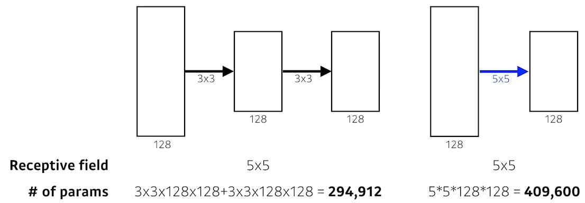

# 02/08

### 할 일

* DL Basic - 최적화
  * 3강 Optimization
  * 3강 실습 Optimization Methods
* DL Basic - CNN (Convolutional Neural Network)
  * 4강 Convolution은 무엇인가?
  * 4강 실습 Convolutional Neural Network
  * 5강 Moder CNN
  * 6강 Computer Vision Applications

### 피어세션/멘토링

* CutMix의 비율 지정 방법 : 이미지 자체의 비율 사용. 랜덤하게 잘라 붙임.

### 공부한 내용

#### Optimization

##### Important Concepts in Optimization

* **Generalization**

  * 접한 적 없는 데이터에 대해서도 잘 동작함.

  

* Underfitting vs Overfitting

  * **Underfitting** : 모델이 학습이 덜 된 경우.
  * **Overfitting** : 학습 데이터에 비해 테스트 데이터에서 성능이 떨어짐.

  

* **Cross-validation**

  * validation data는 학습에 사용되지 않은 것.
  * 학습 데이터를 k개로 나누어, i (=1~k)번째를 제외하고 학습. → k번 반복.
  * cross-validation으로 최적의 hyperparameter를 찾고, 이 값들로 전체 data set을 사용해 학습.
  * 학습에는 training data와 validation data만을 활용.
  * test data는 학습에 사용하면 안 된다.

  

* Bias and Variance

  * **Bias** : target에서 벗어난 정도.
  * **Variance** : 학습 결과가 분산된 정도.

  

  * **trade off 관계**에 있음. 둘 다 줄이기 힘들다.

    

* **Bootstrapping**

  * 학습 데이터를 랜덤하게 sampling 하여 여러 학습 데이터 셋을 만들고, 다양하게 학습시켜 모델의 결과를 관찰.

* Bagging vs Boosting

  * **Bagging** (Bootstrapping aggregating)
    *  bootstrapping으로 학습된 여러 모델들.
    * 이 모델들 각각의 결과를 취합. (voting, aveaging 등)
    * ex) 앙상블
  * **Boosting**
    * 여러 개의 모델을 sequential하게 연결.
    * 이전 모델이 잘 학습하지 못한 데이터에 대해서만 다음 모델을 학습.

  

##### Practical Gradient Descent Methods

* Stochastic gradient descent (SGD)
  * 하나의 sample로 gradient를 계산하여 업데이트.
* Mini-batch gradient descent
  * 일부분의 sample들로 gradient 계산. (주로 사용)
* Batch gradient descent
  * 전체 데이터를 사용하여  gradient 계산.

* **Batch-size**

  * batch-size를 작게 쓰는 편이 좋다.
  * batch-size가 크면 model을 over-fit.
  
  
  
  * flat minimum이 generalization performace가 떨어진다.
  
  > [논문](https://arxiv.org/abs/1609.04836)

* **Gradient Descent**

  * 적절한 learning rate를 잡아주는 것이 중요.

  

* **Momentum**

  * 좀 더 빨리 minimum을 찾기 위함.
  * 이전의 gradient 방향도 활용. 

  

* **Nesterov Acceleated Gradient**

  * 기존 방향으로 일단 한 번 진행.
  * 일단 진행한 값을 사용.

  

  * Momentum의 수렴을 못하는 현상을 해결하기 위해.

    

* **Adagrad**

  * 파라미터가 지금까지 얼마나 변해왔는가 를 반영.
  * 적게 변한 파라미터는 많이, 많이 변한 파라미터는 적게 업데이트.

  

  * Gt가 너무 커지면 업데이트가 되지 않는다.

* **Adadelta**

  * Adagrad의 Gt가 너무 커지는 현상을 해결하기 위함.
  * 이전 n-step 동안의 업데이트 정보만 반영.

  

  * learning rate가 없다.
  * 개발자가 직접 컨트롤 할 수 있는 부분이 적어 많이 사용되지 않는다.

* **RMSprop**

  * Adadelta 대신 많이 사용됨.
  * step size 추가.

  

* **Adam**

  * 가장 무난하게 사용.
  * momentum과 adaptive learning rate를 합침.

  

##### Regularization

>  generalization을 잘 되도록 하고 싶음.

* **Early Stopping**

  * validation error를 보고 학습을 일찍 멈춤.

  

* **Parameter Norm Penalty (Weight Decay)**

  * parameter들이 너무 커지지 않도록.

  * 최대한 부드러운 함수(?)를 만들자.

    

* **Data Augmentation**

  * 데이터가 많을수록 학습이 잘 된다.

    

  * 주어진 데이터를 변형하여 데이터 셋의 크기를 키움.

  * label이 바뀌지 않는 한도 내에서 변형. (뒤집기, 회전, 확대, 축소 등)

* **Noise Robustness**

  * 입력 데이터나 weights에 random noise를 집어 넣음.

* **Label Smoothing**

  * training data 중 2개를 꼽아 섞음.
  * decision boundary를 부드럽게 만들어 줌.
  * label에도 비율을 주어 섞음.
  * data 수 증가.
  * 노력 대비 성능이 많이 올라감.

  

  > [논문](https://arxiv.org/abs/1905.04899?context=cs.CV)

* **Dropout**

  * 일부 뉴런을 랜덤하게 0으로 만들어 줌.

  

* **Batch Normalization**

  * 원하는 레이어의 모든 파라미터의 통계치를 정규화. 
  * 평균을 빼고, 표준편차를 나눔.

  

  > [논문](https://arxiv.org/abs/1502.03167)

  

  > [논문](https://arxiv.org/abs/1803.08494)

> Further Reading
>
> - [RAdam github](https://github.com/LiyuanLucasLiu/RAdam)
> - [AdamP github](https://github.com/clovaai/AdamP)

---

####  Convolution은 무엇인가?

##### convolution

* 이미지에 적용하면 필터의 역할.

* 원하는 **output의 채널 수만큼** 커널 수가 필요.

  

* 구성
  * convolution layer, pooling layer : feature 추출.
  * fully connected layer : decision making

* **stride**

  * kernel을 적용하는 step.

  

* **padding**

  * 원하는 output 크기를 맞추기 위해 input의 가장자리를 채움. 

  

##### 1x1 convoution

* dimension을 줄임.
* 네트워크를 깊게 쌓으면서 파라미터의 수를 줄임.

---

#### Modern CNN - 1x1 convolution의 중요성

>  ILSVRC에서 우승한 모델들.

##### AlexNet

> [논문](https://papers.nips.cc/paper/2012/hash/c399862d3b9d6b76c8436e924a68c45b-Abstract.html)

* ReLU 사용.
  * linear model의 좋은 성질을 갖고 있다.
  * 학습이 용이.
  * sigmoid, tanh는 0에서 멀어질수록 기울기가 거의 없음. - gradien vanishing 발생.
* 2개 GPU 사용.
* Local reponse normalizaion (최근에는 사용하지 않음.)
* Overlapping pooling
* Data augmentation
* Dropout

##### VGGNet

> [논문](https://arxiv.org/abs/1409.1556)

* 3x3 kernel만 사용. (stride=1)
* 1x1 convolution 사용.
* dropout (p=0.5)
* 레이어 수에 따라 VGG16 (레이어 16개), VGG19 (레이어 19개)
* 3x3 2개를 사용한 것과 5x5 1개를 사용한 것이 결과가 같으나, **parameter의 수가 적어진다.**

* receptive field : 

##### GoogLeNet

> [논문](https://arxiv.org/abs/1409.4842)

* network in network (NiN)와 inception block을 함께 활용.

  * **1x1 convolution**이 중간에 추가로 들어감.
  * 전체적인 파라미터 수를 줄임.

  

* 1x1 convolution을 사용하는 이유 - 파라미터 수를 줄이기 위해.

  

##### ResNet

> [논문](https://arxiv.org/abs/1512.03385)

* 문제

  * 파라미터 수가 많아지면 생기는 문제 - **over-fit**
  * 레이어 수가 적은 모델이 에러의 satuation 값이 더 작다.

* **skip connection**

  

  * 차이만 학습하길 원함.

* 깊은 레이어로 더 좋은 성능을 낼 수 있게 됨.

* Shortcut

  

  * projected shorcut : 차원을 맞춰주기 위해 1x1 convolution을 사용하는 것.

* Bottleneck architecture

  

  * 파라미터를 줄이기 위해, 3x3 convolution을 적용하기 전에 1x1을 사용하여 채널 수를 줄임.
  * 3x3 이후에는 원하는 출력 채널을 위해 1x1을 한 번 더  적용.

##### DenseNet

> [논문](https://arxiv.org/abs/1608.06993)

* addition 대신 **concatenation** (그냥 이어 붙임).

  

* 채널이 점점 커짐. - 중간중간 채널 수를 줄여줌.

  

  * Dense Block : concatenation.
  * Transition Block 
    * 채널 수를 줄임.
    * BatchNorm → 1x1 conv. → 2x2 AvgPooling.

---

#### Computer Vision Applications

##### Semantic Segmentation

* 이미지의 각 픽셀마다 분류.

* 각 픽셀이 어떤 class에 속하는 지.

  

* 자율주행 등.

* Fully convolutional network

  * fully connected network에서 dense layer을 없앰.

  

  * convolutionalization

    

    * 파라미터 수는 같다.
    * 입력 데이터 크기에 관계 없이 동작.
    * heat map과 같은 효과.

* Deconvolution (conv. transpose)

  * convolution의 역연산으로 생각하면 편함.

  

  * 실제로는 역연산은 불가능.
  * padding을 주어 원하는 크기의 출력을 얻음.

  

##### Detection

* **R-CNN** [논문](https://arxiv.org/abs/1311.2524)

  * step

    1. 입력 이미지에서 2000개의 구역을 추출. (selective search)

    2. 추출한 것들의 feature 계산. (AlexNet)

    3. linear SVM으로 분류.

  * 문제점 : 2000개의 이미지에 대한 CNN을 모두 수행해야함.

* **SPPNet** [논문](https://arxiv.org/abs/1406.4729)

  * CNN을 한 번만 수행.

  * 바운딩 박스의 추출 시점이 달라짐.

  * step

    1. 이미지에서 바운딩 박스 추출.

    2. 이미지 전체에 대해 CNN 수행.

    3. 바운딩 박스의 feature tensor만 가져옴.

* **Fast R-CNN** [논문](https://arxiv.org/abs/1504.08083)

  * 기본 컨셉은 SPPNet과 동일.
  * 차이점 : neural network를 통해 바운딩 박스를 어떻게 움직일 지 결정.

* **Faster R-CNN** [논문](https://arxiv.org/abs/1506.01497)

  * Region Propasal Network (RPN) + Fast R-CNN
  * 물체가 있을 법한 바운딩 박스를 학습을 통해 찾아줌.
  * fully convolution network 사용.

  

* **YOLO** [논문](https://arxiv.org/abs/1506.02640)

  * 바운딩 박스를 찾는 단계가 나누어져있지 않음. - 빠르다.

  

  * step

    1. 이미지를 SxS의 grid로 나눔.

    2. B개의 바운딩 박스를 찾고, 쓸모 있는 박스인 지를 판단.

    3. 동시에 각 바운딩 박스의 class를 분류.

    

---

#### 퀴즈

> [가중치 감쇠 (Weight Decay)](https://ko.d2l.ai/chapter_deep-learning-basics/weight-decay.html)
>
> [Gradient Vanishing](https://casa-de-feel.tistory.com/36)

