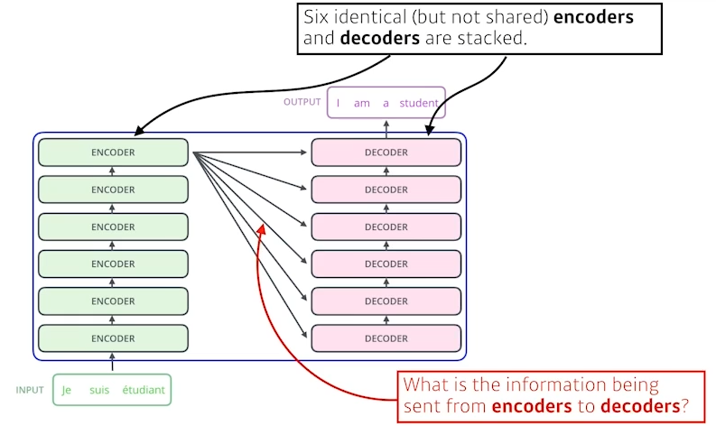
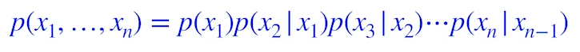
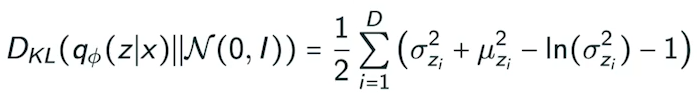

# 02/09

### 할 일

* DL Basic - RNN (Recurrent Neural Network)
  * 7강 Sequential Models - RNN
  * 7강 실습 LSTM
  * 8강 Sequential Models - Transformer
  * 8강 실습 SDPA & MHA
* DL Basic - Generative Models
  * 9강 Generative Models 1
  * 10강 Generative Models 2

### 피어세션

### 공부한 내용

#### RNN

* 주어진 입력이 sequential.

  

* Naive sequential model

  * 대부분 입력 데이터의 길이가 정해져있지 않다.
  * 이전 데이터들이 들어왔을 때, 다음 데이터를 예측.
  * 시간이 지날수록 봐야하는 데이터가 점점 늘어남.

  

* Autoregressive model

  * 이전 데이터를 정해진 개수 τ개만큼만 고려.

  

* Markov model (first-order autogressive model)

  * 바로 직전 과거의 데이터에만 의존한다.

  

* Latent autogressive model

  * hidden state가 과거의 정보를 요약.

  

##### Recurrent Neural Network

> image reference : https://colah.github.io/

* 자기 자신을 참조하는 부분이 있음.
* 입력이 굉장히 많은 fully connected  layer로 표현됨.
* 각각의 레이어의 파라미터를 공유하는 네트워크처럼 보임.

* Short-term dependencies

  * 가까운 과거의 정보는 잘 고려가 되지만, 먼 과거의 정보는 고려되기 힘듦.

  * Long-term dependencies를 잡는게 어렵다.

  * sigmoid, tanh 활성함수는 정보를 0~1로 줄인다. 

    → 레이어를 거칠 때마다 과거 정보는 점점 작아진다. (Vanishing gredient)

  * ReLU는 값이 양수이면 그 크기가 레이어를 거칠 때마다 점점 커진다. (Exploding gradient)

    → RNN에서는 ReLU를 잘 사용하지 않음.

​			

* Vanila RNN

  

* **Long Short Term Memory (LSTM)**

  

  * previous cell state 

    * 이전 정보들을 취합하고 있다.
    * 어떤 정보를 취하고 버릴 지를 결정하여 다음 레이어에 넘겨줌.
    * forget gate와 input gate의 정보를 받아서 반영.

  * forget gate

    * 어떤 정보를 버릴 지 선택.

    

  * input gate

    * 현재 입력에서 어떤 정보를 추가할 지 선택.
    * it : 어떤 정보를 취할 지.
    * Ct : 취할 정보.

    

  * update cell

    * forget gate와 input gate의 정보를 cell state에 업데이트.

    

  * output gate

    * 어떤 값을 output으로 보낼 지.

    

* **Gated Recurrent Unit (GRU)**

  * gate가 2개. (reset gate, update gate)

  * cell state 없음.

  * hidden state를 처리하여 output을 만드는 gate가 없다. 

    : hidden state = output

  * LSTM보다 성능이 잘 나오는 편.

    * 적은 파라미터로 동일한 효과.
    * 요즘은 둘 다 잘 안 쓰고, Transformer 사용.

  

---

#### Transformer

> [논문](https://arxiv.org/abs/1706.03762)
>
> image reference : https://jalammar.github.io/illustrated-transformer/

* sequential data를 다루기 어려운 이유.
  * 길이가 달라짐.
  * 중간에 정보가 빠지기도 함.
  * 순서가 바뀌기도 함. 

* 재귀 구조가 아님.
* 입력과 출력의 크기, 도메인이 다를 수 있음.
* 한 번에 n개의 sequence를 모두 처리할 수 있다.

* 같은 구조를 가지지만, 파라미터가 다르게 학습되어 있는 네트워크가 stack.

  

* 어떻게 한 번에 sequence가 학습 되는가?

* encoder와 decoder 사이에 어떤 정보가 주고 받아지는가?

* decoder가 어떻게 generation 할 수 있는가?

* 각 encoder는 self-attention과 feed forward로 이루어짐.

  

##### self-attention 

* n개의 입력에서 n개의 z벡터를 만들 때, 나머지 입력도 함께 고려.

* ex) 한 문장 안에서 다른 단어와의 관계를 생각해야함.

* 3개의 벡터가 만들어짐.

  

  * score를 구함 

    * encoding하고자 하는 단어의 query 벡터와 다른 입력들의 key 벡터의 내적.

      (query와 key의 차원은 같아야 함.)

    * 나머지 단어들과의 유사도, 관계, interaction이 필요한 정도.

    * score를 normalize. → softmax.

  * 실제로 사용되는 값 

    = value vector의 weighted sum.

    * 여기서 value 벡터의 weight가 score.

    

    * z : representation
    * value는 차원이 달라도 됨.
    * 편의상 보통 value도 같은 크기로 구현을 한다.

  

  

* 고정된 입력에서도 입력 간의 관계에 따라 encoding된 결과의 크기가 달라질 수 있음.

  → flexible한 구조.

* 입력이 너무 길어지면, 메모리를 너무 많이 사용하게 된다. (n^2번 계산) - 한계점.

  ex) 100개의 단어 - 100 x 100 계산. 서로의 관계를 계산해야함.

##### Multi-headed attention (MHA)

* query, key, value를 여러 개 만든다.
* n번의 attention.

* n개의 encoding된 벡터를 붙여서 차원을 줄여줌.

##### positional encoding

* 앞선 작업으로는 sequential 정보가 없다.
* 특정 값을 더한다. (offset)
* positional encoding vector (?)

##### decoder

* key와 value 벡터를 전달 받음.
* decoder는 도메인이 다르므로, 자체적으로 가지고 있는 단어의 query 벡터가 있음.
* 하나의 단어씩 autoregressive하게 출력.

* masking
  * 이전 단어들에만 의존하도록.
  * 뒤에 오는 단어들에는 독립적.
* encoder-decoder attention (?)
* 마지막 레이어는 단어의 분포를 만들다.

##### Vision Transformer 

> [논문](https://arxiv.org/abs/2010.11929)

* 이미지 도메인에서도 활용.
* encoder만 활용.

##### DALL-E

> blog : https://openai.com/blog/dall-e/

* 문장이 주어지면 이미지를 만든다.

---

#### Generative Models (생성 모델)

* generation : 샘플데이터에 없는 이미지 등을 만들어 냄. (sampling)
* density estimation : 어떤 입력이 주어졌을 때 예측, 구분. (anomaly detection)
* unsupervised representation learning : 특징을 뽑아냄. (feature learning)

* Basic Discrete Distributions

  * Bernoulli distribution (ex. coin flip)

    * 1개의 파라미터 필요.

    

  * Categorical distribution (ex. m-side flip)

    * n-1개 파라미터 필요.

    

  * 하나의 픽셀의 RGB 표현에 필요한 파라미터 수 = 256 x 256 x 256 - 1

  * binary image = 2^n - 1 (n: 이미지의 픽셀 수)

  * *파라미터 수가 너무 많이 필요하다.*

* Structure Through Independence

  * 모든 픽셀에 독립적이라고 가정하면, n개의 파라미터가 필요하다.
  * 다른 픽셀들과 연관이 없다고 가정.
  * *현실적이지 못하다.*

* **Conditional Independence**

  * Chain rule

    

  * Bayes' rule

    

  * Conditional independence

    * z가 주어졌을 때 x, y는 독립이다.

    

  * chain rule만 적용 시, 그래도 2^n - 1개의 파라미터 필요.

  * **Markov assumption** 가정.

    * i번째 픽셀은 i-1번째 픽셀에만 의존한다.

    → 

    * 2n - 1개의 파라미터 필요.

##### Auto-regressive Model

* 하나의 정보가 이전 정보들에 의존적임.
* 이미지는 순서를 매기는(ordering) 방법에 따라 성능이 달라질 수도 있다.
* conditional independence를 주는 방법에 따라 모델의 구조가 달라짐.
* 몇 번째 전까지의 정보를 고려하느냐에 따라 AR(τ) 모델이라 정의.

* **NADE (Neural Autoregressive Distribution Estimation)** [논문](https://arxiv.org/abs/1605.02226)

  * 이전 픽셀 모두에 의존.

  

  

  * explicit model
    * 생성 뿐 아니라 입력에 확률도 계산할 수 있다.
  * binary output : sigmoid
  * continuous output : mixture of Gaussian

* **Pixel RNN** [논문](https://arxiv.org/abs/1601.06759)

  

  

##### Latent Variable Models

* autoencoder는 generative model이 아니다.

* **Variational Auto-encoder**

  > 논문 : https://www.narcis.nl/publication/RecordID/oai:dare.uva.nl:publications%2F8e55e07f-e4be-458f-a929-2f9bc2d169e8

  * posterior distribution : 나의 목적이 주어졌을 때, 관심 있는 random variable의 확률분포.

    

    * 반대는 likelihood.

  * variational distribution

    * posterior distribution을 계산하기 어렵거나 불가능할 때가 많음.
    * 최적화 시킬 수 있는 어떤 것으로 근사한 분포.

    

  * **Variational inference**

    * posterior distribution을 잘 근사하는 variational distribution을 최적화 하는 것.
    * posterior distribution과의 **KL divergence를 최소화** 할 수 있는 variational distribution을 찾는 것.

    

    

    * KL divergence를 최소화 하는 것이 목적이나 불가능.
    * ELBO 항을 키움으로써 반대급부 효과를 얻으려 함.

  * **ELBO**

    

    * x를 잘 표현하는 latent space(?)를 찾고 싶음.
    * reconstruction term : encoder - decoder을 거치면서 생기는 reconstruction loss를 줄이는 항.
    * prior fitting term : latent space의 분포가 가정한 prior distribution과 비슷한 정도.

  * explicit는 아니고 inplicit 모델이다. (?)

  * interactive model : likelihood를 계산하기 어렵다.

  * KL divergence 때문에, 거의 gaussian prior만 사용한다.

  * isotropic Gaussian : 모든 output dimension이 독립적.

    

* **Adversarial Auto-encoder** [논문](https://arxiv.org/abs/1511.05644)

  * VAE의 prior fitting term을 GAN objective로 변경.
  * sampling만 가능한 어떤 분포만 있어도 활용 가능.
  * VAE에 비해 성능이 좋을 때가 많다.

  

##### Generative Adversarial Network

> [논문](https://arxiv.org/abs/1406.2661)

* 생성 모델과 학습 모델을 두고, 학습 모델을 속이는 데이터 생성 → 속지 않도록 학습 을 반복.

* VAE vs GAN

  

* generator와 discriminator의 minimax 게임.

  * for discriminator

    

    * 항상 최적화 시키는 D

      

    * generator가 고정되어 있을 때, 항상 최적으로 갈라줌.

  * for generator

    

    * Plugging in the optimal discriminator,

      

    * JSD 최소화.

* **DCGAN** [논문](https://arxiv.org/abs/1511.06434)

  

  * image domain
  * geneartor deconvolution

* **Info-GAN** [논문](https://arxiv.org/abs/1606.03657)

  

  * generator를 할 때, 특정 모드에 집중할 수 있도록.

* **Text2Image** [논문](https://arxiv.org/abs/1605.05396)

* **Puzzle-GAN** [논문](https://arxiv.org/abs/1703.10730)

* **CycleGAN** [논문](https://arxiv.org/abs/1703.10593)

  * 이미지 사이의 도메인 변경.
  * cycle-consistency loss.
  * 임의의 이미지를 원하는 이미지로 바꾸어 줌.
  * GAN 구조가 2개.

* **Star-GAN** [논문](https://arxiv.org/abs/1711.09020)

* **Progressive-GAN** [논문](https://arxiv.org/abs/1710.10196)

  * 저해상도부터 고해상도까지 점진적으로 학습.

  

