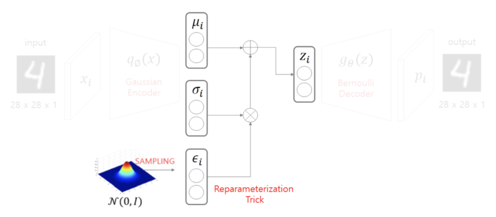

# 02/11

### 할 일

* DL Basic
  * 심화과제 - Adversarial Autoencoder
* 논문 리뷰 - Vision Transformer

### 피어세션

### 공부한 내용

#### 논문 리뷰

* Transformer는 계산 효율성과 확장성 덕분에 매우 큰 데이터에 대한 학습도 가능하다.
* 충분하지 않은 양에 대해서는 기본 모델들보다 학습이 잘 되지 않는다.
* cls token - BERT에서 제안.
  * classification을 token을 사용.
  * 사전 학습 시킴.

#### 심화과제 - AAE

* AAE = VEA + GAN
* AAE의 구성
  * Encoder (Generatoro in GAN)
  * Decoder
  * Discriminator
* AAE vs VEA
  * VEA는 isotropic Gaussian 분포만 사용할 수 있다.
  * 분포를 몰라도 잘 학습할 수 있게 하고 싶음.
  * GAN을 사용하여 분포를 몰라도 학습할 수 있게 함.

* conditional AAE : label이 있는 상태에서 학습.

* reparametrization

  * VAE에서 나온 평균과 표준편차로 zi를 sampling 해야 함.
  * 그냥 평균과 표준편차를 모두 사용하여 하면, 역전파를 계산할 수 없다. (?)
  * εi를 표준정규분포에서 샘플링한 후, 평균과 표준편차를 사용해 zi 계산.

  

* 
