# 02/14

### 할 일

* Data Visualization
  * 6-1강 Interactive Visualization
  * 6-2강 Interactive Visualization 실습
  * 7-1강 Custom Matplotlib Theme
  * 7-2강 Image & Text Visualization


### 피어세션


### 공부한 내용

#### Interactive Visualization

##### Interactive를 사용하는 이유

* 예시 : 정형 데이터에 feature가 10개가 있을 때,

  * 각 feature를 살펴보기 위해 10개 plot
  * feature 간의 관계를 알아보기 위해 45개 plot.

  → 많은 plot이 필요.

  → **공간 낭비**

* 사용자가 interaction을 통해 각자의 인사이트에 맞는 정보를 얻을 수 있다.


* 종류
  * select
  * explore
  * reconfigure
  * encode
  * abstract
  * filter
  * connect


##### Interactive Viz Library

* Matplotlib
  * jupyter notebook이나 local에서만 실행 가능.
  * `mpld3`를 사용하면 웹에서 D3-based Viewer 제공.
* Plotly
  * 가장 많이 사용됨.
  * R, JS에서도 제공.
  * 예시와 문서가 잘 제공됨.
  * 통계, 지리, 3D, 금융 등 다양한 시각화 기능 제공.
  * JS 시각화 라이브러리 D3js를 기반으로 만들어져서 웹에서 사용 가능.
  * 기본 color가 형광색.
* Plotly Express
  * Plotly를 seaborn과 유사한 문법으로 만들어 쉽다.
  * 커스텀 부분이 부족.
  * 다양한 함수 제공.
  * 3D, animation 제공.
* Bokeh
  * Matplotlib와 문법 유사.
  * 기본 테마가 Plotly에 비해 깔끔.
  * 문서화 부족.
* Altair
  * D3 기반. Vega 라이브러리를 사용.
  * 문법이 Pythonic하지 않음.
  * 데이터 크기에 5000개 제한.
  * Bar, Line, Scatter, Histogram에 특화.


##### 실습

> https://plotly.com/python-api-reference/plotly.express.html

`import plotly.express as px`

* `px.scatter(df,)`

  * `x`, `y` : column name, 필수

  * `size` : column name

  * `color` : column name

  * `range_x`, `range_y` : 보여줄 축의 범위. `[start, end]`

  * `marginal_x`, `marginal_y` : 각 축의 분포 plot, (box, viloin 등)

  * `hover_data` : 마우스 호버링 시 보여줄 데이터를 지정. (col name list)

  * `hover_name` : 호버링 시 보여지는 데이터의 제목. (col name)

    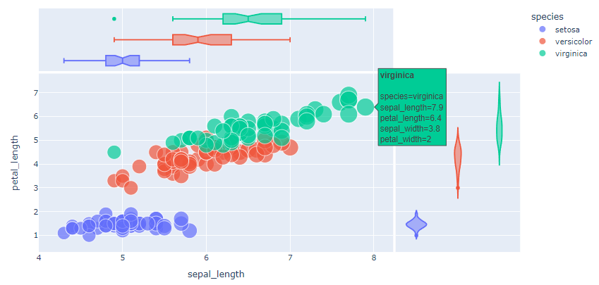

  * 범례를 클릭하여 원하는 데이터 on/off 가능.

  * `trendline` : 회귀선 추가.

  * `fecet_col`, `fecet_row` : col name, 주어진 데이터를 기준으로 행, 열을 나누어 plot

    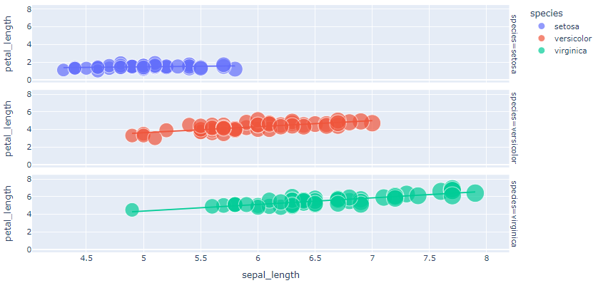

* 다양한 interactive 기능 제공.

  * zoom in/out
  * pan (panning)
  * select
  * auto scale

* `px.line(df,)`

  * `x`, `y` : column name, 필수.

* `px.bar(df,)`

  * `x`, `y` : column name, 필수.
  * groupby 등이 필요 없음.
  * `barmode` : 기본은 stacked bar chart. ()
  * y축을 여러 column을 지정해 stacked bar를 그릴 수 있음.

* interaction이 필요한가를 잘 고려하여 사용.


* `px.sunburst(df, )`

  * `path` : 계층 순서대로 col name.
  * `value` : col name, 차트 표현의 기준이 되는 값.

  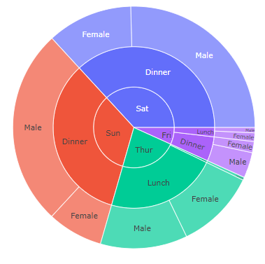

* `px.treemap(df, )`

  * `path`
  * `value`

  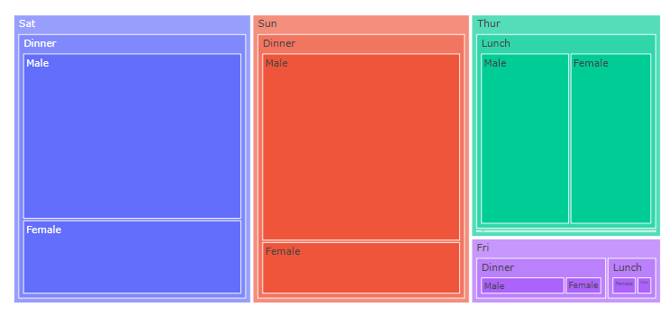

* `px.scatter_3d(df, )`

  * `x`, `y`, `z`
  * `symbol`
  * `color`

  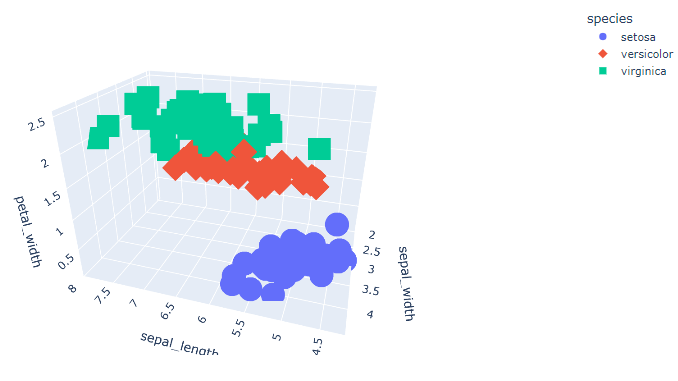

* `px.parallel_coordinates(df, )`

  * 다차원 데이터 시각화.
  * 데이터 흐름, 패턴 등을 볼 때 유용.
  * 연속형 데이터.

  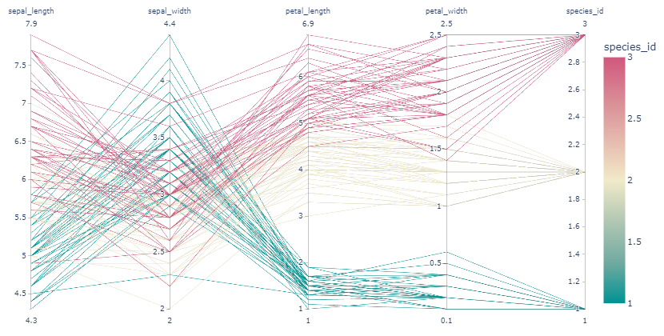

* `px.parallel_categories(df, )`

  * 범주형 데이터

  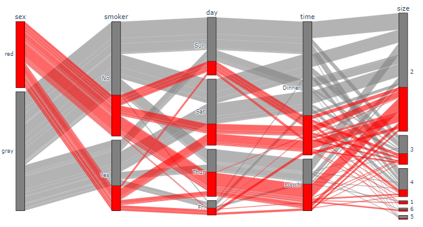

* `px.scatter_geo(df, )`

  * 지리 데이터.
  * `locations`
  * `color`
  * `size`
  * `animation_frame` : 어떤 데이터 흐름으로 애니메이션을 표현할 것인지.
  * `projection`

  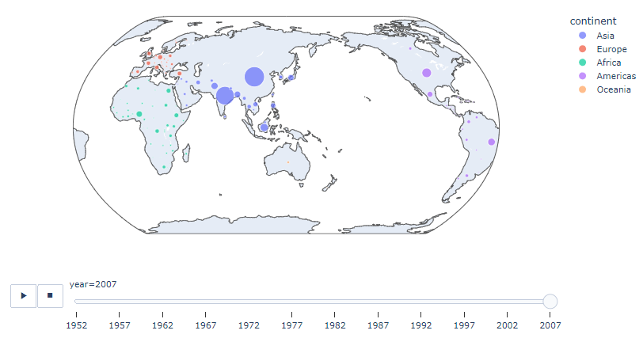

* ` px.choropleth(df, )`

  * `locations`
  * `color`
  * `projection`

  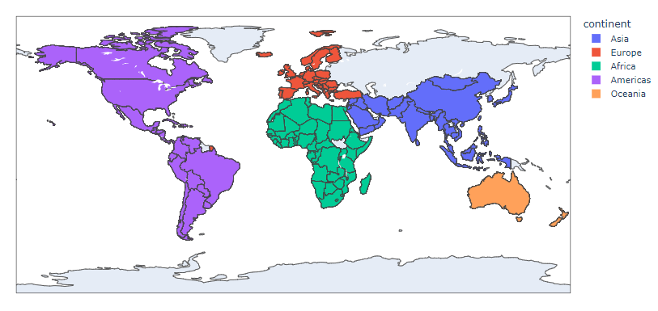


`import plotly.graph_objects as go`

> https://plotly.com/python-api-reference/plotly.graph_objects.html


---


#### Custom Matplotlib Theme

##### 색의 선정

> [apple color palette](https://developer.apple.com/design/human-interface-guidelines/ios/visual-design/color)

* cyler : 순환 자료 구조.

* `sns.palplot()` : palette 보기. max가 1인 ndarray.

* light palette

  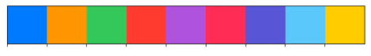

* dark palette

  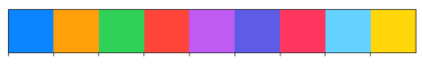

  

* cmap 수정 : `mpl.rcParams['axes.prop_cycle'] = cycler('color',palette)`


* figure 배경색 : `mpl.rcParams['figure.facecolor']`
* figure 테두리 색 : `mpl.rcParams['figure.edgecolor']`
* ax 배경색 : `mpl.rcParams['axes.facecolor']`


* 글자들
  * `text_color`
  * `axes.labelcolor`
  * `axes.edgecolor`
  * `xtick.color`
  * `ytick.color`


* 해상도 : `figure.api`, 기본 150


* 테두리 일부 표시 여부
  * `mpl.rcParams['axes.spines.top'] = bool`
  * `top`, `bottom`, `left`, `right`


---


#### Image & Text Visualization Techniques

* 비정형 데이터셋의 시각화
  * dataset meta data visualization
    * target distribution
  * dataset listup
    * 어떤 데이터가 있는 지 일부를 봄.
    * dataset-target 관계.
  * visual analytics
    * dimension reduction(pca, lda, tsne, umap)
    * vector로 나타낸 데이터 간의 관계.
    * 전처리 필요.
    * 데이터 간의 관계 네트워크.
  * train/inference visualizaion
    * loss graph
    * 훈련과정 확인.
    * result
      * ex) 분류문제 : confusion matrix
      * ex) 생성모델 : 생성 결과 listup
  * etc
    * XAI
      * using torch : https://captum.ai/
      * saliency map (heatmap visualization)
    * node-link diagram (network visualization)


##### Image Dataset Visualization

* 이미지 나열

  > Facet : https://pair-code.github.io/facets/

  * `ax.imshow`, `sns.heatmap`, `px.imshow`

* patch

  ```python
  import matplotlib.patches as patches
  
  rect = patches.Rectangle((x, y), dx, dy)
  ax.add_patch(rect)
  ```

  * `fig.add_trace` : 여러 그래프를 겹쳐 그릴 때 사용.

* Dimension Reduction

  * 일반적으로 cluster가 이루어지는 지 체크함.

  ```python
  from umap import UMAP
  
  umap = UMAP(random_state=0)
  data_dr = umap.fit_transform(data, target)
  ```

  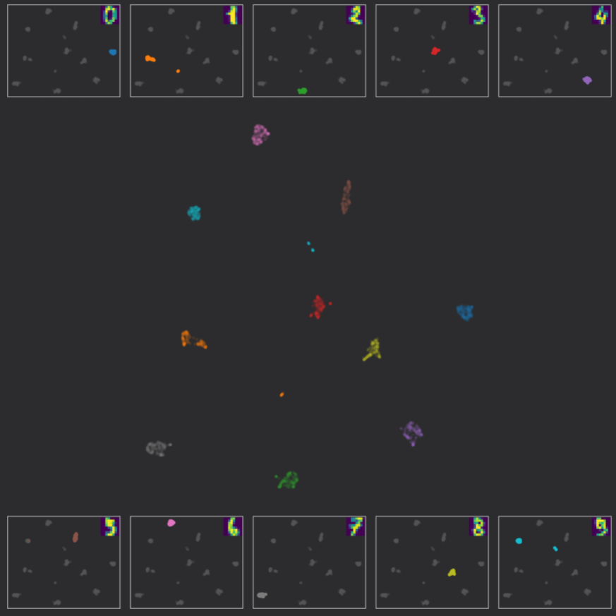

​	

##### Text Dataset Visualization

* console output text에 색 입히기 (highlight)

  ```python
  from termcolor import colored
  
  print(colored('hello', 'red'), colored('world', 'green'))
  ```

  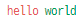

* IPython의 HTML 활용

  ```python
  from IPython.core.display import HTML
  
  HTML("<span style='color:red'>hello</span> <span style='background-color:yellow'>world</span>")
  ```

  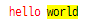


##### Further Reading

- Distill.pub : https://distill.pub/
- Poloclub : https://poloclub.github.io/
- Google Pair : https://pair.withgoogle.com/
- Open AI Blog : https://openai.com/blog/
- Observable : https://observablehq.com/
- https://textvis.lnu.se/
- https://visimages.github.io/visimages-explorer/