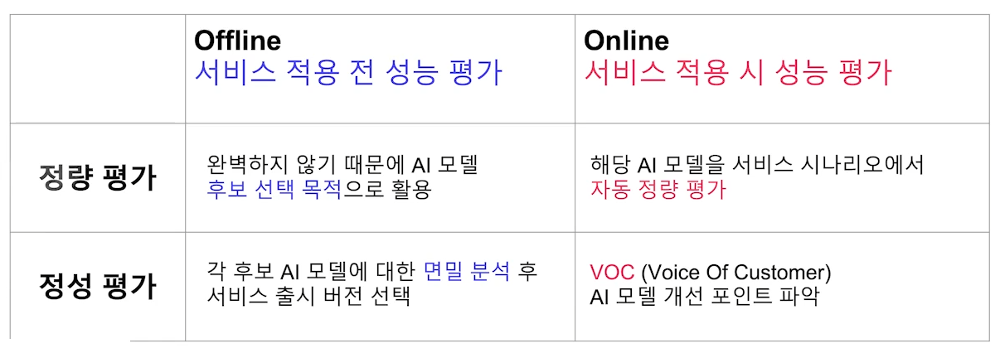
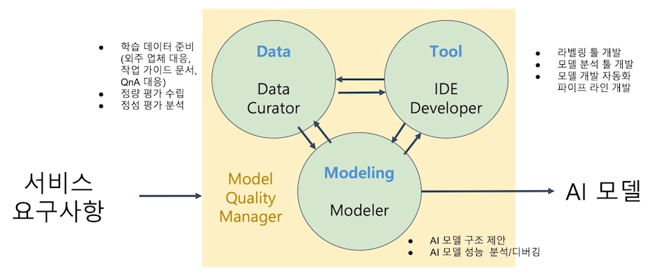
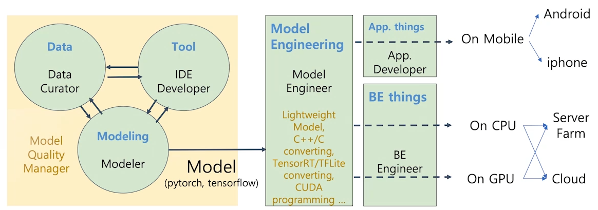

# 02/15

### 할 일

* AI 서비스 개발 개론
  * 2강 머신러닝 프로젝트 라이프 사이클
* AI 현업자 특강
  * 1강 서비스 향 AI 모델 개발하기

### 피어세션

### 공부한 내용

#### 머신러닝 프로젝트 라이프 사이클

##### 머신러닝 프로젝트 Flow

* 문제 정의의 중요성
  * 특정 현상을 파악하고, 그 현상에 있는 문제 정의.
  * 문제가 명확하지 않으면, 이후 무엇을 해야할 지 결정하기 어려워짐.
  * 문제를 충분히 정의하고 고민.

###### 1. 현상 파악

###### 2. 구체적인 문제 정의

- 무엇을 해결하고 싶은가, 무엇을 알고 싶은가.
- 인터뷰 등을 통해 어떤 어려움인 지 구체적으로 파악.
- 원인과 해결 방안 선정.
- 문제를 쪼개서 파악.
- 데이터로 해결할 수 있는 방법.
- 점진적 실행.

###### 3. 프로젝트 설계

- 설계를 구체적으로 해야 시간 낭비를 최대한 줄일 수 있다.
- 머신러닝 문제 **타당성** 확인.
  - 비즈니스 가치 고려.
  - 필요한 데이터 종류, 기존 모델이 있는지 살펴보기.
  - 머신러닝 솔루션이 최적이 아닐 수 있음.
  - 머신러닝을 사용하면 좋은 경우
    * 학습할 수 있는 패턴이 있는가.
    * 목적 함수를 만들 수 있는가.
    * 복잡한 패턴.
    * 데이터 존재 여부.
    * 반복적으로 실행.
  - 좋지 않은 경우
    - 비윤리적 문제.
    - 간단히 해결 가능.
    - 데이터 수집이 어려움.
    - 적은 예측 오류가 치명적인 경우.
    - 모든 결정이 설명 가능해야할 경우.
    - 비효율적.
- **목표, 지표** 설정.
  - Goal : 프로젝트의 큰 목적.
  - Objectives : 세부 단계 목표. 구체적.
  - 데이터를 확인하여 목표 설정.
  - 목적 함수가 여러 개인 경우.
    1. 여러 목적함수를 결합한 단일 모델.
    2. 여러 모델을 만들어 연결. - 더 쉽고, 선호됨.
- **제약 조건 (Constraint & Risk)**
  - 시간, 예산, 영향을 받는 사람, 개인정보 보호, 기존 환경, 윤리 등.
  - 성능.
    - baseline
    - threshold
    - performance trade-off
    - 해석 가능 여부
    - confidence measurement
- **베이스라인**
  - 모델이 더 좋아졌다 판단할 수 있는 베이스라인 필요.
  - 간단한 모델부터 시작.
    - 모델의 위험을 낮추는 것이 목표가 되어야 함.
    - 최악의 성능을 알기 위해 허수아비 모델로 시작.
  - 유사한 문제의 논문 파악.
- **프로토타입**
  - 간단한 모델을 만들어 피드백을 받음.
  - 프로토타입을 만들어 제공.
- **Metric Evaluation**
  - 모델의 성능.
  - 비즈니스 목표의 지표도 잘 정의해야 함. (고객의 재방문율, 매출 등)
  - 만든 모델이 비즈니스에 어떤 영향을 미쳤을 지 고려.
  - 대부분 기업은 이익 극대화를 목표.
  - 배포 후에도 필요한 지표를 잘 설정해야 함.

###### 4. Action

* 모델 개발 후 배포 & 모니터링.
* 앞서 정의한 지표가 어떻게 변하는 지.

###### 5. 추가 원인 분석

* 새롭게 발견한 상황을 파악해 문제 해결 방식 모색.

##### 비즈니스 모델

* 비즈니스 모델에서 어떤 데이터가 존재하고, 어떤 것을 할 수 있을 지 고려.
* 회사가 어떤 서비스, 가치를 제공하는가.

---

#### 서비스 향 AI 모델 개발하기

* 연구 관점 AI 개발 - 정해진 데이터셋/평가 방식에서 모델 개선.

* 서비스 관점 AI 개발 - 서비스 요구사항만 존재.

* 학습 데이터셋을 정하고 구해야 함. (종류, 수량 등)

  * 각 모델 별로 데이터 입출력 정의가 필요.
  * 데이터셋에 모델 설계 정보 필요.

* 테스트 데이터셋 준비. - 테스트 방법에 대해 고려.

  

* 모델 요구사항

  * 처리 시간
  * 정확도
  * QPS (Queries Per Second) : 초당 처리 가능한 요청 수.
    * 장비를 늘림.
    * 처리 시간을 줄임.
    * 모델 크기를 줄임.
  * Serving 방식
  * 장비 사양

##### 조직 구성

