# 02/16

### 할 일

* AI 서비스 개발 개론
  * 3강 Linux & Shell Command
* AI 현업자 특강
  * 2강 내가 만든 AI 모델은 합법일까, 불법일까
  * 3강 AI Ethics

### 피어세션

### 공부한 내용

#### Linux & Shell Command

##### Linux

* Linux
  * 서버에서 자주 사용하는 OS.
  * Free. 오픈소스.
  * 버전이 많다.
  * 안정성, 신뢰성.
  * 쉘 커멘드, 쉘 스크립트.
* CLI : Terminal - Command Line Interface.
* GUI : Desktop - Graphic User Interface
* 대표적인 배포판 : Debian, Ubuntu, Redhat, CentOS

##### Shell Command

* shell : 사용자가 문자를 입력해 컴퓨터에 명령할 수 있도록 하는 프로그램.
* shell의 종류 
  * sh : 최초의 쉘. 
  * bash : 리눅스 표준.
  * zsh : mac 카탈리나 os 기본 쉘.

###### 기본 쉘 커맨드

* `man` : 메뉴얼

* `mkdir` : make directory

* `ls` : list segments

  * `-a` : 전체 파일

  * `-l` : 퍼미션, 소유자, 만든 날까, 용량까지 출력.

    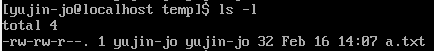

  * `-h` : 용량을 GB, MB 등으로 표현. `-l`과 같이 사용

    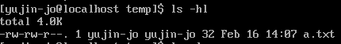

* `pwd` : print working directory

* `cd` : change directory

* `echo` 

  1. ""에 텍스트를 넣으면 터미널에 텍스트 출력.

  2. `` 안에 쉘 커멘드를 넣으면 실행 결과 출력.

     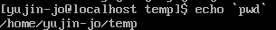

* `vi` : vim 편집기로 파일 생성.

  * vi 편집기의 모드
    * command mode
      * 기본 모드
      * i : insert mode
      * k, j, l, h : 커서를 위, 아래, 오른쪽, 왼쪽으로 이동.
      * yy : 현재 커서가 있는 줄 복사.
      * p : 커서가 있는 줄 바로 아래에 붙여넣기.
      * dd : 커서가 있는 줄 삭제.
    * insert mode
      * 파일 수정 가능.
      * esc를 누르면 command mode로 돌아감.
    * last line mode
      * esc 후 :을 누르면 나오는 모드.
      * w : 저장.
      * q : 종료.
      * wq : 저장 후 종료.

* `bash` : bash로 쉘 스크립트 실행.

  * 쉘 스크립트가 작성된 `.sh` 파일을 실행하면, 파일 내부의 스크립트가 실행된다.

  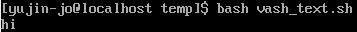

* `sudo` : 관리자 권한으로 실행.

* `cp A B` : copy

  * A를 B로 복사.
  * `-r` : 디렉토리일 경우, 하위 디렉터리와 파일들도 모두 복사.
  * `-f` : 강제 실행.

* `mv A B` : 파일, 폴더 이동. 이름 바꿀 때도 활용

  * A를 B로 이동.
  * A는 삭제됨.

* `cat (파일)` : 파일 내용 출력.

  * 파일을 여러 개 입력하면 합쳐서 출력.
  * `> (파일)` : 파일에 overwrite.
  * `>> (파일)` : 파일에 내용 추가 (append).

* `clear` : 터미널 창 깨끗하게.

* `history` : 최근에 입력한 쉘 커맨드들 출력.

  * `!(번호)` : 같은 커맨드를 다시 사용할 수 있음.

  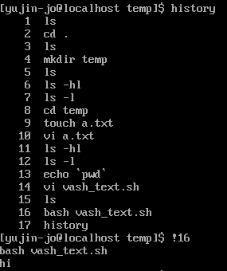

* `find` : 파일 및 디렉토리 검색.

* `export` : 환경변수 설정.

  * 터미널이 꺼지면 사라짐.
  * 계속 저장하고 싶으면, .bashrc 또는 .zshrc에 저장.
  * `vi ~/.bashrc`
  * 재로그인하지 않고 바로 적용하고 싶을 때, `source ~/.bashrc`

* `alias` : 별칭 설정.

  * 자주 쓰는 명령어의 별칭 설정.

  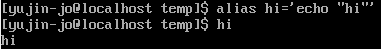

* `head` , `tail`

  * `-n (숫자)` : 파일의 앞/뒤 n 행을 읽음.
  * 지정하지 않으면 기본 10줄.

  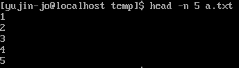

* `sort` : 행 단위 정렬.

  * `-r` : 내림차순.
  * `-n` : numeric sort.

  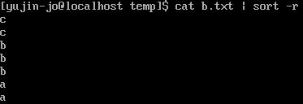

* `uniq` : 중복된 행이 연속으로 있는 경우 중복 제거.

  * sort와 함께 사용.
  * `-c` : 중복 행의 개수 출력

  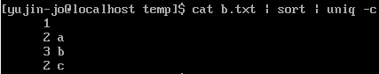

* `grep` : 파일에서 주어진 패턴과 매칭되는 라인 검색.

  * `-i` : 대소문자 구분 없이. (insensitively)
  * `-w` : 정확히 그 단어만.
  * `-v` : 특정 패턴 제외.
  * `-E` : 정규 표현식 사용.
    * `^(단어)` : 단어로 시작하는 것
    * `(단어)$` : 단어로 끝나는 것

* `cut` : 파일에서 특정 필드 추출.

  * `-f` : 잘라낼 필드 지정. (숫자로 지정.)
  * `-d` : 필드 구분하는 구분자. 기본은 `\t`

###### 표준 스트림 (stream)

* unix에서 동작하는 프로그램은 커맨드 실행 시 3개의 stream 생성
  * stdin : 0, 입력. 비밀번호, 커맨드 등.
  * stdout : 1, 출력값, 터미널에서 나오는 값.
  * stderr : 2, 디버깅 정보, 에러.

###### Redirection & Pipe

* **Redirection** : 프로그램 출력을 다른 파일이나 스트림으로 전달.
  * `>` : 덮어쓰기.
  * `>>` : 추가하기.
* **Pipe** : 출력을 다른 프로그램의 입력으로 사용.
  * `|`
  * ex) `ls | grep "vi"` : vi가 들어있는 파일을 현재 디렉토리에서 찾음.

* 연습문제

  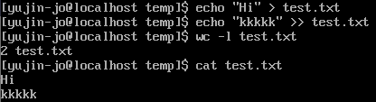

* `ps` : process status
  * `-e` : 모든 프로세스
  * `-f` : full format으로 자세히 보여줌.
* `curl` : Client URL
  * 커맨드 라인 기반의 data transfer 커맨드.
  * 웹 서버를 작성한 수 요청이 제대로 실행되는지 확인할 수 있음.
  * 비슷한 거 : `httpie` (가독성이 더 높음.)
* `df` : disk free 
  * 현재 사용 중인 디스크 용량 확인.
  * `-h` : 읽기 쉬운 형태로 출력.
* `scp` : secure copy (remote file copy program)
  * ssh를 이용해 네트워크로 연결된 호스트 사이에 파일을 주고 받음.
  * `-r` : 재귀적으로 복사.
  * `-P` : 포트 지정.
  * `-i` : ssh 설정을 활용해 실행.
  * local → remote : `scp local_path user@ip:remote_directory`
  * remote → local : `scp user@ip:remote_directory local_path`
  * remote → remote : `scp user@ip:remote_directory user2@ip2:target_remote_directory`
* `nohup` : 터미널 종료 후에도 계속 작업이 유지되도록 백그라운드 실행.
  * 파일의 permission이 755여야 함.
  * 종료
    1. `ps ef | grep app.py`로 해당 프로세스의 pid를 찾은 후,
    2. `kill -9 pid`
  * 로그는 nohup.out에 저장.
  * screen이란 도구도 있다.
* `chmod (permission) (파일)` : 파일 권한 변경.
  * Permission
    * `r` : read = 4
    * `w` : write = 2
    * `x` : execute = 1
    * ex) 755 = 7/5/5 = rwx/r-x/r-x (user / group / others)
  * ex) `chmod 755 test.txt`

###### 쉘 스크립트

* 쉘 커맨드의 조합.

* `#!/bin/bash` : 이 스크립트를 bash 쉘로 해석.

* ex

  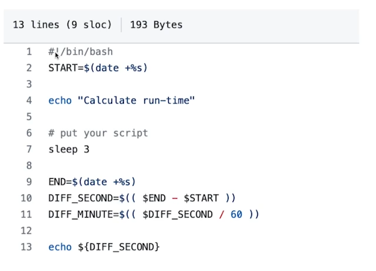

---

#### 내가 만든 AI 모델은 합법일까, 불법일까

* 합법적인 데이터 사용.
* 저작권과 라이센스.
* 저작물 : 사람의 생각이나 감정을 표현한 결과물.

##### 합법적으로 데이터 사용하기

* **저작자와 협의.**

  * 저작재산권 이용 허락 - 독점적 / 비독점적.

* **라이센스** - 저작자가 제안한 특정 조건을 만족하면 이용이 가능하도록 하는 규약.

  * **Creative Commons License (CCL)**

    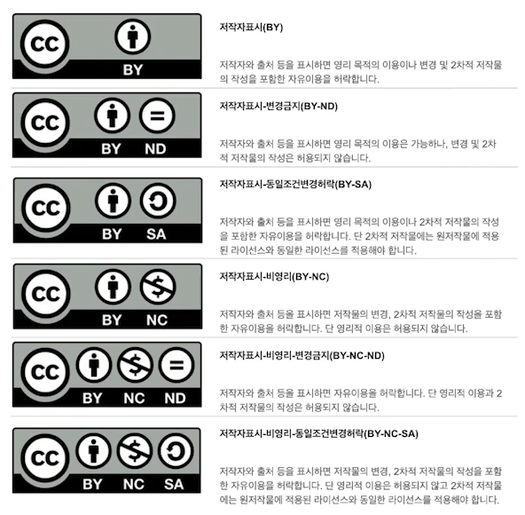

    * BY : Attribution 

      → 저작자 표시. 변경이 있는 경우 공지.

    * ND : NoDerivatives

      → 변경 금지.

    * NC : NonCommercial

      → 비영리 목적 사용 가능.

    * SA : ShareAlike

      → 동일 조건의 CCL을 적용하면, 변경하여 사용 가능.

* 뉴스 기사의 저작권은 언론사에 있음. (혹은 한국언론진흥재단.)

  * 뉴스 기사의 제목은 저작물로 가치를 인정 받지 못함.

* **공정 이용 (Fair-use)**

  * 저작권자의 허락을 받지 않고 사용할 수 있는 목적.

  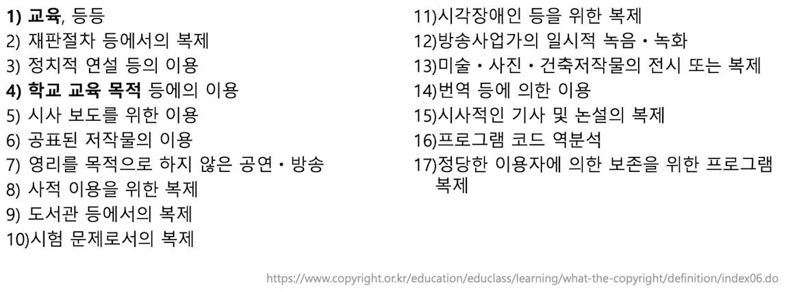

---

#### AI Ethics

>  AI의 윤리적 문제.

##### Individual

1. Bias : 편향.
   - 어디에서 나왔는지 파악이 어려움.
   - data를 준비할 때의 가지고 있는 가치.
   - 누가 수집하고 가공했냐. (빈부격차, group의 인원 수 등.)
   - 어떤 feature를 볼 것인가. (general criteria)
   - 의도하지 않은 패턴 학습 (unintentional discrimination)
2. Privacy
   * 민감한 개인정보 데이터 사용.
   * 이를 보호하기 위한 기술적 솔루션 고려.

##### Society

1. Social Inequality
   * 누구에게 이익이 될 것인가?
   * 불이익을 받는 사람들은 누구인가?
2. Misinformation
   * identity를 만들어냄.
   * identity prediction.
   * 악용되지 않도록 고려 필요.

##### Humanity

1. for Health
2. for Climate Change
   * 많은 CO2 방출. 환경에 영향.
   * energy cost.
   * 