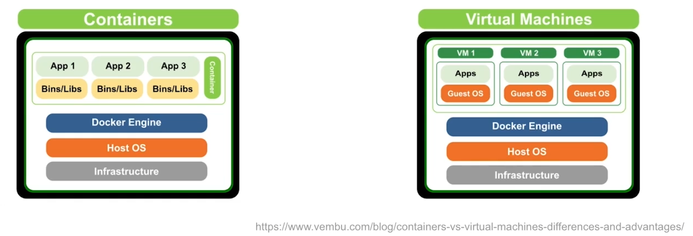
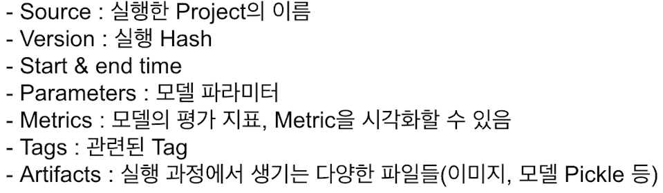
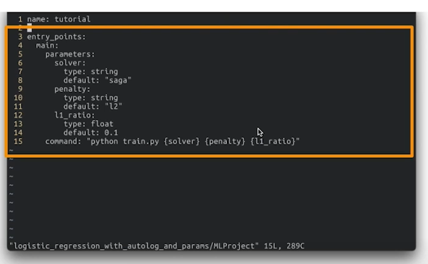
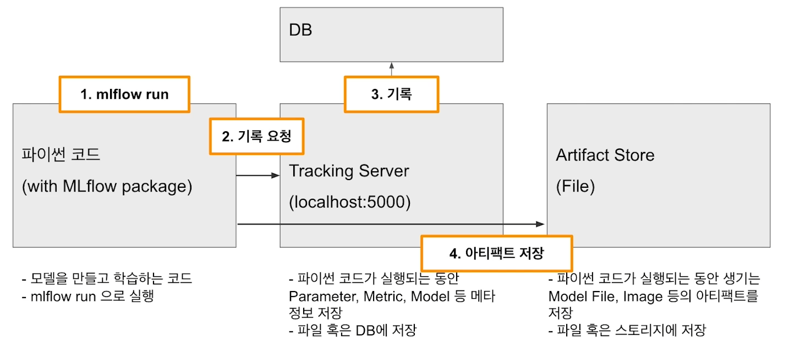

# 02/17

### 할 일

* AI 서비스 개발 개론
  * 4강 Docker
  * 5강 MLflow
* AI 현업자 특강
  * 4강 Full Stack ML Engineer


### 피어세션


### 공부한 내용

#### Docker

##### Docker 소개

###### 가상화

* 개발 환경과 배포 환경이 다른 경우. - 환경설정을 공유해서 맞춰줘야 함. - 번거롭고 실수가 많음.
* 환경 통일의 필요성.


###### Docker 등장 배경

* VM : OS 위에 OS를 하나 더 실행. - 매우 무겁다.
* Container : 좀 더 경량화 된 프로세스 개념의 가상화.




###### Docker 소개

* 컨테이너 기술을 쉽게 사용할 수 있도록 나온 도구.
* 오픈소스.
* Docker Image
  * 컨테이너를 실행할 때 사용하는 템플릿.
  * read only
  * OS, 설정을 포함한 실행 환경.
  * 다른 사람이 만든 것을 가져와서 사용 가능.
* Docker Container
  * 도커 이미지를 활용해 실행된 인스턴스.
  * write 가능.
  * 하나의 이미지로 여러 컨테이너를 만들 수 있다.
* 다른 사람이 만든 소프트웨어를 가져와서 바로 사용 가능.


###### Docker 실행하기 - 기본 명령어

* 이미지 가져오기.

  ```bash
  $ docker pull (image_name:tag)
  ```

* 가져온 이미지 보기

  ```bash
  $ docker images
  ```

* 이미지 실행.

  ```bash
  $ docker run --name (container_name) (image_name:tag)
  ```

  * `-e` : 환경변수

  * `-d` : 컨테이너를 데몬 (백그라운드) 모드로 실행. 안 하면 컨테이너를 나갈 때 종료 됨.

  * `-p` : 포트

  * `-v` : 파일 시스템 연결. `host_folder:container_folder`

  * `-i` : stdin을 부착하지 않아도 열린상태 유지.

  * `-t` : 텍스트 기반의 터미널(TTY)을 애뮬레이트 해줌.

  * ex

    

* 실행한 컨테이너 확인.

  ```bash
  $ docker ps
  ```

  * `-a` : 실행 중이 아닌 컨테이너도 보여줌.

* 컨테이너에 진입.

  ````bash
  $ docker exec -it (container_name) /bin/bash
  ````

* 컨테이너 삭제

  ```bash
  $ docker rm (container_name)
  ```

  * 실행 중이 아닌 컨테이너만 삭제 가능.
  * `-f` : 실행 중인 컨테이너도 삭제.

> docker hub images : https://hub.docker.com/search?q=&type=image


###### Docker image 만들기

* 설치한 라이브러리 모두 보기

  ```bash
  $ pip freeze
  ```

* 의존성에 따라 설치된 라이브러리는 보이지 않음.

  ```bash
  $ pip list --not-required --format=freeze
  ```

* requirements.txt 만들기

  ```bash
  $ pip freeze > requirements.txt
  ```

* `Dockerflie`

  ```dockerfile
  FROM (image_name:tag) # 베이스 이미지, 이미 만들어진 것.
  
  # local은 Dockerfile이 존재하는 곳 기준. 상대경로.
  # 컨테이너 디렉터리로 복사.
  COPY (local_dir) (container_dir)
  
  # RUN, CMD, ENTRYPOINT 등의 명령어를 실행할 컨테이너 경로
  WORKDIR (container_dir) 
  
  ENV (환경변수 이름=값)
  
  RUN (실행할 리눅스 명령어) # 보통 && \로 이어서 한 번에 실행. 더 빠름.
  
  CMD [(실행할), (명령어)] # ex) ["python", "app.py"]
  
  # 컨테이너 외부에 노출할 포트 지정
  EXPOSE 
  
  # 이미지를 컨테이너로 띄울 때 항상 실행하는 커맨드
  ENTRYPOINT
  ```


---


#### MLflow

##### MLflow 란

* 코드 공유, 모델 버저닝
* 해결하고 싶은 점
  1. 실험을 추적하기 어려움
  2. 코드 재현이 어려움.
  3. 모델 패키징 및 배포가 어려움.
  4. 모델을 관리하기 위한 중앙 저장소 부재.
* 머신러닝 실험, 배포를 쉽게 할 수 있는 오픈소스.
* CLI, GUI 지원.


###### 핵심 기능

1. Experiment Management & Tracking
   1. 실험들을 관리, 기록.
   2. 여러 사람이 하나의 MLflow 서버 위에 각자 자기 실험을 만들고 공유 가능.
   3. 코드, 파라미터, metric, 부산물 등을 저장.
2. Model Registry
   1. MLflow로 실행한 모델을 model registry에 등록할 수 있음.
   2. 저장될 때마다 버전이 자동으로 올라감.
3. Model Serving
   1. 등록한 모델을 REST API 형태의 서버로 serving 가능.
   2. 모델의 input, output.
   3. 직접 도커 이미지를 만들지 않아도 생성 가능.


###### Component

1. MLflow Tracking
   1. 코드 실행, 로깅을 위한 API, UI.
   2. 여러 실행과 비교 가능.
2. MLflow Project
   1. ML 프로젝트 코드를 패키징하기 위한 표준.
   2. MLflow Tracking API를 사용하면 프로젝트 버전을 모든 파라미터와 자동으로 로깅.
3. MLflow Model
   1. 모델 파일과 코드로 저장.
   2. 다양한 플랫폼에 배포할 수 있는 여러 도구 제공.
4. MLflow Registry
   1. 전체 라이프 사이클에서 사용할 수 있는 중앙 모델 저장소.


##### MLflow 사용하기

* 설치

  ```bash
  $ pip install mlflow
  ```

* Experiment 

  * 하나의 프로젝트 단위.
  * 정해진 metric으로 모델 평가.
  * 여러 번 run 가능.
  * 생성

  ```bash
  $ mlflow experiments create --experiment-name (experiment_name)
  ```

  * 리스트 확인

  ```bash
  $ mlflow experiments list
  ```

* Project

  * 프로젝트 메타 정보 저장.
  * 어떤 환경에서 실행 시킬 지 정의.
  * 패키지 모듈의 상단에 위치.

* Run

  * 하나의 run은 코드를 1번 실행.

  * 로깅하는 것들.

    

  ```bash
  $ mlflow run
  ```

  

* UI 실행

  ```bash
  $ mlflow ui
  ```


###### MLflow autolog

* `mlflow.sklearn.autolog()`

* run 할 때 생기는 로그를 자동으로 저장.

* 모든 프레임워크에 사용 가능한 것은 아님. 

  >  https://mlflow.org/docs/latest/tracking.html#id2


###### MLflow Parameter




##### MLflow 서버로 배포하기

###### MLflow Architecture




---


#### Full Stack ML Engineer

* ML service

  

* Edge device service

  

* Data annotator

  


##### Full stack ML 엔지니어의 장점

* 빠른 프로토타이핑
* 기술간 시너지
  * 결국은 하나의 서비스로 연결되어야 함.
* 팀플레이
  * 갈등이 생길 법한 부분의 이해.
  * 잠재적 위험에 대한 고려.
* 성장의 다각화


##### ML Product

1. 요구사항 전달
   1. 미팅(B2B) or 기획(B2C).
   2. 요구, 제약 정리.
   3. ML이 풀 수 있는 문제로 회귀.
2. 데이터 수집 
   1. raw 데이터 수집.
   2. annotation tool 기획, 개발.
      - 데이터에 대한 정답 입력.
      - 모델 input/output 고려.
   3. annotation guide 작성, 운용.
      - 사람마다 기준이 다르지 않게 명확한 가이드 작성.
3. 모델 개발 
   1. 기존 연구 research, 내재화.
      - 논문 찾기
      - 적절한 모델 재현, 내재화.
   2. 실 데이터 적용 실험, 평가 피드백.
      - 수집된 데이터 적용.
      - 평가 및 모델 수정.
   3. 모델 차원 경량화 작업.
      - 모델 경량화
      - distillation
      - network surgery
4. 배포
   1. 엔지니어링 경량화 작업.
   2. 연구용 코드 수정 작업.
      - 서비스에 불필요한 코드 등 정리.
   3. 모델 버전 관리 및 배포 자동화.


---


#### AI 시대의 커리어 빌딩

