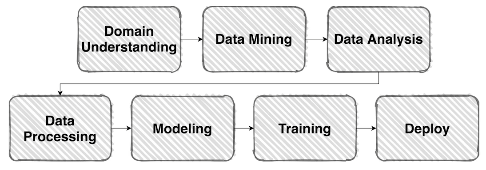

# 02/21

### 할 일

* 1강 Competition with AI stages
* 2강 Image Classification & EDA
* 3강 Dataset
* 4강 Data Generation

### 피어세션

### 공부한 내용

#### Competition with AI stages

##### simple ML flow

---

#### Image Classification & EDA

##### EDA (Exploratory Data Analysis)

* 데이터를 이해하기 위한 노력.
* 문제가 다르면 데이터를 보는 방식도 달라진다. (분석 결과, 입력, 전처리 등)
* 다양한 도구가 있으므로, 할 수 있는 방법부터 시도해보자.
* 