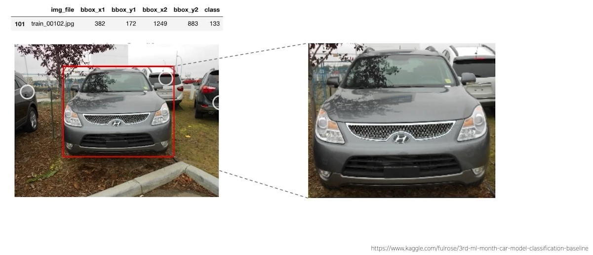
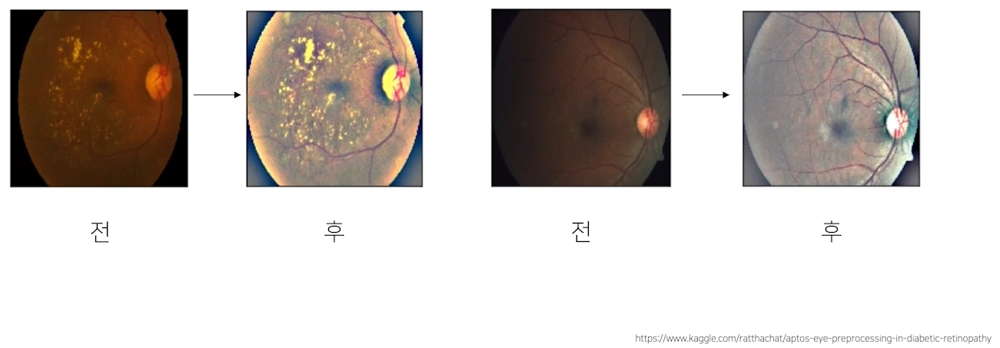
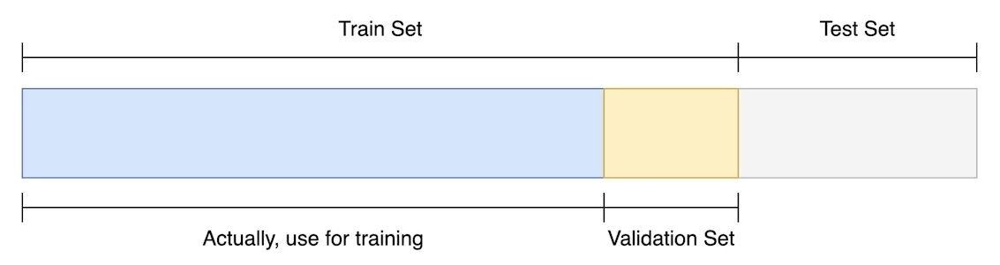
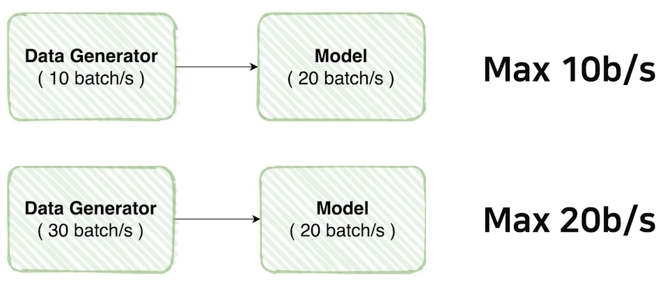
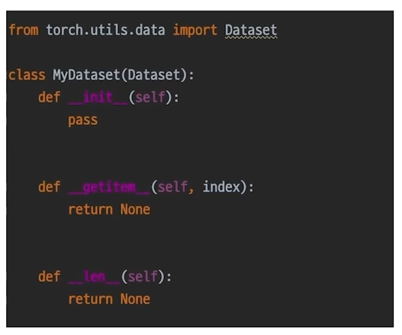

# 02/21

### 할 일

* 1강 Competition with AI stages
* 2강 Image Classification & EDA
* 3강 Dataset
* 4강 Data Generation

### 피어세션

* 대회 서버 세팅.
  * vs code로 ssh 접속.

### 공부한 내용

#### Competition with AI stages

##### simple ML flow

---

#### Image Classification & EDA

##### EDA (Exploratory Data Analysis)

* 데이터를 이해하기 위한 노력.
* 문제가 다르면 데이터를 보는 방식도 달라진다. (분석 결과, 입력, 전처리 등)
* 다양한 도구가 있으므로, 할 수 있는 방법부터 시도해보자.

---

#### Dataset

* 주어진 raw data를 ***모델에 적용하기 위한*** dataset으로 변환.

##### Pre-processing (전처리)

* 생각보다 시간이 오래 걸리고 비중이 큼.

1. 필요 이상의 데이터가 있는 경우. - 필요한 부분만 잘라냄.

2. 계산 효율을 위해 크기 변경, 통일.

3. 밝기, 선명도, 대비 등 조절.

   

4. 도메인, 데이터에 따라 다양한 전처리 방법 존재.

##### Generalization

* Bias & Variance

* Train / Validation

  * validation set을 사용하는 이유 : 학습 검증.

  

* Data Augmentation

  * 주어진 데이터가 가질 수 있는 경우, 상태의 다양성을 고려하는 모델 필요.
  * 다양한 **노이즈** 고려.
  * 노이즈를 첨가한 데이터 제작. - 다양한 상태에 대응할 수 있는 모델 학습.
  * 문제의 배경, 쓰임새를 고려하면 어떤 상태가 있을 수 있는 지 생각해볼 수 있다.

* Transforms

  * crop, flip 등, 종류가 많음.
  * 무작정 시도하지 말고, 모델을 실사용함에 있어 있을 수 있는 경우인 지를 생각해보는 것이 중요.

* Albumentations - 라이브러리

* 정의한 문제를 잘 고려하여 기법 적용.

---

#### Data Generation

* 모델이 잘 학습할 수 있는 효율적인 dataset을 뽑아냄.

##### Data Feeding

* 대상의 상태를 고려하여 적정한 양을 줌.

* data feeding의 양과 모델이 처리할 수 있는 양을 잘 고려.

  * feeding 양이 모델 처리량에 비해 적으면 학습 속도가 저하.
  * feeding 양이 많아도 모델 처리량이 적으면 속도가 느림.

  

* transform 순서에 따라서도 처리 속도가 달라질 수 있다. - 계산량 고려.

##### torch.utils.data

* Dataset 구조

  

* DataLoader

  * Dataset을 효율적으로 사용할 수 있도록 관리하는 기능.
  * batch_size, num_workers, drop_last 등의 파라미터.