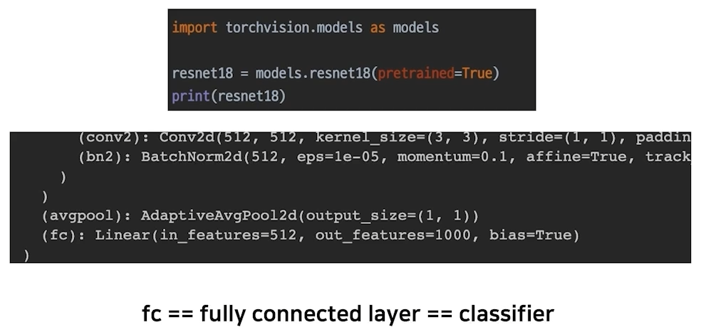
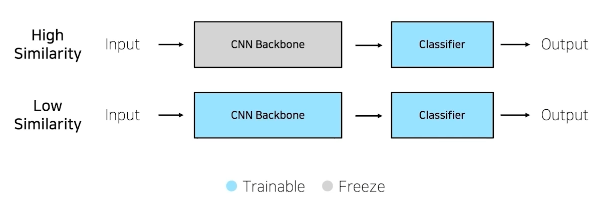
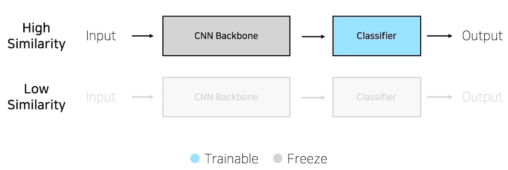
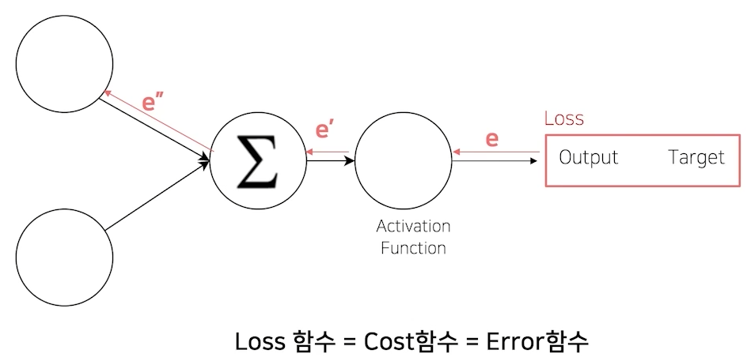
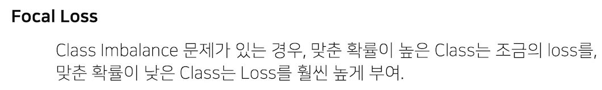
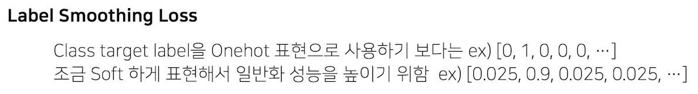
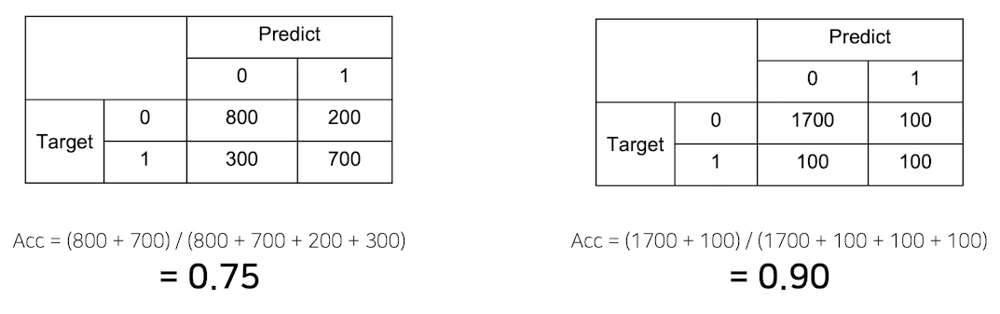

# 02/22

### 할 일

* 5강 Model 1
* 6강 Model 2
* 7강 Training & Inference 1
* 8강 Training & Inference 2

### 피어세션

* static method와 class method.

  > https://wikidocs.net/21054
  >
  > https://wikidocs.net/16074

### 공부한 내용

#### Model

> [Torchvisions Models](https://pytorch.org/vision/stable/models.html)

* 원하는 입력, 출력을 가지도록 하는 시스템.

##### Design Model with Pytorch

* Pytorch 특징 : Low-level, Pythonic, Flexibility.
* 모든 nn.Module은 child modules를 가질 수 있다. (`.modules()`)
* 각 모델 파라미터들은 data, grad, requires_grad 등을 가짐.
* `.state_dict()` or `.parameters()` : 파라미터를 볼 수 있음.

* ImageNet : 좋은 데이터셋. → CV 분야 발전에 기여.

##### Pretrained Model

* 미리 학습된 모델을 사용하여 목적에 맞게 다듬어 사용. - 시간 절약, 효율적.
* `torchvision.models` : 다양한 기존 모델을 모아놓음.
* `pretrained=True`
* transfer learning

##### Transfer Learning

* torchvision models의 구조

  

* pretraining 할 때 설정했던 문제와 현재 문제와의 유사성 고려.

  * 기존 모델을 어떻게 다듬을 지 생각.

* **case 1. 학습 데이터 충분.**

  

  * 유사한 문제라면 굳이 backbone을 학습할 필요가 없다.
  * 유사하지 않은 문제라도 pretrained model을 사용해서 학습하면, no-base보다 빠르게 학습한다.

* **case 2. 학습 데이터가 충분하지 않음.**

  

  * 유사도가 낮은 경우는 제대로 학습되지 않을 가능성이 매우 높다.

---

#### Training & Inference

##### Loss

* `creterion(output, labels)` : 기존에 정의한 loss 함수.

* loss도 nn.Module을 상속 받는다. → forward 사용 가능.

* 특별한 loss

  

  * 클래스가 다양하고 데이터가 언밸런스 할 때

  

  * 하나의 카테고리를 딱 정하기보단, 유사한 feature들이 있는 지 확인하기 위함.

##### Optimizer

* LR scheduler
  * learning rate가 고정적일 경우 최저점을 찾을 수 없을 수도 있다.
  * learning rate의 값을 조절해줌.
  * `StepLR` : step 별로 lr값을 점점 줄여나감.
  * `CosineAnnealingLR` : cos함수 형태로 급격하게 변경. 
  * `ReduceLROnPlateau` : 성능 향상이 없을 때, lr 감소. 안정적으로 학습.

##### Metric

* 학습에 직접 영향을 미치 지는 않음.
* 모델을 평가하는 객관적 지표.

* 종류
  * Classification : Accuracy, F1-score, precision, recall, ROC-AUC
  * Regression : MAE, MSE
  * Ranking : MRR, NDCG, MAP

* 적절한 metric 선택 중요.

  

  * 다음 경우에서 accuracy는 후자가 높지만 좋은 예측모델이라고는 할 수 없다.

* 데이터의 상태에 따라 적절히 선택.

  * accuracy : class 별로 밸런스가 적절히 분포.
  * F1-score : class 별 밸런스가 좋지 않을 경우.

##### Training Process

* `model.train(mode=True)` : 학습 모드로 셋팅.
* `optimizer.zero_grad()` 
  * 이전 batch의 값들을 갖고 있으므로, 초기화 필요.
  * 안 하면 각 batch의 loss가 계속 더해짐.
* loss의 역할 : grad 업데이트.
* optimizer : 업데이트 된 grad 적용.
* `optimizer.step()` : 파라미터  적용.
* gradient accumulation

##### Inference Process

* `model.eval()` : 평가 모드로 셋팅.
* `torch.no_grad()` : 평가 모드에서 파라미터들이 업데이트 되지 않도록.
