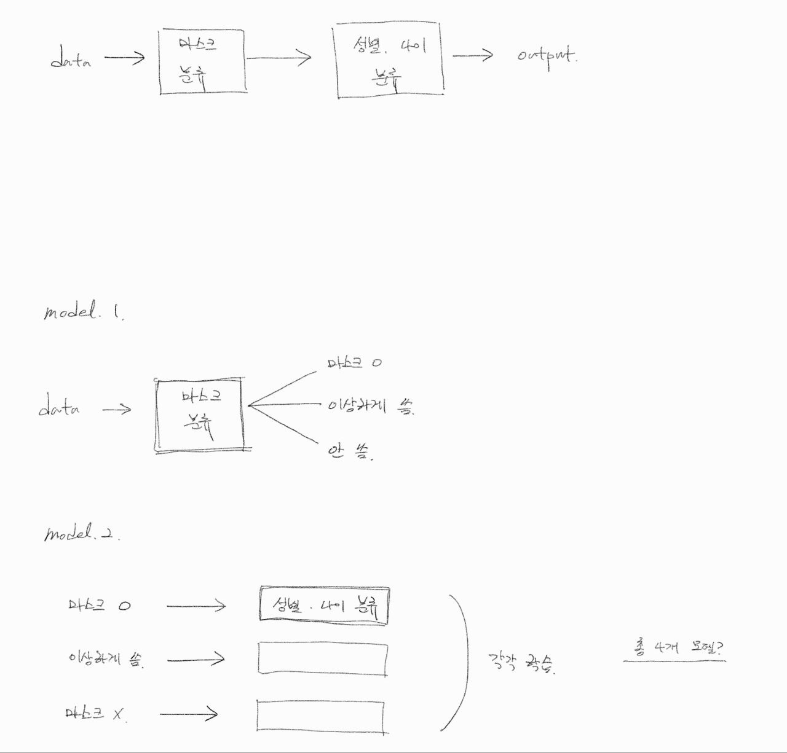
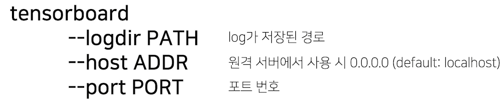

# 02/23

### 할 일

* 9강 Ensemble
* 10강 Experiment Toolkits & Tips


### 피어세션

* model

  

* undersampling과 oversampling.

* 얼굴 부분을 추출하는 모델을 처음에 추가하는 것은 어떤가.

  > https://stages.ai/competitions/104/discussion/talk/post/1116

  * 다음과 같이 배경이나 옷이 학습에 미치는 영향이 생각보다 크다.


#### git branch

* 각자 branch를 만들고, 개인 폴더를 하나씩 만들어 작업.


### 공부한 내용

#### Ensemble

* Model Averaging (Voting)

  

  * 두 방식의 최종 결과가 다를 수도 있다.

* Cross Validation

  

* Stratified K-flod Cross Validation

  

  * 일반적으로 K >= 5 정도.
  * K가 작으면 train에 사용되는 데이터 수가 적고, 많으면 학습해야하는 모델이 너무 많아진다.
  * 분할 시에 class 분포도 고려.

* TTA (Test Time Augmentation)

  * 테스트 데이터를 augmentation 후 모델 추론.
  * 출력된 결과를 앙상블.

  


* 성능과 효율 trade-off.
* 효과는 있지만 학습, 추론 시간이 많이 소모됨.


##### Hyperparameter Optimization

* 시간 대비 효과가 썩 좋지는 않다.
* `optuna` : 라이브러리.


---


#### Experiment Toolkits & Tips

##### Training Visualization

###### Tensorboard

* 사용법

  

  ```bash
  $ tensorboard --logdir PATH --host ADDR --port PORT
  ```


###### Weight and Bias (wandb)

* 사용법 - 첫 1회만 로그인하면 됨. (key 필요)


##### Machine Learnig Project

###### jupyter notebook

* EDA 할 때 간편하다.
* 도중에 노트북이 꺼지면 문제가 생김. - 불안정.


###### Python IDLE

* 간편한 코드 재사용.
* 디버깅.
* 자유로운 실험 핸들링.
