# 03/07

### 할 일

* 1강 Image Classification 1
* 2강 Annotation Data Efficient Learning
* 3강 Image Classification 2

### 피어세션

* 

### 공부한 내용

#### Image Classification 1

* AI란? : 사람의 지능을 컴퓨터 시스템으로 구현.
  * 다양한 입력과 출력.
  * 인지, 지각 능력. 오감, 사회성 등.

* Visual perception & intelligence → 입력 : 이미지 or 비디오.

* Visual perception 종류

  * color perception
  * motion perception
  * 3D perception
  * semantic-level perception
  * social perception (emotion perception)
  * visuomotor perception

* 사람의 시각 능력에 대한 이해

* 딥러닝의 발전

  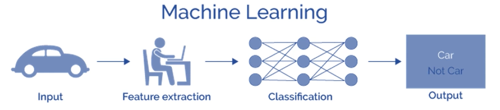

  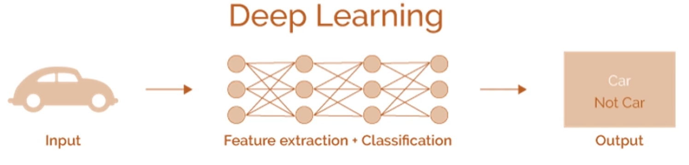

  * 사람이 직접하던 feature extraction 과정이 자동화.

* K nearest neighbors 

  * 입력 데이터에 대해 가장 가까운 K개의 기존 데이터를 보고 결과를 예측.
  * 검색 문제.

* fully connected layer

  * 과적합 문제.
  * 학습 데이터와 다른 데이터에 대한 예측이 어려움.

* CNN

  * locally connected.
  * 많은 CV task의 backbone network로 사용됨.

##### Image classification을 위한 CNN 구조

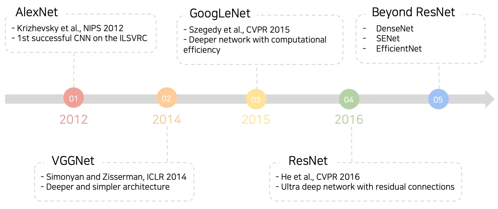

* LeNet-5 (1998)
  * conv. layer 2개와 FC layer 2개로 이루어진 간단한 CNN 구조.
* AlexNet (2012)
  * 7개 히든 레이어.
  * conv. layer 5개, FC layer 3개. 
  * ReLU 사용.
  * LRN (Local Response Normalization) (??)
  * 11x11 conv. filter
  * receptive field : 원본 레이어 사이즈. 얼마만큼의 데이터가 고려되었는가.
* VGGNet (2015)
  * 16 혹은 19 레이어.
  * 3x3 conv. filter.
  * 2x2 max pooling.
  * 더 적은 parameters.
  * 3개의 FC layer.

---

#### Annotation Data Efficient Learning

##### Data Augmentation

* 실제와 달리 수집한 학습 데이터이에는 어느 정도 바이어스가 있을 수 밖에 없음.

* 이 바이어스를 완화시켜 주는 것(데이터를 풍부하게)이 augmentation.

* 종류

  * 밝기 조정.

  * 회전, 뒤집기.

  * 자르기.

  * Affine transformation

    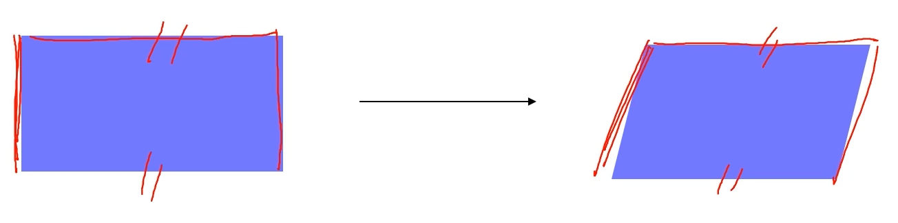

  * cut mix (2019)

    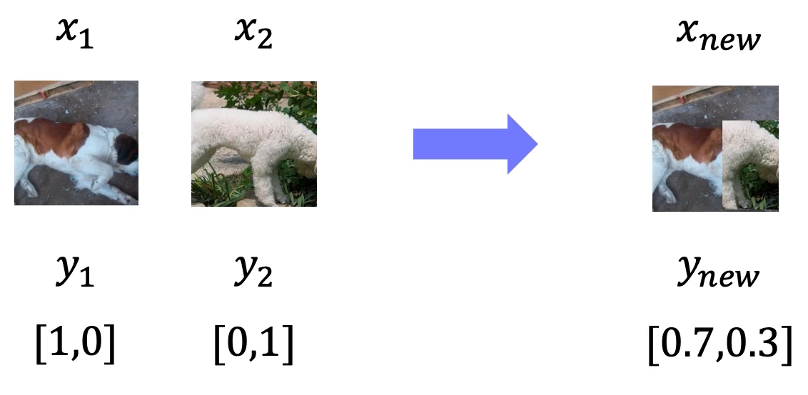

  * RandAugment : random하게 augmentation을 해서 성능이 잘 나오는 쪽을 사용.

##### Leveraging pre-trained information

* Transfer learning

  * 하나의 데이터셋에서 배운 것을 다른 데이터셋에 적용.

  * 학습해야할 파라미터 수가 적어짐.

  * 적은 데이터도로 학습이 가능해짐.

  * 방법 1. FC layer만 추가 학습.

    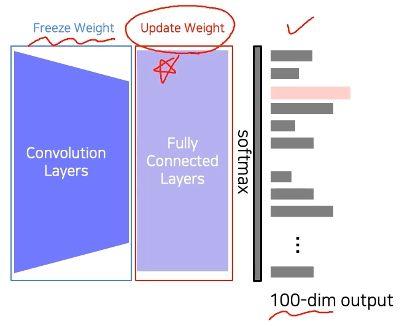

  * 방법 2. conv. layer는 낮은 lr rate로 학습.

    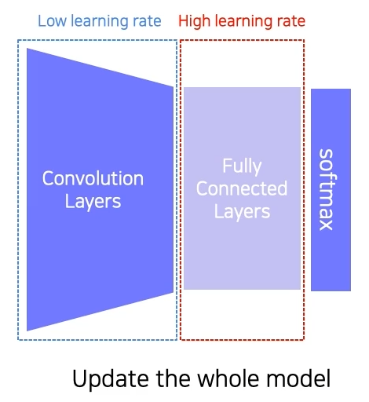

  * 방법 1에 비해서는 좀 더 많은 데이터가 필요할 수 있다.

* Knowledge distillation

  * pre-trained model로 label이 없는 데이터에 pseudo label을 부여.
  * 이러한 데이터로 학습.
  * pseudo label과의 KL divergence를 loss로 사용.
  * student model을 teacher model보다 작은게 일반적.

  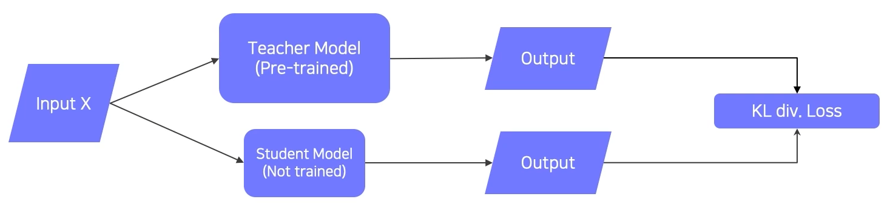

  * hard label vs soft label

    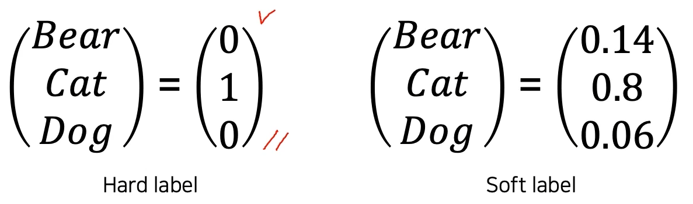

  * softmax with temperature (T)

    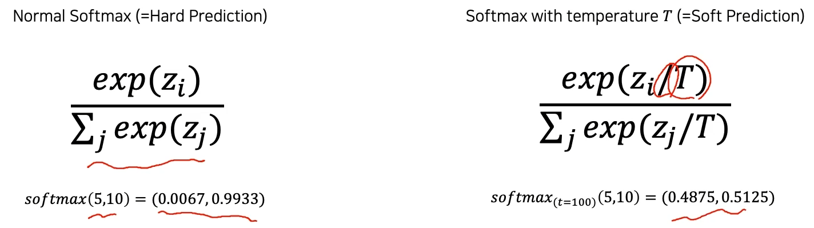

    * 절대적인 값보다 상대적인 값 사용.

  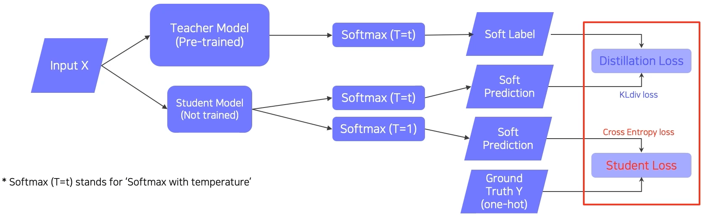

  * 실제 label이 있는 데이터도 사용.
  * Distillation loss
    * KL div. 사용.
    * teacher model의 네트워크를 학습.
  * Student loss
    * cross entropy 사용.
    * 실제 label로 학습.
  * 둘의 weighted sum으로 학습.

##### Leveraging unlabeled dataset for training

* semi-supervised learning

  * 적은 수의 labeled data와 많은 unlabeled data 사용.
  * labeled data로 pre-training.
  * pseudo-labeling을 한 다음, 두 데이터를 합쳐서 다시 학습.

  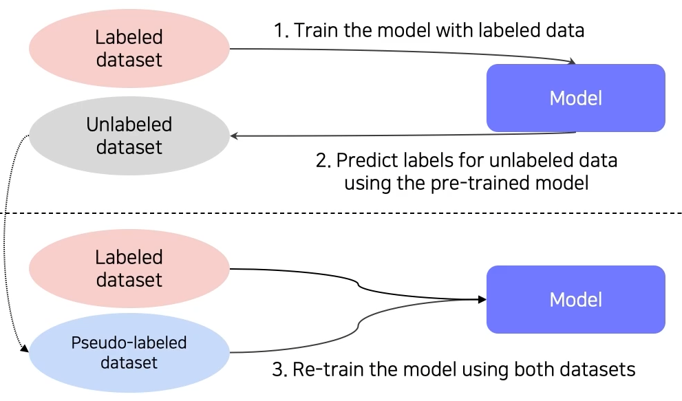

* self-training (2020)

  * augmentation + teacher-student network + semi-supervised learning

    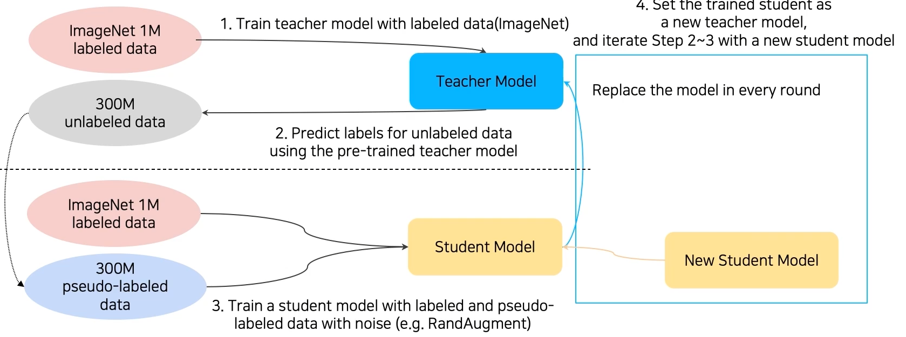

  * student model을 학습 시킬 때, rand augmentation 사용.

  * 먼저 학습시킨 student model을 다음 teacher model로 사용.

  * 새로운 student model을 학습. → 반복.

  * student model의 크기가 점점 커짐.

  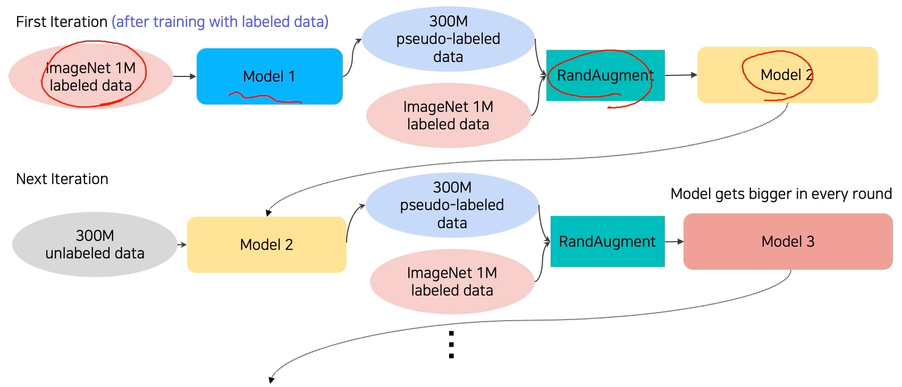

---

#### Image Classification 2

##### 깊은 네트워크의 문제

* 깊어질수록 gradient vanishing / exploding.
* 계산이 복잡해짐.
* degradation problem.

* GoogLeNet (2015)

  * inception module.
  * 하나의 레이어에서 다양한 크기의 conv. filter 사용.
  * 수평 확장. (concatenation)
  * 크기가 점점 커짐 → 1x1 conv. 사용.

  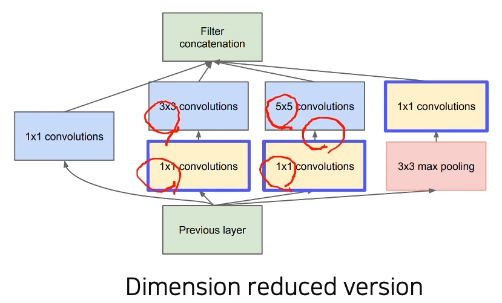

  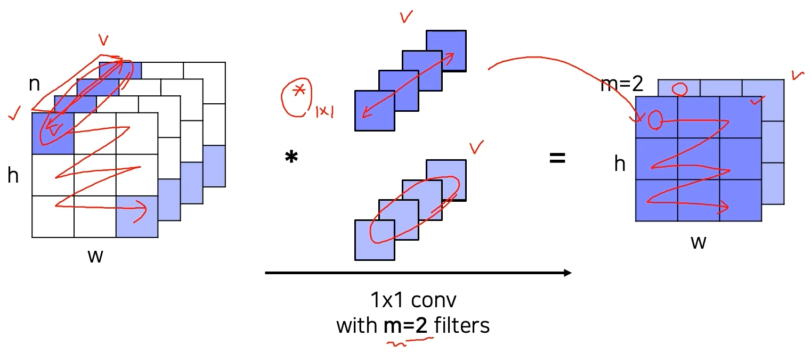

  * 역전파 시, gradient vanishing을 피하기 위해 네트워크 사이사이에 loss 계산(?)을 주입시켜줌. (auxiliary classifier)

    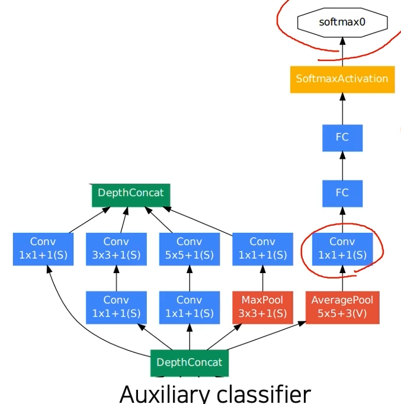

    * 테스트 시에는 사용하지 않음.

  * 하나의 FC layer.

  

* ResNet (2016)

  * 최초로 100개 이상의 레이어를 적층.
  * 깊이 쌓을수록 성능이 좋아짐을 보여줌.
  * 처음으로 인간의 성능을 뛰어넘음.
  * 기존 결과 : 더 깊은 네트워크의 training error가 더 크게 나옴. overfitting 문제가 아님.

  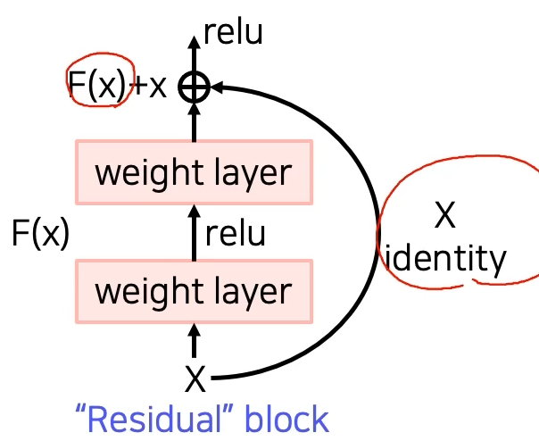

  * shortcut connection
    * 역전파의 경로가 많아짐에 따라 gradient vanishing의 문제가 줄어든다.

* DenseNet (2017)

  * 이전 출력을 channel 축으로 concatenation.

  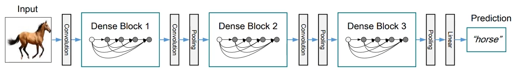

  * add가 아니라 concatenation이라 이전 레이어 정보가 보존됨.

  

* SENet (2018)

  * squeeze : global average pooling.
  * excitation : 각 채널들을 weighting. 중요한 채널과 중요하지 않은 채널. 

  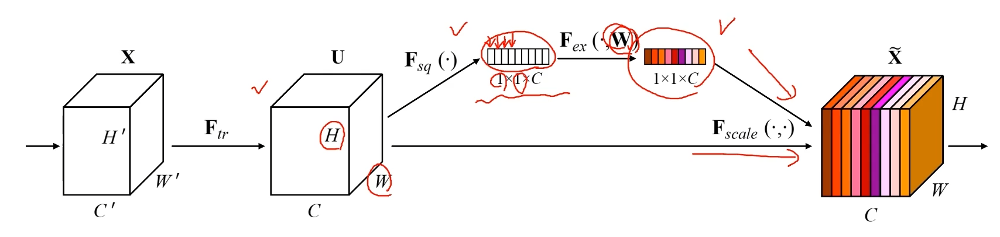

* EfficientNet (2019)

  * 네트워크 성능 높이는 법 : deep, wide, high resolution.
  * 셋을 동시에. (compound scaling)

  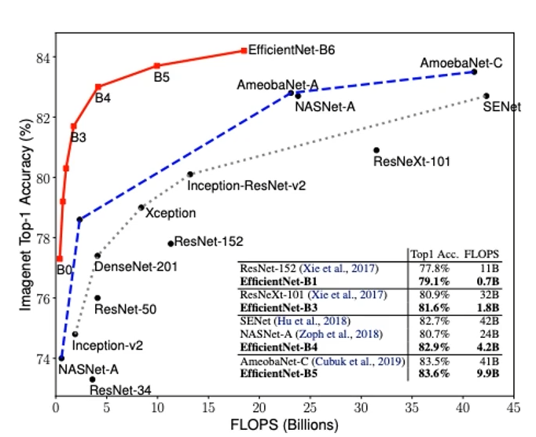

  * FLOPS : https://ko.wikipedia.org/wiki/%ED%94%8C%EB%A1%AD%EC%8A%A4

* Deformable convolution (2017)

  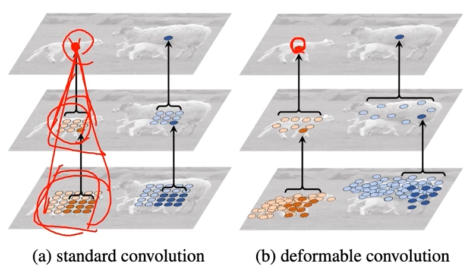

  * deformable한 모양대로 convolution 적용.

##### Summary

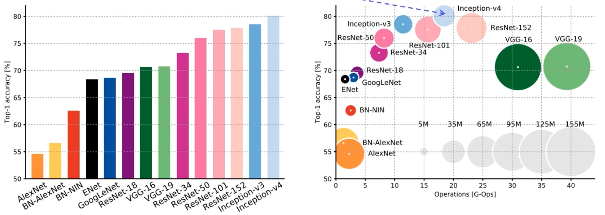

* googlenet은 alexnet, vgg, resnet에 비해서는 효율적.
* 하지만 학습 트릭 등 학습과 이용을 복잡하게 만드는 요소가 많다.

​	→ backbone network로는 잘 사용하지 않음.

​	→ 주로 vgg나 resnet을 사용. 비교적 구조가 간단.