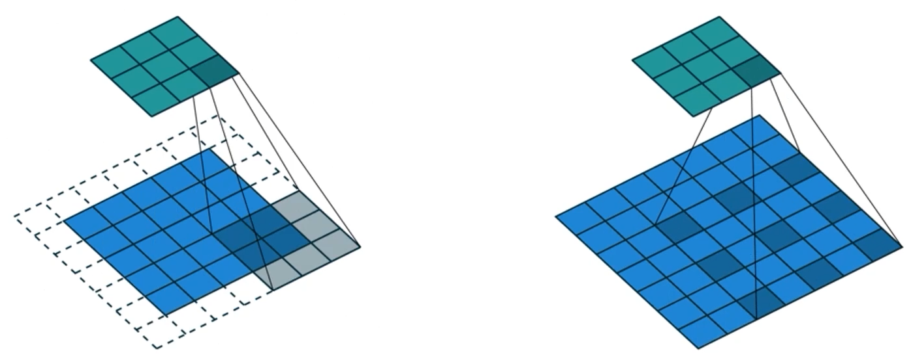

# 03/08

### 할 일

* 4강 Sementic Segmentation
* 기본과제1 ResNet34 구현
* 기본과제2 Data Augmentation
* 기본과제3 Classification to Segmentation

### 피어세션

* 

### 공부한 내용

####  Sementic Segmentation

* 픽셀 단위의 이미지 분류.
* 각 픽셀이 어떤 클래스에 속하는지.
* 응용
  * medical images
  * autonomous driving
  * computational photography

##### Architectures

* Fully convolutional networks (2015)

  * 임의의 입력 사이즈 사용 가능.

  * fully connected layer

    * 고정된 차원의 벡터.
    * flatten
    * 영상의 공간정보를 고려하지 않음.

    

    * 다른 방법 - 공간 정보 고려.

    

  * fully convolution layer

    * 1x1 conv로 구현.

    

  * upsampling

    * activation map을 원래 입력 크기에 맞춰주기 위해.

    * activation map을 되도록 작게 만들어 receptive field를 일단 키워줌.

      * 영상의 전반적인 context 파악.

    * upsampling을 통해 원래 해상도에 맞춤.

    * transpose convolution

      

      * 중첩되는 부분에서 checkboard artifacts 발생.

    * overlap issue 해결책

      

  * 낮은 레이어 : 작은 rf, local, detail

  * 높은 레이어 : 큰 rf, global

  * 중간 레이어들을 upsampling한 activation map과 합쳐서 사용.

* Hypercolumns (2015)
  * 높은 레이어와 낮은 레이어의 해상도를 맞춰서 합쳐서 사용.
  * endtoend가 아니다. 
  * bounding box를 적용하여 사용.

* U-Net (2015)

  > refer : https://velog.io/@guide333/U-Net-%EC%A0%95%EB%A6%AC

  * fully conv networks
  * skip connection
  * 단계적으로 upsampling.

  

  * 레이어에서 홀수 해상도가 나오지 않도록 주의.

* DeepLab (2015~)

  * Conditional Random Fields

  * Dilated convolution

    

    * 더 넓은 영역 고려.
    * receptive field 증가.

  * depthwise separable convolution

---

#### ResNet34 구현

