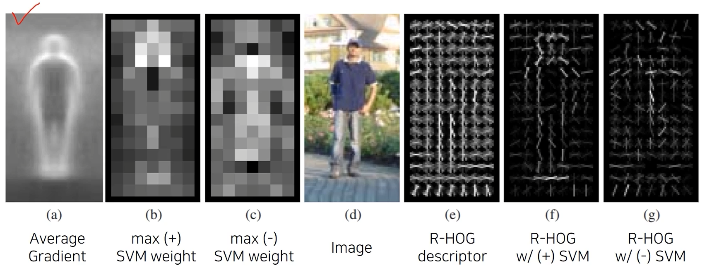
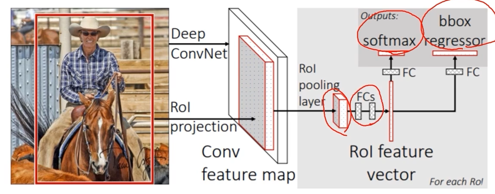
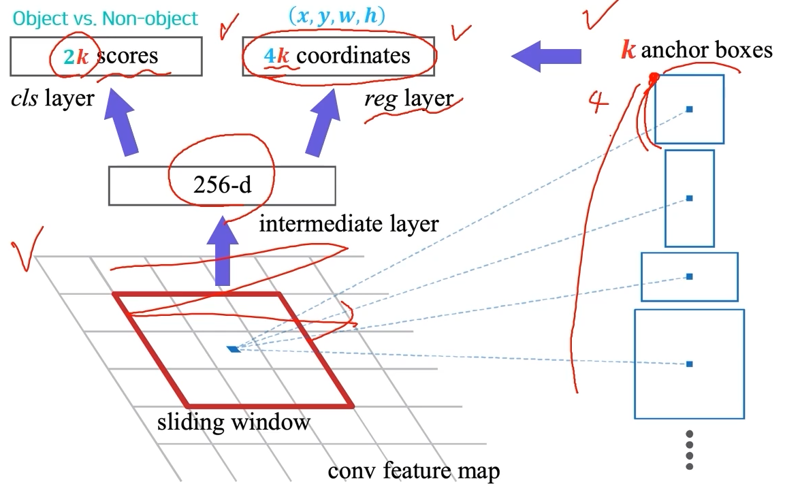
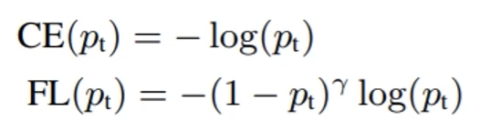
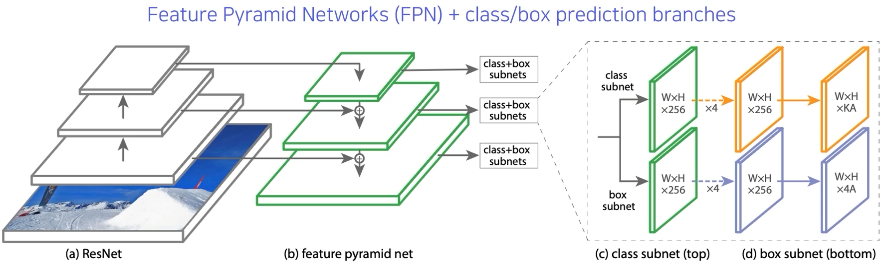
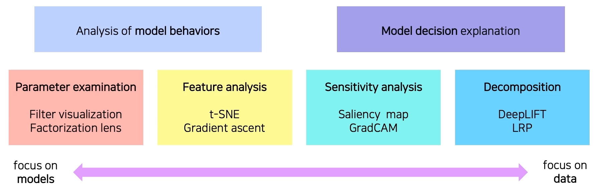
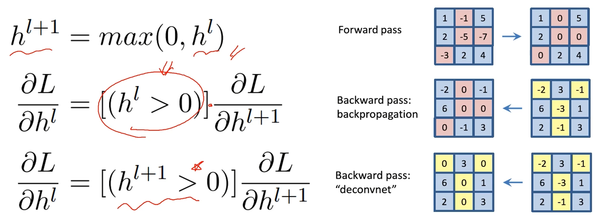
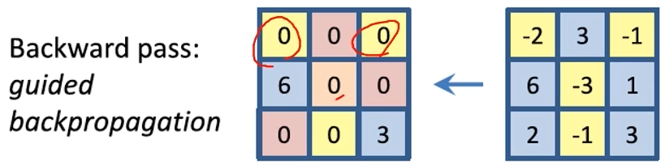
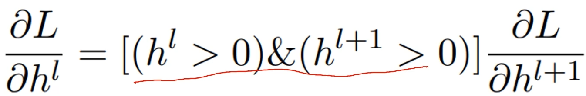
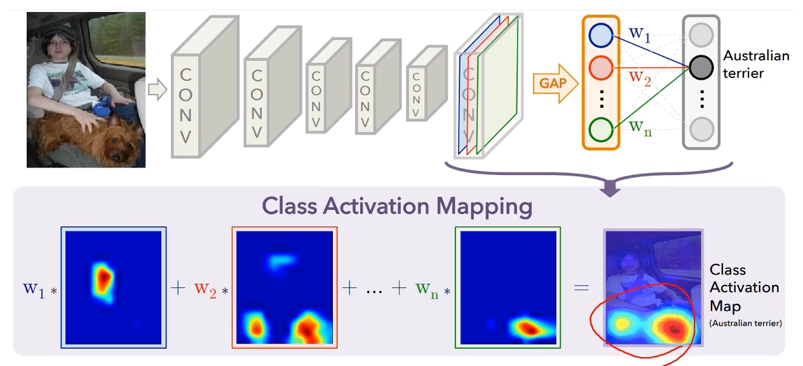

# 03/10

### 할 일

* 5강 Object Detection
* 6-1강 CNN Visualization
* 심화과제 1 CNN Visualization

### 피어세션

* Object detection의 4가지 종류
* 

### 공부한 내용

#### Object Detection

* Semantic segmentation : 같은 class에 속하는 물체는 같은 것으로 분류.
* Instance, Panoptic segmentation : class가 아닌 개체 단위로 분류.
* Instance ⊂ Panoptic

* `Classification + Box Localization` : (p_class, x_min, y_min, x_max, y_max)
* 자율 주행.
* OCR (Optical Character Recognition)

##### Two-stage detector

* Gradient-based detector (ex. [Histogram of Oriented Gradient (2005)](https://ieeexplore.ieee.org/document/1467360))

  * 영상의 gradient를 기반으로 한 detector

  

  

* Selective search ([논문](http://www.huppelen.nl/publications/selectiveSearchDraft.pdf))

  1. over segmentation (비슷한 색끼리 분할)
  2. 기준을 정의하여 비슷한 영역끼리 합침. → 반복. (그리디)
  3. bounding box 후보군 추출.

* [R-CNN (2014)](https://arxiv.org/abs/1311.2524)
  * ~2천개 정도의 영역을 추출. (ex. selective search)
  * pre-trained CNN 모델에서 분류.
  * 모든 추출 영역이 모델을 거치기 때문에 굉장히 느림.
  * selective search가 CPU에서만 가능.

* [Fast R-CNN (2015)](https://arxiv.org/abs/1504.08083)

  * 일단 영상 전체에 대한 feature를 한 번에 추출.
  * 영상 전체를 conv layer만 거침.
  * RoI (Region of Interest) : 추출된 후보 영역들.
  * RoI에 해당하는 feature map만 추출하여 resampling
  * bounding box regression : 더 정밀한 bbox 추출.
  * classification

  

  * 기존 R-CNN에 비해 최대 18배 정도 빠름.
  * region proposal로 인한(?) 성능 향상의 한계.

* [Faster R-CNN (2015)](https://arxiv.org/abs/1506.01497)

  * end-to-end object detection
    * 모든 구성이 neural network 기반.
  * IoU = intersection (교집합) / union (합집합)
    * 높을수록 두 집합이 잘 정합되었다.
  * Anchor boxes 
    * 특정 위치에서 가능할법한 box의 후보군. 미리 정해놓고 사용.
    * ground truth와의 IoU가 0.7 미만인 후보에 loss 적용. 
  * Region proposal network
    * region proposal을 제안하는 네트워크

  

  * Non-Maximum Suppression (NMS)

> https://lilianweng.github.io/posts/2017-12-31-object-recognition-part-3/

##### Single-stage detector

* 정확도보다 속도에 중점을 두어, 리얼타임이 가능하도록.
* RoI 관련이 없다.

* [YOLO (2016)](https://arxiv.org/abs/1506.02640)
  * 전체를 SxS grid로 나눔.
  * box 좌표 + confidence score + class score 예측.

* [Single Shot MultiBox Detector (SSD) (2016)](https://arxiv.org/abs/1512.02325) (??)
  * YOLO는 localization 성능이 상대적으로 떨어짐.
  * 레이어마다 다른 스케일의 bbox 고려.
  * multi-scale.

> https://lilianweng.github.io/posts/2018-12-27-object-recognition-part-4/

##### Two-stage detector vs Single-stage detector

* single-stage는 모든 영역에서 loss 계산.

  * 일반적인 영상은 배경의 영역이 더 넓다.

  * positive sample의 수가 negative에 비해 매우 적다.

  * class 불균형 문제 발생.

  * Focal loss 

    * cross-entropy의 확장
    * 오답일수록 더 sharp한 gradient를 가지게 됨.

    

* [RetinaNet (2017)](https://arxiv.org/abs/1708.02002)

  

##### Detection with Transformer

* [DETR (2020)](https://arxiv.org/abs/2005.12872)
* [Detecting objects as points (2019)](https://arxiv.org/abs/1904.07850)
  * 물체의 중심점.

---

#### CNN Visualization

* filter visualization - 첫번째 conv layer만 가능. (3채널)

##### Analysis of model behaviors

* Embedding feature analysis

  * Nearest neighbors (NN) in a feature space ([예시](https://proceedings.neurips.cc/paper/2012/file/c399862d3b9d6b76c8436e924a68c45b-Paper.pdf))
    * 유사한 데이터들끼리 나열.
    * fc layer 직전에 feature 추출. 
  * Dimensionality reduction
    * 차원축소를 통해 feature들을 2d로 맵핑.
    * [t-SNE (t-distributed stochastic neighbor embedding)](https://www.jmlr.org/papers/volume9/vandermaaten08a/vandermaaten08a.pdf)

* Activation investigation

  * 레이어의 activation을 분석.

  * Layer activation ([예시](https://arxiv.org/abs/1704.05796))

  * Maximally activating patches ([예시](https://arxiv.org/abs/1412.6806))

    * hidden node에서 가장 큰 값을 가지고 있는 부분의 근처로 patch를 뽑음.
    * 중간 레이어의 분석에 적합.
    * 원하는 레이어와 채널을 고름.
    * 최대 값의 receptive field.

  * Class visualization 

    > https://github.com/auduno/deepdraw/

    * 네트워크가 내재, 기억하고 있는 이미지.
    * 특정 클래스 스코어가 높은 부분을 추출.
    * 역전파를 통해, 입력 데이터가 어떻게 변해야 해당 클래스 스코어가 높아지는 지 계산.
    * 업데이트 된 입력 데이터로 위 과정 반복.
    * 초기 이미지에 따라 다양한 결과를 얻을 수 있음.
    * 어떤 입력을 넣어도 됨.

##### Model decision explanation

* 모델이 특정 입력에 대해 어떻게 바라보고 있는 지 분석.

* Saliency test

  * 영상이 주어졌을 때, 판별되기 위한 각 영역의 중요도를 추출.
  * Occlusion map
    * 특정 영역을 가려준 입력으로 클래스 스코어를 얻음.
    * 어떤 영역을 가려주느냐에 따라 스코어가 달라짐.
    * 어느 부분이 중요한 지 알아냄.
  * 역전파 사용 ([예시](https://arxiv.org/abs/1312.6034))
    * 입력으로 하나의 이미지를 넣고 스코어를 얻음.
    * 입력까지 역전파. 
    * gradient의 크기를 visualization.
    * 현재의 데이터가 어떻게 해석되고 있는지.

* Backpropagation-based saliency

  * [Rectified unit (backward pass)](https://arxiv.org/abs/1902.04893)

    

    

    

    * 수학적 의미보단 결과에 중점.

    

* Class activation map (CAM) ([예시](https://arxiv.org/abs/1512.04150))

  * FC 레에이러를 1개로 줄이고 나머지는 GAP(grobal average pooling) 레이어로 대체.

  

  * 마지막 레이어가 GAP과 FC 레이어가 들어가야한다.
  * 여기에 맞게 구조를 바꾸어 재학습이 필요. 성능이 떨어질 수 있다.
  * ResNet 과 GoogLeNet은 이미 GAP 레이어가 있다.
  * [Grad-CAM (2017)](https://arxiv.org/abs/1610.02391)
    * 기존 네트워크 구조를 변경하지 않아도 됨.
    * backbone이 CNN이면 됨.
    * activation map까지만 역전파.
  * [SCOUTER (2020)](https://arxiv.org/abs/2009.06138)