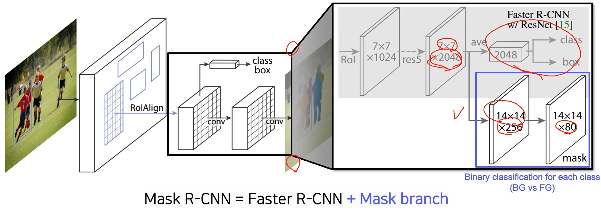
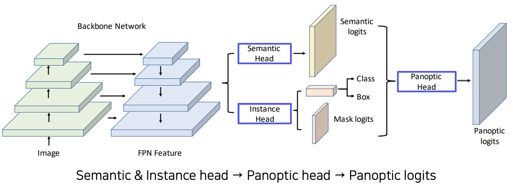
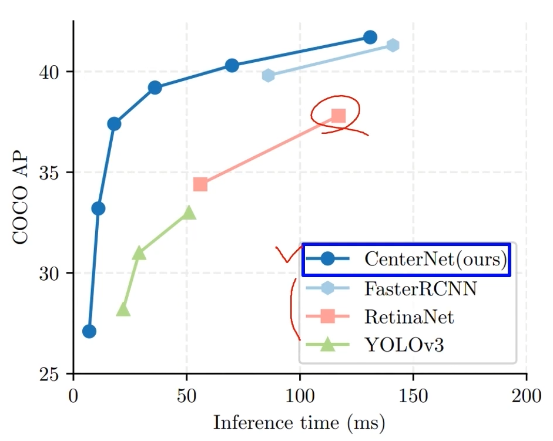
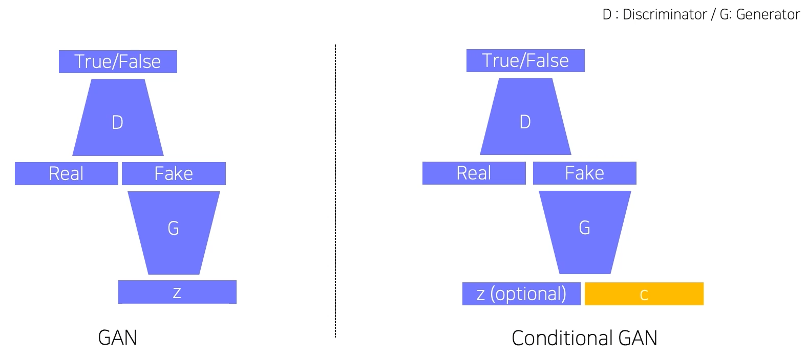
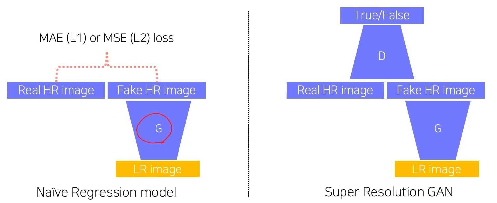
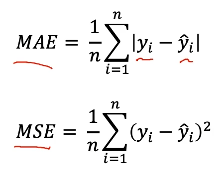
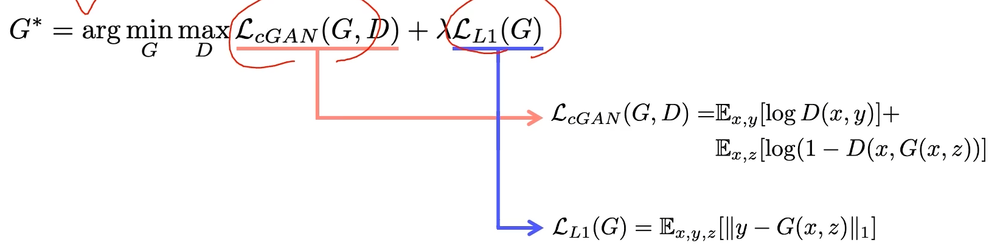
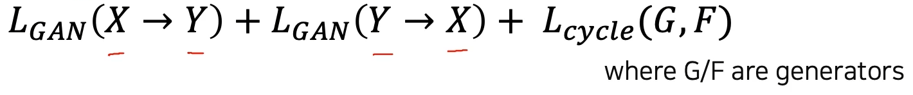

# 03/14

### 할 일

* 7강 Instance/Panoptic Segmentation and Landmark Localization
* 8강 Conditional Generative Model
* 기본과제 4 Conditional GAN

### 피어세션

* 

### 공부한 내용

#### Instance/Panoptic Segmentation and Landmark Localization

* 같은 class라도 개체가 다르면 구별됨.

##### Instance Segmentation

* [Mask R-CNN (2017)](https://arxiv.org/abs/1703.06870)

  > https://lilianweng.github.io/posts/2017-12-31-object-recognition-part-3/

  * RoI Align : 소수점 레벨의 좀 더 정교한 pooling 지원.
  * mask branch
    * class 별로 마스크를 생성하고, classification 결과를 토대로 어떤 마스크를 선택할 지 정함.

  

  * key point branch

* [YOLACT (2019)](https://arxiv.org/abs/1904.02689)
  * 리얼 타임.
  * 마스크의 프로토타입. soft segmentation components. 마스크의 재료.
  * prediction head : 프로토타입들을 잘 합성하기 위한 계수들을 출력.
  * mask R-CNN의 마스크 수에 비해 적은 프로토타입 개수.
  * 프로토타입의 합성으로 마스크 생성.
  * 메모리를 적게 사용.

* [YolactEdge (2020)](https://arxiv.org/abs/2012.12259)
  * 속도 문제를 더 개선.

##### Panoptic segmentation

* Instance segmentation은 배경은 X.
* 배경 정보를 원할 때는 semantic이 더 유리했음.

* [UPSNet (2019)](https://arxiv.org/abs/1901.03784)

  

  * semantic head : fully convolution 구조.
  * unknown class.

* [VPSNet (2020)](https://arxiv.org/abs/2006.11339)
  * panoptic segmentation을 비디오로 확장.
  * 두 시간 차를 가지는 두 영상.
  * 시간에 따라 픽셀 트래킹.
  * 이전 영상의 feature들을 픽셀 트래킹을 통해 이동.
  * 현재의 영상에서 뽑은 feature와 합쳐서 사용.
  * 단일 영상으로는 얻기 힘든 내용도 얻을 수 있음.

##### Landmark localization

* 특정 물체에 대해 중요하다고 생각되는 특정 부분 (landmark)을 특정하고 추적.

* Coordinate regression

* Heatmap classification

  * 모든 픽셀에 대해 계산해야함.

  

* [Hourglass network (2016)](https://arxiv.org/abs/1603.06937)

  * 입력 영상을 작게 만들어 receptive field를 키움.
  * skip connection으로 낮은 레이어 참조.

* [DensePose (2018)]()
  * UV map
    * 표준 3D 모델의 각 부위를 2D로 펼쳐서 이미지 형태로 만든 표기법.
  * Faster R-CNN + 3D surface regression brach

* [RetinaFace (2020)](https://arxiv.org/abs/1905.00641)
  * FPN + Multi-task branches

* FPN + target-task branches

##### Detecting objects as keypoints

* [CornerNet (2018)](https://arxiv.org/abs/1808.01244)
  * `(top-left, bottom-right)`
* [CenterNet1 (2019)](https://arxiv.org/abs/1904.08189)
  * CornerNet에서 center point 추가.
  * `(top-left, bottom-right, center)`
* [CenterNet2 (2019)](https://arxiv.org/abs/1904.07850)
  * `(width, height, center)`

---

#### Conditional Generative Model

##### Conditional Generative Model

* condition = 정보, 조건.
* 기본적인 Generative Model → 조작 없이 그냥 생성만 가능.
* 사용자의 의도를 반영하여 생성. = conditional
* 사용 예
  * audio super resolution
  * machine translation
  * article generation with the title

* super resolution 

  

  

  * MAE나 MSE loss를 사용한 모델은 loss를 줄이기 위해 어정쩡한 이미지를 생성한다.
  * GAN은 real data와 비교하므로 이러한 현상이 상대적으로 적다.
  * [SRGAN (2017)](https://arxiv.org/abs/1609.04802)

##### Image translation GANs

* [Pix2Pix (2017)](https://arxiv.org/abs/1611.07004)

  * `GAN loss + L1 loss`

    

    * GAN loss는 real or fake만 판별.
    * L1을 사용하면 입력되는 y와도 비교. (?)

  * L1 loss만 사용하면 선명하지 않은 출력.

  * GAN loss만 사용하면 사용자의 의도가 잘 반영되지 않음.

  * supervise

* [CycleGAN (2017)](https://arxiv.org/abs/1703.10593)

  * unpaired data. 직접적인 대응 관계가 존재하지 않는 데이터셋.

  * 응용 범위가 상대적으로 더 넓다.

  * `GAN loss + Cycle-consistency loss`

    

  * GAN loss만 사용하면 input에 상관 없이 같은 출력만 내보내게 될 수 있음.

  * 원본 복원을 시도했을 때의 차이도 반영.

  * self-supervision