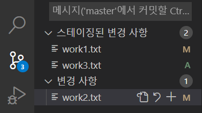
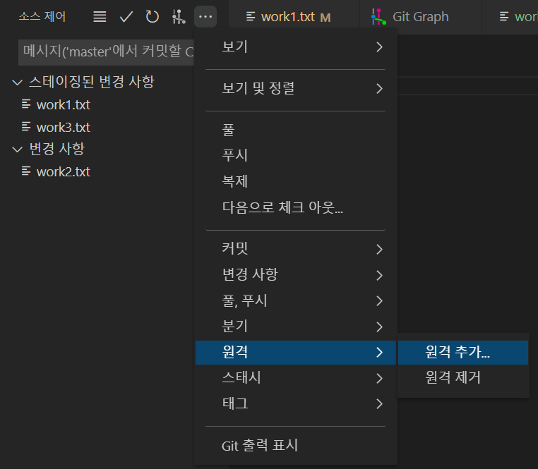

# 03/15

### 할 일

* git 특강.


### 피어세션

* 없음.


### 공부한 내용

#### git 특강

* 이력 보기

  ```bash
  $ git log
  ```

* staging을 통해 특정 파일만 commit 가능.

  

* command에서는 add 시에 특정 파일들을 지정하면 됨.


* 여러 개의 원격 저장소와 연결 가능.

  


* `git fetch` : 변경 내용을 미리 확인.


* conflict
  * 공통 조상(base)를 참조하여 한 쪽만 수정된 경우는 그냥 적용.


* git은 항상 HEAD를 바라 봄.
* checkout은 HEAD가 바라보고 있는 곳(branch?)을 변경함.
* branch는 마지막 commit id를 가리킴.
* HEAD는 현재 워킹 디렉토리가 어떤 버전과 같은 지 가리킴.


* git graph에서 commit 이름 오른쪽 클릭 -> checkout : 해당 커밋의 시점으로.


* origin master와 local master는 다른 branch 취급.
* push를 해야 origin master가 local master와 병합.
* pull = fetch + merge