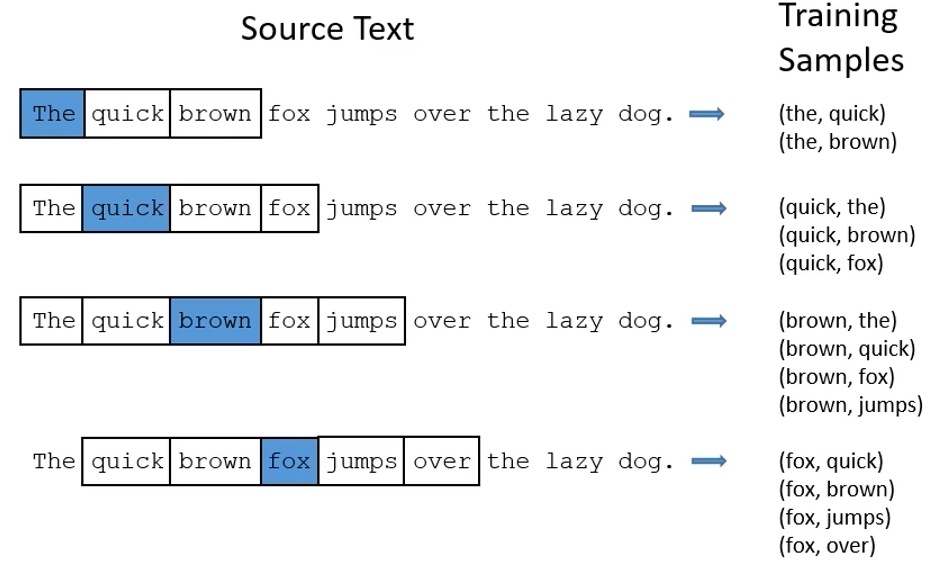

# 03/16

### 할 일

* 9-1강 Multi-modal Learning
* 9-2강 Image Captioning
* 기본과제 4 Conditional GAN
* 기본과제 5 Multi-modal applications with CLIP

### 피어세션

* 

### 공부한 내용

####  Multi-modal Learning

* 다른 타입의 데이터를 학습에 함께 사용.

* 문제점.

  1. 데이터 타입마다 표현 방법이 다름.

  2. 다른 타입의 데이터에서 오는 정보의 양이 다름.

  3. multi modal이 학습에 방해될 때가 있다.
     1. 하나의 modality에 bias.

* matching, translating, referencing

##### Visual data & Text

* Text embedding

  * embedding vector 형태.

    

    * 일반화

  * skip gram model : word2vec

    * 주변 word와의 관계성 학습.
    * window=5 : 가운데 단어가 주면 4개의 단어와 연관이 있다.

    

* joint embedding - matching

  * image tagging (2014) 
    * 주어진 이미지에 태그를 붙임.
    * 태그를 사용해 이미지를 찾음.
    * text와 image의 feature vector를 찾음. 같은 dim.
    * 두 벡터의 embedding space에서의 거리를 줄이도록 학습. = Metric learning
  * image & food recipe retrieval (2019)
    * 음식 이미지와 레시피 연결.
    * 레시피는 순서가 중요. - RNN 계열 사용.
    * cosine similarity loss, semantic regularization loss

* cross modal translation

  * image captioning
    * image to sentence
    * image - CNN, sentence - RNN
  * show and tell (2015)
    * encoder : pre-trained CNN
    * decoder : LSTM
  * show, attend and tell (2015)
    * 국지적인 부분에 집중.
    * feature map을 RNN으로.
    * soft attention embedding
    * 다음 순서로는 어디를 참고할 건 지 출력.
  * text to image by generative model (2016)
    * gaussian code : 같은 sentence에서 같은 이미지만 나오는 것을 방지.
    * conditional GAN

* cross modal reasoning - referencing

  * visual question answering (예시(2015))

    * point-wise multiplication
    * end to end training

    

##### Visual data & Audio

* sound representation

  * Fourier transform

    * 짧은 window 구간 내에서만.
    * hamming window - 가운데에 집중.

    

  * Spectrogram

    * melspectrogram
    * MFCC

    

* joint embedding

  * sound tagging (SoundNet (2016))

    * sound - 1D CNN
    * visual recognition의 네트워크는 pre-trained.
    * sound에 대한 네트워크만 학습.
    * waveform을 사용.

    

* cross modal translation

  * Speech2Face (2019)
    * 목소리를 듣고 사람의 얼굴을 reconstruction.
    * face feature를 뽑는 VGG model.
    * face decoder : face feature가 들어오면 얼굴을 재구성하는 네트워크.
    * voice feature를 추출하여 face feature와 loss 계산.
    * self-supervised
  * image to speech synthesis (2020)
    * image to sub-word units → unit to speech, 각각 학습.
    * speech에서도 unit을 추출하여 학습에 사용.

* cross modal reasoning

  * sound source localization (2018)

    * 입력한 소리가 어느 장소에서 나는 것인지.
    * 영상의 context와 매칭.
    * 출력 : localization score

    

    * 내적으로 관계성을 나타냄.
    * groun truth와 loss 계산.
    * video에는 영상과 소리가 동시에 있으므로, unsupervised로 학습 가능.

    

  * Looking to listion at the cocktail party (2018)

    * 영상 정보를 참조하여 소리를 구분.

---

#### Image Captioning