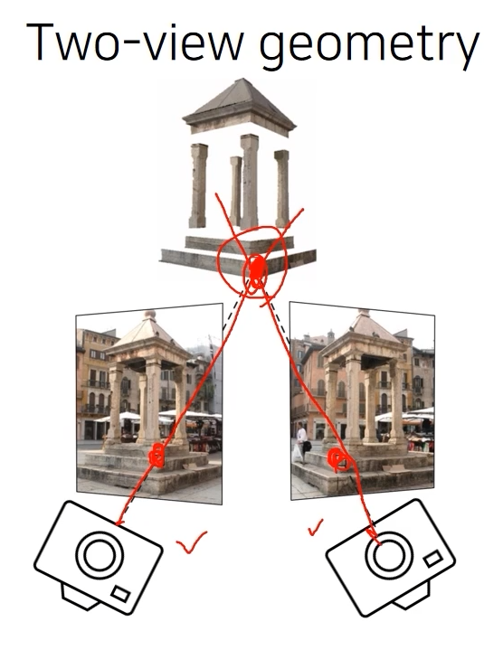
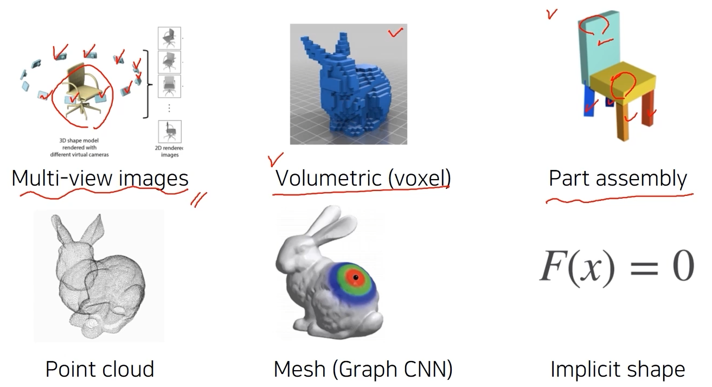
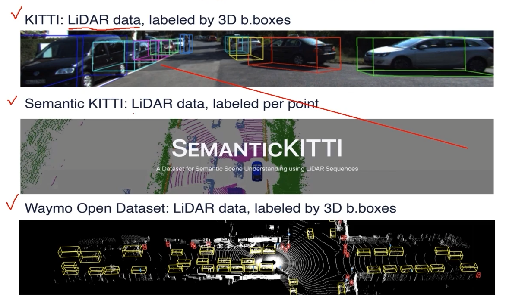
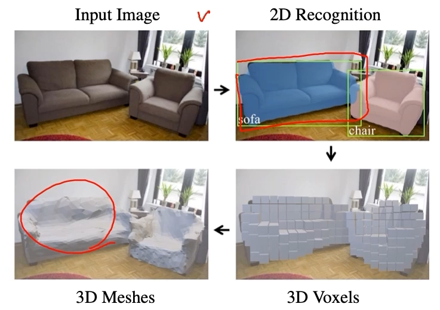
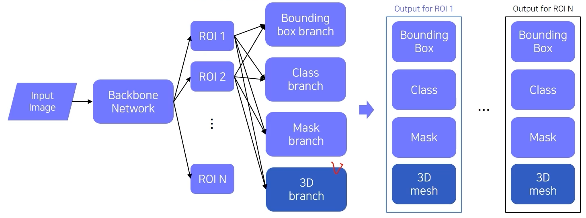
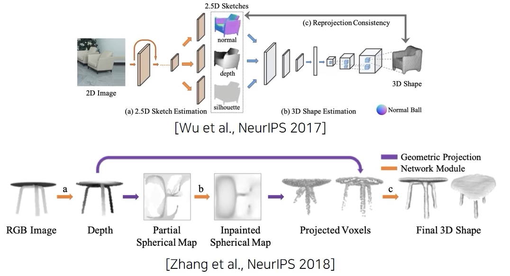

# 03/17

### 할 일

* 10강 3D Understanding

### 피어세션

* 

### 공부한 내용

#### 3D Understanding

* 2D image → 3D

  * Triangulation

  

* 3D representations

  

  * point cloud : (x, y, z) 점들의 집합.

* 3D datasets

  * [ShapeNet (2015)](https://arxiv.org/abs/1512.03012)

    * 51,300 models, 55 categories

  * [PartNet (2019)](https://arxiv.org/abs/1812.02713)

    * 573,585 part instances in 26,671 models
    * 물체의 각 파트를 나눠놓음.

  * [SceneNet (2017)](https://arxiv.org/abs/1612.05079)

    * 5 milion RGB-Depth synthetic indoor images

  * [ScanNet (2017)](https://arxiv.org/abs/1702.04405)

    * RGB-Depth
    * 2.5 milion views from 1500 scans

  * outdoor datasets

    

##### 3D tasks

* 3D recognition

  * classification
  * volumetric CNN

* 3D object detection

* 3D semantic segmentation

* conditional 3D generation - [Mesh R-CNN (2019)](https://arxiv.org/abs/1906.02739)

  

  * box, class, mask, 3d branch를 prediction.

    

* 3D reconostruction

  

  * [논문1 (2017)](https://arxiv.org/abs/1711.03129)
  * [논문2 (2018)](https://arxiv.org/abs/1812.11166)