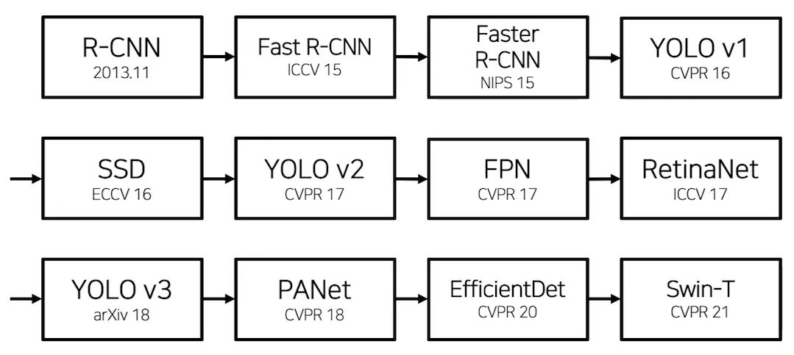
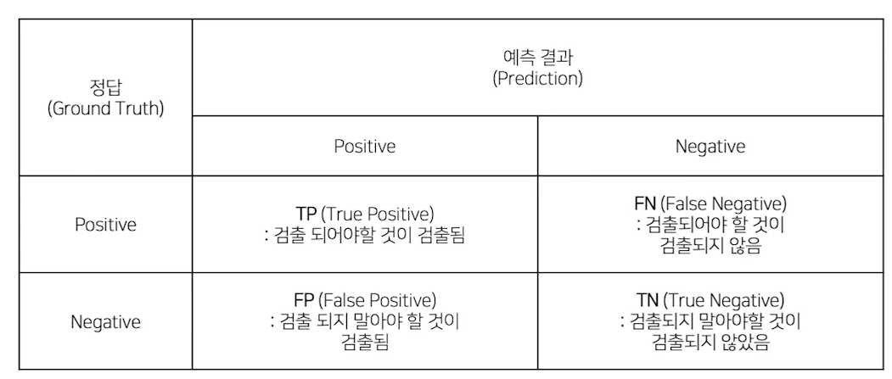
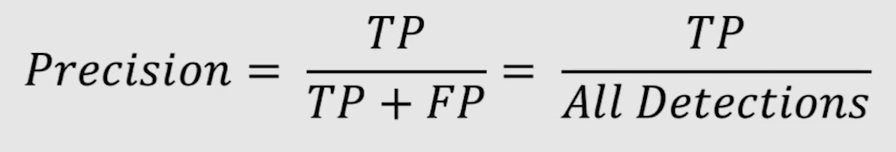
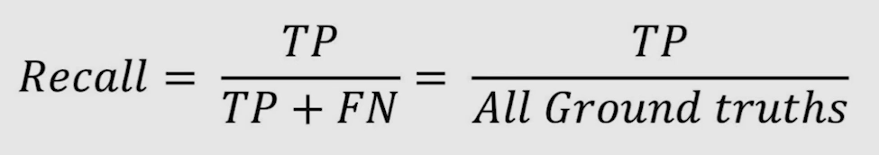
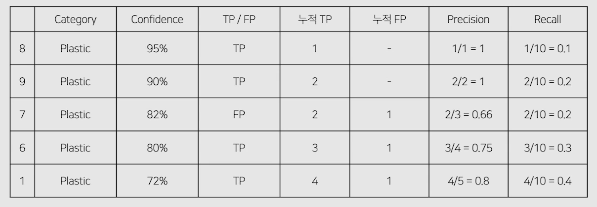
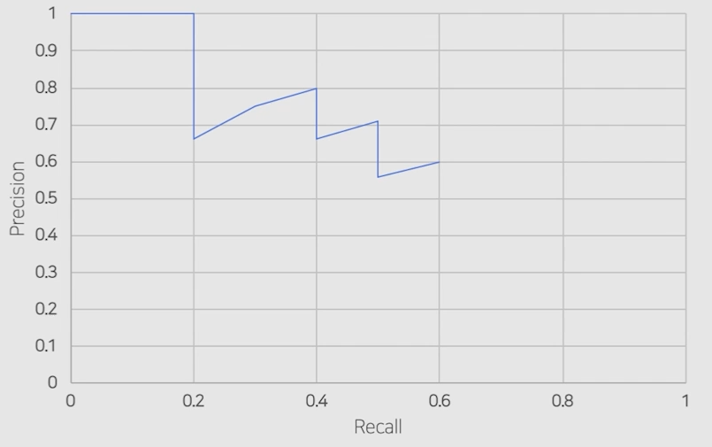
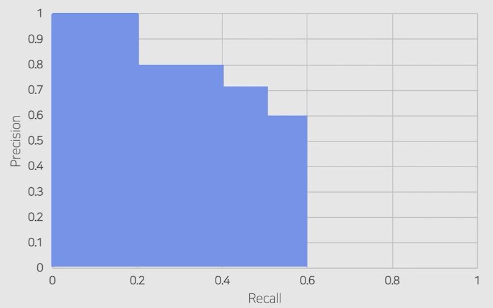
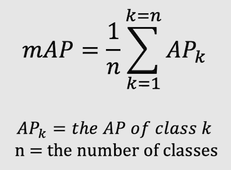
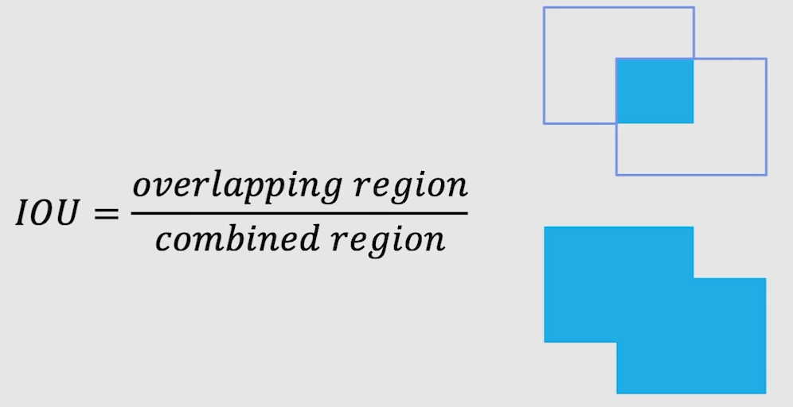
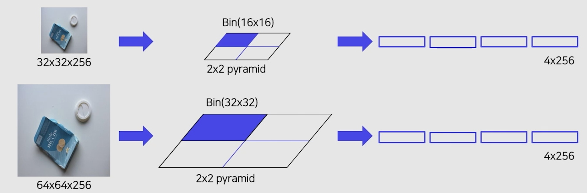

# 03/21

### 할 일

* 1강 Object Detection Overview
* Special Mission1 - mAP metric code
* p-stage 서버 연결
* p-stage EDA

### 피어세션

* R-CNN
  * selective search

#### EDA

### 공부한 내용

#### Object Detection Overview

* 주요 task
  * sementic segmentation
  * instance segmentation
* 응용
  * 자율주행
  * OCR
  * 의료 도메인
  * CCTV 사람 추적

##### History

##### Evaluation

* 성능 : 얼마나 잘 검출했는가.

  * **mAP (mean Average Precision)**

    * 각 클래스 당 AP의 평균.

  * confusion matrix

    

  * **Precision** : 모델이 positive로 예측한 것 중 정답 비율.

    

  * **Recall **: 정답이 positive인 것들 중 정답 비율.

    

  * **PR curve**

    * confidence의 내림차순으로 정렬했을 때, Precision과 Recall 계산.

    

    

  * **AP**

    * PR curve의 아래 면적.

    

  * **mAP**

    * 각 클래스의 AP를 모두 계산하여 평균을 냄.

    

  * **IOU (Intersection Over Union)**

    

    * 전체 영역과 겹치는 영역의 비율 - 얼마나 잘 예측하였는가.
    * IOU 기준을 정하고, 그 기준에 따라 T/F가 판별

* 속도 : 얼마나 빨리 검출했는가.

  * **FPS (Frame per second)** : 초당 처리하는 프레임 수.
  * **FLOPs (Floating Point Operations)** : 연산량 횟수.

##### Library

* MMDetection
* Detectron2
* YOLOv5
* EfficientDet

---

#### 2 Stage Detectors

1. 입력 이미지에서 후보 영역 추출.
2. 후보 영역을 고정된 크기로 변경 후, feature를 추출. (CNN) → sementic feature vector
3. classification

##### R-CNN

###### 후보 영역 추출

* sliding window
  * 수가 매우 많아짐.
  * 대부분이 배경일 것.
  * 더이상 사용하지 않음.
* selective search
  * 이미지를 무수히 많은 작은 영역으로 나누어, 점점 큰 영역으로 합쳐감.
  * 그리디 알고리즘.

###### Pipeline

1. 입력 이미지에서 약 2000개의 RoI (Region of Interest) 추출.

2. RoI 크기를 모두 같은 크기로 변형. 

   → CNN의 FC layer는 크기가 고정되어있기 때문.

3. CNN에 넣어 feature 추출.

   1. 각 region마다 1x4096 feature vector 추출.

4. feature vector를 SVM으로 분류.

5. output : Class (C + 1개) + confidence scores

6. bounding box 조정.

   1. bounding box의 중심점과 가로, 세로 크기를 ground truth에 맞게 조정하도록 학습.

###### Training

* AlexNet (CNN)
  * IoU threshold = 0.5
  * 1 batch = positive sample 32개, negative sample 96개.
* Linear SVM
  * positive sample : ground truth 사용.
  * negative : IoU < 0.3
  * hard negative mining
    * False positive : 모델이 구분하기 어려운 샘플.
    * FP인 샘플들을 다음 batch의 negative sample로 사용.
* Bbox regressor
  * positive : IoU > 0.6 
  * 배경은 박스가 없어 학습이 어려움.
  * 박스의 조정 (중심점, 가로, 세로 길이)에 대해 loss를 계산. : MSE loss

###### 단점

* 2000개의 RoI가 각각 CNN을 통과하여 시간이 오래 걸림.
* 강제 resize로 인해 성능 하락.
* CNN, SVM, box regressor를 따로 학습.
* End-to-End가 아니다.

##### SPPNet

* 입력 이미지 전체를 CNN에 넣고 feature map에서 후보 영역 추출.
* 추출한 영역을 warping하지 않음.
* spatial pyramid pooling : 영역을 고정된 크기의 feature vector로 변형.

###### Spatial Pyramid Pooling

###### 개선점

* 영역 추출 전에 CNN을 사용하므로 시간이 상대적으로 적게 걸린다.
* 강제적인 warping을 피했다.

##### Fast R-CNN