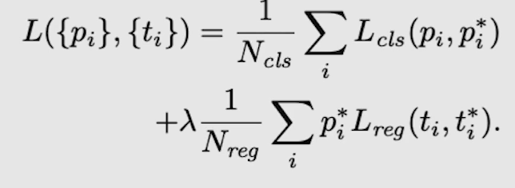

# 03/22

### 할 일

* 2강 2 Stage Detectors
* 2강 실습 Faster RCNN from scratch
* Special Mission2 - Faster RCNN
* p-stage wandb 가입
* p-stage 다른 모델 사용법 찾기

### 피어세션

* https://github.com/akarazniewicz/cocosplit

### 공부한 내용

#### 2 Stage Detectors

1. 입력 이미지에서 후보 영역 추출.
2. 후보 영역을 고정된 크기로 변경 후, feature를 추출. (CNN) → sementic feature vector
3. classification

##### R-CNN

###### 후보 영역 추출

* sliding window
  * 수가 매우 많아짐.
  * 대부분이 배경일 것.
  * 더이상 사용하지 않음.
* selective search
  * 이미지를 무수히 많은 작은 영역으로 나누어, 점점 큰 영역으로 합쳐감.
  * 그리디 알고리즘.

###### Pipeline

1. 입력 이미지에서 약 2000개의 RoI (Region of Interest) 추출.

2. RoI 크기를 모두 같은 크기로 변형. 

   → CNN의 FC layer는 크기가 고정되어있기 때문.

3. CNN에 넣어 feature 추출.

   1. 각 region마다 1x4096 feature vector 추출.

4. feature vector를 SVM으로 분류.

5. output : Class (C + 1개) + confidence scores

6. bounding box 조정.

   1. bounding box의 중심점과 가로, 세로 크기를 ground truth에 맞게 조정하도록 학습.

###### Training

* AlexNet (CNN)
  * IoU threshold = 0.5
  * 1 batch = positive sample 32개, negative sample 96개.
* Linear SVM
  * positive sample : ground truth 사용.
  * negative : IoU < 0.3
  * hard negative mining
    * False positive : 모델이 구분하기 어려운 샘플.
    * FP인 샘플들을 다음 batch의 negative sample로 사용.
* Bbox regressor
  * positive : IoU > 0.6 
  * 배경은 박스가 없어 학습이 어려움.
  * 박스의 조정 (중심점, 가로, 세로 길이)에 대해 loss를 계산. : MSE loss

###### 한계점

* 2000개의 RoI가 각각 CNN을 통과하여 시간이 오래 걸림.
* 강제 resize로 인해 성능 하락.
* CNN, SVM, box regressor를 따로 학습.
* End-to-End가 아니다.

##### SPPNet

* 입력 이미지 전체를 CNN에 넣고 feature map에서 후보 영역 추출.
* 추출한 영역을 warping하지 않음.
* spatial pyramid pooling : 영역을 고정된 크기의 feature vector로 변형.

###### Spatial Pyramid Pooling

###### 개선점

* 영역 추출 전에 CNN을 사용하므로 시간이 상대적으로 적게 걸린다.
* 강제적인 warping을 피했다.

##### Fast R-CNN

* RoI pooling

###### pipeline

1. VGG16 (CNN)으로 feature 추출.

2. RoI Projection : RoI를 추출.

   1. 원본 이미지에서 selective search.
   2. feature map에 projection.

   

3. 고정된 vector를 얻기위해 SPP.

4. FC layer → softmax classifier, BBox regressor

   1. 클래스 개수 : C+1개

###### Training

* 거의 end-to-end.
* multi task loss : classification loss + bounding box regression
* loss function
  * classification : cross entropy
  * BB regressor : smooth L1
    * outlier에 덜 민감.
* Dataset
  * positive : IoU > 0.5
  * negarive : 0.1 < IoU < 0.5
  * P : N = 1 : 3
* 한 배치에 한 이미지의 RoI만 포함.

###### 한계점

* selective search로 인해 완전한 end-to-end가 아니다.

##### Faster R-CNN

* selective search 제거.
* DL 기반의 영역 추출. RPN (region proposal network)

###### pipline

1. CNN으로 feature map 추출.

2. RPN으로 RoI 추출.

   1. Anchor box
      - 각 셀마다 다양한 box 크기들을 정해준다.

   

   2. 2 (object or not) X 9 (num of anchors) 채널 생성.

   3. 4 (bounding box (중심점, W, H)) X 9 (anchors) 채널 생성.

      

      

3. 여러 RoI들 중, IoU가 0.7 이상이면 중복 영역으로 판단하고 제거. (NMS)

###### Training

* RPN

  * positive : IoU > 0.7 or GT와 가장 큰 IoU를 가지는 것.
  * negative : IoU < 0.3
  * 그 외는 학습에 사용하지 않음.
  * loss

  

  * 객체가 있을 때만 regression loss 적용.

* Fast R-CNN

  * IoU threshold : 0.5
  * P : N = 1 : 3, 128개 batch
  * loss : Fast R-CNN과 동일.

* 4가지 step.

  

###### 개선점

* 완전한 end-to-end로 개선.

###### 한계점

* 2-stage 구조로 인해 시간이 오래 걸림 - real-time으로 사용하긴 어렵다.

##### Summary

