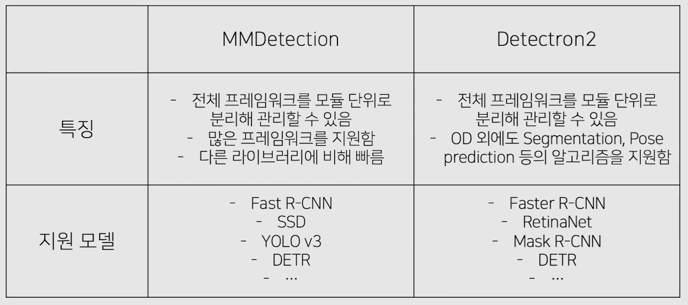
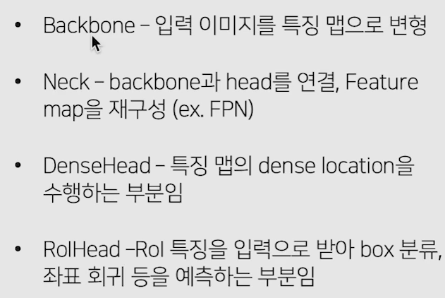

# 03/23

### 할 일

* 2강 실습 Faster RCNN from scratch
* Special Mission2 - Faster RCNN
* 3강 Object Detection Library
* 4강 Neck

### 피어세션

* 

### 공부한 내용

#### Faster R-CNN 실습

##### albumentations 라이브러리

* augmentation을 할 경우, bbox의 위치 등이 달라져 조정이 필요.

* `bbox_params : format`

  * `coco` : `[x_min, y_min, width, height]`
  * `pascal_voc` : `[x_min, y_min, x_max, y_max]`
  * `yolo` : `[x, y, width, height]`

* Cutout augmentation은 자체적으로 지원.

  > https://albumentations.ai/docs/api_reference/augmentations/dropout/cutout/#cutout-augmentation-augmentationsdropoutcutout

* Cutmix는 없는 듯하다.

---

#### Object Detection Library

* object detection은 통합된 라이브러리 부재

* 실무/캐글에서 주로 활용하는 라이브러리

  

##### MMDetection

* PyTorch 기반.

* 초기 허들은 높은 편이지만 사용하기 편리하다.

* 2 stage model : backbone / neck / dense head / RoI head 모듈로 나뉨.

  

* 각 모듈 단위로 커스터마이징 가능.

* config 파일로 통제.

###### Dataset

* `samples_per_gpu` : 한 gpu 당 올라갈 sample 수. sample = image.
* `workers_per_gpu` : 한 gpu 당 코어 수.
* `train`, `val`, `test`

###### Model

* `type` : 모델 종류
* `backbone`
* `neck`
* `rpn_head`

* model이나 dataset 등을 `mmdet` 폴더에 직접 정의하여 사용할 수 있다.

###### Runtime settings

* `lr_config`
* `runner`

##### Detectron2

* PyTorch 기반.
* detection 외에 다른 task도 제공하지만 주로 detection이 사용됨.
* config 구성 - trainer 구성 - training
* augmentation 직접 구현.
* 자유도가 비교적 높다.

