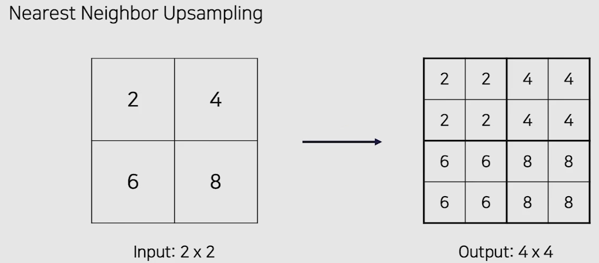
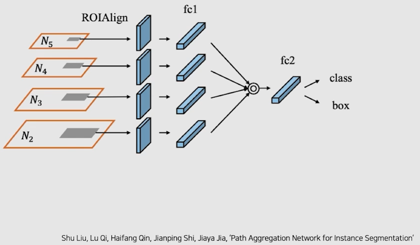
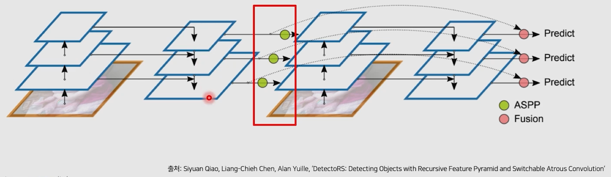

# 03/24

### 할 일

* 4강 Neck
* 5강 1 Stage Detectors
* p-stage
  * class 별 box의 h, w 평균.
  * train data의 한 이미지 당 class 수.

### 피어세션

* cascadeRCNN
  * epochs를 증가시키니 쓸데없는 박스가 줄어든다.
  * test mAP는 0.4071로 크게 좋지 않음. (50 epochs) 

* train data
  * 323 : metal이 plastic bag으로 표기.
  * 331 : 담배는 표기 x.
  * 367 : 부츠를 일반쓰레기로 표기.
  * 374 : 화재 감지기는 표기 x
  * 399 : 투명 비닐봉지
  * 448 : 일반 쓰레기 부분이 왜인지 잘 모르겠음.
  * 498 : 뭐가 비닐인가

* https://89douner.tistory.com/324
* faster_rcnn_torchvision epochs 100 - epochs 30보다 떨어짐.

### 공부한 내용

#### Neck

* backbone의 중간 feature map들도 활용하기 위함.
* **low level : 작은 객체, high level : 큰 객체**를 잘 포착한다 함.
* 따라서 최종 feature map만 사용하면 작은 객체를 포착하기 어려움.

→ 다양한 크기의 객체를 더 잘 탐지하기 위해.

##### Feature Pyramid Network (FPN)

* top-down path way

  * high level의 정보를 lower level에 순차적으로 전달.

  

* Lateral connections

  

  

  * 두 feature map의 크기를 맞춰주고 element-wise add.

    

* 추출한 RoI가 어떤 feature map에서 왔는지 판단 필요.

  

  * RoI의 크기가 작을수록 low level feature map 사용.

* 작은 물체를 탐지하는 성능이 많이 향상.

  

  * AR : average recall
  * s, m, l 크기 별로 나누어 성능 측정.

##### Path Aggregation Network (PANet)

* FPN의 문제

  * backbone 네트워크가 깊다 → low level feature가 high level에 잘 전달 되는가.
  * 각 level의 경계에 있는 RoI는 잘못 projection될 수 있다.

* bottom-up path를 하나 더 추가.

  

* Adaptive Feature Pooling

  * 모든 feature map에서 RoI projection 수행.

  

##### After FPN

* DetectoRS

  * Recursive Feature Pyramid (RFP)
  * 단점 : 연산량 증가.

  

  

  * Atrous convolution

    * receptive field 증가.

    

* Bi-directional Feature Pyramid (BiFPN)

  * 효율을 위해 한 곳에서만 오는 feature map 삭제.

    

  * Weighted Feature Fusion

    * 단순 sum이 아니라 가중치 부여.

    

    * weight도 학습.

* NASFPN
  * NAS를 사용해 적절한 FPN 구조를 찾음. (?)
  * 찾는 비용이 많이 든다.

* AugFPN

  * FPN의 단점.

    * 서로 다른 level의 feature 간의 semantic 차이.
    * highest feature map의 정보 손실.

  * Residual Feature Augmentation

    

    * 마지막 레이어를 여러 크기로 adaptive pooling → 같은 크기로 upsampling → weighted sum.

    

  * soft RoI selection

    * 모든 feature map에서 RoI projection.
    * channel-wise weight 부여.

---

#### 1 Stage Detectors

* 2 stage의 속도가 느린 점을 개선.
* RPN이 없다.
* feature map에서 바로 객체 검출.
* 간단하고 쉬운 디자인.

##### History

##### YOLOv1

* YOLO history

  

* GoogLeNet 변형

  * 24 conv layers : feature 추출.
  * 2 FC layers : box 좌표 및 확률 계산.

###### Pipeline

1. SxS 그리드 영역으로 나눔.

2. 각 그리드마다 B개의 bbox와 confidence score 계산.

   1. confidence = 박스에 객체가 있을 확률 x IoU

3. 각 그리드 영역마다 C개의 class에 대한 확률 계산.

   

4. 최종 output : 7x7x30

   1. 하나의 픽셀 당 하나의 입력 그리드.

   2. 총 20개의 class 사용.

   3. background class는 없음.

   4. box 정보 : 중심 좌표 (x, y) + 너비, 높이 (w, h) + confidence score

      

   5. 각 box의 score를 클래스 정보와 곱함 = 각 박스가 해당 클래스일 확률.

   6. 98 (7x7x2)개의 박스.

   7. 해당 클래스의 score가 threshold 이하인 박스는 고려 x.

   8. score가 높은 박스를 고름. 

5. Loss

   1. localization loss : 해당 박스에 객체가 있을 때, loss 계산.
   2. confidence loss : 객체가 있는 박스와 없는 박스를 따로 loss 계산.
   3. classification loss : 그리드에 객체가 있을 때, classification 확률로 loss 계산.

   

###### Result

* Fast R-CNN과 앙상블하면 성능 향상.

  

* 장점

  * Faster R-CNN에 비해 6배 빠름.
  * 다른 real-time detector에 비해 2배 높은 정확도.
  * 이미지 전체를 보기 때문에 background error가 적은 편.
  * 새로운 도메인 이미지에 대한 좋은 성능.

##### SSD

* YOLO의 단점
  * grid보다 작은 물체는 검출 불가능.
  * 마지막 feature map만 사용.
* YOLO와 비교
  * 300x300 입력 사용.
  * FC layer 대신, 1x1 conv layer 사용. (속도 향상)
  * 마지막 feature map에 추가적인 conv를 적용.
  * 여러 scale의 feature map을 더 만들어 사용.
  * 총 6개의 서로 다른 스케일의 feature map.
  * anchor box 사용.

###### Pipeline

1. VGG16 backbone + extra conv layer, 입력 : 300x300

2. feature map 채널 수 = 박스 수 * (offset(4) + 클래스 수)

   

   

3. Hard negative mining, Non maximum suppression (NMS) 수행.

4. Loss

   1. Localization loss : 예측한 박스와 ground truth 박스의 차이 계산.

   

###### Result

* YOLO보다 2배 정도 빠르고 성능도 향상.

##### YOLOv2

* v1과 비교한 개선 방향

  * 정확도 향상.
  * 속도 향상.
  * 더 많은 class 예측.

* 정확도

  * Batch normalization

  * high resolution classifier

    * VGG를 448x448로 finetuning

  * anchor box 도입

    * 좌표값 대신 offset(이동 정도) 예측.

  * fine-grained features

    

  * 입력 이미지 크기를 다양하게 사용. (feature map X)

* 속도

  * Darknet-19

    

* 다양한 class

  * word tree 구성.
  * ImageNet : Coco = 4 : 1

##### YOLOv3

* DarkNet-53
* max pooling x, conv stride=2 사용.
* multi-scale feature map 사용. (52, 26, 13)
* FPN 사용.

##### RetinaNet

* 1 stage detector의 단점
  * class 불균형 : 객체보다 배경이 훨씬 더 많다.
* **Focal Loss**
  * cross entropy + scaling factor
  * 어려운 예제 (적은 클래스)에 큰 가중치.
  * 적은 클래스에 집중.
  * 클래스 불균형 해소.

##### 1 stage detector 연구 동향

