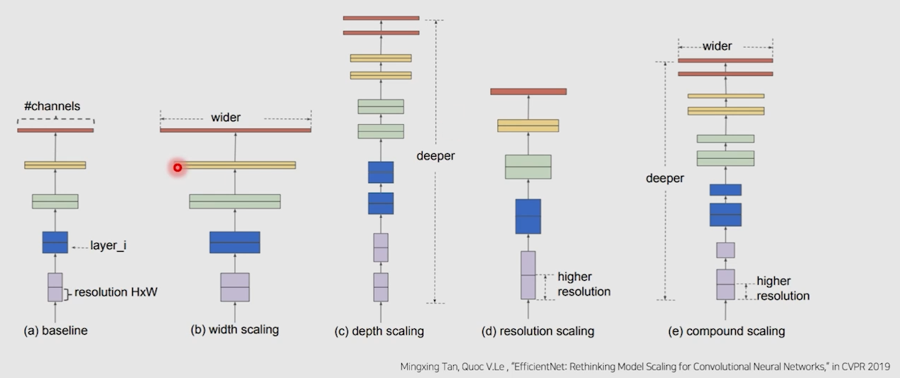
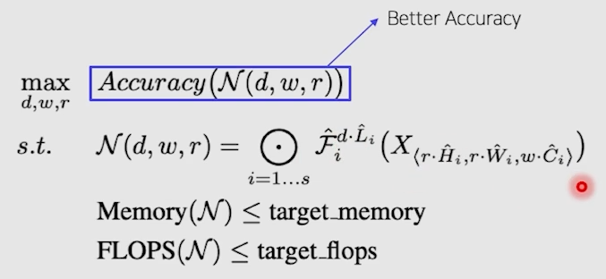
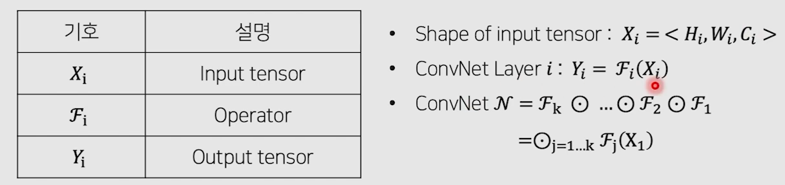
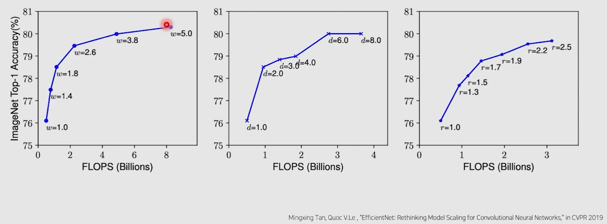
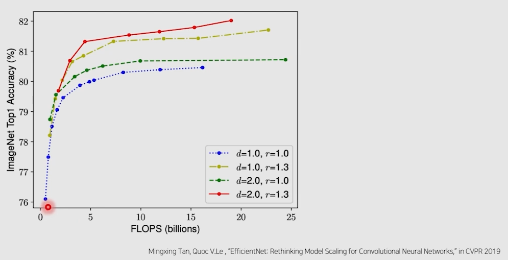
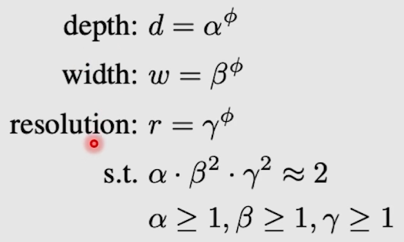
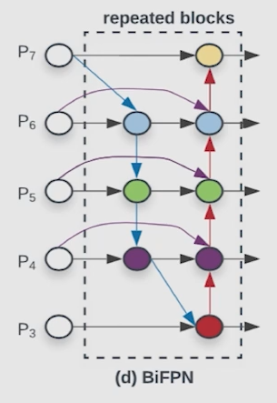
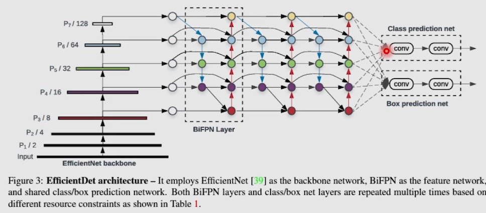
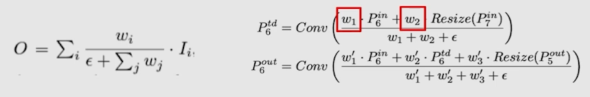

# 03/25

### 할 일

* 6강 EfficientDet

### 피어세션/멘토링

* 

### 공부한 내용

#### EfficientDet

* 어떻게 해야 모델을 잘 쌓을 수 있는가.

* 기존 연구들의 model scaling

  

* 성능과 속도의 trade-off

* width, height, resolution을 균형을 맞춰 효율적으로 scaling.

##### EfficientNet

* 시간이 지남에 따라 모델들의 성능을 올라가지만, 파라미터수는 더욱 많아짐.
* 효율성과 정확도의 trade-off.
* 모델 스케일링을 통해 효율성과 정확도를 동시에 확보하는 것이 목적.

###### scale up

* width scaling
  * 넓은 네트워크는 미세한 특징을 잘 잡아내는 경향이 있다.
  * 극단적으로 넓고 얇은 모델을 high-level 특징을 잘 잡지 못한다.
  * 상대적으로 작은 모델에서 사용.
* depth scaling
  * 더 풍부하고 복잡한 특징을 잘 잡아냄.
  * 새로운 task에서 일반화가 잘 됨.
  * gradient vanishing 문제.
* resolution scaling
  * 고화질 입력 사용.

###### Accuracy & Efficiency

* 목적한 메모리와 속도를 만족하는 범위에서 최고의 성능을 가지는 모델의 d, w, r 찾기.

  

  

* w, d, r 각각을 증가시키면 성능이 향상되지만 속도도 느려짐.

  

* 3가지 factor의 균형이 중요.

  

* scaling method

  

* NAS로 최적 레이어를 찾음.

* grid search로 최적 factor를 찾음.

##### EfficientDet

* 이전 모델들

  * neck - 단순 sum으로 여러 스케일을 합침.
  * 단순히 backbone을 깊게 하고 이미지 크기를 키우는데 초점을 맞춤.

* multi-scale feature fusion

  * BiFPN

    

    

  * 여러 resolution의 feature map을 weighted sum.

    

* model scaling

  * backbone으로 EfficientNet 사용.

    

