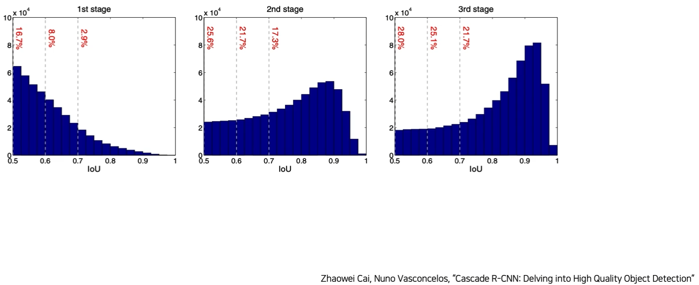

# 03/29

### 할 일

* 7강 Advanced Object Detection 1
* EfficientDet kaggle reference code 시도.

### 피어세션

* 

### 공부한 내용

#### Advanced Object Detection 1

##### Cascade R-CNN

###### Motivation

* Faster R-CNN에서 positive와 negative를 나누는 기준에 집중.

* IoU 0.7을 기준으로 나눔.

* IoU P/N 기준을 높였더니 FP가 줄어들었다.

  

  * 기준이 높을수록, head를 통과하기 전 IoU가 큰 것이 head 통과 후 더 높은 IoU를 가짐.

  * head 통과 전 IoU가 낮은 경우, 기준이 높은 것이 head 통과 후에 더 낮은 IoU를 가짐. - FP가 줄어드는 원인.

    

    

* 학습 단계에서는 IoU threshold를 높여주는 것이 필요.

* 단, 전체 성능은 낮아질 우려.

* 이를 해결하기 위해 cascade R-CNN 제안.

* IoU threshold를 바꾸어가며 학습.

###### Method

1. 같은 head로 여러번 projection → 성능 향상은 크게 없었음.

2.  여러 개의 IoU threshold와 각각의 head

   

3. 1과 2를 혼합 = cascade R-CNN

    

   

   → head를 지날수록 성능이 좋아짐.

   * 각 헤드의 threshold 별 성능 측정 → 각 헤드의 th를 0.5, 0.6, 0.7로 정함.

     

   * **IoU threshold가 다른 RoI head를 cascade로 쌓을 시 성능 향상**

##### Deformable Convolution Networks (DCN)

