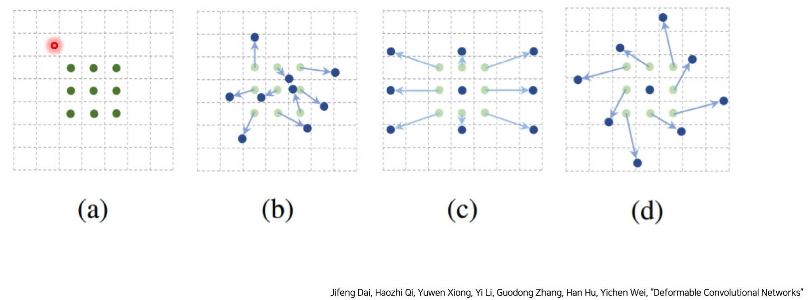
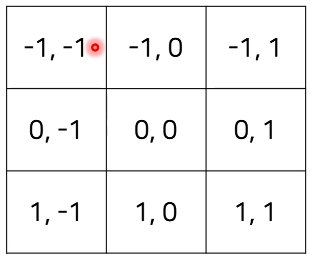
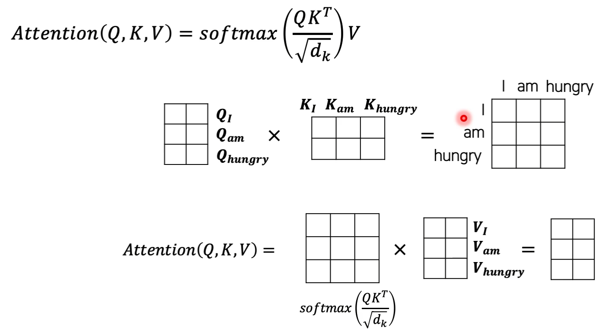
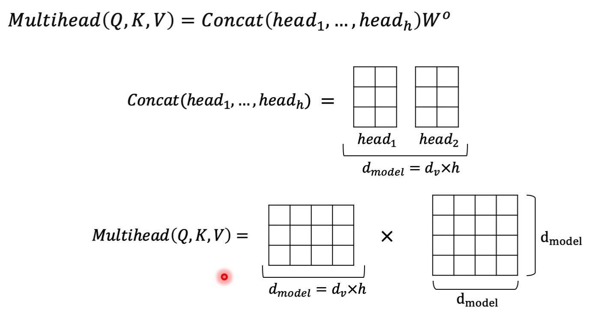
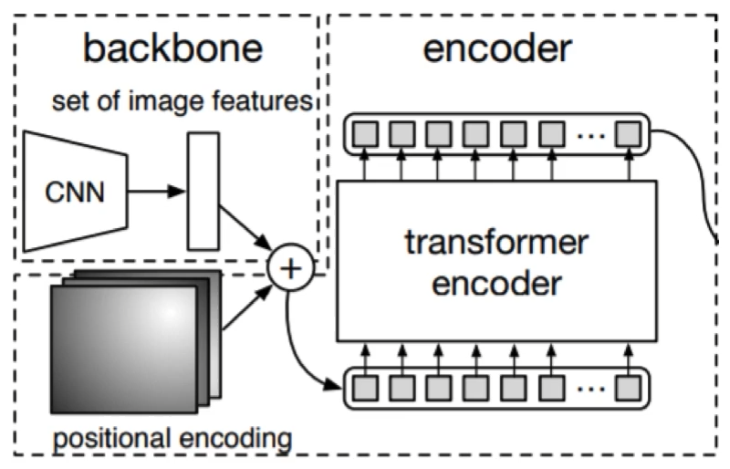
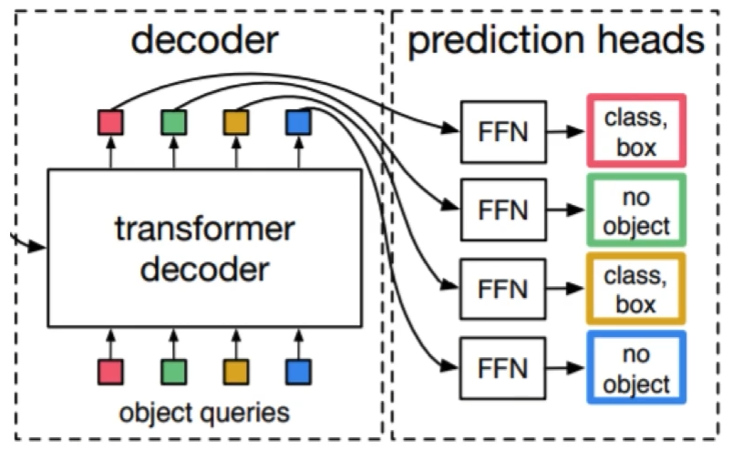
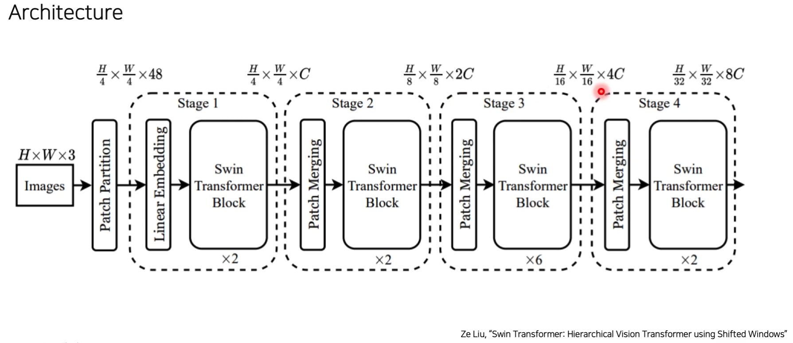
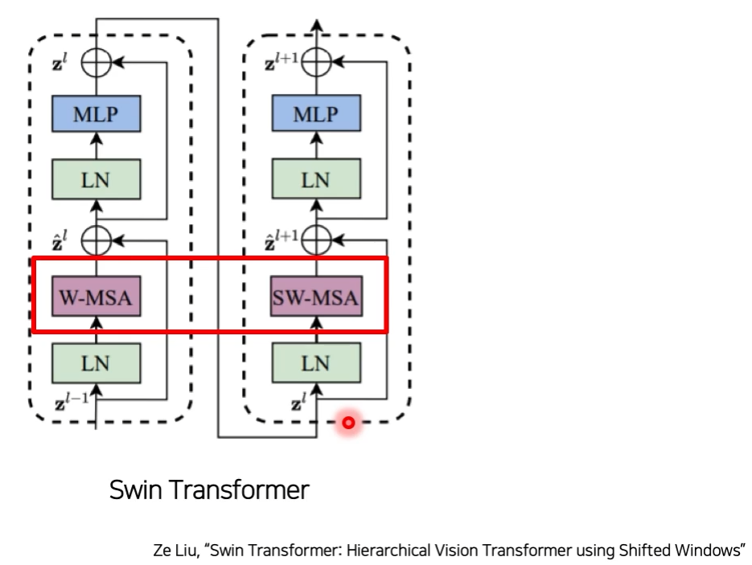
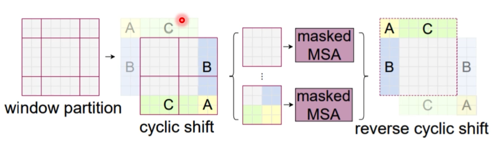

# 04/01

### 할 일

* 7강 Advanced Object Detection 1

### 피어세션/멘토링

* 

### 공부한 내용

#### Advanced Object Detection 1

##### Deformable Convolution Networks (DCN)

###### 기존 CNN 문제점

* 일정한 패턴을 지닌 CNN은 geometric transformations에 한계를 지님.
* 기존 해결 방법.
  * geometric augmentation
  * geometric invariant feature engineering
* 적용해준 augmentation에 대해서만 학습 가능.

→ 네트워크가 스스로 conv filter 크기 등을 찾을 수 있도록.

###### Method

* 커널 적용에 **offset**을 추가.

  * offset으로 input map의 어떤 값과 연산할 것인 지를 결정.

* 기존의 경우의 offset.

  

* offset도 학습.

##### Transformer

###### Attention

###### Multihead Attention

###### Vision Transformer (ViT)

* 이미지를 sequential한 데이터로 바꾸어 줄 필요가 있음.
* patch 단위로 나누기.
* class embedding (cls token)
* position embedding 추가.
* ViT의 문제점.
  * 데이터의 양이 굉장히 많아야 함.
  * computational cost가 큼.
  * 일반적인 backbone을 사용하기 어려움.

###### End-toEnd Object Detection with Transformer

* groundtruth와 prediction 사이의 N:N 매핑을 위해, 모자란 groundtruth는 no object로 padding 처리.

  (일반적으로 N은 groudtruth의 최대 개수보다 크게 잡음.)

* 각 예측값 N개가 unique하게 나오기 때문에 post process 불필요.

* 마지막 feature map을 사용하기 때문에, 작은 객체에서는 faster R-CNN 성능 하락.

###### Swin Transformer

* backbone에 transformer 적용.

* **window**를 사용하여 cost를 줄임.

* CNN과 유사한 구조.

  

  1. Patch Partitioning (N개의 patch)

  2. Linear Embedding

     1. class embedding 제거.

  3. Swin Transformer Block

     1. 하나의 블록에 2번의 attention 통과.
     2. window multihead self attention / shifted-window multihead self attention
        1. 각 window 안에서만 transformer 적용.
        2. receptive field가 제한 됨.
        3. 이를 해결하기 위해 shifted window 사용.

     

     

  4. Patch Merging

     1. patch 사이즈를 줄이기 위해 channel wise concat.

* 적은 데이터에도 학습이 잘 됨.

* cost를 대폭 줄임.

* CNN과 비슷한 구조로, backbone으로 general하게 활용할 수 있음.

