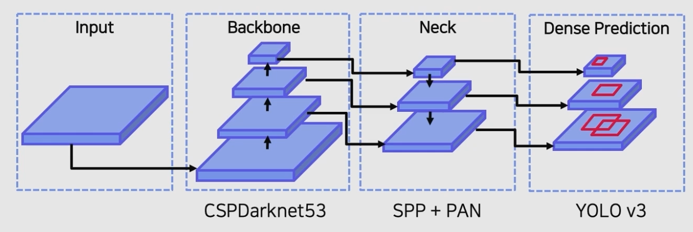
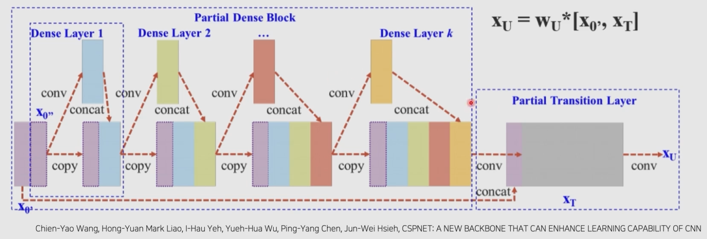
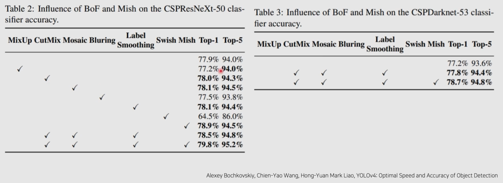
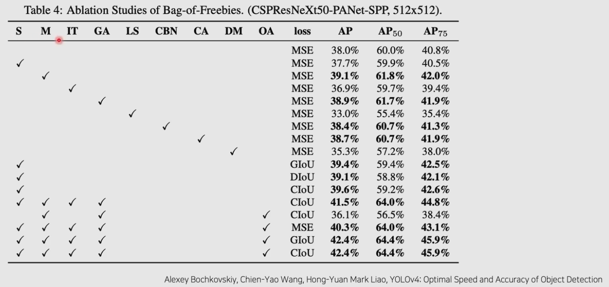

# 04/07

### 할 일

* 8강 Advanced Object Detection 2

### 피어세션

* 

### 공부한 내용

#### Advanced Object Detection 2

##### YOLO v4

* object detection model을 디자인하거나 향상할 수 있는 다양한 아이디어.

###### Contribution

* 하나의 GPU에서 훈련할 수 있는 빠르고 정확한 object detector
* BOF, BOS 방법들을 실험을 통해 증명.
  * BOF (Bag of Freebies) : inference 비용을 늘리지 않고 정확도 향상시키는 방법
    * 대신 학습 과정에서 추가적인 비용이 발생할 수 있음.
  * BOS (Bag of Specials) : inference 비용을 조금 높이지만 정확도를 크게 향상시키는 방법
* GPU 학습에 더 효율적이고 적합하도록 방법을 변형.

###### Related Work

* **Bag of Freebies**
  * Data Aumentation
  * Sementic Distribution Bias
    * detecion task의 경우 배경이 압도적으로 많기 때문에 큰 성능 향상을 기대할 수 있음.
    * Focal loss 등 
  * Label Smoothing
    * overfitting을 막고, regularization 효과
  * Bounding Box Regression
    * IoU 기반의 loss 제안
    * MSE가 일정하더라도 IoU가 다를 수가 있음
    * GIoU : IoU 기반의 loss. IoU가 0인 경우는 거리를 반영해 차별화. (더 먼 box의 loss가 더 커야함.)
* Bag of Specials
  * Enhance Receptive Field
    * feature map의 receptive field를 키워서 검출 성능을 높임.
    * ex) SPP
  * Attention Module
    * ex) SE, CBAM
  * Feature Integration
  * Active Function
    * ReLU : 음수값 허용 X.
    * Swish / Mish : 약간의 음수값 허용.

###### Architecture

* CSPNet

  * 정확도를 유지하며 경량화
  * 연산 bottleneck 제거

  

  * gradient information이 많아지는 것을 방지

###### Result

