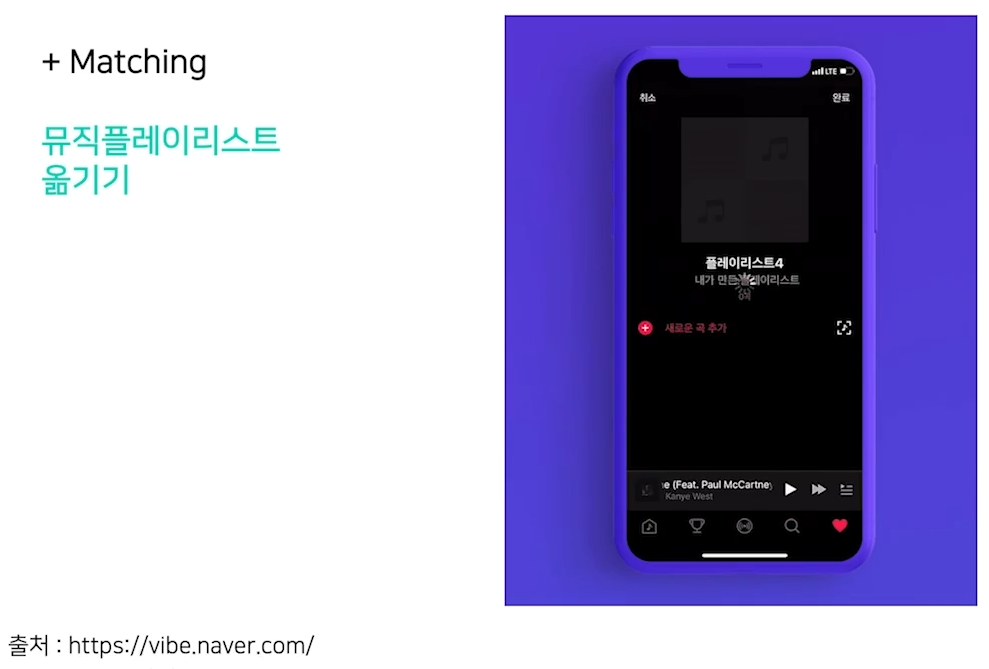

# 04/11

### 할 일

* 1강 데이터 제작의 중요성 1
* 2강 데이터 제작의 중요성 2
* 3강 OCR Technology & Services

### 피어세션

* 

### 공부한 내용

#### 데이터 제작의 중요성 1

* software 1.0

  1. 문제 정의
  2. 큰 문제를 작은 문제들의 집합으로 분해
  3. 개별 문제 별로 알고리즘 설계
  4. 솔루션들을 합쳐서 하나의 시스템으로

  → 사람이 직접 연산이나 알고리즘을 고안.

* software 2.0

  

  * 최적의 프로그램을 AI가 찾음.
  * 모델의 구조 + 최적화 방법 + **데이터**

---

#### 데이터 제작의 중요성 2

##### AI 프로젝트의 Life Cycle

1. **Project Setup** - 모델 요구사항 확정
   1. 처리 시간
   2. 목표 정확도
   3. 목표 qps
   4. serving 방식
   5. 장비 사양
2. **Data Preparation** - 데이터셋 준비
   1. 종류
   2. 수량
   3. label
3. **Model Training** - 모델 학습 및 디버깅
   1. 데이터 관련 피드백
   2. 요구사항 달성
4. **Deploying** - 설치 및 유지보수
   1. 성능 모니터링
   2. 이슈 해결

* 요구사항을 충족하는 모델을 지속적으로 확보

  * Data-Centric : 데이터만 수정하여 모델 성능 끌어올리기
  * Model-Centric : 데이터는 고정시키고 모델 성능 끌어올리기

* 데이터와 모델의 비중

  * deploying 전, 데이터:모델 = 50:50

  * deploying 후, 데이터:모델 = 80:20

    * 모델 구조 변경은 처리 속도, qps, 메모리 크기 등에 대한 요구사항 검증도 다시 해야 함.

      → 비용이 큼.

##### Data

###### Data-related tasks

* 어떻게 하면 좋을 지 잘 알려져 있지 않다. - 문제를 다룬 논문 등의 자료가 매우 적다.
* 데이터 라벨링 작업은 생각보다 어렵다.
  * 데이터가 많다고 성능이 항상 올라가지 않는다.
  * 깨끗한 라벨링 데이터가 많아야한다. (clean)
  * 깨끗한 데이터도 너무 유사한 데이터만 있으면 안 된다. (balance)
  * 일반적인 경우 보다 희귀한 경우에 노이즈가 많아진다.
* 데이터 불균형을 잡기 어렵다.
  * 희귀한 경우를 의도적으로 모아야 골고루 모을 수 있다.

---

#### OCR Technology & Services

* OCR (Optical Character Recognition)
  * 글자 찾기 (detection)
  * 글자 인식 (recognition)

* Text Detector 

  * 일반 객체 검출과의 차이 유의.
  * 글자 영역은 보통 가로가 세로보다 길다.

* Text Recognizer 

  * detector가 검출한 영역을 잘라서 넣어줌.

  * 모델을 구성할 때 글자 부분만 들어온다고 가정.

  * CV와 NLP의 교집합 영역.

    

* Serializer

  * 결과값을 일렬로 정렬.
  * 상용 기술은 이 부분까지 딥러닝을 사용하진 않음.

* Text Parser

  * BIO 태깅
  * 문장에서 미리 정의된 개체에 대한 값을 추출.

  

##### OCR services

1. copy & paste

   

2. search

   

3. matching

   

4. 금칙어 처리

   

5. 번역

   

6. 신용카드, 신분증 등

   

   
