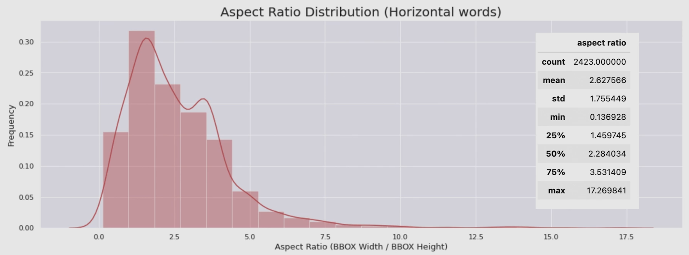

# 04/12

### 할 일

* 4강 Text Detection 소개 1
* 5강 데이터 소개

### 피어세션

* 

### 공부한 내용

#### Text Detection 소개 1

* 일반 객체 영역 검출 vs 글자 영역 검출

  * 글자의 위치만 예측.

  * 객체의 밀도가 높다.

  * 일반적으로 영역의 가로가 매우 길다.

  * 영역의 모양이 특이한 경우. - 구겨짐, 휘어짐, 세로쓰기 등.

  * 모호한 객체 영역.

    

  * 글자 크기 편차가 큰 경우.

    

* 글자 영역 표현법
  * 직사각형 
    * (x, y, w, h) or (x1, y1, x2, y2)
  * 직사각형 + 각도
    * (x, y, w, h, θ) or (x1, y1, x2, y2, θ)
  * 사각형 
    * 시계 방향으로 4개의 점
  * 다각형 
    * 시계 방향으로 N개의 점
    * 일반적으로 2N개.
    * 상하 점들이 쌍을 이루도록.

##### Texonomy

* Regression-based - TextBoxes (2018)

  

  * anchor box를 기준으로 글자 위치의 상대적 위치를 추정.

  * 사각형 형태의 box만 표현 - 임의의 형태를 갖는 글자에 대해서는 불필요한 영역을 포함함.

    → 인식 능력 저하.

  * anchor box 보다 종횡비가 큰 글자가 있을 경우 성능이 떨어짐.

* Segmentation-based - PixelLink (2018)

  

  * 각 pixel 별로 글자 영역에 속할 확률.
  * 후처리가 생각보다 복잡해질 수 있다.
  * 글자 영역이 인접해있으면 구분이 어려움.

* Hybrid - MaskTextSpotter (2018)

  

* Character-based
  * 한 글자씩 검출하여 이를 조합.
  * 한 글자 단위로 labeling을 해야함.
  * CRAFT (2019)
    * 글자 별 영역 정보 + 글자 간에 연결이 되어 있는지
    * 단어 단위 라벨링으로 글자 단위 라벨링 추정. (weakly-supervised learning)

* Word-based
  * 단어 단위로 검출.
  * 대부분의 모델.

##### EAST : An Efficient and Accurate Scene Text Detector (2017)

* 일종의 segmentation-based

* 2가지 정보를 pixel-wise로 출력.

  

  * 글자 영역의 중심에 해당하는지: score map
  * 속해 있는 bounding box의 위치 : geometry map

* U-net 구조

  

* score map

  

* geomaetry map

  * 직사각형 + 각도

    

  * 사각형

    

* post-processing

  

  * Locality-Aware NMS
    * IoU가 일정 값을 넘어가면 weighted merge.
    * 그 외에는 그냥 NMS

* Loss

  

  * score map loss

    * paper : class-balanced cross-entropy

    * baseline : dice-coefficient

      

  * geometry map loss

    * 직사각형 IoU loss + 각도 cosine loss

    

* baseline code의 성능 - ICDAR 2015 dataset : 82.79%

---

#### 데이터 소개

##### Data Collection

* public dataset
  * 쉽게 구할 수 있음.
  * 원하는 데이터가 없을 수도 있음.
  * 수량이 작다.
* created dataset
  * 합성 데이터
    * 라벨링이 필요 없음.
    * 원하는 데이터를 빠르게 확보 가능.
    * 실제 데이터와 얼마나 다른 지 확인 필요.
    * 글자 데이터 등
  * 실제 데이터
    * crawing
      * 빠르게 모을 수 있다.
      * 라이센스에 신경써야 함.
      * 고화질 데이터가 많지 않다.
    * 직접 데이터 모으기
      * 비용이 크고 오래 걸림.
      * 원하는 고품질의 데이터를 모을 수 있다.

##### Public Dataset

* 서비스 개발 시 빠르게 답을 얻어야하는 경우.

  

  → 공개 되어있는 최신 dataset과 모델로 테스트.

* 데이터 검색 방법

  * 대회 : kaggle, RRC 등
  * 논문
  * 전문 사이트 : google datasearch, zenodo.org, datatang 등

* OCR 데이터 용어

  

* ICDAR (International Conference on Document Analysis and Recognition)

  * 대표적 OCR 대회.

  * 2년 마다 대회가 열림.

  * 매번 점점 어려운 dataset.

  * ICDAR 2015

    * Incidental scene text : 풍경 이미지 속 우연히 글자가 잡힌 경우
    * 총 1,500장
    * 사각형 (4개 좌표, 8개 값)

  * ICDAR 2017

    * Multi-lingual scene text : 다양한 언어

      

    * 총 18,000장

    * 글자 영역 위주의 이미지

* AI Hub

  * 한국어 공개 데이터셋 존재.
  * 야외 실제 촬영 한글 이미지 
    * 총 50만건
    * 직사각형 (x, y, w, h)
    * 한 이미지 당 최대 3개만 labeling.

##### UFO

* 예시

##### 테스트셋 EDA

