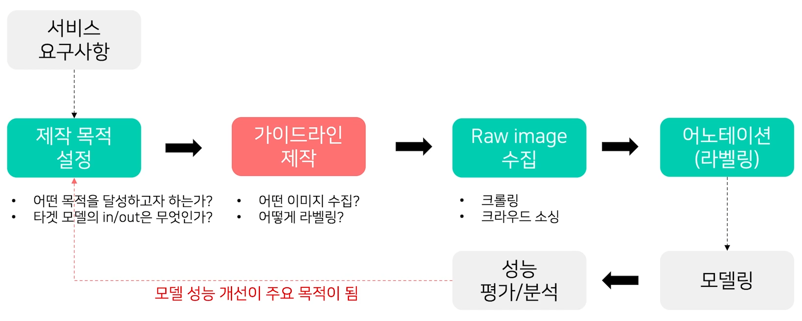
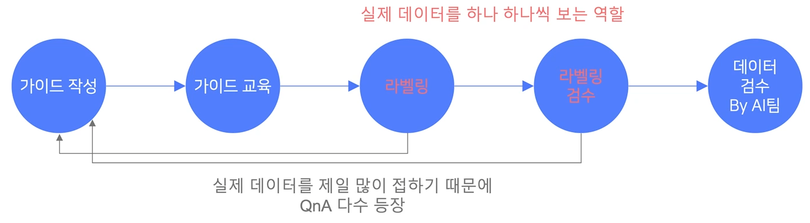
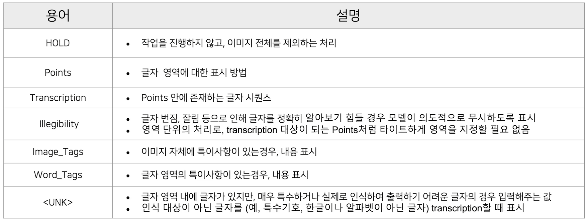

# 04/15

### 할 일

* 6강 Annotation Guide

### 피어세션

* 

### 공부한 내용

#### Annotation Guide

* annotation guide가 잘 작성되어야 labeling noise를 줄일 수 있다.
* 보통 일반적인 케이스보다 희귀한 케이스의 데이터 수가 더 적고, noise도 크다.

* 가이드라인 작성 시 고려할 요소
  * 특이 케이스 - 특이 케이스가 되도록 모두 고려.
  * 단순함 - 너무 복잡하면 작업자들이 모두 숙지하기 힘들다.
  * 명확함 - 작업자 별로 다른 해석의 여지를 줄임.

* 데이터 수집
  * 데이터 수집을 위한 가이드라인도 필요.
  * 크롤링
    * 어떤 검색어를 사용할 지 명시.
    * 이미지 크기도 명시. 되도록 큰 것.
    * 라이센스 확인.
  * 크라우드 소싱
    * 특이 케이스 수집에 유리.
    * 시간, 비용이 많이 들어간다.
    * 개인정보, 저작권 이슈에 비교적 자유로움.

* 가이드라인 제작 과정

  

  * 초기에는 적은 데이터로 가이드라인 완성도를 올리는데에 초점을 두는 것이 좋다.

* 가이드라인 기본 용어

  

* 검수
  * 라벨링 작업 검수
    * 감독자 전수 검사 - 감독자가 자신에게 할당된 결과물 검수
    * peer check - 한 작업자가 다른 작업자의 결과물 검수
    * 다수결 - 여러 작업자가 동일한 데이터를 작업하고, 나중에 합침.
  * 가이드 자체가 잘 동작하고 있는 지 검수
    * 초기 소량의 결과물을 받아 품질 확인
    * 작업자 QnA
    * 추가 수정 비용이 크다면 일부를 포기 - 우선순위가 필요