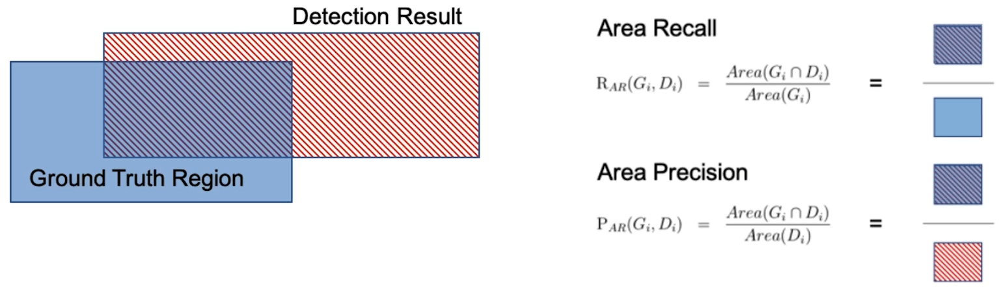
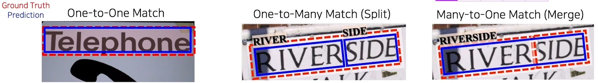
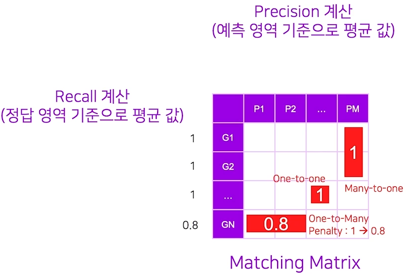
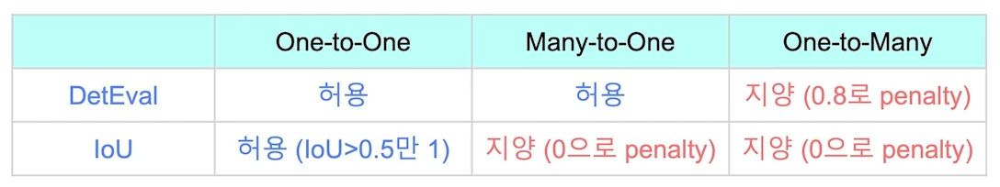
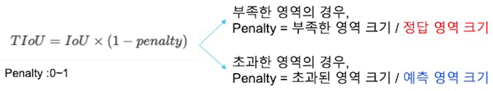
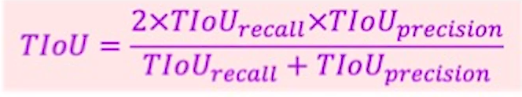
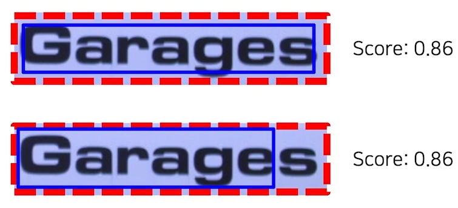

# 04/18

### 할 일

* 7강 성능 평가 방식

### 피어세션

#### 글자 검출 대회

* MLT와 우리가 직접한 annotation의 기준이 다르다.

### 공부한 내용

#### 성능 평가 방식

* confusino matrix

* recall, precision

  

* one-to-one / one-to-many / many-to-one

  

##### DetEval

* 모든 매칭에 대한 recall과 precision을 계산.
* recall >= 0.8 && precision >= 0.4를 충족하면 1, 아니면 0
* one-to-many에서는 0.8을 곱하여 패널티를 줌.

##### IoU

* 1대1 매칭만 허용.

##### TIoU

* Tightness-aware IoU
* 예측 박스의 타이트함을 점수에 반영.

* 한계점

  

  * 같은 수치라도 글자 인식 관점에서는 차이가 크다.

##### CLEval

