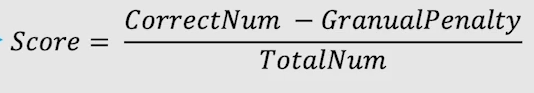
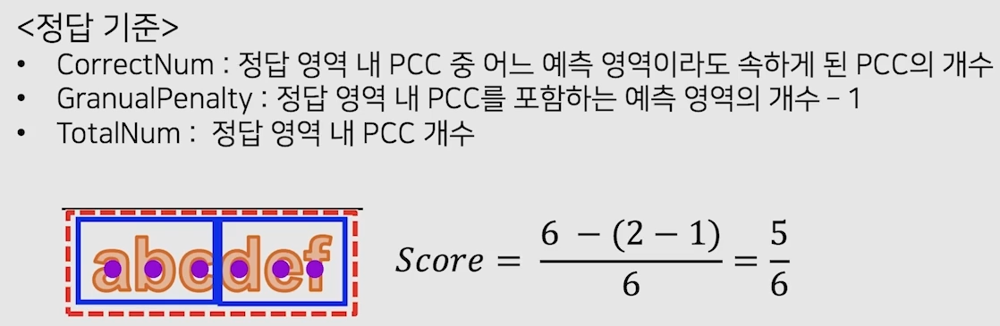
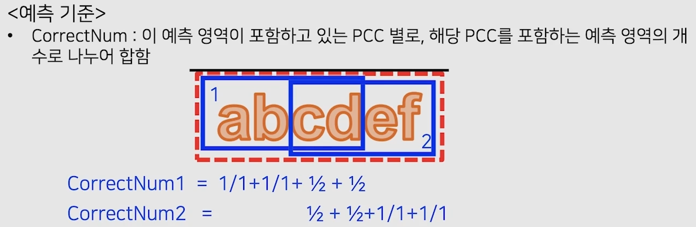
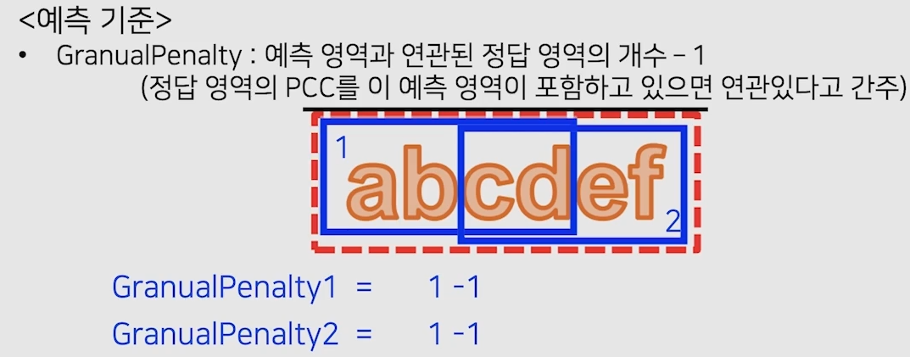
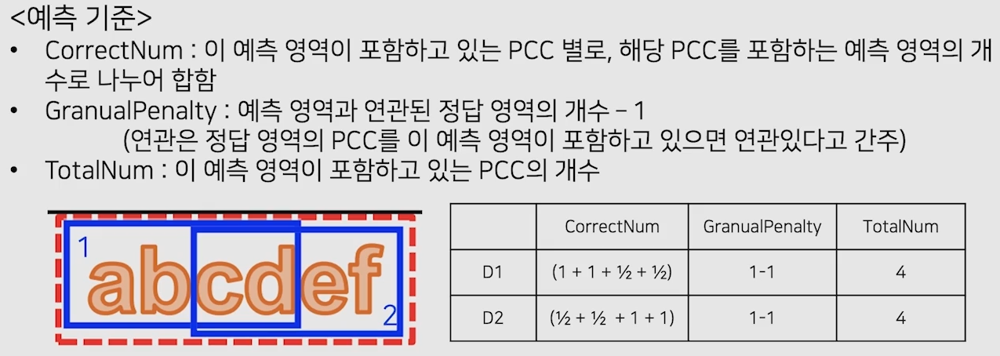
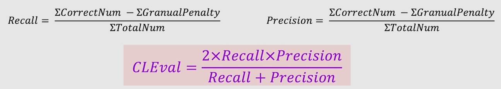

# 04/18

### 할 일

* 7강 성능 평가 방식

### 피어세션

#### 글자 검출 대회

* MLT와 우리가 직접한 annotation의 기준이 다르다.

### 공부한 내용

#### 성능 평가 방식

* confusino matrix

* recall, precision

  

* one-to-one / one-to-many / many-to-one

  

##### DetEval

* 모든 매칭에 대한 recall과 precision을 계산.
* recall >= 0.8 && precision >= 0.4를 충족하면 1, 아니면 0
* one-to-many에서는 0.8을 곱하여 패널티를 줌.

##### IoU

* 1대1 매칭만 허용.

##### TIoU

* Tightness-aware IoU
* 예측 박스의 타이트함을 점수에 반영.

* 한계점

  

  * 같은 수치라도 글자 인식 관점에서는 차이가 크다.

##### CLEval

* Character-Level Evaluation
* 얼마나 많은 글자를 맞추고 틀렸느냐를 평가.
* detection 뿐만 아니라 recognition에 대해서도 평가.
* 글자 각각에 대한 정보 필요.
* PCC (pseudo character centers)
  * 글자마다 라벨을 얻기 어려움.
  * 기존 word 단위 라벨에서 글자 수만큼 등분하여, 각 영역의 중심위치를 사용.

* recall

* precision

* total score

