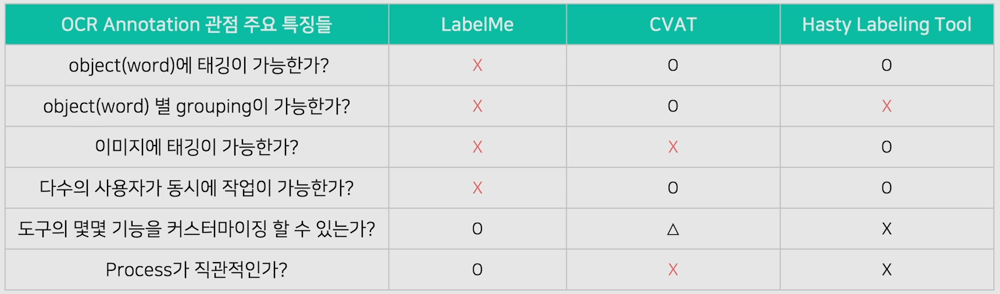

# 04/21

### 할 일

* 8강 Annotation Tool 소개

### 피어세션

* 

### 공부한 내용

#### Annotation Tool 소개

* LabelMe
  * 설치 용이.
  * python으로 작성되어 있어, 기능 추가 가능.
  * 공동작업 불가.
* CVAT
  * automatic annotation 지원.
  * 온라인 사용 가능.
  * 공동작업 가능.
  * 자동 annotation이 느리다.
* Hasty Labeling Tool
  * semi-automated annotation
  * cloud storage (유료)
  * 공동작업 가능.
  * 커스터마이징 불가능.

