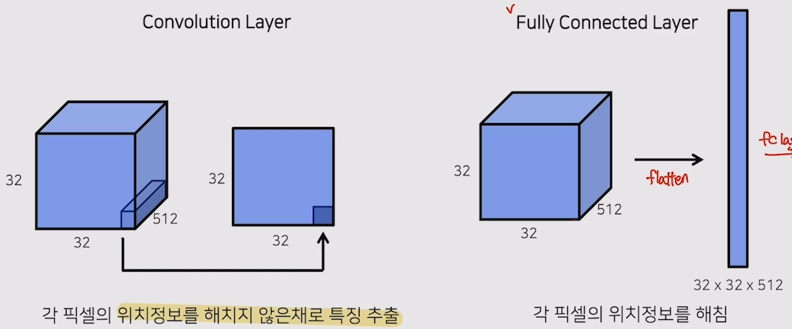
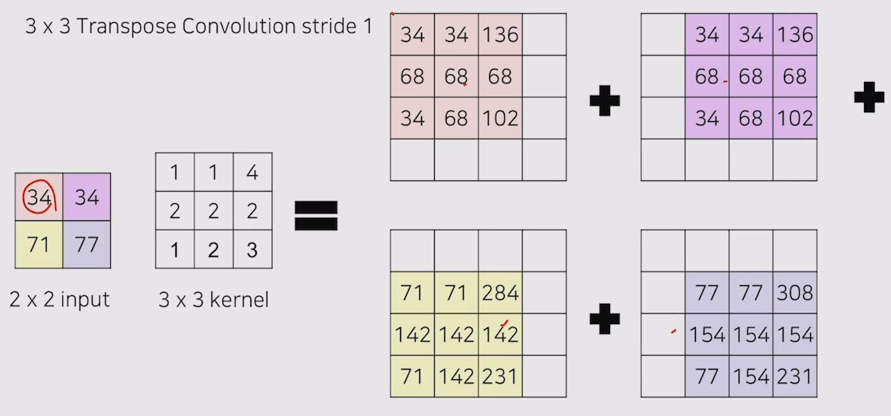
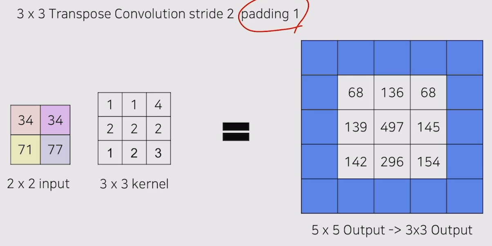
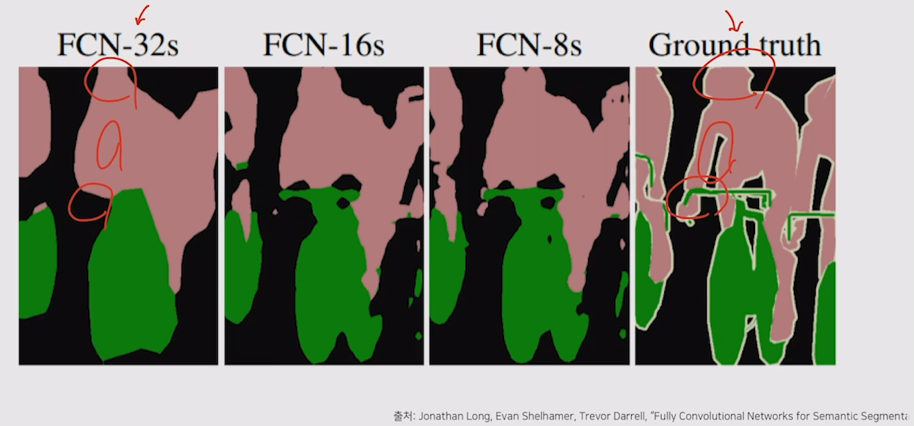
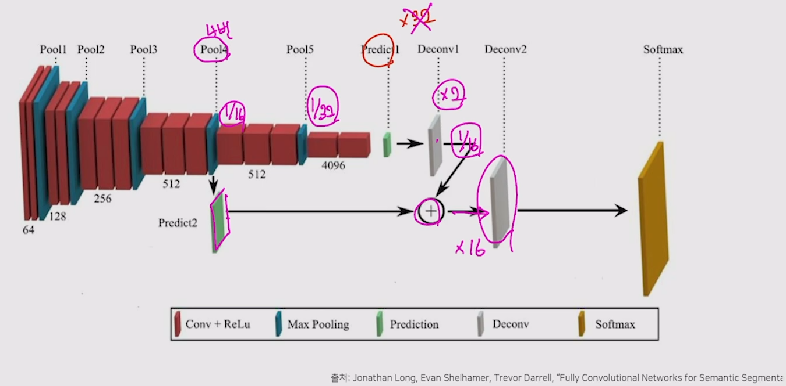
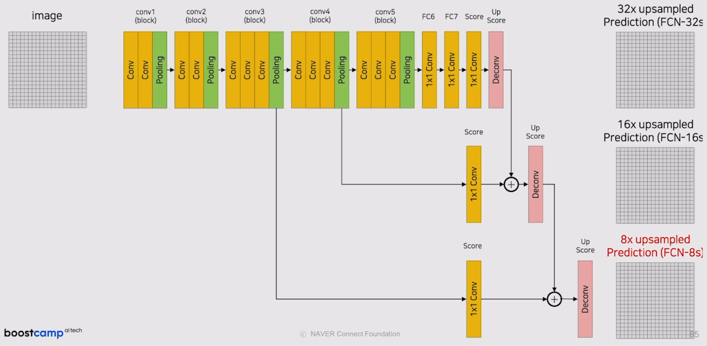
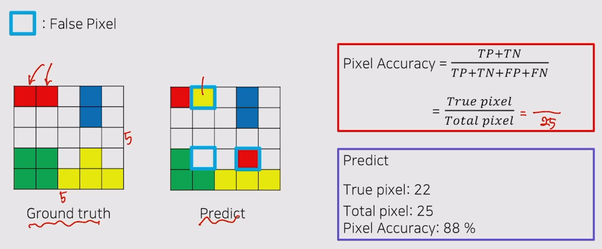
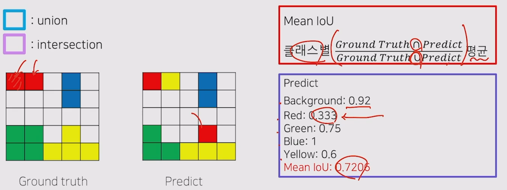
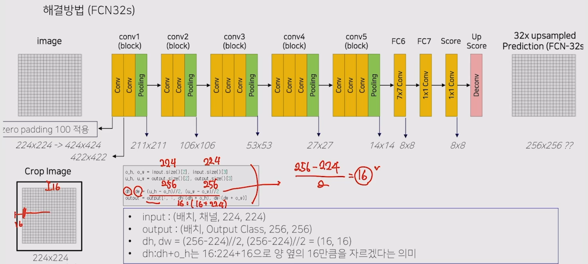

# 04/25

### 할 일

* 1강
* 2강 Competition Overview (EDA & Metric)
* 3강 Semantic Segmentation의 기초와 이해

### 피어세션

* 

### 공부한 내용

#### Semantic Segmentation의 기초와 이해

* fully convolutional network (FCN)
* VGG의 FC layer를 convolution으로 대체.
* transposed convolution

* FC layer는 분류 문제에만 사용될 경우 위치정보를 유지할 필요가 없었다.
* segmentation은 위치 정보가 필요함.
* convolution은 입력 데이터의 크기에 상관이 없다. → 입력 크기가 다양해도 학습 가능.

* input size와 같도록 upsampling - transposed convolution

* padding

  

* transposed convolution을 한 번에 높은 배율로 적용하면 미세한 위치 정보들을 잃는다.

  

* skip connection 적용.

  

  

* pixel accuracy

  

* MIoU

  

