# 04/26

### 할 일

* 4강 FCN의 한계를 극복한 모델들 1

### 피어세션

* 

### 공부한 내용

#### FCN의 한계를 극복한 모델들 1

>  성능적 측면의 개선

##### FCN의 한계점

* 객체의 크기가 크거나 작을 경우 예측을 잘 하지 못 함.
* 디테일한 모습이 사라짐.

##### Decoder를 개선한 모델

###### DeconvNet

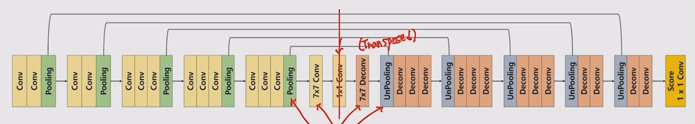

* decoder와 encoder를 **대칭**으로.

* convolution network / deconvolution network

* CN은 VGG16 사용.

* DN : unpooling, deconvolution, ReLU 사용.

* Unpooling - **위치 정보** 사용.

  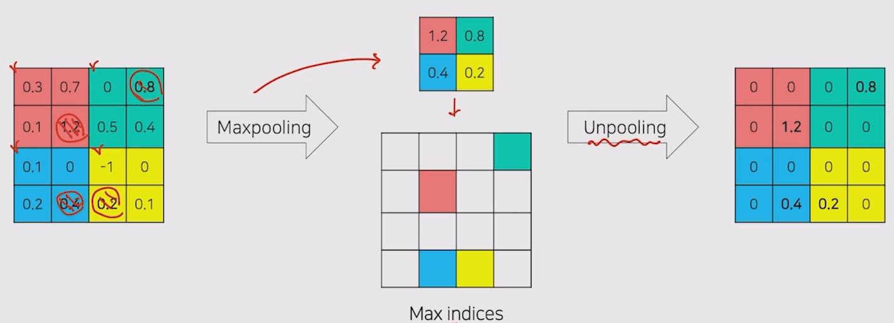

  * 객체 외곽의 모습을 복원.
  * 0인 부분을 채워줄 필요가 있음. → transposed convolution 사용.

###### SegNet

* **real-time** 가능.

* 속도 향상에 중점을 둠.

* DeconvNet과 비교

  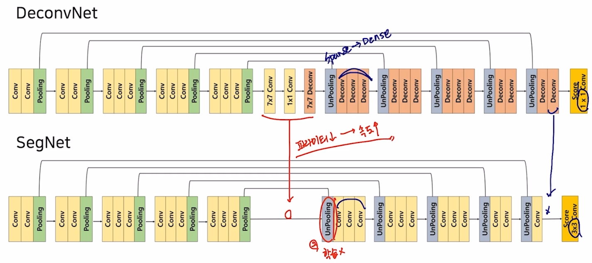

  * 파라미터를 줄여 속도 향상.
  * transposed convolution 대신 convolution.
  * score 생성 시, 3x3 convolution 사용.

##### Skip Connection을 적용한 모델

###### FC DenseNet

* densenet의 구조 채용.

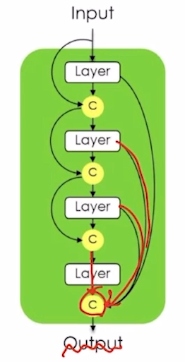

* 채널 별로 concat.

###### Unet

* encoder의 정보를 decoder로 건네줌.

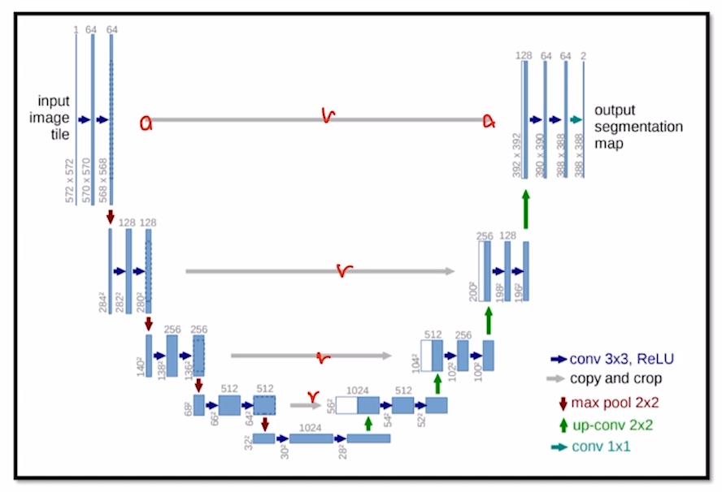

##### Receptive field를 확장시킨 모델

###### DeepLab v1

* convolution과 max pooling을 반복하면 receptive field를 넓힐 수 있다.

  → segmentation에서는 해상도가 줄어드는 문제.

* dilated convolution

  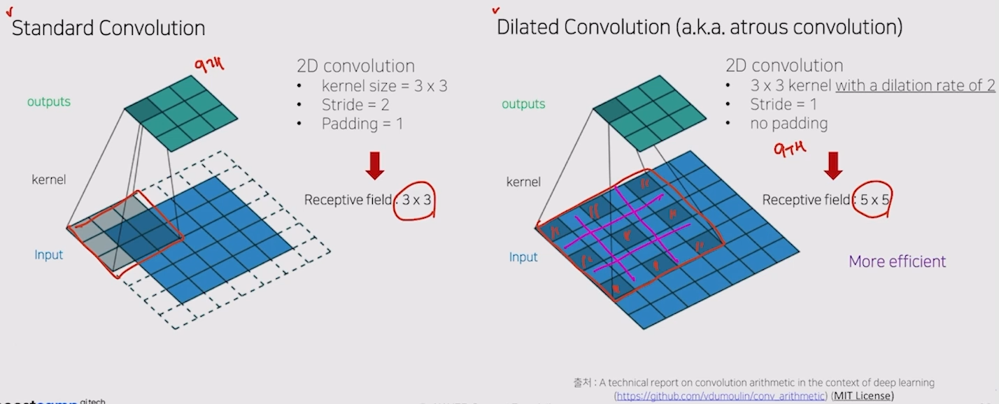

* 구조

  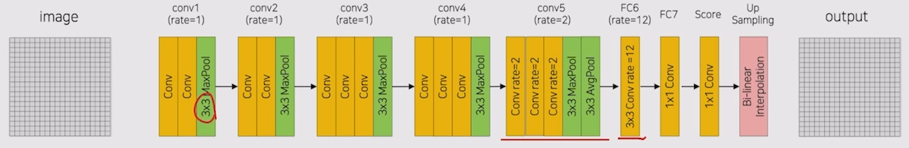

  * 3x3 max pooling 사용.
  * stride = 1, padding = 1 : 입력과 출력의 크기가 같음.

  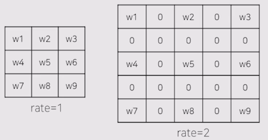

  * bilinear interpolation

    * align_corners = True

      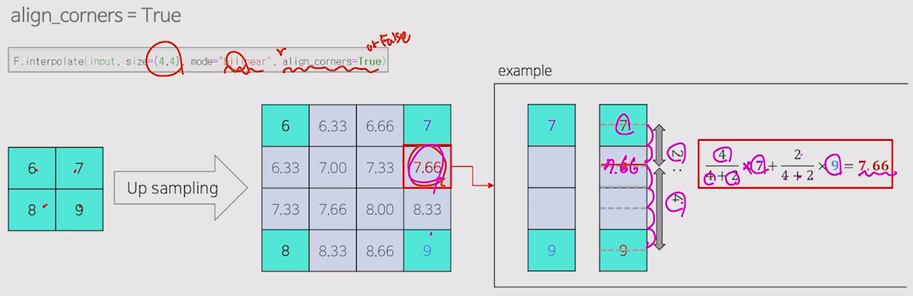

    * align_corners = False

      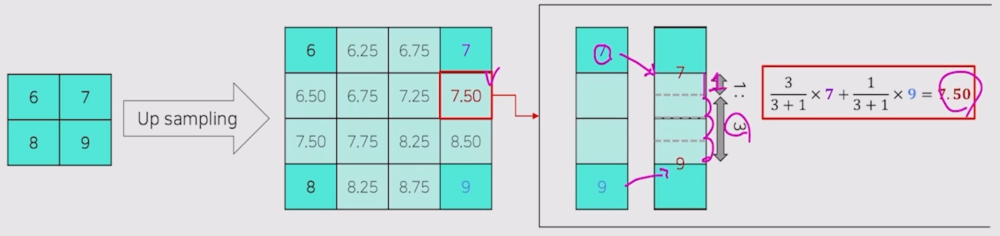

  * bilinear interpolation으로는 정교한 segmentation이 불가능.

  * Dense CRF

    * 원본 이미지에서 유사한 색상을 가지면 같은 카테고리

###### DilatedNet

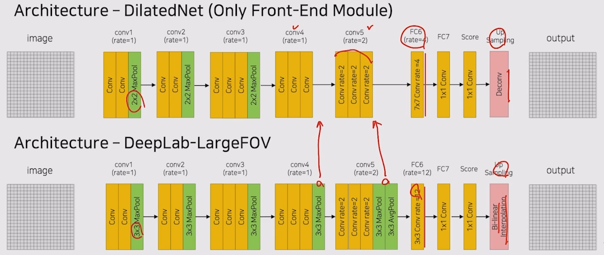

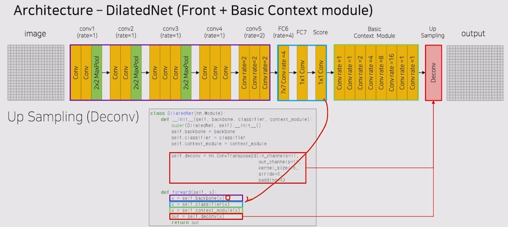

