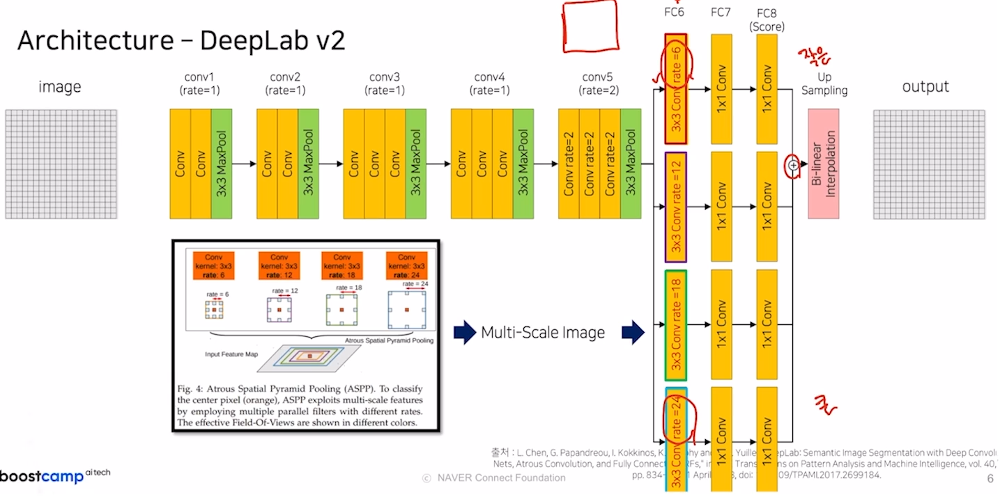
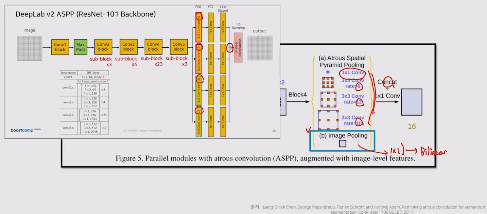
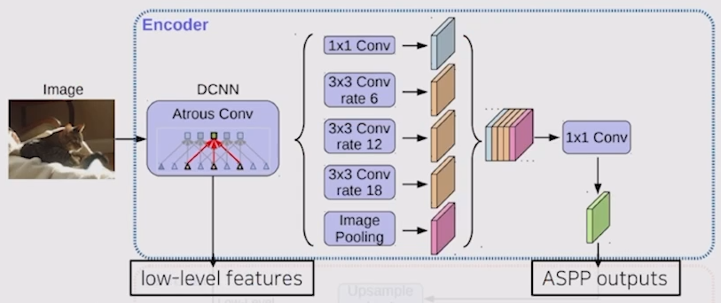
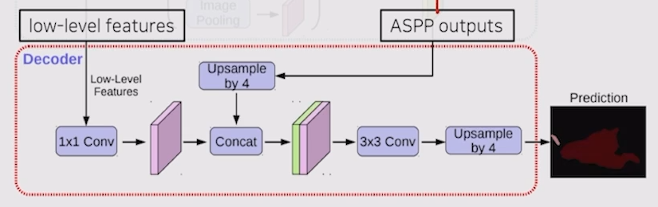
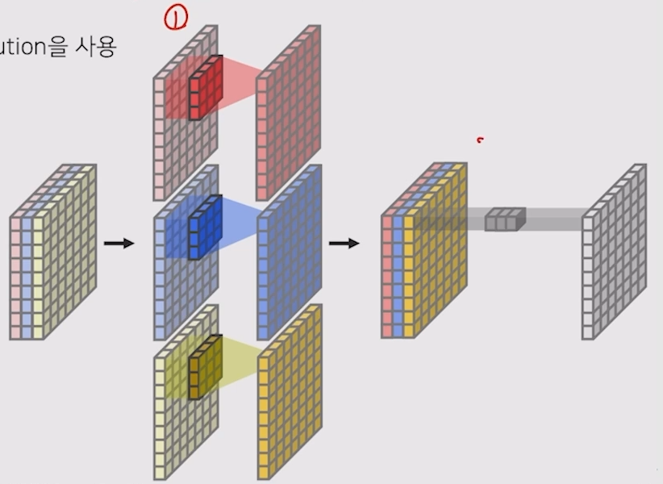

# 04/29

### 할 일

* 5강 FCN의 한계를 극복한 모델들 2

### 피어세션

* 이전 기수 자료
  * https://github.com/8639sung/semantic-segmentation-level2-cv-04
  * https://re-code-cord.tistory.com/entry/%EC%9E%AC%ED%99%9C%EC%9A%A9-%ED%92%88%EB%AA%A9-%EB%B6%84%EB%A5%98%EB%A5%BC-%EC%9C%84%ED%95%9C-Semantic-Segmentation-%EB%8C%80%ED%9A%8C-23?category=980186

### 공부한 내용

#### FCN의 한계를 극복한 모델들 2

##### Receptive field를 확장시킨 모델

###### DeepLab v2

* convolution rate가 클수록 큰 객체에 집중.
* 여러 스케일에 집중할 수 있는 구조로 나누어 합침. (ASPP 구조)

###### PSPNet

* FCN은 주변의 다른 객체와의 관계를 고려하지 못함.

* 지엽적인 정보만으로는 객체 구분이 힘들다.

* 이론적인 receptive field와 실제 receptive field 사이에 차이가 발생. (논문)

  * pooling이 많이 진행될수록 그 차이가 큼.

* Global Average Pooling

  * 한 채널을 1x1로 pooling (average)
  * convolution에 비해 넓은 영역을 볼 수 있다.

* 1x1, 2x2, 3x3, 6x6이 되도록 average pooling 적용.

  → convolution을 통해 채널을 맞춰주고, upsampling으로 크기도 맞춤. 

  → 이 모두와 feature map과 concat. (skip connection)

   

###### DeepLab v3

* v2에 global average pooling 추가.

###### DeepLab v3+

* encoder + decoder 구조로 변경.
* encoder에서 spatial demension으로 인해 손실된 정보를 decoder에서 점진적으로 복원.

* encoder 

  

  * resnet이 아닌, 수정된 Xception을 backbone으로 사용.
  * Atrous separable convolution을 적용한 ASPP 모듈 사용.
  * backbone 내 low-level feature도 decoder로 전달.

* decoder

  

  * low-level feature와 ASPP 결과를 결합. (bilinear upsampling)

* Xception 

  * Depthwise Separable Convolution

    * 각 채널마다 다른 filter를 사용하여 conv. (depthwise)
    * 1x1 conv. = pointwise conv.

    