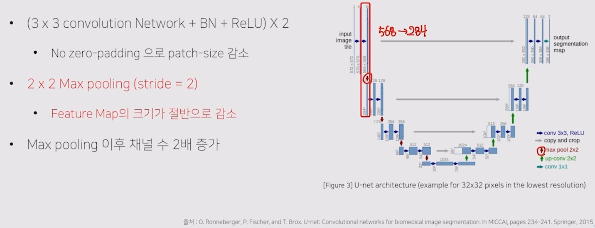

# 05/02

### 할 일

* 6강 High Performance를 자랑하는 Unet 계열의 모델들


### 피어세션

```python
train_pipeline = [
    # dict(type='LoadImageFromFile'),
    # dict(type='LoadAnnotations'),
    dict(
        type='RandomMosaic',
        prob = 0.5,
        img_scale = (512,512),
        pad_val=114),
    dict(type='Resize', img_scale=(512, 512), ratio_range=(0.5, 2.0)),
    dict(type='RandomCrop', crop_size=crop_size, cat_max_ratio=0.75),
    dict(type='RandomFlip', prob=0.5),
    dict(type='PhotoMetricDistortion'),
    dict(type='Normalize', **img_norm_cfg),
    dict(type='Pad', size=crop_size, pad_val=0, seg_pad_val=255),
    dict(type='DefaultFormatBundle'),
    dict(type='Collect', keys=['img', 'gt_semantic_seg']),
]
```

```python
dataset = dict(
            type=dataset_type,
            classes=classes,
            palette=palette,
            reduce_zero_label=False, 
            img_dir=data_root + "images/train",
            ann_dir=data_root + "annotations/train",
            pipeline=[dict(type='LoadImageFromFile'),
                      dict(type='LoadAnnotations')
            ],
        ),
```


### 공부한 내용

#### High Performance를 자랑하는 Unet 계열의 모델들

##### U-net intro

* 의료 계열에서의 문제 상황
  * 데이터를 구하기 어려워 학습 데이터가 부족.
  * segmentation의 경계가 뚜렷하지 않음.


###### 구조

* contracting path 
  * 특징 추출.
* expanding path
  * up-sampling
  * feature map 결합.



* concat 시 feature map의 크기가 맞지 않는 현상 → crop하여 크기를 맞춤.
* encoder에서 채널 수를 1024까지 증가시켜 좀 더 고차원에서 정보를 맵핑.
* 이전 레이어의 정보를 효율적으로 활용.


###### Technique

* Augmentation
  * Random Elastic deformation
* 